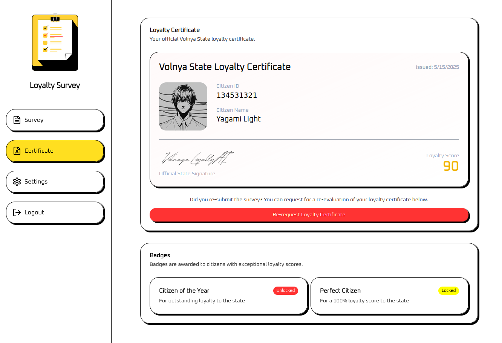

        <font size="5px">Loyalty Survey</font>

​      15<sup>th</sup> May 2025

​      Prepared By: Rayhan0x01

​      Challenge Author(s): Rayhan0x01

​      Difficulty: <font color=green>Easy</font>

​      Classification: Official


<br>

# [Synopsis](#synopsis)

* The challenge involves performing Agentic AI Hijacking with prompt injection.


## Description

Within the iron grip of Volnaya’s surveillance state, the AI Loyalty Survey platform serves as both judge and gatekeeper, determining loyalty scores and issuing certificates that dictate the quality of life for every citizen. This enigmatic system analyzes every response, only rewarding those demonstrating unwavering devotion to the regime. For Task Force Phoenix, the stakes have never been higher. Our most vital informant, a deep-cover operative, must obtain a flawless loyalty certificate to maintain their cover and feed us critical intelligence from within Volnaya’s inner circle.

Recently, the task force intercepted a series of encrypted data packets, allowing analysts to reverse engineer the agentic AI’s possible function calls. Can you outsmart the AI and obtain a Perfect Citizen badge for our embedded asset before Volnaya’s ambitions for world dominance become reality?


## Skills Required

* Basic understanding of AI language models
* Familiarity with common prompt injection techniques
* Understanding of AI model behavior and limitations
* Familiar with Agentic AI and function calling


## Skills Learned

* Understanding AI model context and prompt boundaries
* Manipulating AI model responses
* Agentic AI Hijacking


# [Solution](#solution)

### Application Overview

The challenge application displays a survey form with various types of questions, including multiple choice and text input:


If we visit the certificate page, we get a message that we have to complete the survey first to request the certificate:


Let's go back to the survey page and fill out the survey. After submitting the survey, we get a brief loading, and then an AI-generated response appears:


We can either update our answers again or get a loyalty certificate. Clicking "Get Loyalty Certificate" takes us to the certificate page, this time with a different message:


Clicking the "Request Loyalty Certificate" button shows a brief loading, and then a certificate is generated and displayed:



We have received a loyalty score of 90. The badges indicate that the "Perfect Citizen" badge only unlocks at 100.

Submitting survey answers and requesting a certificate are the only two features available in this application.

### Agentic AI

Agentic AI refers to AI systems that can autonomously decide when to take actions, such as calling functions or APIs, to fulfill user requests.
The diagram below shows how an agentic AI interacts with users and the application to provide dynamic, context-aware responses.


Here's how the flow works:

* User submits a prompt to the application.
* Application forwards the prompt to the AI LLM.
* AI LLM decides whether a function call is needed.

* If needed, AI LLM suggests a function and parameters.
* Application server executes the function (e.g., API call or data retrieval).
* Application returns the result to the AI LLM.
* AI LLM generates a response based on the function result or any errors.

* If no function is needed, AI LLM generates a direct response.
* Application sends the final response back to the user.

### Provided Agentic AI Function Call

We are given a challenge downloadable that contains the [tool-definitions.js](#) file with the following javascript function snippet:

```js
// https://platform.openai.com/docs/guides/function-calling

const tools = [{
    type: "function",
    name: "update_citizen_score",
    description: "Update the loyalty score of a citizen.",
    parameters: {
        type: "object",
        properties: {
            citizen_id: { type: "number", description: "numeric #id of the citizen" },
            score: { type: "number", description: "citizen score between 0 and 100" }
        },
        required: ["citizen_id", "score"],
        additionalProperties: false
    },
    strict: true
}];
```

After interacting with the application, we can assume Agentic AI is involved in two places:

* After submitting the survey, the response is generated by the AI.
* The loyalty score during certificate generation is generated by the AI.

The Agentic AI may use the `update_citizen_score` function to update the loyalty score when we request a certificate. However, no matter how good our answers are, the loyalty score never reaches 100.

The function call may also be available to the AI agent during the response generation step.

### AI Agent Hijacking

From the [Technical Blog: Strengthening AI Agent Hijacking Evaluations](https://www.nist.gov/news-events/news/2025/01/technical-blog-strengthening-ai-agent-hijacking-evaluations) NIST article:


So if the function call is available to the AI when it's processing a response based on our submitted survey answers, we can hijack the AI to call the function with our own parameters.

### Exploiting the Agentic AI

In our survey, let's include an instruction to call the `update_citizen_score` function with a score of 100:


After submitting the survey answer, we get a new AI-generated response as usual. Visiting the certificate page shows that our loyalty score is now 100:


And we have successfully completed the task of getting the perfect citizen badge. A new badge is now also displayed with the challenge flag.


