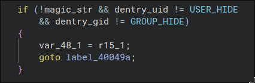

<font size="5">Driver's Shadow</font>

 13<sup>th</sup> 5 2025

 Prepared By: canopus

 Challenge Author: canopus

 Difficulty: <font color=red>Hard</font>

 Classification: Official

# Synopsis

A hard forensic challenge focusing on the identification and analysis of a memory-only rootkit, loaded by a malicious udev backdoor rule. Based on the `sedexp` malware

# Description

A critical Linux server began behaving erratically under suspected Volnaya interference, so a full memory snapshot was captured for analysis. Stealthy components embedded in the dump are altering system behavior and hiding their tracks; your task is to sift through the snapshot to uncover these concealed elements and extract any hidden payloads.

## Skills Required

- General Volatility Knowledge
- Slight C Reversing
- Linux Knowledge

## Skills Learned

- Volatility ISF generation
- Volatility Linux Plugins
- udev Rules
- Basics of Linux Kernel Modules

# Enumeration

We are given a zip file containing an `ELF` memory snapshot. We can identify if the snapshot is from a Linux machine by running the `banners.Banners` plugin in Volatility. This will display any strings that match the `uname -a` format:

```bash
$> vol -f mem.elf banners

Volatility 3 Framework 2.26.2
Progress:  100.00   PDB scanning finished
Offset  Banner

0x10399cd0  Linux version 6.1.0-34-amd64 (debian-kernel@lists.debian.org) (gcc-12 (Debian 12.2.0-14+deb12u1) 12.2.0, GNU ld (GNU Binutils for Debian) 2.40) #1 SMP PREEMPT_DYNAMIC Debian 6.1.135-1 (2025-04-25)
[...]
```

We are dealing with a Debian 12 - Bookworm machine, with a kernel version of `6.1.0-34`. Since no ISF (Intermediate Symbol File) is available, we will need to create it! There are some guides online for this but recently I've published a blog post that goes into great detail about how they are used and how to create them. You can find the blog post [here](https://www.hackthebox.com/blog/how-to-create-linux-symbol-tables-volatility).

Creating symbols is actually really simple, it pretty much boils down to finding the (correct) __debug__ kernel (package that contains a kernel binary with DWARF information), that's the hard part, and using [dwarf2json](https://github.com/volatilityfoundation/dwarf2json) to create the ISF.

Since we are working with Debian 12, let's browse the Bookworm's sections found [here](https://packages.debian.org/bookworm/). From there we can view the [Debug Packages](https://packages.debian.org/bookworm/debug/)


We can search for `6.1.0-34` to find the correct [debug kernel](https://packages.debian.org/bookworm/debug/linux-image-6.1.0-34-amd64-dbg).
Note: If the debian repo is acting up and not responding you can try using a mirror to download the package since you know identified the package name.

After downloading, we can extract with with `dpkg -x [package] [directory]`.

Lastly, we can use `dwarf2json` and point it to the debug `vmlinux` and create the ISF as so:

`$> dwarf2json linux --elf [package_directory]/usr/lib/debug/boot/vmlinux-6.1.0-34-amd64 > deb.json`

If all went well, we can now run `linux.pslist` and should view all the processes on the system!

__Note:__ About a week before the competition, [this repo](https://github.com/Abyss-W4tcher/volatility3-symbols) had been updated to include symbols for this [specific](https://github.com/Abyss-W4tcher/volatility3-symbols/tree/master/Debian/amd64/6.1.0/34) Debian build as well, so players could use those as well.

# Solution

### Q: What is the name of the backdoor udev Rule (ex:10-name.rules)

### A: 99-volnaya.rules

We can run the `linux.pagecache.Files` plugin and `grep` the output for `/etc/udev/rules.d`, or we can use the built-in `--filter` argument:

```
$> vol -f mem.elf -s ../htb/symbols/ --filter 'FilePath,/etc/udev/rules.d/*!' linux.pagecache.Files

Volatility 3 Framework 2.26.2
Progress:  100.00   Stacking attempts finished
SuperblockAddr  MountPoint  Device  InodeNum  InodeAddr FileType  InodePages  CachedPages FileMode  AccessTime  ModificationTime  ChangeTime  FilePath  InodeSize

0x9a097453c800  / 8:1 653067  0x9a09749b4ba8  DIR 1 0 drwxr-xr-x  2025-05-12 19:00:56.401543 UTC  2025-05-12 19:00:56.381548 UTC  2025-05-12 19:00:56.381548 UTC  /etc/udev/rules.d 4096
0x9a097453c800  / 8:1 652915  0x9a0974b66798  REG 1 1 -rw-r--r--  2025-05-12 19:19:55.919384 UTC  2025-05-12 19:20:29.372000 UTC  2025-05-12 19:20:29.372000 UTC  /etc/udev/rules.d/99-volnaya.rules  77
0x9a097453c800  / 8:1 654629  0x9a09749c6c40  REG 1 1 -rw-r--r--  2025-05-12 19:19:55.911388 UTC  2025-05-12 19:20:30.936000 UTC  2025-05-12 19:20:30.936000 UTC  /etc/udev/rules.d/60-vboxadd.rules  134
```

The `!` at the end of the filter signifies that this is a RegEx filter.

The rule in question is the `99-volnaya.rules` since it's part of the theme of the competition. We take note of the `InodeAddr` and we use `linux.pagecache.InodePages` to dump the rule as so:

```bash
$> vol -f mem.elf -s ../htb/symbols/ linux.pagecache.InodePages --inode 0x9a0974b66798 --dump

Volatility 3 Framework 2.26.2
Progress:  100.00   Stacking attempts finished
PageVAddr PagePAddr MappingAddr Index DumpSafe  Flags Output File

0xd787004a4340  0x1290d000  0x9a0974b66910  0 True  lru,private,reported,slob_free,uptodate inode_0x9a0974b66798.dmp
```

The contents of the rule are:

`ACTION=="add", ENV{MAJOR}=="1", ENV{MINOR}=="8", RUN+="/bin/volnaya_usr run"`

The rule describes an action to be performed depending on a device status. It can be translated as such: When the device 'X' gets plugged in (`ACTION=='add'`), run `/bin/volnaya_usr run`.
The device is described with the MAJOR/MINOR numbers, 1/8 respectively and this combination refers to the pseudodevice `/dev/random`. So this rule fires whenever the `/dev` pseudo-filesystem gets initialized as a form of a backdoor/persistence mechanism!

Much like above, we now have to look for the `volnaya_usr` binary. The binary is not under `/bin` but rather under `/usr/bin`, because `/bin` links to `/usr/bin`:

```bash
$> vol -f mem.elf -s ../htb/symbols/ linux.pagecache.Files --find '/usr/bin/volnaya_usr'

Volatility 3 Framework 2.26.2
Progress:  100.00   Stacking attempts finished
SuperblockAddr  MountPoint  Device  InodeNum  InodeAddr FileType  InodePages  CachedPages FileMode  AccessTime  ModificationTime  ChangeTime  FilePath  InodeSize

0x9a097453c800  / 8:1 913940  0x9a0974b68128  REG 107 107 -rwxr-xr-x  2025-05-12 19:20:29.156000 UTC  2025-05-12 19:17:34.102003 UTC  2025-05-12 19:20:12.731680 UTC  /usr/bin/volnaya_usr  437032
```

We extract it as described above and we can load it up in a decompiler to examine it further!

### Q: What is the hostname the rootkit connects to

### A: callback.cnc2811.volnaya.htb

### Q: What is the XOR key used (ex: 0011aabb)

### A: 881ba50d42a430791ca2d9ce0630f5c9

From the main function, we can see there is a hostname variable that gets decrypted using XOR:


We can use CyberChef to easily decrypt it:


The malware starts by checking the `EUID` of the running process and continues only if ran by `root`, after which, it renames itself as `kdevtmpfs` and based on arguments it calls either `install_module()` or `init_revshell()`.

`init_revshell()` is pretty much what the function name is, a reverse shell to `callback.cnc2811.volnaya.htb:4421`:


The interesting function is `install_module()` since is being run from udev itself (`run` argument)!


The function begins by invoking `kill(1,0)` and checks if the return value is 2. From the `man` page of `kill()`:

```txt
[...]
If pid is positive, then signal sig is sent to the process with
the ID specified by pid.
[...]
If sig is 0, then no signal is sent, but existence and permission
checks are still performed; this can be used to check for the
existence of a process ID or process group ID that the caller is
permitted to signal.
```

And for the return value:

```txt
On success (at least one signal was sent), zero is returned. 
```

So this function call checks if the `init` process (PID=1) exists which is already weird because `init` is always present and on top of this checks if the return value is 2. If this checks out then a `found` variable will be set to `1`.

If the `found` variable is still 0, then it continues by calling `deobf()` and then uses the `syscall()` function to call the `syscall` with the ID of `175` which is `init_module()`. From [man init_module(2)](https://man7.org/linux/man-pages/man2/init_module.2.html), we find that this syscall loads a kernel module!

Let's take a look at the `deobf()` function:


This basically allocates a buffer, copies `elf_hdr`, and decrypts the `elf_body` into the allocated buffer.

Following the execution in the `install_module()` after loading the kernel module:


A `readlink()` is called, which reads the file `/proc/self/exe` points at, which is the location of the calling program itself. It then goes on to construct a command line that is getting passed in `system()` which copies the executable from wherever it resides, into `/bin/volnaya_usr`

Finally, it creates the same udev rule we saw earlier!

We can extract the kernel module from the snapshot, but since it's embedded in the userspace binary, it will be easier for us to reverse it:

```python
with open("./volnaya_usr", "rb") as f:
 f.seek(0x3120)
 data = f.read(0x666C0)

key = bytes.fromhex("881ba50d42a430791ca2d9ce0630f5c9")
elf_hdr = data[:0x40]
elf_body = data[0x40:]

with open("./module", "wb") as f:
 f.write(elf_hdr)
 f.write(bytes([b ^ key[i % 16] for i, b in enumerate(elf_body)]))
```

### Q: What __SYSCALLS__ are hooked with ftrace, sorted via SYSCALL number (ex: read:write:open)

### A: kill:getdents64

### Q: What is the name of the kernel module

### A: volnaya_xb127

We can use the `linux.tracing.ftrace.CheckFtrace` plugin to check what hooks exist without reversing the module:

```bash
$> vol -f mem.elf -s ../htb/symbols/ linux.tracing.ftrace.CheckFtrace

Volatility 3 Framework 2.26.2
Progress:  100.00   Stacking attempts finished
ftrace_ops address  Callback  Callback address  Hooked symbols  Module  Module address

0xffffc09803a0  - 0xffffc097e200  filldir64 volnaya_xb127 0xffffc097e000
0xffffc09802c8  - 0xffffc097e200  filldir volnaya_xb127 0xffffc097e000
0xffffc09801f0  - 0xffffc097e200  fillonedir  volnaya_xb127 0xffffc097e000
0xffffc0980118  - 0xffffc097e200  __x64_sys_kill  volnaya_xb127 0xffffc097e000
0xffffc0980040  - 0xffffc097e200  __x64_sys_getdents64  volnaya_xb127 0xffffc097e000
```

We can see the hooked functions along with the module name.

### Q: What string must be contained in a file in order to be hidden

### A: volnaya

### Q: What owner UID and GID membership will make the file hidden (UID:GID)

### A: 1821:1992

For this we would have to reverse the kernel module we extracted earlier:


In the module's `init` function, it loops over an array of structs, defining what function to hook, what is the original function address, and what the hook function is:


This pattern is repeated for all 5 functions we observed earlier.

After installing the hooks, the module hides itself by removing it from the kernel's module list:


First, let's take a look at the hook of the `kill()` syscall. For this, we will switch over to the graph mode:


The hook begins by grabbing 2 values from the `pt_regs` argument, the `RDI`, and the `RSI` registers, and assigning them to `RDX` and `RAX` respectively. Looking at the syscall [definition](https://syscalls.mebeim.net/?table=x86/64/x64/latest) `int kill(pid_t pid, int sig);` we see that the first argument is the PID, and the second one is the signal. The linux calling convention states that the first argument is placed in the `RDI` register and the second in `RSI`:

- `PID = RDI -> pt_regs->di = RDX`
- `SIG = RSI -> pt_regs->si = RAX`

So we can follow the code knowing what checks are performed on the PID/Signal.

The first check is whether the Signal is 66 (0x42), if so it follows the left branch and proceeds to toggle the visibility of the kernel module:


The left-hand side hides the module (adds it back to the kernel's list), while the right-hand side, hides the module. Finally, the visibility is toggled and we return __without__ calling the original `kill()`.


The Blue outline part describes a privesc procedure when the Signal is 67 (0x43).

There is also a check whether the Signal is 0, then, it also checks if the PID is 1 (Red outline),
and if that's the case it returns 2. This is the check we found in the userspace program, it checks whether the rootkit returns 2 while checking the existence of `init`. This is a simple mechanism to check if the rootkit is loaded!

The Purple outline checks if the signal is 65 (0x41) and then calls `toggle_hide_proc()` with the PID as an argument (`mov edi, edx`).

`set_root()` changes the permissions of the current process to root:


In addition, `toggle_hide_proc()` simply, adds or removes the PID for a list that is later checked when hiding directory entries.

So to round up, our `kill()` hook does the following depending on signal:

```
signal: 67 -> privesc
signal: 66 -> toggle module visibility
signal: 65 -> toggle process visibility
signal: 0 && pid: 1 -> return 2
else: calls original kill()
```

Next, let's check out the hook for `getdents64()`:

It loops over all the results of the original `getdents64()` and it checks each one:

1. Checks if the `MAGIC_WORD` exists somewhere in the entry's name


2. Checks if the PID is contained in the `pid_hide_list`


3. Checks if the UID/GID of the entry is either `USER_HIDE`/`GROUP_HIDE` respectively



If any of those conditions are met, then the entry matching the criteria is removed from the results list.

### Q: There is one bash process that is hidden in __USERSPACE__, what is its PID

### A: 2957

Let's take a step back here. Back in `volnaya_usr` we came across the `init_revshell()` function. It __forks__, with the child acting as the reverse shell, and the parent calls `kill(65, child_pid)` and then exits! This means two things:

- The child process will be hidden => is the one we are looking for
- Since the parent exits without waiting that means the bash process we are looking for gets reparented by `init`!

We we list the processes using `linux.pslist` we find a lot of bash processes, and after examining their PPID we find the outlier:

```bash
$> vol -f mem.elf -s ../htb/symbols/ linux.pslist

[...]
0x9a094121cc80  1 1 0 systemd 0 0 0 0 2025-05-12 19:20:25.023435 UTC  Disabled
0x9a0946101980  1750  1750  1 systemd 1000  1000  1000  1000  2025-05-12 19:21:19.375581 UTC  Disabled
0x9a0946310000  2957  2957  1750  bash  0 0 0 0 2025-05-12 19:23:34.894489 UTC  Disabled
[...]
```

Notice the `bash` process, its PPID is the PID of the `systemd` process which acts like a pseudo-`init` process for userspace, which in turn, is parented by the respective processes.

### Q: What is the resolved IP of the attacker

### A: 16.171.55.6

Since we know the aforementioned PID is the process that is serving the reverse shell, we can use `linux.sockstat --pid` to show the open sockets for this process:

```bash
vol -f mem.elf -s ../htb/symbols/ linux.sockstat --pid 2957

Volatility 3 Framework 2.26.2
Progress:  100.00   Stacking attempts finished
NetNS Process Name  PID TID FD  Sock Offset Family  Type  Proto Source Addr Source Port Destination Addr  Destination Port  State Filter

4026531840  bash  2957  2957  0 0x9a094804a400  AF_INET STREAM  TCP 10.0.2.15 55522 16.171.55.6 4421  ESTABLISHED -
4026531840  bash  2957  2957  1 0x9a094804a400  AF_INET STREAM  TCP 10.0.2.15 55522 16.171.55.6 4421  ESTABLISHED -
4026531840  bash  2957  2957  2 0x9a094804a400  AF_INET STREAM  TCP 10.0.2.15 55522 16.171.55.6 4421  ESTABLISHED -
4026531840  bash  2957  2957  3 0x9a094804a400  AF_INET STREAM  TCP 10.0.2.15 55522 16.171.55.6 4421  ESTABLISHED -
```

### Q: What is the address of __x64_sys_kill,__x64__sys_getdents64 (ex: kill:getdents64)

### A: 0xffffb88b6bf0:0xffffb8b7c770

We can easily find the address of any symbol using `linux.kallsyms`:

```bash
$> vol -f mem.elf -s ../htb/symbols/ --filter 'SymbolName,(__x64_sys_kill)|(__x64_sys_getdents64)!' linux.kallsyms --core

Volatility 3 Framework 2.26.2
Progress:  100.00   Stacking attempts finished
Addr  Type  Size  Exported  SubSystem ModuleName  SymbolName  Description

0xffffb88b6bf0  T 176 True  core  kernel  __x64_sys_kill  Symbol is in the text (code) section
0xffffb8b7c770  T 288 True  core  kernel  __x64_sys_getdents64  Symbol is in the text (code) section
```
