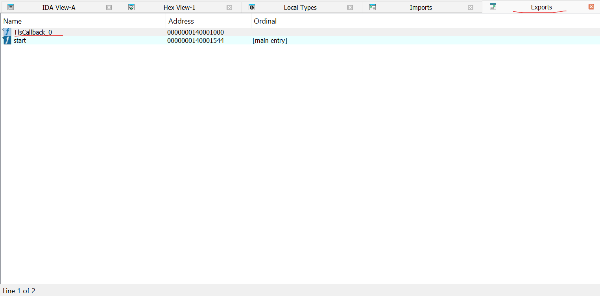
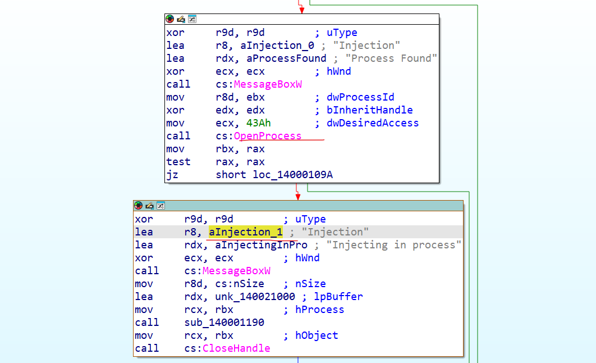
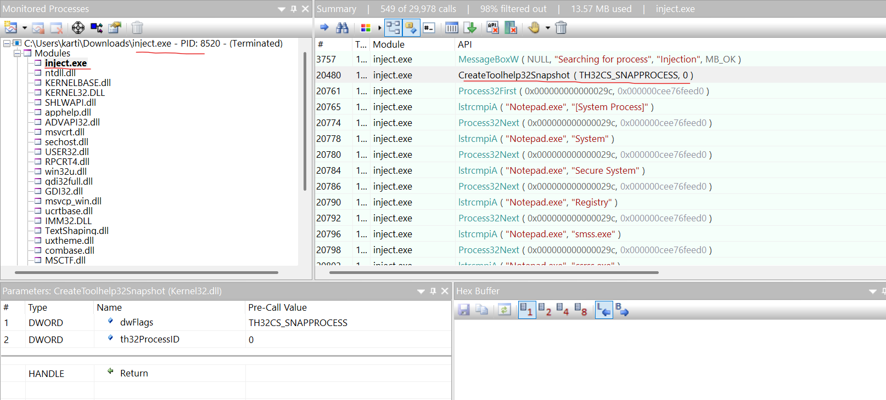
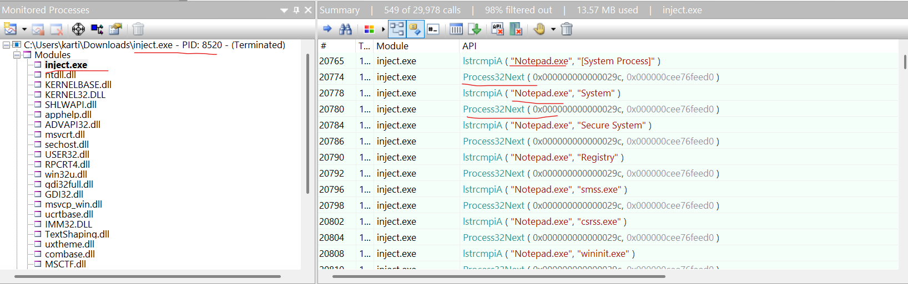
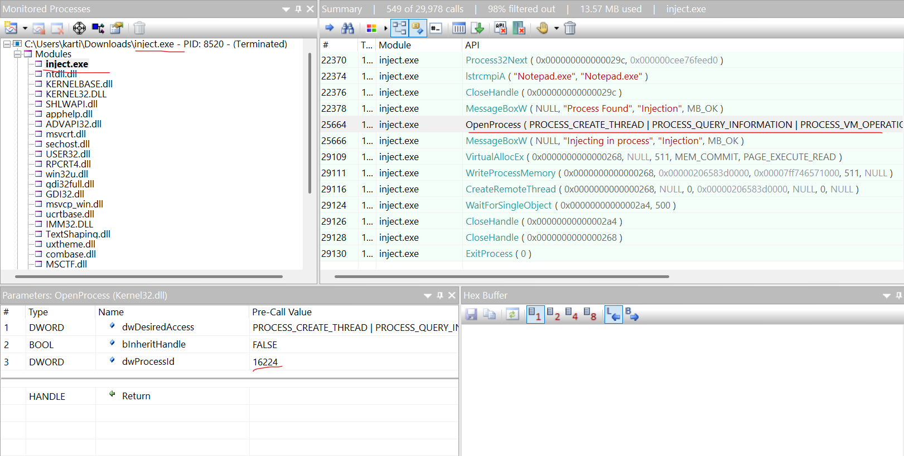
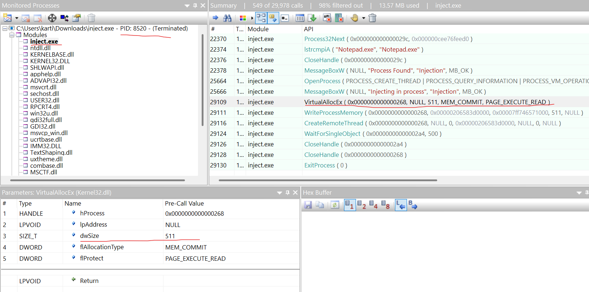
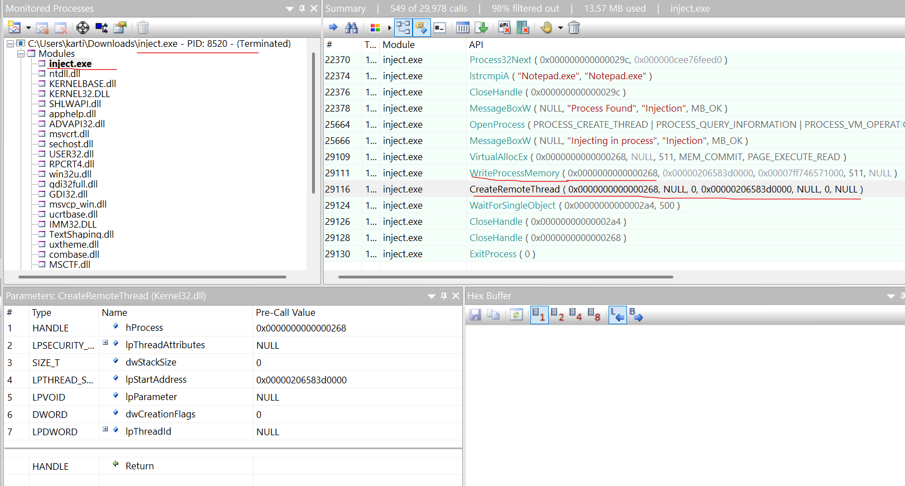
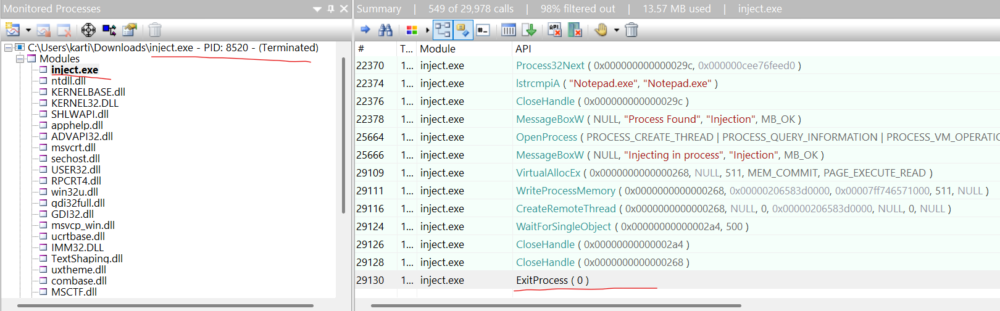

Ghost Thread

 16th 4 2025

 Prepared By: iamr007

 Challenge Author: iamr007

 Difficulty: Easy

 Classification: Official

# Synopsis

In Ghost Thread, players join Talion “Byte Doctor” Reyes as he investigates a stealthy post-breach attack where malicious code was injected into a legitimate process, leaving almost no trace on disk. Using API Monitor logs, players must uncover the process injection technique used and identify which trusted process was injected.

# Description

Byte Doctor suspects the attacker used a process injection technique to run malicious code within a legitimate process, leaving minimal traces on the file system. The logs reveal Win32 API calls that hint at a specific injection method used in the attack. 

Your task is to analyze these logs using a tool called API Monitor to uncover the injection technique and identify which legitimate process was targeted.

## Skills Required

* Basic Windows OS knowledge

## Skills Learned

* Learn how attackers inject malicious code into legitimate processes using APIs.
* Gain experience analyzing low-level Win32 API calls to trace suspicious actions.
* Learn how to filter and correlate API calls to uncover hidden execution flows.

# Enumeration

### API Monitor

We are well-acquainted with opening PCAP and .EVTX files, but what are .apmx64 and .apmx86 files? These are file extensions associated with API Monitor, a software used to monitor and control API calls made by applications and services. To commence your analysis, follow the steps provided below:

- Download the [API Monitor](http://www.rohitab.com/apimonitor)

- Navigate to "Files" and click on "Open" to view captured data from the file: "Ghost-Thread.apmx64"

- After opening the file, the "Monitoring Process" window will populate with a list of processes. Expand the view by clicking the '+' symbol to reveal the modules and threads associated with each process.

- The API calls can be observed in the "Summary" window. To focus our analysis on a specific module, click on the different DLLs loaded by the processes.

# Solution

### [1/7] What process injection technique is being used? Hint: `T***** L**** S******`

To start the analysis, open inject.exe.i64 in IDA Freeware and switch to the Exports tab. There, you’ll see an entry called TlsCallback_0, indicating that the program's code runs before it reaches main().
    

    
By double-clicking the identified export, we see that the callback performs code injection -- a well-known technique known as Thread Local Storage (TLS) injection.
    

**Answer:** `Thread Local Storage`

### [2/7] Which Win32 API was used to take snapshots of all processes and threads on the system?

Immediately after the 'MessageBoxW' API, we observe that the attacker is using the 'CreateToolhelp32Snapshot' API with the 'TH32CS_SNAPPROCESS' flag, indicating that the binary is capturing a snapshot of all processes and threads on the system.
    

 **Answer:** `CreateToolhelp32Snapshot`

### [3/7] Which process is the attacker's binary attempting to locate for payload injection?

We also observe that the binary compares 'notepad.exe' with running background processes, and if there's no match, it calls the 'Process32Next' API to check the next process. This confirms that the binary attempts to locate 'notepad.exe' for payload injection.

**Answer:** `notepad.exe`

### [4/7] What is the process ID of the identified process?

Immediately after locating the 'notepad.exe' process, the binary invokes the 'OpenProcess' API to obtain a handle. The third argument of the 'OpenProcess' call reveals that the process ID of 'notepad.exe' is '16224'.
    

**Answer:** `16224`

### [5/7] What is the size of the shellcode?

After obtaining the handle, the binary calls 'VirtualAllocEx' to allocate memory in the target process, matching the shellcode size of 511 bytes.
    

**Answer:** `511`

### [6/7] Which Win32 API was used to execute the injected payload in the identified process?

After allocating memory, the binary uses 'WriteProcessMemory' to write the shellcode to a specific location, followed by 'CreateRemoteThread' to execute the payload.
    

**Answer:** `CreateRemoteThread`

### [7/7] The injection method used by the attacker executes before the main() function is called. Which Win32 API is responsible for terminating the program before main() runs?

 As identified in the first question, the attacker is using the Thread Local Storage (TLS) injection technique, which involves manipulating pointers within a Portable Executable (PE) file to redirect execution to malicious code before the program reaches its legitimate entry point. Based on this, all the above shellcode injection is occuring within a malicious TLS callback. To prevent the program from continuing to its actual entry point (main function), the process must terminate early. The API calls confirm that the binary invokes 'ExitProcess' to terminate execution before reaching main().
    

**Answer:** `ExitProcess`

