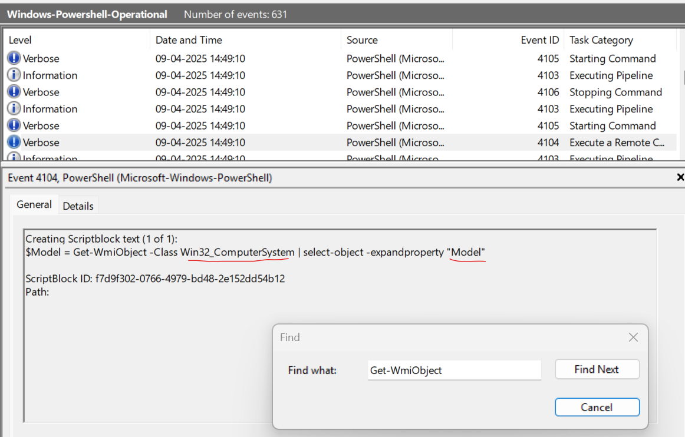
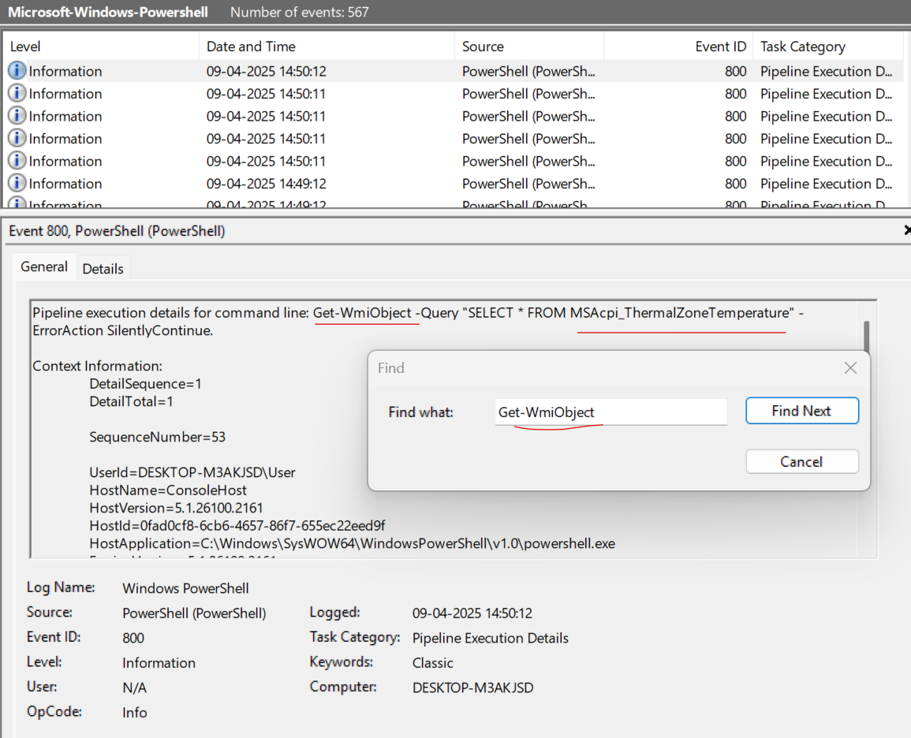
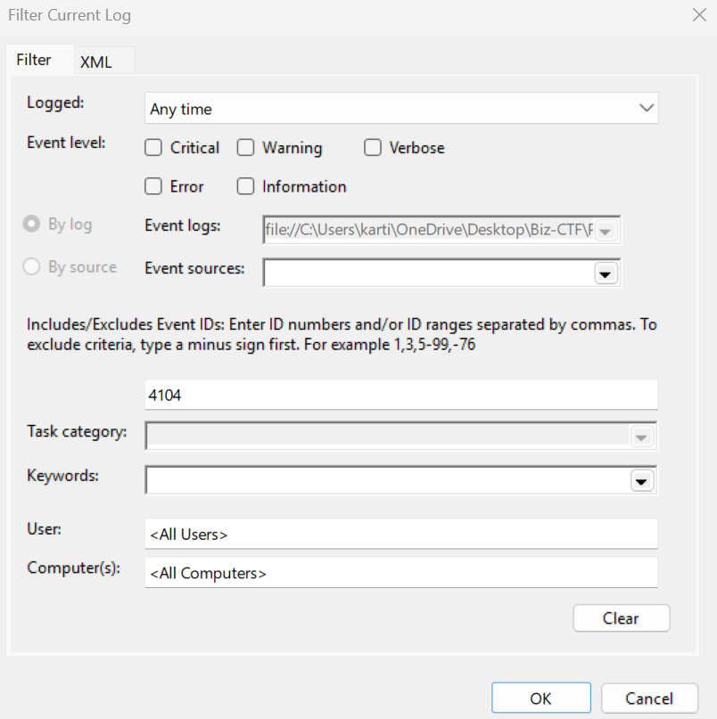
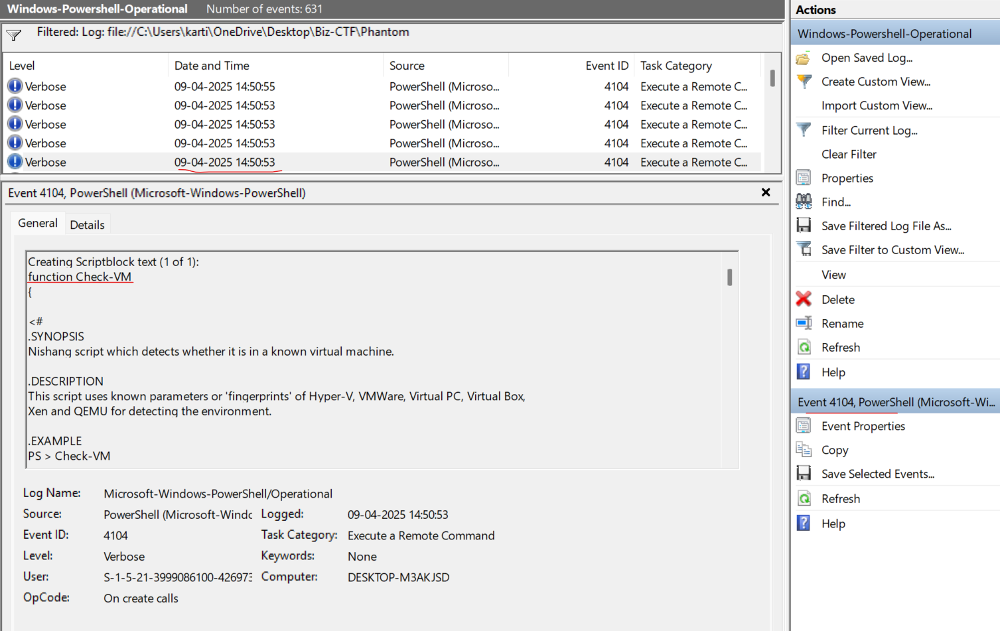
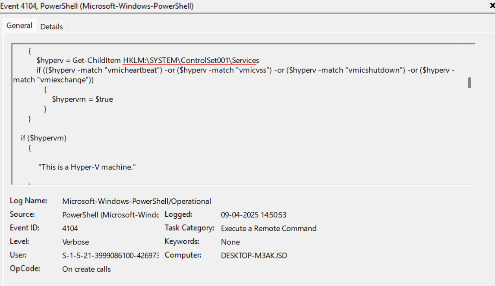
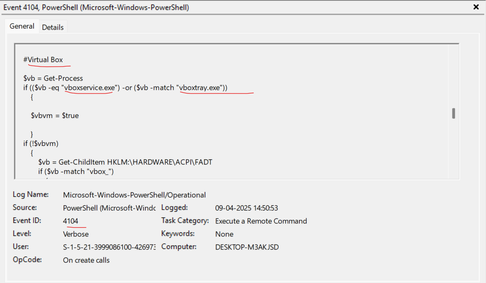
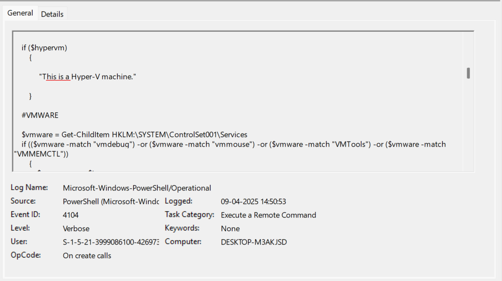
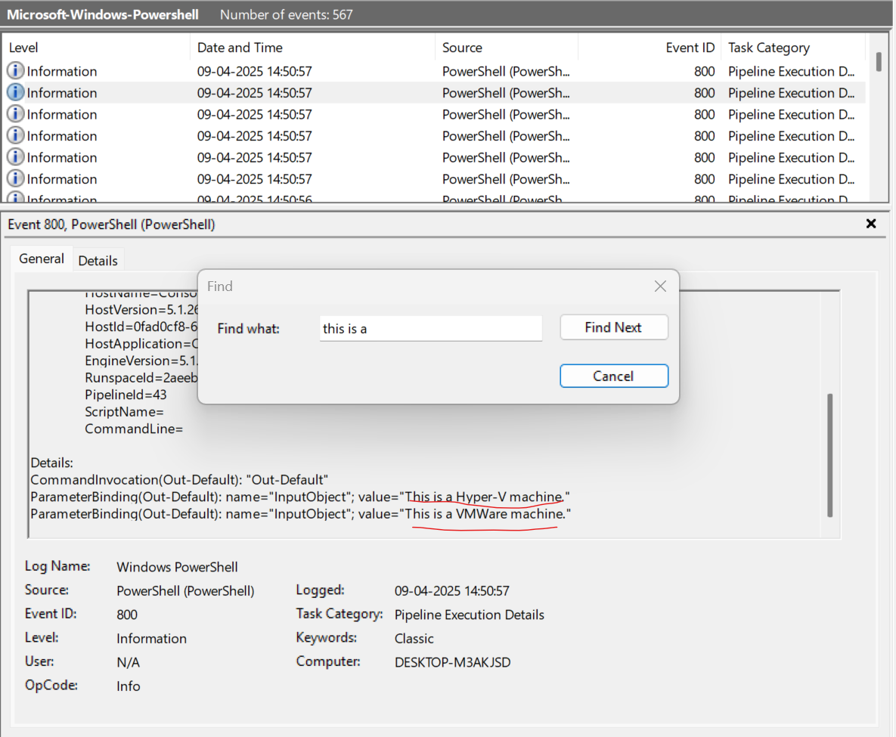

Phantom Check

 09th 4 2025

 Prepared By: iamr007

 Challenge Author: iamr007

 Difficulty: Very Easy

 Classification: Official

# Synopsis

Phantom Check is a very easy challenge showcasing some of the common virtualization detection techniques used by attackers. 

# Description

Talion suspects that the threat actor carried out anti-virtualization checks to avoid detection in sandboxed environments. Your task is to analyze the event logs and identify the specific techniques used for virtualization detection. Byte Doctor requires evidence of the registry checks or processes the attacker executed to perform these checks.

## Skills Required

* Basic Windows knowledge

## Skills Learned

* Players will gain the ability to create detection rules by identifying specific WMI queries, comparing processes for virtual machine detection, and analyzing registry keys or file paths associated with virtual environments.

# Solution

### [1/6] Which WMI class did the attacker use to retrieve model and manufacturer information for virtualization detection?

From the list of artifacts, we observe only Windows PowerShell event logs, indicating that PowerShell was used. One of the commonly used cmdlets for retrieving information via WMI classes in PowerShell is 'Get-WmiObject'. Searching for this in the event logs reveals the use of the 'Win32_ComputerSystem' class to obtain model and manufacturer details.
	

**Answer:** `Win32_ComputerSystem`

### [2/6] Which WMI query did the attacker execute to retrieve the current temperature value of the machine?

Following the same approach as above, we find that the attacker executed the query 'SELECT * FROM MSAcpi_ThermalZoneTemperature' to retrieve the current temperature value.
	

**Answer:** `SELECT * FROM MSAcpi_ThermalZoneTemperature`

### [3/6] The attacker loaded a PowerShell script to detect virtualization. What is the function name of the script?

Filtering the event logs in 'Windows-PowerShell-Operational' to show all entries with Event ID 4104 reveals the PowerShell scripts that were executed. Upon reviewing the logs, we find that the attacker loaded a virtualization detection script containing the function 'Check-VM'.
	

	

**Answer:** `Check-VM`

### [4/6] The script enumerates the registry for virtualization __services__. Which key is being enumerated?

Going through the above identified script we find that the script retrives service details from 'HKLM:\SYSTEM\ControlSet001\Services'
	

**Answer:** `HKLM:\SYSTEM\ControlSet001\Services`

### [5/6] When identifying the presence of VirtualBox, which two processes are being checked for existing? (ServiceA.exe:ServiceB.exe)

We scroll down until we come across the 'VirtualBox' comment in the script. Just below it, we can see that the script retrieves process details using the 'Get-Process' cmdlet and compares them with 'vboxservice.exe' and 'vboxtray.exe' to determine whether it's running in a VirtualBox environment.
	

**Answer:** `vboxservice.exe:vboxtray.exe`

### [6/6] The VM detection script prints any detection with the prefix 'This is a'. Which two virtualization platforms did the script detect?

Thoroughly analyzing the script, we do observe that it prints virtual machine detection results using the phrase 'This is a' followed by the name of the VM. To find the output, we search for the string 'This is a' within the 'Microsoft-Windows-PowerShell' logs and confirm that, according to the script, the operating system is running inside either 'Hyper-V' or 'VMware'.
	

	

**Answer:** `Hyper-V:Vmware`

