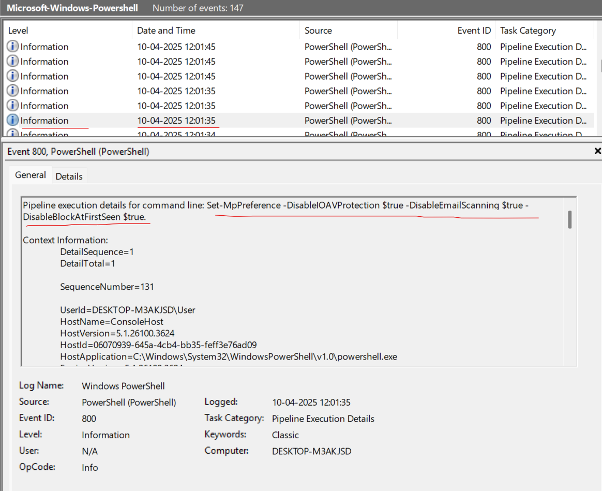

Smoke & Mirrors

 10th 4 2025

 Prepared By: iamr007

 Challenge Author: iamr007

 Difficulty: Very Easy

 Classification: Official

# Synopsis

In Smoke & Mirrors, players analyze the provided event logs and forensic artifacts to uncover how the attacker disabled or altered security features. They must identify the tools, commands, or scripts used to reduce visibility and reconstruct the methods the attacker used to operate undetected.

# Description

Byte Doctor Reyes is investigating a stealthy post-breach attack where several expected security logs and Windows Defender alerts appear to be missing. He suspects the attacker employed defense evasion techniques to disable or manipulate security controls, significantly complicating detection efforts. 

Using the exported event logs, your objective is to uncover how the attacker compromised the system's defenses to remain undetected.

## Skills Required

* Basic Windows OS knowledge

## Skills Learned

* Understand and recognize malicious use of PowerShell cmdlets
* Analyze and interpret Windows Registry modifications
* Identify how attackers disable or tamper with Windows security features

# Solution

### [1/5] The attacker disabled LSA protection on the compromised host by modifying a registry key. What is the full path of that registry key?

The question clearly states that the attacker modified LSA protection by changing a registry key. By searching for commonly used commands like 'reg add' in the Windows PowerShell Operational logs, we find that the attacker altered the following path:
    
`HKLM\SYSTEM\CurrentControlSet\Control\LSA`
    

**Answer:** `HKLM\SYSTEM\CurrentControlSet\Control\LSA`

### [2/5] Which PowerShell cmdlet controls Windows Defender?

The most commonly used PowerShell cmdlet to disable Windows Defender is 'Set-MpPreference'. We begin our search for this command in the Windows PowerShell logs and find multiple instances of its use, with the first execution recorded at '10-04-2025 12:01:35'. Below is the complete command:
    

**Answer:** `Set-MpPreference`

### [3/5] The attacker loaded an AMSI patch written in PowerShell. Which function __in__ the amsi.dll is being patched by the script to effectively disable AMSI? Hint: The script in question imports `kernel32.dll`

We begin by searching for any strings related to '.dll' within the Windows-PowerShell-Operational logs and discover that the attacker imported a function named 'Disable-Protection' which modifies 'amsi.dll'. Reviewing the full script reveals that it attempts to patch the 'AmsiScanBuffer' function within the DLL.
    

**Answer:** `AmsiScanBuffer`

### [4/5] Which command did the attacker use to restart the machine in Safe Mode, (with arguments, without ".exe")?

To restart a Windows machine in Safe Mode, the command must include the string 'safeboot'. Searching for this confirms that the attacker executed the following command to initiate a Safe Mode reboot.
    

**Answer:** `bcdedit /set safeboot network`

### [5/5] Which PowerShell command did the attacker use to disable PowerShell command history logging?

The PowerShell cmdlet 'Set-PSReadlineOption' customizes the behavior of the PSReadLine module during command-line editing. Searching for its usage in the Windows PowerShell logs reveals that the attacker executed the following command to disable history logging.
    

**Answer:** `Set-PSReadlineOption -HistorySaveStyle SaveNothing`

