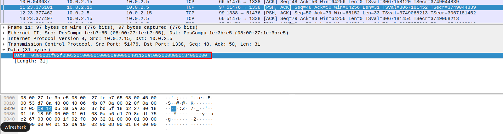
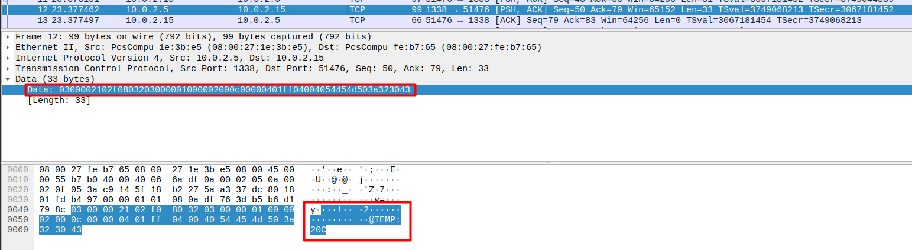
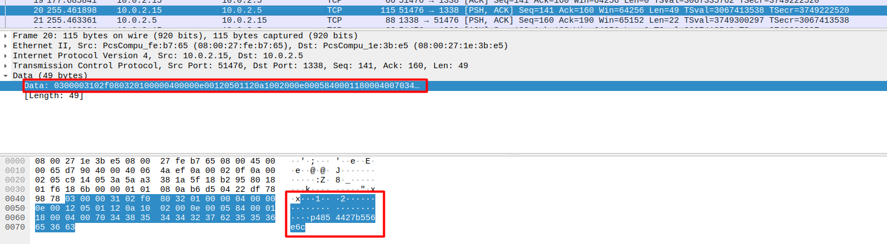
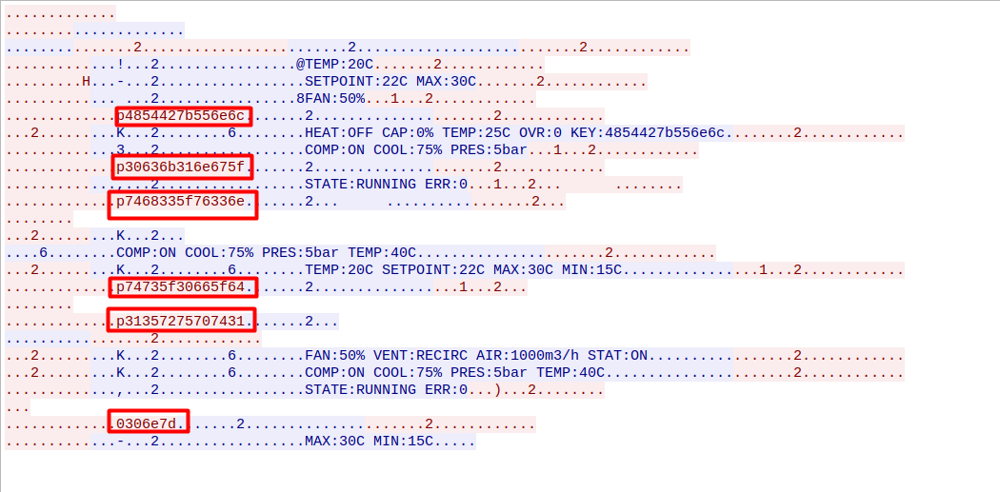
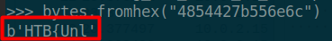

 Whispers of the Ducts

04th April 2025

Prepared By: `r3dsh3rl0ck`

Challenge Author(s): `r3dsh3rl0ck`

Difficulty: Very Easy

      

# Synopsis (!)

- Understanding S7 network traffic
- Analyzing TCP streams in Wireshark
- Decoding hex values into ASCII

## Description (!)

- Task Force Phoenix has intercepted faint signals from Volnaya’s government complex—a stream of HVAC control traffic buzzing over the wire. Buried in the chatter lies a critical piece of intel, the first whisper of Operation Blackout’s plan to turn the smart building’s systems against its masters.

## Skills Required (!)

- Basic knowledge of S7 read/write operations
- Familiarity with Wireshark
- Understanding of TCP traffic analysis

## Skills Learned (!)

- How to analyze S7 network traffic
- Identifying read and write operations in S7 protocol
- Decoding hexadecimal strings into readable text

# Solution (!)

## S7 network traffic analysis via Wireshark

We’re provided with a PCAP file named hvac_traffic.pcap, containing TCP traffic captured from Volnaya’s HVAC system. Opening it in Wireshark, we see packets flowing over tcp, indicating S7 protocol communication (an ICS protocol used in Siemens PLCs).

Upon inspecting the packets, we observe a mix of read and write operations:

- Read Requests and Responses: Clients querying the HVAC PLC for data.
- Write Requests and Responses: Clients modifying PLC variables.

Let’s break down examples of each to understand the traffic.

#### Read Request Example

Packet: `03 00 00 1f 02 f0 80 32 01 00 00 01 00 00 0e 00 00 04 01 12 0a 10 02 00 08 00 01 84 00 00 00`

Breakdown:

- 03 00 00 1f - TPKT: 31 bytes.
- 02 f0 80 - COTP: Data Transfer.
- 32 01 - S7 PDU: S7 protocol, Job Request (Unacknowledged).
- 00 01 - PDU Ref: ID 1.
- 00 0e 00 00 - Param: 14 bytes, no data.
- 00 04 01 - Read Var, 1 item.
- 12 0a 10 02 00 08 00 01 84 00 00 00 - Read 8 bytes from DB1, offset 0.

Meaning: Client requests 8 bytes from DB1.

#### Read Response Example
Packet: `03 00 00 21 02 f0 80 32 03 00 00 01 00 00 02 00 0c 00 00 04 01 ff 04 00 40 54 45 4d 50 3a 32 30 43`

Breakdown:

- 03 00 00 21 - TPKT: 33 bytes.
- 02 f0 80 - COTP: Data Transfer.
- 32 03 - S7 PDU: S7 protocol, Job Request (Acknowledged).
- 00 01 - PDU Ref: ID 1 (matches request).
- 00 02 00 0c - Param: 2 bytes, Data: 12 bytes.
- 00 04 01 - Echoes Read Var, 1 item.
- ff 04 00 40 - Success, byte array, 8 bytes.
- 54 45 4d 50 3a 32 30 43 - Data: TEMP:20C.

Meaning: Server returns `TEMP:20C` from DB1.

#### Write Request Example

Packet: `03 00 00 31 02 f0 80 32 01 00 00 04 00 00 0e 00 12 05 01 12 0a 10 02 00 0e 00 05 84 00 01 18 00 04 00 70 34 38 35 34 34 32 37 62 35 35 36 65 36 63`

Breakdown:

- 03 00 00 31 - TPKT: 49 bytes.
- 02 f0 80 - COTP: Data Transfer.
- 32 01 - S7 PDU: S7 protocol, Job Request (Unacknowledged).
- 00 04 - PDU Ref: ID 4.
- 00 0e 00 12 - Param: 14 bytes, Data: 18 bytes.
- 05 01 - Write Var, 1 item.
- 12 0a 10 02 00 0e 00 05 84 - Byte array, 14 bytes to DB5.
- 00 01 18 - DB5, offset 24 (start of KEY in OVR:0 KEY:0x0000).
- 00 04 00 - Data format (inconsistent, should match 14).
- 70 34 38 35 34 34 32 37 62 35 35 36 65 36 63 - Data: p4854427b556e6c.

Meaning: Client writes 14 bytes `(p4854427b556e6c)` to DB5, offset 24.

#### Write Response Example
Packet: `03 00 00 16 02 f0 80 32 03 00 00 04 00 00 02 00 01 00 00 05 01 ff`

Breakdown:

- 03 00 00 16 - TPKT: 22 bytes.
- 02 f0 80 - COTP: Data Transfer.
- 32 03 - S7 PDU: S7 protocol, Job Request (Acknowledged).
- 00 04 - PDU Ref: ID 4 (matches request).
- 00 02 00 01 - Param: 2 bytes, Data: 1 byte.
- 00 05 01 - Echoes Write Var, 1 item.
- ff - Success.

Meaning: Server confirms the write to DB5 succeeded.

## Following the TCP Stream

To simplify analysis, right-click a packet in Wireshark, select "Follow" > "TCP Stream." This displays the conversation between client and server:

- Blue Text: Read requests from the client.
- Red Text: Write requests from the client.

Focusing on writes, we notice multiple write requests to DB5, offset 24 which as we can observer is the `key` variable from the hvac system. The first write payload is `p4854427b556e6c` in hex, in which each character is inside the range of the ASCII printable characters. 

Examining all write requests to DB5, we see a pattern of hex strings being written sequentially.

### Extracting the Flag

By inspecting all write operations in the TCP stream, we collect these hex payloads: `4854427b556e6c30636b316e675f7468335f76336e74735f30665f6431357275707431306e7d`

By converting these hex characters to ASCII we got the flag :).

