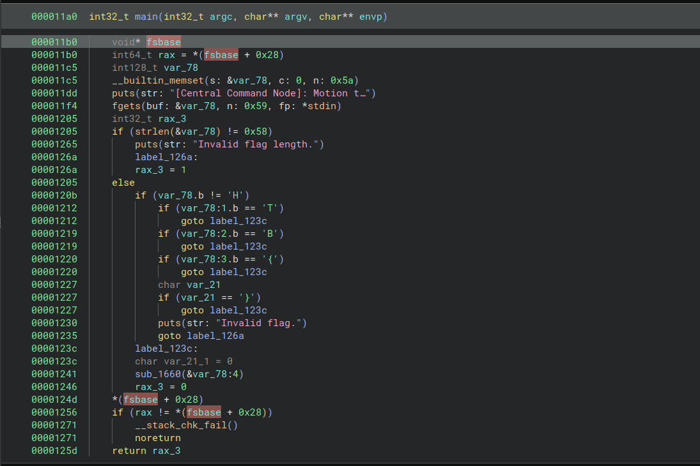
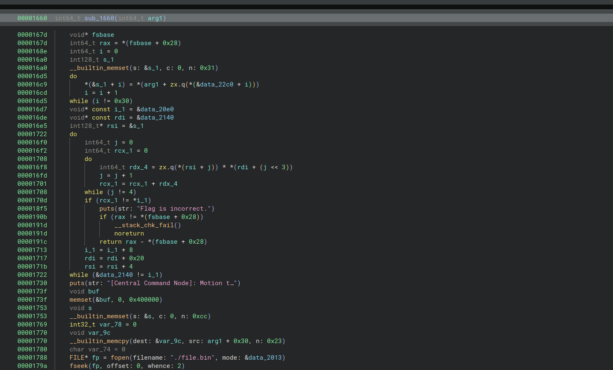
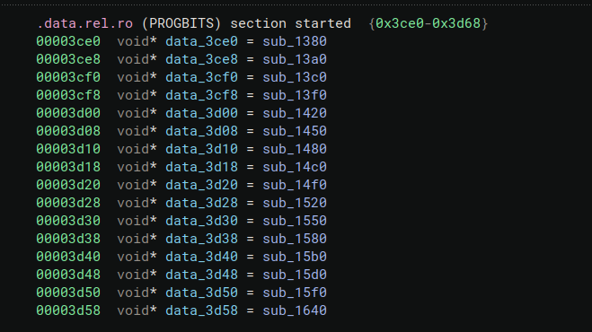

<font size="5">ShadowLabyrinth</font>

  4<sup>th</sup> 10 24

  Prepared By: clubby789

  Challenge Author: Rafa10

  Difficulty: <font color=red>Hard</font>

  Classification: Official

# Description
Deep within Volnaya's digital territory lies an ancient-themed virtual labyrinth protecting their central command node. This shifting maze guards the heart of Operation Blackout with rotating encryption, adaptive defenses, and cryptographic puzzles embedded in ancient symbology. The clock is ticking, my friend!

# Synopsis

ShadowLabyrinth is a Hard reversing challenge. Players will understand how/when to solve linear equations to derive an AES key and decrypt and decompress bytecode from a virtualmachine. By looking at the patterns done by the code, they will solve the challenge.

## Skils Required
    - Z3 usage
    - GDB usage

## Skills Learned
    - Equation solving techniques like Babai CVP and matrix encodings.
    - Use of Sagemath
    - Understanding virtualized code
    - Scripting and general problem solving capabilities


# Solution

We open the binary and it seem like a normal flag checker.



It seems as though the flag has the format "HTB{}" and `sub_1660` will hold our verifier. Let's reverse it.



A little big... Let's break the problem down. And rename things.

First, it seems as though we are doing permutations on the flag.
```
000016d5      do
000016c9          s_1[i] = our_flag[zx.q((&permutation_box)[i])]
000016cd          i = i + 1
000016d5      while (i != 0x30)
```

Then, we see some linear problem...
```
000016d7      uint64_t* const i_1 = &results
000016de      uint64_t (* const coefs)[0x4] = &table_of_coheficcients
000016e5      uint8_t (* flag_after_permut)[0x30] = &s_1
00001722      do
000016f0          int64_t j = 0
000016f2          int64_t rcx_1 = 0
00001708          do
000016f8              int64_t rdx_4 = zx.q((*flag_after_permut)[j]) * (*coefs)[j]
000016fd              j = j + 1
00001701              rcx_1 = rcx_1 + rdx_4
00001708          while (j != 4)
0000170d          if (rcx_1 != *i_1)
000018f5              puts(str: "Flag is incorrect.")
0000190b              if (rax != *(fsbase + 0x28))
0000191d                  __stack_chk_fail()
0000191d                  noreturn
0000191c              return rax - *(fsbase + 0x28)
00001713          i_1 = &i_1[1]
00001717          coefs = &coefs[1]
0000171b          flag_after_permut = &(*flag_after_permut)[4]
00001722      while (&table_of_coheficcients != i_1)
```

The permutated_flag has groups of 4 characters (uint8_t) multiplied by 4 coheficients (uint64_t).


We see a weird copy...
```
__builtin_memcpy(dest: &var_9c, src: &our_flag[0x30], n: 0x23)
```

Seems to be the rest of the flag that was not used...\
We'll figure it out later.


The rest sounds like xor, aes and... zlib inflation on `file.bin`.

```
00001788      FILE* fp = fopen(filename: "./file.bin", mode: &data_2013)
0000179a      fseek(fp, offset: 0, whence: 2)
000017a2      int64_t rax_1 = ftell(fp)
000017b1      fseek(fp, offset: 0, whence: 0)
000017bd      if (rax_1 u> 0x100000)
00001931          puts(str: "Does not fit!")
0000193b          exit(status: 1)
0000193b          noreturn
000017d1      fread(buf: &buf, size: 1, count: rax_1, fp)
000017d9      fclose(fp)
000017e1      if (rax_1 != 0)
000017e3          void* rdx_6 = &buf
000017e9          int32_t i_2 = 0
00001818          do
00001800              int32_t i_3 = i_2
00001802              i_2 = i_2 + 1
00001810              *rdx_6 = *rdx_6 ^ flag_after_permut_1[0x20 + zx.q(i_3 & 0xf)]
00001812              rdx_6 = rdx_6 + 1
00001818          while (i_2 != rax_1.d)
0000181d      int64_t rax_2 = malloc(bytes: rax_1)
00001825      int64_t rax_3 = EVP_CIPHER_CTX_new()
00001830      int32_t var_400170
00001830      if (rax_3 != 0 && EVP_DecryptInit_ex(rax_3, EVP_aes_256_cbc(), 0, &flag_after_permut_1, &data_40c0) == 1 && EVP_DecryptUpdate(rax_3, rax_2, &var_400170, &buf, zx.q(rax_1.d)) == 1 && EVP_DecryptFinal_ex(rax_3, sx.q(var_400170) + rax_2, &var_400170) == 1)
0000189c          EVP_CIPHER_CTX_free(rax_3)
000018b7          var_400170.q = compressBound(0x100000)
000018c3          uncompress(&buf, &var_400170, rax_2, rax_1)
000018cb          free(mem: rax_2)
000018d0          while (true)  // virtual machine handler
000018d0              uint64_t rax_12 = zx.q(var_78)
000018e1              var_78 = (rax_12 + 1).d
000018e8              (&data_3ce0)[zx.q(*(&buf + (rax_12 << 2)))](&buf)
00001925      exit(status: 0xffffffff)
```

The compressBound is part of zlib.

So... It seem sas though it is a virtual machine, we can see `data_3ce0` leads us to a vtable with the instructions.



If we look at `sub_15d0`, we realise, that's what the copy was for, it will read from the rest of the flag.\
We will have to reverse a VM program to figure what the flag is.

So, now, we could try to get solve the keys and disassemble the code.\
We start by dumping the cohefficients from memory and the results.\

We will first solve the 4 var equations.\
A way to find a solution for this type of problems really fast is using closest vector problem with lattices.\
There is an implementation for this made by rbtree, which allows us to derive the solution very fast.

```py
for config in equation_system:
    mat = [
        [config[0][0], 1, 0, 0, 0], # select exactly the variable per line
        [config[0][1], 0, 1, 0, 0],
        [config[0][2], 0, 0, 1, 0],
        [config[0][3], 0, 0, 0, 1],
        [2**64, 0, 0, 0, 0] # all the cohefficients of our polynomial are less than 2**64
    ]
    L = [config[1], 0, 0, 0, 0] # the values of the variables are `uint8_t`, so the lowerbound is 0
    U = [config[1], 256, 256, 256, 256] # and the upperbound is 256
    mat = Matrix(mat)
    _,_,res=solve(mat,L,U)
    key += bytes(res[:4])

key2 = bytes(list(key))
```

Magic! We get the keys!

So, now, we can get the code.

```python
key2 = bytes(list(key))

with open("./file.bin", "rb") as f:
    dat = f.read()


dat = xor(dat, key2[32:])


iv = [0x8c, 0xa2, 0xca, 0xb2, 0x29, 0xdb, 0x61, 0x0a, 0xac, 0xdd, 0x9d, 0x43, 0x7c, 0x61, 0x7a, 0xf3]
cipher = AES.new(key2[:32], AES.MODE_CBC, bytes(iv))

get_vm_data = unpad(cipher.decrypt(dat), AES.block_size)

get_vm_data = decompress(get_vm_data)
```

And, after analysing the VM, we can write our disassembler too.

```python
from sage.all import *
from sage.modules.free_module_integer import IntegerLattice

from Crypto.Cipher import AES
from Crypto.Util.Padding import unpad

from pwn import xor
from zlib import decompress
import struct

def read_u32(binary, offset):
    return struct.unpack('<I', binary[offset:offset+4])[0]

def disassemble(binary):
    instructions = []
    offset = 0
    
    while offset < len(binary):
        try:
            opcode = read_u32(binary, offset)
            offset += 4
            
            instruction = {
                'offset': offset - 4,
                'opcode': opcode,
                'args': [],
                'mnemonic': '',
                'text': ''
            }
            
            if opcode == 0:  # reset0
                reg = read_u32(binary, offset)
                offset += 4
                instruction['args'] = [reg]
                instruction['mnemonic'] = 'reset0'
                instruction['text'] = f"reset0 r{reg}"
                
            elif opcode == 1:  # reset1
                reg = read_u32(binary, offset)
                offset += 4
                instruction['args'] = [reg]
                instruction['mnemonic'] = 'reset1'
                instruction['text'] = f"reset1 r{reg}"
                
            elif opcode == 2:  # addi
                reg = read_u32(binary, offset)
                offset += 4
                val = read_u32(binary, offset)
                offset += 4
                instruction['args'] = [reg, val]
                instruction['mnemonic'] = 'addi'
                instruction['text'] = f"addi r{reg}, {val}"
                
            elif opcode == 3:  # subbi
                reg = read_u32(binary, offset)
                offset += 4
                val = read_u32(binary, offset)
                offset += 4
                instruction['args'] = [reg, val]
                instruction['mnemonic'] = 'subbi'
                instruction['text'] = f"subbi r{reg}, {val}"
                
            elif opcode == 4:  # lsli
                reg = read_u32(binary, offset)
                offset += 4
                val = read_u32(binary, offset)
                offset += 4
                instruction['args'] = [reg, val]
                instruction['mnemonic'] = 'lsli'
                instruction['text'] = f"lsli r{reg}, {val}"
                
            elif opcode == 5:  # add
                dst = read_u32(binary, offset)
                offset += 4
                src = read_u32(binary, offset)
                offset += 4
                instruction['args'] = [dst, src]
                instruction['mnemonic'] = 'add'
                instruction['text'] = f"add r{dst}, r{src}"
                
            elif opcode == 6:  # sub
                dst = read_u32(binary, offset)
                offset += 4
                src = read_u32(binary, offset)
                offset += 4
                instruction['args'] = [dst, src]
                instruction['mnemonic'] = 'sub'
                instruction['text'] = f"sub r{dst}, r{src}"
                
            elif opcode == 7:  # xor
                dst = read_u32(binary, offset)
                offset += 4
                src = read_u32(binary, offset)
                offset += 4
                instruction['args'] = [dst, src]
                instruction['mnemonic'] = 'xor'
                instruction['text'] = f"xor r{dst}, r{src}"
                
            elif opcode == 8:  # str
                reg = read_u32(binary, offset)
                offset += 4
                disp = struct.unpack('<i', binary[offset:offset+4])[0]*4  # signed int32
                offset += 4
                instruction['args'] = [reg, disp]
                instruction['mnemonic'] = 'str'
                instruction['text'] = f"str r{reg}, [{(offset + disp):08x}]"
                
            elif opcode == 9:  # ldr
                reg = read_u32(binary, offset)
                offset += 4
                disp = struct.unpack('<i', binary[offset:offset+4])[0]*4  # signed int32
                offset += 4
                instruction['args'] = [reg, disp]
                instruction['mnemonic'] = 'ldr'
                instruction['text'] = f"ldr r{reg}, [{(offset + disp):08x}]"
                
            elif opcode == 10:  # jz
                target = struct.unpack('<i', binary[offset:offset+4])[0]  # signed int32
                offset += 4
                instruction['args'] = [target]
                instruction['mnemonic'] = 'jz'
                abs_target = (offset - 8) + target*4 

                instruction['text'] = f"jz {target:+d} [-> 0x{abs_target:08x}]"
                
            elif opcode == 11:  # jnz
                target = struct.unpack('<i', binary[offset:offset+4])[0]  # signed int32
                offset += 4
                instruction['args'] = [target]
                instruction['mnemonic'] = 'jnz'
                abs_target = (offset - 8) + target*4
                instruction['text'] = f"jnz {target:+d} [-> 0x{abs_target:08x}]"
                
            elif opcode == 12:  # jmp
                target = struct.unpack('<i', binary[offset:offset+4])[0]  # signed int32
                offset += 4
                instruction['args'] = [target]
                instruction['mnemonic'] = 'jmp'
                abs_target = (offset - 8) + target*4
                instruction['text'] = f"jmp {target:+d} [-> 0x{abs_target:08x}]"
                
            elif opcode == 13:  # getch
                instruction['mnemonic'] = 'getch'
                instruction['text'] = "getch"
                
            elif opcode == 14:  # puts
                disp = struct.unpack('<i', binary[offset:offset+4])[0] + 2  # signed int32
                offset += 4
                instruction['args'] = [disp]
                instruction['mnemonic'] = 'puts'
                instruction['text'] = f"puts [{disp:+d}]"
                
                # Try to extract the string being printed if possible
                str_offset = offset + (disp - 2)*4
                if 0 <= str_offset < len(binary):
                    # Read until null terminator
                    string_data = []
                    while str_offset < len(binary):
                        char_val = read_u32(binary, str_offset)
                        if char_val == 0:
                            break
                        string_data.append(chr(char_val))
                        str_offset += 4
                    if string_data:
                        instruction['text'] += f" ; \"{''.join(string_data)}\""
                
            elif opcode == 15:  # exit
                instruction['mnemonic'] = 'exit'
                instruction['text'] = "exit"
                
            else:
                instruction['mnemonic'] = f"unknown_{opcode}"
                instruction['text'] = f"unknown_{opcode}"
            
            instructions.append(instruction)
            
        except Exception as e:
            # If we encounter an error, just show what we have
            print(f"Error at offset 0x{offset:08x}: {e}")
            break
    
    return instructions

def print_disassembly(instructions):
    for insn in instructions:
        print(f"0x{insn['offset']:08x}: {insn['text']}")

# Directly taken from rbtree's LLL repository
# From https://web.archive.org/web/20211006060014/https://oddcoder.com/LOL-34c3/, https://hackmd.io/@hakatashi/B1OM7HFVI
def Babai_CVP(mat, target):
	M = IntegerLattice(mat, lll_reduce=True).reduced_basis
	G = M.gram_schmidt()[0]
	diff = target
	for i in reversed(range(G.nrows())):
		diff -=  M[i] * ((diff * G[i]) / (G[i] * G[i])).round()
	return target - diff


def solve(M, lbounds, ubounds, weight = None):
	mat, lb, ub = copy(M), copy(lbounds), copy(ubounds)
	num_var  = mat.nrows()
	num_ineq = mat.ncols()

	max_element = 0 
	for i in range(num_var):
		for j in range(num_ineq):
			max_element = max(max_element, abs(mat[i, j]))

	if weight == None:
		weight = num_ineq * max_element

    # sanity checker
	if len(lb) != num_ineq:
		print("Fail: len(lb) != num_ineq")
		return

	if len(ub) != num_ineq:
		print("Fail: len(ub) != num_ineq")
		return

	for i in range(num_ineq):
		if lb[i] > ub[i]:
			print("Fail: lb[i] > ub[i] at index", i)
			return

    	# heuristic for number of solutions
	DET = 0

	if num_var == num_ineq:
		DET = abs(mat.det())
		num_sol = 1
		for i in range(num_ineq):
			num_sol *= (ub[i] - lb[i])
		if DET == 0:
			print("Zero Determinant")
		else:
			num_sol //= DET
			# + 1 added in for the sake of not making it zero...
			print("Expected Number of Solutions : ", num_sol + 1)

	# scaling process begins
	max_diff = max([ub[i] - lb[i] for i in range(num_ineq)])
	applied_weights = []

	for i in range(num_ineq):
		ineq_weight = weight if lb[i] == ub[i] else max_diff // (ub[i] - lb[i])
		applied_weights.append(ineq_weight)
		for j in range(num_var):
			mat[j, i] *= ineq_weight
		lb[i] *= ineq_weight
		ub[i] *= ineq_weight

	# Solve CVP
	target = vector([(lb[i] + ub[i]) // 2 for i in range(num_ineq)])
	result = Babai_CVP(mat, target)

	for i in range(num_ineq):
		if (lb[i] <= result[i] <= ub[i]) == False:
			print("Fail : inequality does not hold after solving")
			break
    
    	# recover x
	fin = None

	if DET != 0:
		mat = mat.transpose()
		fin = mat.solve_right(result)
	
	## recover your result
	return result, applied_weights, fin

# The system of equations that we get from the binary that we have to solve.
equation_system = [
    [[14055091775023953042, 4697615361981610810, 13156859446556206221, 9827634565473418386], 13300144332188832633],
    [[5373631360438526983, 16942442890343741447, 3664586747082128017, 14567259116776078067], 12888318284105725407],
    [[6785120272971039627, 10789770647799993750, 16439294865311385781, 6508158523694997399], 10558681868314680195],
    [[1802839430078646867, 6286569574160603382, 9334576314108341274, 5975256149793082424], 10627411219216148408],
    [[18081590721992869275, 17876552896028830478, 15004347904193854619, 18171394467572912155], 11773963806847708635],
    [[13312841314732569691, 7778175297513301391, 7381032535666542733, 18260596666252650869], 12288299245347496658],
    [[9058469793968160760, 6202997293771330668, 6877061413170231308, 16628218849096314863], 8108830967362923143],
    [[12108041809488199247, 13192887724755078504, 4916096456553900087, 2484714295426518693], 10267425364822616444],
    [[11810397209173602435, 4233600866858274491, 14160344317519436691, 10746092446191405905], 2055613089520971530],
    [[1248975127725990079, 2001095475832083806, 1369475499596269645, 14130870301470775307], 13187960460901614106],
    [[13499373392351563463, 18083580916977673865, 16647353807052949688, 8126032605205937982], 2573742750309805842],
    [[4219647702921633222, 17990802922386267876, 14587743928823397188, 3689454119161069336], 7702547848331324668]
]


key = b""
for config in equation_system:
    mat = [
        [config[0][0], 1, 0, 0, 0],
        [config[0][1], 0, 1, 0, 0],
        [config[0][2], 0, 0, 1, 0],
        [config[0][3], 0, 0, 0, 1],
        [2**64, 0, 0, 0, 0]
    ]
    L = [config[1], 0, 0, 0, 0]
    U = [config[1], 256, 256, 256, 256]
    mat = Matrix(mat)
    _,_,res=solve(mat,L,U)
    key += bytes(res[:4])

key2 = bytes(list(key))

with open("./file.bin", "rb") as f:
    dat = f.read()


dat = xor(dat, key2[32:])


iv = [0x8c, 0xa2, 0xca, 0xb2, 0x29, 0xdb, 0x61, 0x0a, 0xac, 0xdd, 0x9d, 0x43, 0x7c, 0x61, 0x7a, 0xf3]
cipher = AES.new(key2[:32], AES.MODE_CBC, bytes(iv))

get_vm_data = unpad(cipher.decrypt(dat), AES.block_size)

get_vm_data = decompress(get_vm_data)

insns = disassemble(get_vm_data)

# get the disassembly
print_disassembly(insns)

# get the binary
with open("./vm_inst", "wb") as f:
    f.write(get_vm_data)
```

We get a lot of instructions from the binary, but the trick is to start from the bottom.

```
0x0007bdcc: puts [+112] ; "[Central Command Node]: Authentication complete!"
0x0007bdd4: jmp +4 [-> 0x0007bde4]
0x0007bddc: puts [+157] ; "[Central Command Node]: Authentication failed!"
0x0007bde4: exit
```

Sounds promising, a win or lose game.\
So, we see a bunch of 0 comparisons after with the `subbi` instruction as we called it... for each register


```
0x0007bb14: jnz +172 [-> 0x0007bdc4]
0x0007bb1c: subbi r1, 0
...
0x0007bda8: jnz +7 [-> 0x0007bdc4]
0x0007bdb0: subbi r34, 0
```

And they are set to xor before...

```
...
0x0007ba9c: ldr r32, [0007be68]
0x0007baa8: ldr r33, [0007bef4]
0x0007bab4: xor r32, r33
0x0007bac0: ldr r33, [0007be6c]
0x0007bacc: ldr r34, [0007bef8]
0x0007bad8: xor r33, r34
0x0007bae4: ldr r34, [0007be70]
0x0007baf0: ldr r35, [0007befc]
0x0007bafc: xor r34, r35
```

Sounds like another equality problem.

The flag is stored in the beginning right to 0x7bf00 in the VM memory.\
The xors and stores are handled with the nearby addresses.

The code is still confusing, but, if we scroll through it, we start to notice patterns.

```
0x00077d88: add r35, r0
0x00077d94: add r35, r1
0x00077da0: add r35, r2
0x00077dac: add r35, r3
0x00077db8: add r35, r4
0x00077dc4: add r35, r5
0x00077dd0: add r35, r6
0x00077ddc: add r35, r7
0x00077de8: add r35, r8
0x00077df4: add r35, r9
0x00077e00: add r35, r10
0x00077e0c: add r35, r11
0x00077e18: add r35, r12
0x00077e24: add r35, r13
0x00077e30: add r35, r14
0x00077e3c: add r35, r15
0x00077e48: add r35, r16
0x00077e54: add r35, r17
0x00077e60: add r35, r18
0x00077e6c: add r35, r19
0x00077e78: add r35, r20
0x00077e84: add r35, r21
0x00077e90: add r35, r22
0x00077e9c: add r35, r23
0x00077ea8: add r35, r24
0x00077eb4: add r35, r25
0x00077ec0: add r35, r26
0x00077ecc: add r35, r27
0x00077ed8: add r35, r28
0x00077ee4: add r35, r29
0x00077ef0: add r35, r30
0x00077efc: add r35, r31
0x00077f08: add r35, r32
0x00077f14: add r35, r33
0x00077f20: add r35, r34
0x00077f2c: str r35, [0007bef8]
```

Like sudden sprouts like this in the middle of the code that resemple matrix multiplication collapsing.

Seems like the values are generated through instruction spam and then the matrix multiplies to store the final result in the respective place. The data to be matched with keeps being generated as well.

There is a bit of a smarter technique for this that will save us a lot of time...

```
0x00000614: add r0, r36
0x00000620: reset0 r0
0x00000628: add r0, r35
0x00000634: subbi r0, 1124
0x00000640: ldr r35, [0007bf00]
0x0000064c: reset0 r36
0x00000654: add r36, r0
0x00000660: subbi r35, 1
0x0000066c: jz +7 [-> 0x00000688]
0x00000674: add r0, r36
0x00000680: jmp -8 [-> 0x00000660]
```

Notice these loops, they are multiplications. Hence, if we set a watchpoint for every single char of the flag and then we print what ends up in `r36`, we will end up dumping the whole matrix.
Then, by the end, we only have to dump the other vector as well.

```python
import gdb

# dispatcher breakpoint
gdb.execute("break *(0x18d0 + 0x000555555554000)")

rax_values = []

count = 0
count_steps = 0
reg = 0
regs = []
mat = []

def breakpoint_handler(event):
    global count, count_steps, rax_values, regs
    addr = gdb.execute("print/x $rip", to_string=True).split()[-1]
    addr = int(addr, 16) - 0x000555555554000

    if addr == 0x18d0:
        if count_steps == 0:
            gdb.execute("disable break 1")
            gdb.execute(f"rwatch *((0x7bf00 + {reg * 4}) + 0x7fffffbfd320)")
        elif count_steps > 0:
            if ((count_steps) % 3) == 0:
                gdb.execute("disable break 1")
                gdb.execute(f"enable break {reg + 2}")
                r36 = int(gdb.execute("print/x *(unsigned int *)(0x7fffffbfd320 + 0x400000 + (36 * 4))", to_string=True).split()[-1], 16)
                regs += [r36]
        count_steps += 1
    else:
        gdb.execute(f"disable break {reg + 2}")
        gdb.execute("enable break 1")
        count += 1

    print(regs)

gdb.events.stop.connect(breakpoint_handler)

ct = 0
while reg < 35:
    # we can fill the rest of flag.txt with 'a' or whatever, it does not matter
    gdb.execute("r < ./flag.txt")
    while True:
        try:
            # fixed number (we can get it by incrementing until the try fails)
            if ct == 4934:
                break

            gdb.execute("continue")
            ct += 1
        except:
            break
    mat += [regs]
    gdb.execute(f"delete break {reg + 2}")
    gdb.execute(f"enable break 1")
    count = 0
    count_steps = 0
    regs = []
    reg += 1

mat = [tuple(col) for col in zip(*mat)]
print(mat)

ans = tuple()

# now dump the answer vector that was generated as well at 0x7bde8
for i in range(35):
    ans += (int(gdb.execute(f"print/x *(unsigned int *)(0x7fffffbfd320 + 0x7bde8 + {i *4})", to_string=True).split()[-1], 16),)

print(ans)
```

Now, we can finally write the full solver that will solve this system of equations.


```python
from sage.all import *
import sys
import re
import struct


from sage.modules.free_module_integer import IntegerLattice

# Directly taken from rbtree's LLL repository
# From https://web.archive.org/web/20211006060014/https://oddcoder.com/LOL-34c3/, https://hackmd.io/@hakatashi/B1OM7HFVI
def Babai_CVP(mat, target):
	M = IntegerLattice(mat, lll_reduce=True).reduced_basis
	G = M.gram_schmidt()[0]
	diff = target
	for i in reversed(range(G.nrows())):
		diff -=  M[i] * ((diff * G[i]) / (G[i] * G[i])).round()
	return target - diff


def solve(M, lbounds, ubounds, weight = None):
	mat, lb, ub = copy(M), copy(lbounds), copy(ubounds)
	num_var  = mat.nrows()
	num_ineq = mat.ncols()

	max_element = 0 
	for i in range(num_var):
		for j in range(num_ineq):
			max_element = max(max_element, abs(mat[i, j]))

	if weight == None:
		weight = num_ineq * max_element

    # sanity checker
	if len(lb) != num_ineq:
		print("Fail: len(lb) != num_ineq")
		return

	if len(ub) != num_ineq:
		print("Fail: len(ub) != num_ineq")
		return

	for i in range(num_ineq):
		if lb[i] > ub[i]:
			print("Fail: lb[i] > ub[i] at index", i)
			return

    	# heuristic for number of solutions
	DET = 0

	if num_var == num_ineq:
		DET = abs(mat.det())
		num_sol = 1
		for i in range(num_ineq):
			num_sol *= (ub[i] - lb[i])
		if DET == 0:
			print("Zero Determinant")
		else:
			num_sol //= DET
			# + 1 added in for the sake of not making it zero...
			print("Expected Number of Solutions : ", num_sol + 1)

	# scaling process begins
	max_diff = max([ub[i] - lb[i] for i in range(num_ineq)])
	applied_weights = []

	for i in range(num_ineq):
		ineq_weight = weight if lb[i] == ub[i] else max_diff // (ub[i] - lb[i])
		applied_weights.append(ineq_weight)
		for j in range(num_var):
			mat[j, i] *= ineq_weight
		lb[i] *= ineq_weight
		ub[i] *= ineq_weight

	# Solve CVP
	target = vector([(lb[i] + ub[i]) // 2 for i in range(num_ineq)])
	result = Babai_CVP(mat, target)

	for i in range(num_ineq):
		if (lb[i] <= result[i] <= ub[i]) == False:
			print("Fail : inequality does not hold after solving")
			break
    
    	# recover x
	fin = None

	if DET != 0:
		mat = mat.transpose()
		fin = mat.solve_right(result)
	
	## recover your result
	return result, applied_weights, fin

# The system of equations that we get from the binary that we have to solve.
equation_system = [
    [[14055091775023953042, 4697615361981610810, 13156859446556206221, 9827634565473418386], 13300144332188832633],
    [[5373631360438526983, 16942442890343741447, 3664586747082128017, 14567259116776078067], 12888318284105725407],
    [[6785120272971039627, 10789770647799993750, 16439294865311385781, 6508158523694997399], 10558681868314680195],
    [[1802839430078646867, 6286569574160603382, 9334576314108341274, 5975256149793082424], 10627411219216148408],
    [[18081590721992869275, 17876552896028830478, 15004347904193854619, 18171394467572912155], 11773963806847708635],
    [[13312841314732569691, 7778175297513301391, 7381032535666542733, 18260596666252650869], 12288299245347496658],
    [[9058469793968160760, 6202997293771330668, 6877061413170231308, 16628218849096314863], 8108830967362923143],
    [[12108041809488199247, 13192887724755078504, 4916096456553900087, 2484714295426518693], 10267425364822616444],
    [[11810397209173602435, 4233600866858274491, 14160344317519436691, 10746092446191405905], 2055613089520971530],
    [[1248975127725990079, 2001095475832083806, 1369475499596269645, 14130870301470775307], 13187960460901614106],
    [[13499373392351563463, 18083580916977673865, 16647353807052949688, 8126032605205937982], 2573742750309805842],
    [[4219647702921633222, 17990802922386267876, 14587743928823397188, 3689454119161069336], 7702547848331324668]
]


key = b""
for config in equation_system:
    mat = [
        [config[0][0], 1, 0, 0, 0],
        [config[0][1], 0, 1, 0, 0],
        [config[0][2], 0, 0, 1, 0],
        [config[0][3], 0, 0, 0, 1],
        [2**64, 0, 0, 0, 0]
    ]
    L = [config[1], 0, 0, 0, 0]
    U = [config[1], 256, 256, 256, 256]
    mat = Matrix(mat)
    _,_,res=solve(mat,L,U)
    key += bytes(res[:4])

key2 = list(key)
shuffle_box = [16, 25, 32, 5, 0, 45, 38, 2, 14, 40, 24, 17, 7, 33, 23, 29, 39, 15, 35, 21, 46, 26, 19, 47, 43, 20, 13, 31, 1, 22, 44, 42, 30, 8, 34, 11, 18, 27, 12, 9, 41, 36, 4, 28, 3, 6, 37, 10]

for i, j in enumerate(shuffle_box):
    key2[j] = chr(key[i])

key2 = ''.join(key2)

Zq = Zmod(2**32)

# Matrix that we dumped from the VM.
coefs = [(281, 123, 291, 110, 116, 87, 13, 150, 7, 157, 256, 18, 111, 251, 54, 109, 227, 205, 289, 256, 151, 270, 165, 247, 197, 58, 69, 20, 67, 234, 58, 249, 29, 184, 107), 
(294, 112, 298, 15, 99, 60, 148, 280, 265, 258, 17, 281, 72, 14, 17, 235, 72, 297, 179, 138, 246, 175, 133, 150, 3, 184, 80, 130, 91, 5, 117, 284, 227, 143, 116), 
(236, 183, 237, 10, 8, 48, 276, 142, 149, 127, 64, 106, 103, 136, 220, 200, 97, 41, 14, 215, 248, 114, 260, 134, 178, 214, 58, 188, 43, 280, 247, 204, 1, 94, 214), 
(131, 296, 72, 237, 294, 146, 79, 285, 129, 27, 108, 278, 261, 194, 164, 186, 128, 252, 128, 253, 174, 271, 274, 229, 80, 16, 126, 74, 86, 71, 52, 15, 26, 50, 95), 
(187, 292, 260, 157, 186, 106, 211, 241, 191, 133, 70, 222, 124, 132, 256, 157, 282, 242, 220, 113, 297, 105, 63, 214, 223, 203, 215, 94, 90, 79, 0, 69, 262, 267, 218), 
(161, 230, 11, 242, 39, 58, 193, 294, 181, 1, 109, 273, 268, 167, 56, 1, 19, 241, 82, 233, 85, 151, 132, 108, 276, 223, 289, 78, 211, 93, 17, 24, 27, 225, 145), 
(237, 126, 106, 225, 139, 239, 86, 210, 235, 156, 256, 119, 242, 107, 27, 197, 125, 36, 7, 231, 52, 284, 239, 3, 107, 210, 31, 166, 79, 71, 45, 235, 65, 156, 194), 
(139, 94, 143, 223, 212, 35, 212, 88, 293, 186, 144, 299, 53, 194, 259, 167, 21, 165, 157, 93, 221, 269, 282, 251, 72, 272, 129, 176, 237, 160, 285, 156, 270, 259, 30), 
(112, 185, 190, 266, 286, 206, 241, 286, 84, 255, 38, 128, 56, 60, 150, 46, 99, 137, 128, 288, 159, 259, 22, 256, 47, 201, 38, 166, 16, 203, 230, 210, 282, 111, 211), 
(151, 148, 70, 91, 191, 211, 224, 248, 208, 176, 9, 138, 277, 168, 232, 10, 190, 67, 235, 108, 102, 106, 152, 73, 6, 291, 124, 94, 235, 88, 123, 129, 298, 184, 269), 
(292, 162, 128, 221, 40, 82, 126, 96, 154, 123, 60, 288, 98, 273, 264, 205, 25, 135, 155, 183, 120, 36, 43, 208, 192, 284, 245, 12, 107, 289, 69, 40, 113, 106, 222), 
(183, 65, 118, 113, 7, 46, 296, 96, 129, 102, 173, 21, 119, 146, 192, 51, 14, 253, 38, 299, 294, 183, 228, 126, 207, 198, 244, 260, 269, 284, 99, 189, 147, 256, 213), 
(192, 167, 21, 22, 99, 4, 292, 39, 214, 173, 169, 44, 192, 147, 33, 130, 168, 21, 70, 163, 78, 248, 285, 43, 212, 98, 252, 102, 66, 117, 270, 160, 131, 286, 10), 
(1, 257, 139, 298, 37, 178, 142, 214, 293, 104, 203, 100, 60, 255, 153, 204, 32, 106, 96, 3, 103, 101, 264, 281, 289, 155, 263, 290, 155, 69, 233, 149, 8, 207, 82), 
(211, 157, 16, 183, 1, 95, 72, 166, 145, 113, 199, 90, 192, 210, 0, 265, 182, 256, 293, 97, 53, 26, 256, 100, 49, 242, 244, 95, 108, 211, 0, 40, 251, 43, 208), 
(296, 209, 122, 100, 127, 162, 187, 289, 173, 240, 179, 253, 77, 153, 129, 51, 123, 94, 57, 142, 105, 114, 115, 8, 127, 15, 103, 117, 243, 288, 228, 292, 183, 126, 95), 
(138, 282, 170, 160, 196, 61, 93, 296, 83, 137, 178, 209, 95, 271, 212, 226, 13, 272, 56, 83, 90, 224, 128, 173, 162, 111, 151, 227, 107, 174, 25, 24, 46, 193, 34), 
(7, 284, 70, 235, 137, 298, 72, 90, 82, 60, 228, 262, 4, 186, 229, 175, 266, 102, 158, 163, 202, 153, 16, 67, 240, 142, 179, 55, 191, 16, 177, 214, 255, 281, 263), 
(184, 72, 4, 8, 123, 117, 208, 45, 79, 188, 42, 0, 257, 103, 91, 79, 144, 174, 237, 224, 240, 4, 18, 130, 1, 244, 62, 220, 63, 30, 162, 101, 154, 296, 295), 
(154, 122, 295, 253, 5, 255, 24, 184, 156, 38, 70, 51, 106, 71, 130, 255, 68, 114, 208, 163, 167, 193, 69, 138, 236, 182, 101, 167, 291, 207, 280, 153, 50, 22, 31), 
(251, 128, 279, 67, 170, 232, 29, 196, 104, 295, 85, 284, 66, 198, 203, 238, 255, 294, 246, 123, 155, 21, 134, 5, 121, 52, 150, 293, 63, 90, 204, 79, 92, 294, 244), 
(196, 286, 52, 87, 57, 7, 203, 296, 272, 188, 152, 209, 266, 0, 158, 174, 115, 167, 258, 172, 105, 94, 18, 212, 130, 70, 205, 224, 291, 26, 235, 293, 103, 186, 178), 
(186, 21, 29, 61, 15, 204, 156, 232, 42, 217, 178, 38, 73, 283, 43, 210, 259, 5, 241, 146, 87, 193, 31, 143, 166, 222, 249, 162, 91, 175, 49, 145, 236, 37, 282), 
(82, 252, 216, 113, 271, 152, 102, 32, 130, 77, 130, 139, 102, 206, 16, 84, 242, 20, 279, 277, 32, 107, 67, 164, 195, 149, 37, 96, 218, 287, 198, 19, 212, 283, 283), 
(60, 40, 37, 148, 244, 100, 168, 244, 45, 20, 223, 263, 248, 173, 44, 162, 53, 125, 184, 131, 5, 205, 201, 290, 246, 100, 9, 276, 249, 232, 276, 121, 128, 159, 119), 
(92, 176, 276, 275, 43, 7, 4, 199, 38, 150, 221, 93, 214, 120, 26, 145, 273, 281, 50, 235, 214, 288, 90, 263, 231, 126, 25, 97, 186, 170, 174, 78, 201, 194, 11), 
(45, 229, 279, 183, 189, 252, 268, 78, 118, 124, 74, 36, 292, 299, 230, 289, 12, 12, 250, 81, 78, 276, 115, 98, 237, 17, 0, 235, 129, 152, 46, 165, 258, 126, 131), 
(150, 74, 145, 202, 68, 240, 15, 131, 220, 28, 3, 35, 217, 137, 250, 78, 182, 177, 146, 194, 12, 137, 133, 268, 234, 74, 162, 36, 253, 94, 219, 85, 10, 218, 278), 
(75, 188, 29, 18, 213, 208, 121, 195, 115, 288, 159, 166, 97, 96, 149, 106, 101, 148, 246, 5, 262, 50, 61, 253, 0, 243, 89, 15, 87, 104, 20, 209, 130, 195, 169), 
(98, 12, 46, 148, 154, 226, 151, 213, 130, 243, 86, 89, 113, 61, 3, 73, 58, 48, 32, 23, 145, 116, 81, 68, 256, 76, 197, 149, 290, 80, 68, 238, 190, 1, 98), 
(197, 21, 98, 288, 177, 87, 60, 150, 47, 116, 169, 221, 29, 128, 186, 45, 266, 65, 245, 299, 272, 193, 174, 175, 102, 253, 156, 13, 26, 200, 279, 80, 120, 196, 43), 
(165, 19, 125, 213, 252, 58, 241, 151, 101, 238, 289, 209, 181, 236, 50, 260, 232, 276, 168, 187, 98, 248, 207, 210, 129, 41, 152, 286, 188, 80, 177, 161, 271, 163, 145), 
(134, 156, 265, 26, 249, 245, 286, 187, 275, 99, 155, 127, 65, 148, 33, 2, 131, 238, 7, 129, 149, 91, 25, 161, 34, 275, 97, 106, 194, 46, 115, 297, 140, 240, 146), 
(49, 136, 163, 132, 283, 129, 169, 130, 2, 289, 93, 187, 11, 279, 62, 88, 131, 168, 247, 248, 28, 208, 293, 288, 276, 114, 275, 100, 283, 41, 294, 60, 277, 64, 79), 
(272, 20, 183, 288, 215, 241, 59, 227, 77, 112, 75, 222, 211, 177, 273, 295, 78, 98, 172, 215, 151, 165, 232, 65, 269, 5, 154, 92, 47, 271, 99, 89, 156, 230, 82)]

# Matrix multiplication.
m = matrix(Zq, coefs)


# Solutions.
v = vector((526162, 517711, 490345, 529536, 636090, 495033, 500970, 608292, 565270, 547687, 505882, 556709, 466029, 541989, 473345, 543512, 504443, 558774, 419918, 481496, 563443, 569425, 475833, 518187, 509866, 519179, 540335, 491299, 478567, 417961, 506039, 604004, 514020, 544304, 564033))

sol = m.solve_right(v)

flag = "HTB{" + (key2 + (struct.pack('B'*len(sol), *sol)).decode()) + "}"
print(flag)
```
