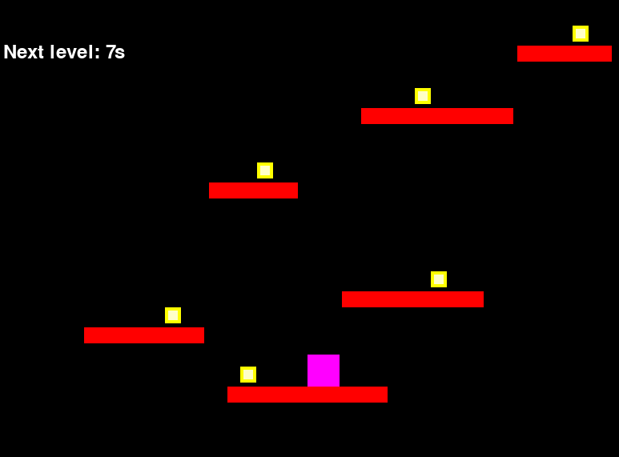
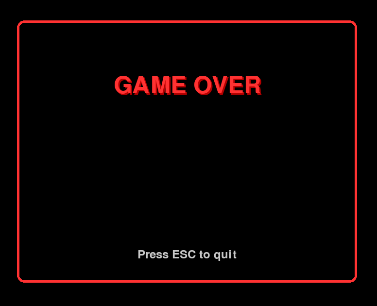
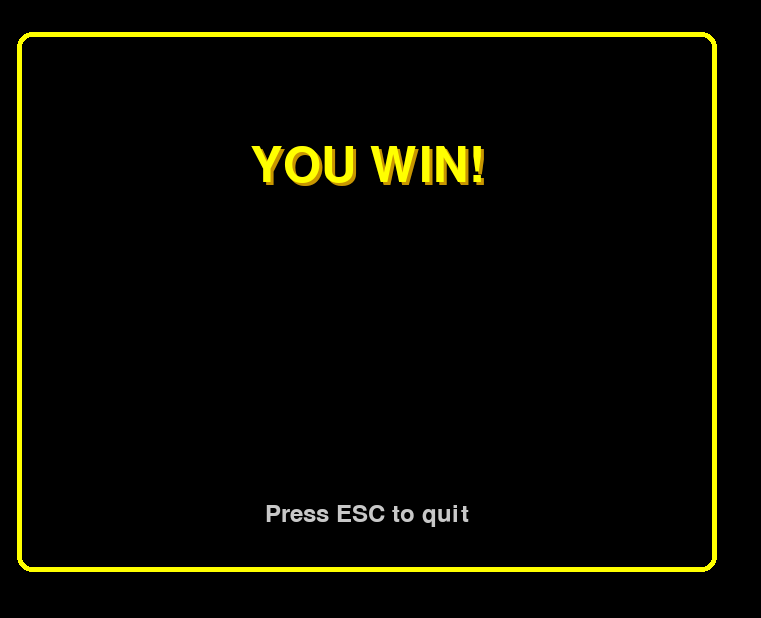

        <font size="6">TinyPlatformer</font>

  4<sup>th</sup> 10 24

  Prepared By: clubby789

  Challenge Author: Rafa10

  Difficulty: <font color=green>Easy</font>

  Classification: Official

# Description

Navigate through Data Center Alpha's exterior defenses and ventilation system. The facility features platforms and elecrified objects. Your character must jump, slide, and time movements carefully to avoid detection while collecting an encryption key that will let you out with the secret. Watch every move!

# Synopsis

TinyPlatformer is a Easy reversing challenge. Players will understand how to reverse engineer pyinstaller executables, get the Python executable and analyse the code.

## Skills Learned
    - PyInstaller decompilation
    - Scripting and general problem solving capabilities

# Solution

We are given an executable. When we run it, we see a simple platformer game.

It seems to be a simple game, you can move with the arrow keys and use space to jump.




When we fall, we get a game over.




When we collect all the things, we get a You Win!, but we get no flag... So something fishy must be going on inside...



When we run `strings` on the binary, we notice strings like:
```
blib-dynload/_bisect.cpython-37m-x86_64-linux-gnu.so
blib-dynload/_blake2.cpython-37m-x86_64-linux-gnu.so
blib-dynload/_bz2.cpython-37m-x86_64-linux-gnu.so
blib-dynload/_codecs_cn.cpython-37m-x86_64-linux-gnu.so
blib-dynload/_codecs_hk.cpython-37m-x86_64-linux-gnu.so
blib-dynload/_codecs_iso2022.cpython-37m-x86_64-linux-gnu.so
blib-dynload/_codecs_jp.cpython-37m-x86_64-linux-gnu.so
blib-dynload/_codecs_kr.cpython-37m-x86_64-linux-gnu.so
blib-dynload/_codecs_tw.cpython-37m-x86_64-linux-gnu.so
blib-dynload/_ctypes.cpython-37m-x86_64-linux-gnu.so
...
blib-dynload/zlib.cpython-37m-x86_64-linux-gnu.so
```

This suggests that it could be a PyInstaller binary.


So, we will use `pyinstxtractor` to get the `pyc` files out of it and then use [`uncompyle6`](https://pypi.org/project/uncompyle6/), [`decompyle3`](https://pypi.org/project/decompyle3/) or [`pycdc`](https://github.com/zrax/pycdc) to decompile the game script.


```
$ python pyinstxtractor.py TinyPlatformer
[+] Processing TinyPlatformer
[+] Pyinstaller version: 2.1+
[+] Python version: 3.7
[+] Length of package: 21410735 bytes
[+] Found 113 files in CArchive
[+] Beginning extraction...please standby
[+] Possible entry point: pyiboot01_bootstrap.pyc
[+] Possible entry point: pyi_rth_subprocess.pyc
[+] Possible entry point: pyi_rth_pkgutil.pyc
[+] Possible entry point: pyi_rth_inspect.pyc
[+] Possible entry point: pyi_rth_pkgres.pyc
[+] Possible entry point: asd.pyc
[!] Warning: This script is running in a different Python version than the one used to build the executable.
[!] Please run this script in Python 3.7 to prevent extraction errors during unmarshalling
[!] Skipping pyz extraction
[+] Successfully extracted pyinstaller archive: TinyPlatformer
```

Then,
```
$ uncompyle6 ./TinyPlatformer_extracted/main.pyc > main.py
```

Now, we can start analysing the source code.


```py
# uncompyle6 version 3.9.3.dev0
# Python bytecode version base 3.7.0 (3394)
# Decompiled from: Python 3.10.17 (main, Apr 16 2025, 20:44:37) [GCC 14.2.1 20250207]
# Embedded file name: main.py
import pygame, os, sys

def resource_path(relative_path):
    base_path = getattr(sys, "_MEIPASS", os.path.dirname(os.path.abspath(__file__)))
    return os.path.join(base_path, relative_path)


pygame.init()
WIDTH, HEIGHT = (800, 640)
PLAYER_SIZE = 40
SCROLL_AMOUNT = 520
GRAVITY = 0.8
JUMP_ACCEL = 15
MOVEMENT_SPEED = 5
PLATFORM_COLOR = (255, 0, 0)
PLAYER_COLOR = (255, 0, 255)
BACKGROUND_COLOR = (0, 0, 0)
COLLECTIBLE_SIZE = 20
FRAMERATE = 60
COLLECTIBLE_COLOR = (255, 255, 0)
SCROLL_INTERVAL = 8000
FONT = resource_path("fonts/FreeSansBold.ttf")
LEVELS = [
 [
  pygame.Rect([300, 490, 200, 20]), pygame.Rect([277, 235, 111, 20]), pygame.Rect([662, 64, 118, 20]), pygame.Rect([467, 142, 190, 20]), pygame.Rect([121, 416, 150, 20]), pygame.Rect([443, 371, 177, 20])],
 [
  pygame.Rect([325, 440, 200, 20]), pygame.Rect([363, 277, 117, 20]), pygame.Rect([530, 163, 100, 20]), pygame.Rect([62, 341, 245, 20]), pygame.Rect([277, 90, 164, 20])],
 [
  pygame.Rect([52, 314, 213, 20]), pygame.Rect([483, 75, 170, 20]), pygame.Rect([223, 169, 217, 20]), pygame.Rect([326, 467, 204, 20])]]
COLLECTIBLES = [
 [
  (316, 465), (337, 210), (731, 39), (534, 117), (222, 391), (554, 346)],
 [
  (380, 415), (417, 252), (570, 138), (197, 316), (358, 65)],
 [
  (164, 289), (567, 50), (371, 144), (461, 442)]]

def exit_game():
    pygame.quit()
    sys.exit()


class Player:

    def __init__(self, x, y, width, height):
        self.box = pygame.Rect(x, y, width, height)
        self.velocity_x = 0
        self.velocity_y = 0
        self.jumping = False
        self.secret = []

    def update(self, platforms, collectibles):
        self.velocity_y += GRAVITY
        self.box.y += self.velocity_y
        self.box.x += self.velocity_x
        if self.box.left < 0:
            self.box.left = 0
        if self.box.right > WIDTH:
            self.box.right = WIDTH
        for platform in platforms:
            if self.box.colliderect(platform) and self.velocity_y > 0 and self.box.bottom > platform.top and self.box.top < platform.top:
                self.box.bottom = platform.top
                self.velocity_y = 0
                self.jumping = False

        for collectible in collectibles:
            if collectible.collected == False and self.box.colliderect(collectible.box):
                collectible.collected = True
                self.secret.append(collectibles.index(collectible))

    def jump(self):
        if not self.jumping:
            self.velocity_y = -JUMP_ACCEL
            self.jumping = True

    def draw(self, surface):
        pygame.draw.rect(surface, PLAYER_COLOR, self.box)


class Collectible:

    def __init__(self, x, y):
        self.box = pygame.Rect(x, y, COLLECTIBLE_SIZE, COLLECTIBLE_SIZE)
        self.collected = False

    def draw(self, surface):
        if not self.collected:
            pygame.draw.rect(surface, COLLECTIBLE_COLOR, self.box)
            pygame.draw.rect(surface, (255, 255, 200), (self.box.x + 4, self.box.y + 4, COLLECTIBLE_SIZE - 8, COLLECTIBLE_SIZE - 8))


class TinyPlatformer:

    def __init__(self, start_time):
        pygame.display.set_caption("TinyPlatformer")
        self.cur_level = 0
        self.player = Player(WIDTH // 2, HEIGHT // 2, PLAYER_SIZE, PLAYER_SIZE)
        self.levels = list(zip(LEVELS, [[Collectible(*y) for y in x] for x in COLLECTIBLES]))
        self.platforms = self.levels[0][0]
        self.collectibles = self.levels[0][1]
        self.time_remaining = SCROLL_INTERVAL // 1000
        self.last_second = pygame.time.get_ticks() // 1000
        self.font = pygame.font.Font(None, 36)
        self.screen = pygame.display.set_mode((WIDTH, HEIGHT))
        self.clock = pygame.time.Clock()
        self.start_time = start_time
        self.finished = False
        self.win = False

    def display_game_end_screen(self):
        overlay = pygame.Surface((WIDTH, HEIGHT), pygame.SRCALPHA)
        overlay.fill((0, 0, 0, 200))
        self.screen.blit(overlay, (0, 0))
        large_font = pygame.font.Font(None, 72)
        small_font = pygame.font.Font(None, 36)
        secret_flag = False
        if self.win:
            title_text = large_font.render("YOU WIN!", True, (255, 255, 0))
            title_shadow = large_font.render("YOU WIN!", True, (200, 150, 0))
            secrets = [
             [self.player.secret[i] for i in range(6)]]
            secrets += [[self.player.secret[i] for i in range(6, 11)]]
            secrets += [[self.player.secret[i] for i in range(11, len(self.player.secret))]]
            secrets = [secrets[0][0] > secrets[0][2], secrets[0][1] < secrets[0][4], secrets[0][2] > secrets[0][5], secrets[0][3] > secrets[0][4], secrets[0][5] > secrets[0][3],
             secrets[1][0] > secrets[1][4], secrets[1][1] < secrets[1][4], secrets[1][2] < secrets[1][3], secrets[1][3] < secrets[1][1],
             secrets[2][0] > secrets[2][1], secrets[2][2] < secrets[2][1], secrets[2][2] > secrets[2][3]]
            secret_flag = secret_flag not in secrets
        else:
            title_text = large_font.render("GAME OVER", True, (255, 50, 50))
            title_shadow = large_font.render("GAME OVER", True, (180, 0, 0))
        title_x = WIDTH // 2 - title_text.get_width() // 2
        title_y = HEIGHT // 4
        self.screen.blit(title_shadow, (title_x + 3, title_y + 3))
        self.screen.blit(title_text, (title_x, title_y))
        instruction_y = HEIGHT - 120
        if secret_flag:
            key = "".join([str(x) for x in self.player.secret]).encode()
            ciph = b'}dvIA_\x00FV\x01A^\x01CoG\x03BD\x00]SO'
            flag = bytes((ciph[i] ^ key[i % len(key)] for i in range(len(ciph)))).decode()
            secret_text = small_font.render(flag, True, (200, 200, 0))
            secret_x = WIDTH // 2 - secret_text.get_width() // 2
            self.screen.blit(secret_text, (secret_x, instruction_y))
            instruction_y += 40
        instruction_text = small_font.render("Press ESC to quit", True, (200, 200,
                                                                         200))
        instruction_x = WIDTH // 2 - instruction_text.get_width() // 2
        self.screen.blit(instruction_text, (instruction_x, instruction_y))
        border_color = (255, 255, 0) if self.win else (255, 50, 50)
        border_rect = pygame.Rect(50, 50, WIDTH - 100, HEIGHT - 100)
        pygame.draw.rect((self.screen), border_color, border_rect, 5, border_radius=15)
        pygame.display.flip()

    def scroll_map(self):
        self.player.box.y += SCROLL_AMOUNT
        for platform in self.platforms:
            platform.y += SCROLL_AMOUNT

        platform_indices_to_remove = []
        for i, platform in enumerate(self.platforms):
            if platform.top >= HEIGHT:
                platform_indices_to_remove.append(i)

        for index in sorted(platform_indices_to_remove, reverse=True):
            self.platforms.pop(index)
            if index < len(self.collectibles):
                self.collectibles.pop(index)

        self.cur_level += 1
        info = self.levels[self.cur_level]
        new_platforms, new_collectibles = info
        self.platforms += new_platforms
        self.collectibles = new_collectibles

    def hud_update(self):
        time_text = self.font.render(f"Next level: {self.time_remaining}s", True, (255,
                                                                                   255,
                                                                                   255))
        self.screen.blit(time_text, (20, 60))

    def map_action(self, current_time):
        elapsed = current_time - self.start_time

        def transition():
            if self.cur_level + 1 != len(self.levels):
                self.scroll_map()
                self.start_time = current_time
            else:
                self.win = True
                self.finished = True
                self.display_game_end_screen()
                return False
                return True

        cur_colls = sum((1 for c in self.collectibles if c.collected))
        collectible_total = len(self.collectibles)
        if elapsed >= SCROLL_INTERVAL:
            if cur_colls != collectible_total:
                self.win = False
                self.finished = True
                self.display_game_end_screen()
                return
            transition()
        if cur_colls == collectible_total:
            self.player.box.x = [
             695, 375, 0][self.cur_level]
            self.player.box.y = [24, 50, 0][self.cur_level]
            if not transition():
                return
        self.time_remaining = max(0, SCROLL_INTERVAL - elapsed) // 1000
        current_second = current_time // 1000
        if current_second != self.last_second:
            self.last_second = current_second
        self.player.update(self.platforms, self.collectibles)
        if self.player.box.y > HEIGHT:
            self.finished = True
            self.win = False
        self.screen.fill(BACKGROUND_COLOR)
        for platform in self.platforms:
            pygame.draw.rect(self.screen, PLATFORM_COLOR, platform)

        for collectible in self.collectibles:
            collectible.draw(self.screen)

        self.player.draw(self.screen)
        self.hud_update()
        pygame.display.flip()
        self.clock.tick(FRAMERATE)

    def on_run(self):
        current_time = pygame.time.get_ticks()
        for event in pygame.event.get():
            if event.type == pygame.QUIT:
                exit_game()
            if event.type == pygame.KEYDOWN:
                if event.key == pygame.K_ESCAPE:
                    exit_game()
                if not self.finished:
                    if event.key == pygame.K_SPACE:
                        self.player.jump()
                    if event.key == pygame.K_LEFT:
                        self.player.velocity_x = -MOVEMENT_SPEED
                    if event.key == pygame.K_RIGHT:
                        self.player.velocity_x = +MOVEMENT_SPEED
            if event.type == pygame.KEYUP and event.key in [pygame.K_LEFT, pygame.K_RIGHT]:
                self.player.velocity_x = 0

        if self.finished:
            self.display_game_end_screen()
            return
        self.map_action(current_time)


start_time = pygame.time.get_ticks()
game = TinyPlatformer(start_time)
while True:
    game.on_run()

# okay decompiling /home/user/Source/pyinstxtractor/TinyPlatformer_extracted/main.pyc
```


So, we can notice:
```
            secrets = [secrets[0][0] > secrets[0][2], secrets[0][1] < secrets[0][4], secrets[0][2] > secrets[0][5], secrets[0][3] > secrets[0][4], secrets[0][5] > secrets[0][3],
             secrets[1][0] > secrets[1][4], secrets[1][1] < secrets[1][4], secrets[1][2] < secrets[1][3], secrets[1][3] < secrets[1][1],
             secrets[2][0] > secrets[2][1], secrets[2][2] < secrets[2][1], secrets[2][2] > secrets[2][3]]

```
This set of conditions has to be passed and it is per level, as the organization code above suggests. If we trace it back, we notice it has to do with the collectibles in the level that lets us progress.
Hence, we need to see which one maps to which index on `COLLECTIBLES` array and then we can feed it as a constraint solve problem to Z3.


```py
from z3 import *
from pwn import xor

x = [Int(f'x{i}') for i in range(10)]

s = Solver()
levels = [6, 5, 4]

constraints = [
    [x[0] > x[2], x[1] < x[4], x[2] > x[5], x[3] > x[4], x[5] > x[3]],
    [x[0] > x[4], x[1] < x[4], x[2] < x[3], x[3] < x[1]],
    [x[0] > x[1], x[2] < x[1], x[2] > x[3]]
]

ans = ''

for i in range(len(levels)):
    s.push()

    for j in range(levels[i]-1):
        s.add(constraints[i][j])

    s.add(And([And(x[ii] >= 0, x[ii] < levels[i]) for ii in range(10)]))
    s.add(Distinct(x[:levels[i]]))

    for v in x[levels[i]:]:
        s.add(v == 0)

    if s.check() == sat:
        m = s.model()
        ans += ''.join([str(m.evaluate(x[ii])) for ii in range(10) if ii < levels[i]])

    s.pop()
    

print(xor(b'}dvIA_\x00FV\x01A^\x01CoG\x03BD\x00]SO', ans.encode()))
```
