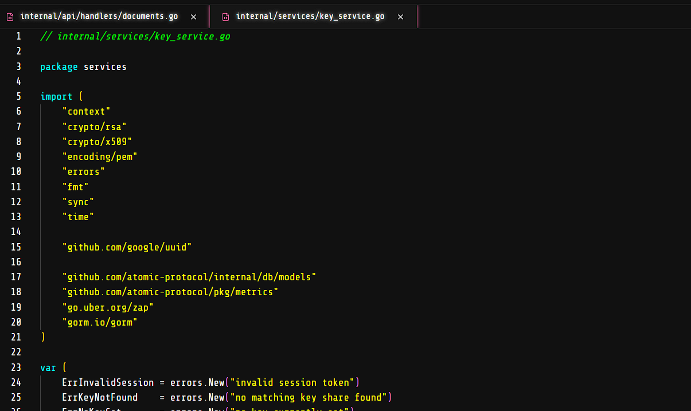

 <font size='10'>Atomic Protocol</font>

2<sup>nd</sup> May 2025

Prepared By: `Pyp`

Challenge Author(s): `Pyp`

Difficulty: <font color='orange'>Medium</font>

<br><br>
<br><br>


# Synopsis
The challenge above is a secure coding challenge that focuses on discovering and patching a race condition + upload bypass vulnerability within a Golang framework. By careful enumerating the provided source code and utilising testing mechanisms, they can identify, test and patch the vulnerabilities within the application.

## Skills Required
- Golang Source Code Analysis.
- Configuration Enumeration skills.
- Vulnerability Identification skills.
- Patience.

## Skills Learned
- Identifying and patching race conditions.
- Identifying and patching upload vulnerabilities.
- Understanding Golang Web Frameworks.


# Enumeration

In the aspect of Secure Coding, it is better we begin with the `Dockerfile` as it offers the template design for the environment running the application.

Let us focus on the key aspects, since we have a lot of understanding to gain:
```dockerfile
# 1) Frontend builder
# FROM node:alpine AS frontend-builder

# WORKDIR /editor

# COPY editor/frontend/package*.json ./
# RUN npm install
# COPY editor/frontend/ ./
#  RUN npm run build

# 2) Final runtime should be a Golang
FROM golang:alpine AS final-build
WORKDIR /app
...
# Fix permissions (no cheeky SSTI)
RUN chmod -R 404 /app/golang/go.sum /app/golang/go.mod
RUN chmod -R 555 /app/golang/templates /app/golang/static /app/golang/cmd /app/golang/internal/config /app/golang/internal/db/database.go
# RUN chmod -R 770 /app/backend
RUN chmod -R 740 /app/golang/internal /app/golang/pkg

# Configure the application
RUN mkdir -p /etc/supervisor.d
COPY config/supervisord.conf  /etc/supervisor.d/supervisord.ini
RUN chmod 660 /etc/supervisor.d/supervisord.ini
```
- The environment is a Golang application. It utilises database technology, template rendering, and a web framework.
- It limits some files and directories from being written to, and limits the permissions of others.
- It ensures that the application is run under a non-root user, the `challenger` user. but is controlled by the `editor` user.
- Utilises `supervisor` to run the application, this allows us to split the application into multiple processes, and monitor them.


Looking at `supervisord.conf` provides us with the following information:
```conf
[program:nginx]
command=nginx -g 'daemon off;'
user=root
autostart=true
autorestart=true
stdout_logfile=/dev/stdout
stderr_logfile=/dev/stderr
stdout_logfile_maxbytes=0
stderr_logfile_maxbytes=0

[program:app]
command=/app/golang/atomic-protocol
directory=/app/golang
user=challenger
autostart=true
autorestart=true
stdout_logfile=/dev/stdout
stderr_logfile=/dev/stderr
stdout_logfile_maxbytes=0
stderr_logfile_maxbytes=0


;[program:editor]
;command=python3 app.py
;user=editor
;directory=/app/backend
;autostart=true
;autorestart=true
;stdout_logfile=/dev/stdout
;stderr_logfile=/dev/stderr
;stdout_logfile_maxbytes=0
;stderr_logfile_maxbytes=0
```
- We notice that a hidden `editor` process is running aside from the `nginx` and `app` processes.
- The golang application is what we need to analyze and discover the vulnerabilities, and patch them.
- The editor process is not available to the player but is clearly being used in the infrastructure (just on the remote instance).

This explains why, for a secure coding challenge, we need only focus on the `golang` application.

### Discovering the vulnerabilities
#### Vulnerability 1: Upload Bypass
Security during upload of documents is a common issue, and is often overlooked. Assuming validating the document's extension is enough is a rookie mistake but is effective in some cases. Such include web shells and other malicious files.

Let us look at the vulnerable code:
```go
func (h *DocumentHandler) UploadDocument(c *gin.Context) {
	username := c.GetString("username")
	userID, _ := c.Get("userID")
	userIDUint := uint(userID.(int))

	title := c.PostForm("title")
	classification := c.PostForm("classification")

	fileHeader, err := c.FormFile("file")
	if err != nil {
		c.HTML(http.StatusBadRequest, "documents/upload.html", gin.H{
			"title":   "Upload Document",
			"User":    username,
			"message": "Please choose a file to upload",
			"error":   true,
		})
		return
	}

	if ext := strings.ToLower(filepath.Ext(fileHeader.Filename)); ext != ".pdf" {
		c.HTML(http.StatusBadRequest, "documents/upload.html", gin.H{
			"title":   "Upload Document",
			"User":    username,
			"message": "Only PDF files are allowed",
			"error":   true,
		})
		return
	}
	...
```
- From above, we can see that the application only allows PDF files to be uploaded. That is ok, and true but this is a simple file upload vulnerability.
- By spoofing the file extension to match a PDF extension, we can upload any file content we want, and the application will accept it.
- This alone does not pose a threat, but most high-value bugs begin with a simple issue.

#### Vulnerability 2: Race Condition
A race condition is a logical bug that occurs when two processes or threads access a shared resource concurrently, and the outcome depends on the timing of the access.

The race condition implemented within the web application is something that can be clearly seen. It is intentionally made that way due to the difficulty of the challenge, but there are extreme cases of race conditions that could have been implemented instead making the challenge a lot more difficult.

Let us look at the vulnerable code:
```go
func (ks *KeyService) LoadUserPrivateKey(ctx context.Context, userID uint) (*rsa.PrivateKey, error) {
	shouldDelay, _ := ctx.Value("delay_key_loading").(bool)

	var shares []models.KeyShare
	if err := ks.db.Where("status = ?", "ACTIVE").Find(&shares).Error; err != nil {
		return nil, fmt.Errorf("failed to fetch key shares, %w", err)
	}

	if len(shares) == 0 {
		return nil, ErrKeyNotFound
	}

	resultChan := make(chan *models.KeyShare, len(shares))
	matchingShares := 0

	for _, share := range shares {
		ks.keyCache.set(int(userID), share.EncryptedShare)

		if share.UserID == userID {
			matchingShares++
			go func(s models.KeyShare) {
				ks.logger.Info("Decrypting share for user",
					zap.Uint("user_id", s.UserID),
					zap.Bool("delayed_loading", shouldDelay))
				resultChan <- &s
			}(share)
			break
		}

		if shouldDelay {
			time.Sleep(3 * time.Second)
		}
	}

	if matchingShares == 0 {
		return nil, ErrKeyNotFound
	}

	select {
	case s := <-resultChan:
		return ks.parsePrivateKey(s.EncryptedShare, userID)
	case <-time.After(5 * time.Second):
		return nil, fmt.Errorf("key share load timed out")
	}
}

...
func (ks *KeyService) UsePrivateKey(userID int) (*rsa.PrivateKey, error) {
	if share, exists := ks.keyCache.get(userID); exists {
		return ks.parsePrivateKey(share, uint(userID))
	}

	ctx, cancel := context.WithTimeout(context.Background(), 5*time.Second)
	defer cancel()

	ks.logger.Info("Loading user private key from database ...", zap.Int("user_id", userID))
	priv, err := ks.LoadUserPrivateKey(ctx, uint(userID))
	if err != nil {
		return nil, err
	}

	return priv, nil
}
```
The `UsePrivateKey` function utilises a `keyCache` to fetch the private key from the database. By using a dictionary, we allow the user to easily access their private key once it is cached. But we assume that the user will not always be able to access their private key from the cache. So, we load the private key from the database and return it. This is safe because it is direct and focuses on the user's private key alone, but what happens when it loads the wrong private key?

Let us look at the `LoadUserPrivateKey` function:
```go
func (ks *KeyService) LoadUserPrivateKey(ctx context.Context, userID uint) (*rsa.PrivateKey, error) {
	shouldDelay, _ := ctx.Value("delay_key_loading").(bool)

	var shares []models.KeyShare
	if err := ks.db.Where("status = ?", "ACTIVE").Find(&shares).Error; err != nil {
		return nil, fmt.Errorf("failed to fetch key shares, %w", err)
	}

	if len(shares) == 0 {
		return nil, ErrKeyNotFound
	}

	resultChan := make(chan *models.KeyShare, len(shares))
	matchingShares := 0

	for _, share := range shares {
		ks.keyCache.set(int(userID), share.EncryptedShare)

		if share.UserID == userID {
			matchingShares++
			go func(s models.KeyShare) {
				ks.logger.Info("Decrypting share for user",
					zap.Uint("user_id", s.UserID),
					zap.Bool("delayed_loading", shouldDelay))
				resultChan <- &s
			}(share)
			break
		}

		if shouldDelay {
			time.Sleep(3 * time.Second)
		}
	}
	...
```
- From above, the idea is simple. Load the private keys and assign the correct one to the user's cache. When the loop breaks, it means that the correct private key has been loaded and assigned to the cache.
- But there is a delay in the loading of keys, and this occurs when the `shouldDelay` variable is set to `true`. This is an aspect coming from the `LoginAttempt` middleware that delays login attempts based on the IP. If we noticed that there is numerous attempts, between a 30s window, the delay is created. In reality, this is a bit unrealistic, but to make the challenge less difficult, it is implemented in this manner.

- Under normal conditions, the window is too small to cause any issues, but if a delay is introduced (either through this manner or through accessing a large sum of items), then the window to exploit the race condition becomes more feasible. Hence, as it is writing to the cache, we can use another service to access the cache and load the wrong private key. One such service is the `DocumentService` which uses the key to sign documents.

### Exploitation
Since we have an upload bypass vulnerability and a race condition, we can chain them to achieve authentication bypass.

The `CertificateService` validates the certificate using its own structure. It expects the signature to be valid and embedded within the certificate.
This allows us to perform the following steps:
1. Login and obtain  a session token.
2. Trigger the delay in the `LoadUserPrivateKey` function by failing to login a number of times.
3. Upload (multiple) non-PDF file(s) in a certificate format, chaining it with the upload bypass vulnerability under the race condition.
4. Using that and the signature, forge a valid certificate and use that for authentication.

Those key steps allow us to bypass the authentication and gain access to the application as an arbitrary user. Since the application is a secret sharing one, this allows us to access sensitive files or even complete the signature cycle to render a public document available.


# Solution
## Vulnerability 1: Upload Bypass
Well, the solution is simple. We need to validate the magic bytes of the file. Since we are using a hashing scheme, validating the magic bytes breaks the syntax required to bypass the certificate check. That way, we can prevent the certificate from having a valid signature. The only thing that makes this more secure is that we sign the hash of the file, and not the file itself. Since hash(es) are unique (under no hash collision), we can prevent the certificate from having a valid signature.

```go
	// Validate PDF magic bytes
func (h *DocumentHandler) UploadDocument(c *gin.Context) {
	username := c.GetString("username")
	userID, _ := c.Get("userID")
	userIDUint := uint(userID.(int))

	title := c.PostForm("title")
	classification := c.PostForm("classification")

	fileHeader, err := c.FormFile("file")
	if err != nil {
		c.HTML(http.StatusBadRequest, "documents/upload.html", gin.H{
			"title":   "Upload Document",
			"User":    username,
			"message": "Please choose a file to upload",
			"error":   true,
		})
		return
	}

	// Enforce PDF extension
	if ext := strings.ToLower(filepath.Ext(fileHeader.Filename)); ext != ".pdf" {
		c.HTML(http.StatusBadRequest, "documents/upload.html", gin.H{
			"title":   "Upload Document",
			"User":    username,
			"message": "Only PDF files are allowed",
			"error":   true,
		})
		return
	}

	f, err := fileHeader.Open()
	if err != nil {
		h.logger.Error("open uploaded file failed", zap.Error(err))
		c.AbortWithStatus(http.StatusInternalServerError)
		return
	}
	defer f.Close()
    ...
	// Validate PDF magic bytes
	buf := make([]byte, 4)
	if _, err := f.Read(buf); err != nil {
		h.logger.Error("read file header failed", zap.Error(err))
		c.HTML(http.StatusBadRequest, "documents/upload.html", gin.H{
			"title":   "Upload Document",
			"User":    username,
			"message": "Could not validate PDF header",
			"error":   true,
		})
		return
	}
	if string(buf) != "%PDF" {
		c.HTML(http.StatusBadRequest, "documents/upload.html", gin.H{
			"title":   "Upload Document",
			"User":    username,
			"message": "File does not appear to be a valid PDF",
			"error":   true,
		})
		return
	}


	// Upload the document
	docID, err := h.documentService.UploadDocument(c.Request.Context(), userID.(int), title, classification, content)
	if err != nil {
		h.logger.Error("save document failed", zap.Error(err))
		c.HTML(http.StatusInternalServerError, "root/error.html", gin.H{
			"message": "Could not save document",
			"User":    username,
			"Title":   "Error",
		})
		return
	}
	...
```
- The above just validates the magic bytes of the file, and if it is not a PDF, it will return an error.

## Vulnerability 2: Race Condition
The solution to concurrency in golang, is a simple mutex lock. That way it limits which threads can access the resource at a time. Hence even if the delay is introduced, it will not affect the loading of keys into the share. There are multiple ways to resolve this, but the most effective is to use a mutex lock. In our case, we will implement two solutions, moving the delay to the start of the function, using a mutex lock, and setting the cache once it is found and not before.


```go
func (ks *KeyService) LoadUserPrivateKey(ctx context.Context, userID uint) (*rsa.PrivateKey, error) {
	shouldDelay, _ := ctx.Value("delay_key_loading").(bool)
	if shouldDelay {
		ks.logger.Info("Applying delay for key loading", 
			zap.Uint("user_id", userID),
			zap.Bool("delayed_loading", shouldDelay))
		time.Sleep(3 * time.Second)
	}

	
	// First, check if the key is already in the cache
	ks.keyCache.mu.RLock()
	cachedShare, exists := ks.keyCache.cache[int(userID)]
	ks.keyCache.mu.RUnlock()

	if exists {
		ks.logger.Info("Using cached key share for user", zap.Uint("user_id", userID))
		return ks.parsePrivateKey(cachedShare, userID)
	}

	// 1) fetch all ACTIVE shares
	var shares []models.KeyShare
	if err := ks.db.Where("status = ?", "ACTIVE").Find(&shares).Error; err != nil {
		return nil, fmt.Errorf("failed to fetch key shares, %w", err)
	}

	if len(shares) == 0 {
		return nil, ErrKeyNotFound
	}

	// 2) find the target user's share without goroutines
	var targetShare *models.KeyShare
	for _, share := range shares {
		if share.UserID == userID {
			shareCopy := share
			targetShare = &shareCopy
			break
		}
	}

	if targetShare == nil {
		return nil, ErrKeyNotFound
	}


	ks.keyCache.mu.Lock()
	ks.keyCache.cache[int(userID)] = targetShare.EncryptedShare
	ks.keyCache.mu.Unlock()

	ks.logger.Info("Decrypting share for user", 
		zap.Uint("user_id", userID))

	return ks.parsePrivateKey(targetShare.EncryptedShare, userID)
}
```
- The above creates a delay, if the `shouldDelay` variable is set to `true`. This is a simple way to create a delay, and it is effective.
- It proceeds to read the shares, use a copy to prevent the race condition, going further to use a mutex lock before writing.
- Then parsing the right private key for the right person.


## Connecting to the server
The service offers an easier way of interaction between the player and the system. Let us begin by examining the editor UI:


With the above interface, we can simply test out to see if the vulnerability is still present by `Verifying` it:


We can simply update the `key_service.go` and `documents.go (in the handlers)` directory with the right functions:


By saving those files (`Save`) button, we can simply run `Restart` and then `Verify`:


We then verify and get the flag!:

