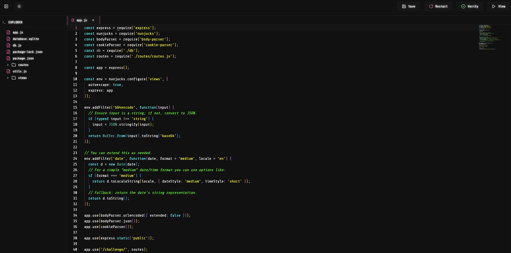
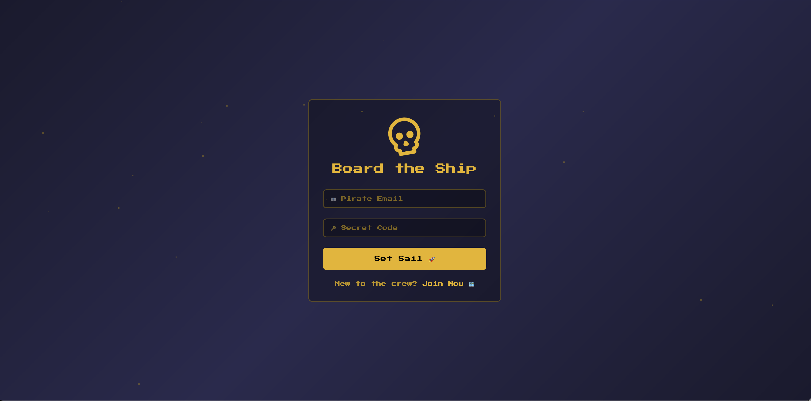
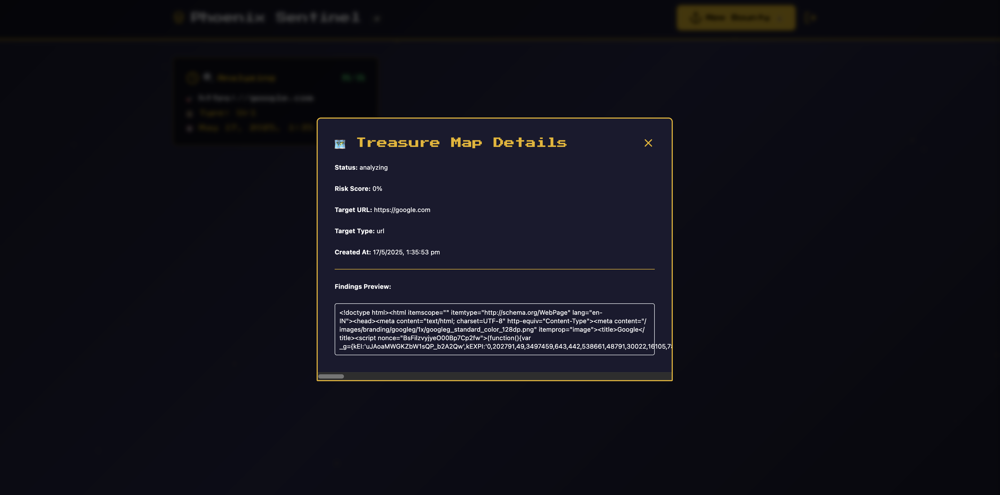
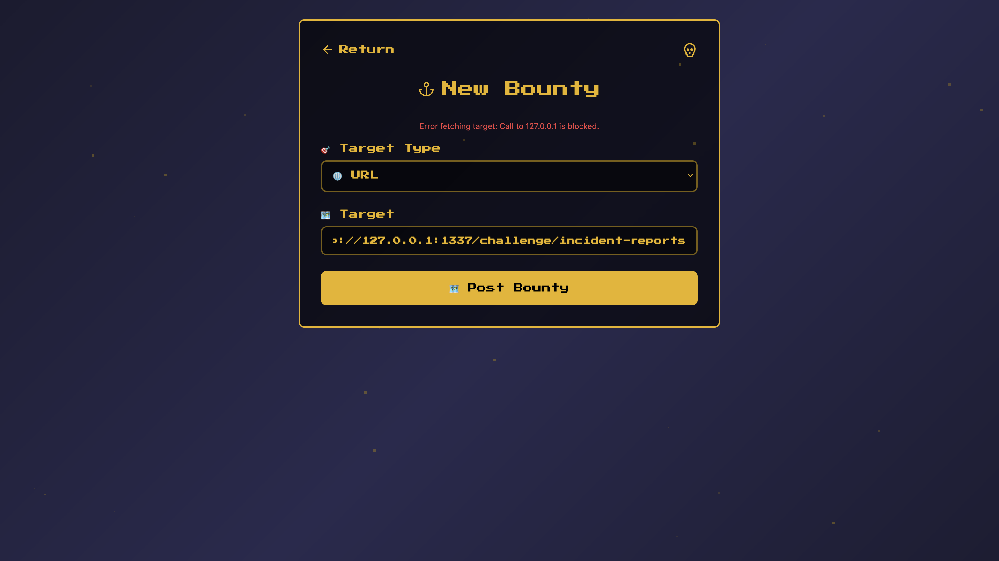

<font size="5">phoenix sentinel</font>

  7<sup>th</sup> 5 2025

  Prepared By: xclow3n

  Challenge Author: xclow3n

  Difficulty: <font color=green>Very Easy</font>

  Classification: Official


# Synopsis

phoenix sentinel is a Very Easy Secure Coding challenge.

## Skills Required
    - Basic Understanding of Javascript
    - Basic Understanding of SSRF
## Skills Learned
    - Fixing Cross Protocol SSRF

# Solution

Visiting the page, gives us the following web editor, and we are given source code of nodejs web app.



We can visit the vulnerable application as well using the `View` button.



After register and login, the application allows us create bounty.



The application simply fetches the target url and shows in preview.

Taking a look at the routes:

```Javascript
router.get('/incident-reports', async (req, res) => {
  const clientIp = req.ip;
  
  console.log("Client IP:", clientIp);
  
  if (clientIp !== "127.0.0.1" && clientIp !== "::ffff:127.0.0.1" && clientIp !== "::1") {
    return res.status(403).send("Forbidden");
  }
  
  try {
    const reports = await db.getAllReports();
    res.render('incident-reports.html', { reports });
  } catch (err) {
    res.status(500).send("Error fetching incident reports: " + err.message);
  }
});

```

There is one route which is only accessible via localhost, If we remember correctly the application has functionality which allows us to get content of a URL, let's see if we can get that



Apparently we cannot make request to localhost directly, looking at the functionality,

```Javascript
const request = require('request');
const util = require('util');
const requestPromise = util.promisify(request);
const fs = require('fs');
const path = require('path');
const ssrfFilter = require('ssrf-req-filter');

async function fetchAndStoreReport(targetUrl) {
  const response = await requestPromise({
    uri: targetUrl,
    agent: ssrfFilter(targetUrl)
  });
  const content = response.body;

  const reportsDir = path.join(__dirname, 'reports');
  if (!fs.existsSync(reportsDir)) {
    fs.mkdirSync(reportsDir);
  }

  const filename = `report-${Date.now()}-${Math.random().toString(36).substr(2, 8)}.html`;
  const filePath = path.join(reportsDir, filename);

  fs.writeFileSync(filePath, content, 'utf8');

  return filePath;
}

module.exports = fetchAndStoreReport;
```

The application is using ssrf-req-filter to avoid SSRF attacks, taking a look at this package on NPM, there is a note:
```
Note: It's recommended to overwrite both httpAgent and httpsAgent in Axios with ssrf-req-filter. Otherwise, SSRF mitigation can be bypassed via cross protocol redirects. Refer to [Doyensec's research](https://blog.doyensec.com/2023/03/16/ssrf-remediation-bypass.html) for more information.
```

So basically this app is vulnerable to cross protocol ssrf, one of the way to patch this bug can be to just not allow app to follow redirects


we just need to set `followRedirect` to false

After Fixing the app, saving the file and restarting the app

Now if we run the checker we get the flag
